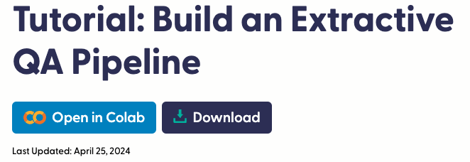
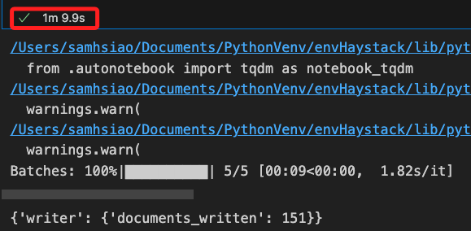
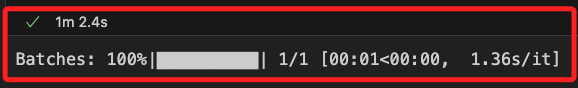

# 抽取式問答管道



<br>

## 說明

1. 這是官方在 `2024/04/25` 發佈的 [官方教程](https://haystack.deepset.ai/tutorials/34_extractive_qa_pipeline)。

<br>

2. 使用的組件包含 `ExtractiveReader`、`InMemoryDocumentStore`、`InMemoryEmbeddingRetriever`、`DocumentWriter`、`SentenceTransformersDocumentEmbedder`、`SentenceTransformersTextEmbedder`。

<br>

3. 範例目標是建立一個使用 `萃取模型` 來顯示查詢答案所在位置的 `Haystack` 管道。所謂的 `Extractive QA` 簡單來說就是 `抽取模型` 會直接從文本中提取出答案，這種方法適合需要高準確性的用例，並且需要知道答案在文本中的確切位置。

<br>

4. 在範例中將建立一個 Haystack 管道，根據提供的文件提取問題的答案。同時，還將構建一個索引管道來處理並加載 `古代世界七大奇蹟數據集` 的 `Wikipedia` 頁面。

<br>

## 環境與說明

1. 在使用這些數據進行 `抽取式處理` 之前，需要通過 `索引管道` 來獲取、處理並加載到文件存儲中。這些數據已經被清洗和預處理過，所以轉換為 Haystack 文件相對簡單。這裡使用的是 `InMemoryDocumentStore`。另外，使用 `SentenceTransformersDocumentEmbedder` 將每個文件轉換為向量。嵌入模型則使用 `sentence-transformers/multi-qa-mpnet-base-dot-v1`。可以根據需要替換成其他模型，只要在 `抽取管道` 中使用相同的模型即可。最後，`DocumentWriter` 將向量化的文件寫入 `DocumentStore`。

<br>

2. 安裝庫。

    ```bash
    # 安裝所需的庫
    pip install haystack-ai accelerate "sentence-transformers>=2.2.0" "datasets>=2.6.1"
    ```

<br>

## 腳本編寫

1. 導入庫。

    ```python
    # 載入數據集
    from datasets import load_dataset
    from haystack import Document, Pipeline
    from haystack.document_stores.in_memory import InMemoryDocumentStore
    from haystack.components.retrievers.in_memory import InMemoryEmbeddingRetriever
    from haystack.components.readers import ExtractiveReader
    from haystack.components.embedders import SentenceTransformersDocumentEmbedder
    from haystack.components.writers import DocumentWriter
    ```

<br>

2. 加載與儲存資料。

    ```python
    # 加載 "古代世界七大奇蹟" 數據集
    dataset = load_dataset("bilgeyucel/seven-wonders", split="train")

    # 將數據集轉換為 Haystack 文件格式
    documents = [
        Document(content=doc["content"], meta=doc["meta"])
        for doc in dataset
    ]

    # 定義嵌入模型
    model = "sentence-transformers/multi-qa-mpnet-base-dot-v1"

    # 初始化內存文件存儲
    document_store = InMemoryDocumentStore()
    ```

<br>

3. 建立管道。

    ```python
    # 建立索引管道
    indexing_pipeline = Pipeline()

    # 添加嵌入組件到管道
    indexing_pipeline.add_component(instance=SentenceTransformersDocumentEmbedder(model=model), name="embedder")
    # 添加文件寫入組件到管道
    indexing_pipeline.add_component(instance=DocumentWriter(document_store=document_store), name="writer")

    # 連接嵌入組件和文件寫入組件
    indexing_pipeline.connect("embedder.documents", "writer.documents")

    # 執行索引管道
    indexing_pipeline.run({"documents": documents})
    ```

<br>

4. 下載模型需要一點時間。

    

<br>

## 建立抽取式問答管道

1. 抽取式問答管道將包含三個組件：`嵌入器`、`檢索器` 和 `讀取器`。

<br>

2. `SentenceTransformersTextEmbedder` 將查詢轉換為向量，並使用與前面定義的相同嵌入模型。向量搜索允許檢索器從文件存儲中高效地返回相關文件。檢索器與文件存儲緊密耦合，因此我們將使用 `InMemoryEmbeddingRetriever` 來搭配 `InMemoryDocumentStore`。`ExtractiveReader` 會返回查詢的答案，以及答案在源文件中的位置和置信度分數。

    ```python
    # 從 Haystack 模組中導入需要的組件
    from haystack.components.retrievers.in_memory import InMemoryEmbeddingRetriever
    from haystack.components.readers import ExtractiveReader
    from haystack.components.embedders import SentenceTransformersTextEmbedder

    # 初始化檢索器
    retriever = InMemoryEmbeddingRetriever(document_store=document_store)

    # 初始化讀取器
    reader = ExtractiveReader()
    # 預熱讀取器
    reader.warm_up()

    # 建立抽取式問答管道
    extractive_qa_pipeline = Pipeline()

    # 添加嵌入組件到管道
    extractive_qa_pipeline.add_component(
        instance=SentenceTransformersTextEmbedder(model=model),
        name="embedder"
    )
    # 添加檢索組件到管道
    extractive_qa_pipeline.add_component(
        instance=retriever,
        name="retriever"
    )
    # 添加讀取組件到管道
    extractive_qa_pipeline.add_component(
        instance=reader,
        name="reader"
    )

    # 連接嵌入組件和檢索組件
    extractive_qa_pipeline.connect(
        "embedder.embedding",
        "retriever.query_embedding"
    )
    # 連接檢索組件和讀取組件
    extractive_qa_pipeline.connect(
        "retriever.documents",
        "reader.documents"
    )
    ```

<br>

## 定義查詢

1. 提問。

    ```python
    query = "Who was Pliny the Elder?"

    # 執行抽取式問答管道，並返回答案
    result = extractive_qa_pipeline.run(
        data={
            "embedder": {"text": query},
            "retriever": {"top_k": 3},
            "reader": {
                "query": query,
                "top_k": 2
            }
        }
    )
    # 輸出查看
    print(result)
    ```

<br>

2. 下載模型需要一點時間。

    

<br>

3. 結果。

    ```python
    {'reader': {
        'answers': [
            ExtractedAnswer(
                query='Who was Pliny the Elder?',
                score=0.8306005597114563,
                data='Roman writer',
                document=Document(
                    id='bb2c5f3d2e2...',
                    content: 'The Roman writer Pliny the Elder, writing in the first century AD, argued that the Great Pyramid had...',
                    meta: {
                        'url': 'https://en.wikipedia.org/wiki/Great_Pyramid_of_Giza',
                        '_split_id': 16
                    },
                    score: 21.66772941840059
                ),
                context=None,
                document_offset=ExtractedAnswer.Span(start=4, end=16),
                context_offset=None,
                meta={}
            ),
            ExtractedAnswer(
                query='Who was Pliny the Elder?',
                score=0.7280887365341187,
                data='a Roman author',
                document=Document(
                    id='8910f21f7...',
                    content: '[21]Pliny the Elder (AD 23/24 – 79) was a Roman author, a naturalist and natural philosopher, a nav...',
                    meta: {
                        'url': 'https://en.wikipedia.org/wiki/Colossus_of_Rhodes',
                        '_split_id': 8
                    },
                    score: 26.857539924645973
                ),
                context=None,
                document_offset=ExtractedAnswer.Span(start=41, end=55),
                context_offset=None,
                meta={}
            ),
            # 以下省略 ...
        ]
    }}
    ```

<br>

## 優化回答格式

1. 提問及回答。

    ```python
    # 優化輸出答案格式
    def format_extracted_answers(answers):
        formatted_answers = []
        for answer in answers:
            data = answer.data if answer.data else "No answer provided."
            document_content = answer.document.content if answer.document else "No document found."
            document_url = answer.document.meta['url'] if answer.document and 'url' in answer.document.meta else "No URL available."
            score = answer.score
            
            try:
                start = int(answer.document_offset.start) if answer.document_offset else None
                end = int(answer.document_offset.end) if answer.document_offset else None
                excerpt = document_content[start:end] if start is not None and end is not None else "No excerpt available."
            except (ValueError, TypeError):
                excerpt = "Invalid indices for excerpt."
            
            formatted_answer = f"""
            Query: {answer.query}
            Answer: {data}
            Score: {score:.4f}
            Document Excerpt: {excerpt}
            Document URL: {document_url}
            Context (Start-End): {start}-{end}
            """
            formatted_answers.append(formatted_answer)
        return "\n".join(formatted_answers)

    # 檢視結果
    answers = result["reader"]["answers"]
    print("提取的答案：\n", format_extracted_answers(answers))
    ```

<br>

2. 答案。

    ```bash
    提取的答案：
    
            Query: Who was Pliny the Elder?
            Answer: Roman writer
            Score: 0.8306
            Document Excerpt: Roman writer
            Document URL: https://en.wikipedia.org/wiki/Great_Pyramid_of_Giza
            Context (Start-End): 4-16
            

            Query: Who was Pliny the Elder?
            Answer: a Roman author
            Score: 0.7281
            Document Excerpt: a Roman author
            Document URL: https://en.wikipedia.org/wiki/Colossus_of_Rhodes
            Context (Start-End): 41-55
            

            Query: Who was Pliny the Elder?
            Answer: No answer provided.
            Score: 0.0461
            Document Excerpt: No excerpt available.
            Document URL: No URL available.
            Context (Start-End): None-None
    ```

<br>

## `ExtractiveReader` 的詳細說明

1. 置信度分數範圍是從 0 到 1。分數越高表示模型對答案的相關性越有信心。

<br>

2. 讀取器根據概率分數對答案進行排序，概率越高的答案排在前面。您可以使用 `top_k` 參數限制讀取器返回的答案數量。

<br>

3. 默認情況下，讀取器設置了 `no_answer=True` 參數，這會返回一個 `ExtractedAnswer`，其中不包含文本，並顯示沒有正確答案的概率。

<br>

4. 當模型對於提供的答案較為有信心時，可以在初始化 `ExtractiveReader` 時設置 `no_answer` 參數為 `False`，以僅返回答案。

<br>

___

_END_