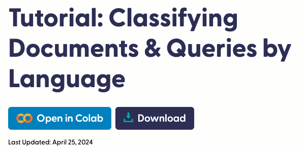
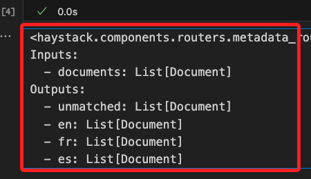
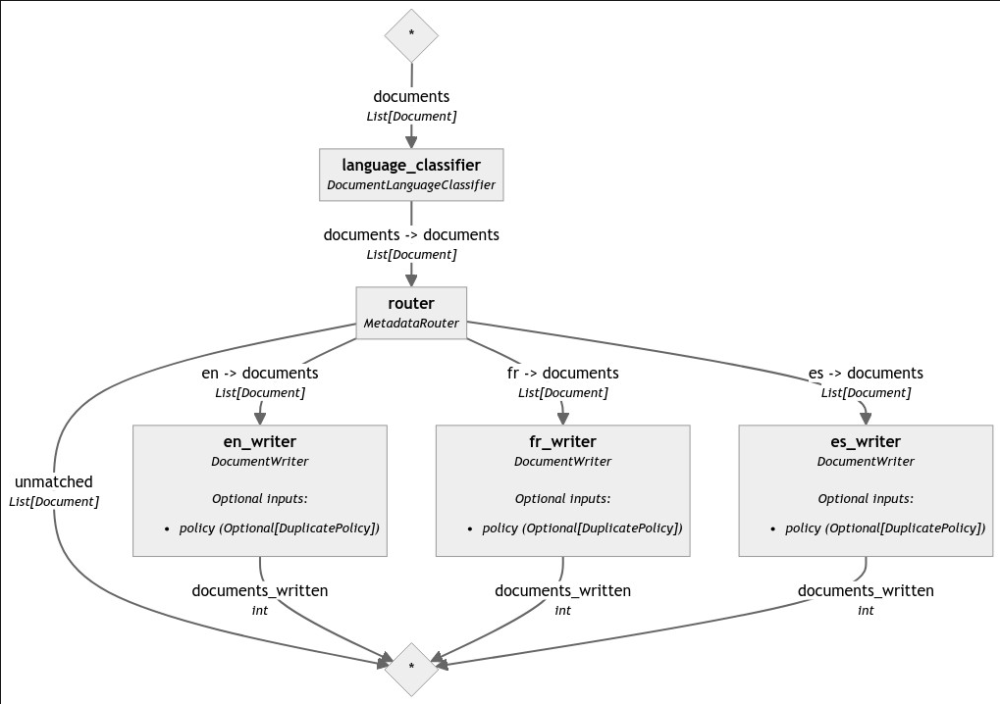
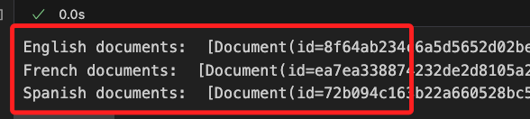
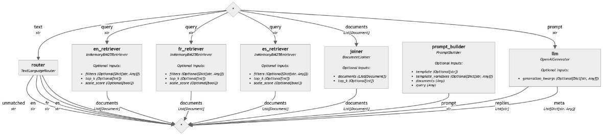

# 分類管道



<br>

## 說明

1. 這是官方在 `2024/04/25` 發佈的 [官方教程](https://haystack.deepset.ai/tutorials/32_classifying_documents_and_queries_by_language)。

<br>

2. 處理多語言輸入是 NLP 應用中的常見需求，`Haystack` 內建組件 `DocumentLanguageClassifier` 可用於檢測文件的語言，透過這便可在 `Haystack 管道` 中建立不同語言的處理分支，並為每種語言添加不同的處理步驟。

<br>

3. 本範例將使用人工編輯 `不同語言` 的 `酒店評論` 作為 `文本樣本`，將其 `轉換為 Haystack 文件` 後進行 `語言分類`，然後每個文件將被寫入語言專用的 `DocumentStore` 中，最後將建立一個多語言的 RAG 管道檢測問題使用的語言，針對該問題僅使用提問語言的文件來生成答案。

<br>

4. 本範例最終目標是建立一個 `Haystack 管道` 來根據 `文件的語言` 進行分類，還可以將 `語言分類` 和 `查詢路由` 集成到 `RAG 管道`中，如此便能根據 `查詢的語言` 進行文件檢索，並使用相應語言的文件來輔助生成答案。

<br>

## 使用組件

1. `InMemoryDocumentStore`：文件儲存，這是一個內存中的數據儲存組件，用於臨時儲存和管理文件。

<br>

2. `DocumentLanguageClassifier`：語言分類器，用於檢測文件的語言。這個組件可以自動識別文本內容所使用的自然語言，並標記文件的語言元數據。

<br>

3. `MetadataRouter`：元數據路由器，MetadataRouter 基於文件的元數據（如語言、類別等）來路由文件。它使用預定義的規則來將文件分配到不同的處理路徑上。

<br>

4. `DocumentWriter`：文件寫入器，用於將文件寫入到指定的文件儲存中。這個組件可以將處理後的文件（例如經過嵌入向量化的文件）保存到內存、數據庫或其他持久化儲存中，以便後續檢索和查詢。

<br>

5. `TextLanguageRouter`：文本語言路由器，這會根據輸入查詢文本的語言，將查詢路由到不同的處理管道。

<br>

6. `DocumentJoiner`：文件合併器，用於將多個文件合併成一個輸出。

<br>

7. `InMemoryBM25Retriever`：BM25檢索器，是一種基於 BM25 演算法的文本檢索器，適用於內存中的文件儲存。

<br>

8. `PromptBuilder`：提示生成器，用於建立提示文本，將用戶的查詢和文件內容結合成一個統一的提示，供生成模型使用。

<br>

9. `OpenAIGenerator`：文本生成器，這是一個使用 OpenAI 提供的模型來生成文本的組件。

<br>

## 開始

1. 安裝套件。

    ```bash
    pip install haystack-ai langdetect
    ```

<br>

2. 導入套件。

    ```python
    # 導入所需的模組
    # 用於建立和管理 Haystack 管道
    from haystack import Document, Pipeline
    # 該類用於建立內存中的文件儲存，方便快速讀取和寫入數據
    from haystack.document_stores.in_memory import InMemoryDocumentStore
    # 這是一個文件語言分類器，用於檢測文件的語言
    from haystack.components.classifiers import DocumentLanguageClassifier
    # 用於根據文件的元數據（例如語言）將文件路由到不同的處理節點
    from haystack.components.routers import MetadataRouter
    # 用於將文件寫入指定的文件儲存中
    from haystack.components.writers import DocumentWriter
    ```

<br>

3. 準備數據：人工編輯各種語言的酒店評論樣本。

    ```python
    # 人工編輯各種語言的酒店評論樣本
    documents = [
        Document(content="Super appartement. Juste au dessus de plusieurs bars qui ferment très tard. A savoir à l'avance. (Bouchons d'oreilles fournis !)"),
        Document(content="El apartamento estaba genial y muy céntrico, todo a mano. Al lado de la librería Lello y De la Torre de los clérigos. Está situado en una zona de marcha, así que si vais en fin de semana , habrá ruido, aunque a nosotros no nos molestaba para dormir"),
        Document(content="The keypad with a code is convenient and the location is convenient. Basically everything else, very noisy, wi-fi didn't work, check-in person didn't explain anything about facilities, shower head was broken, there's no cleaning and everything else one may need is charged."),
        Document(content="It is very central and appartement has a nice appearance (even though a lot IKEA stuff), *W A R N I N G the appartement presents itself as a elegant and as a place to relax, very wrong place to relax - you cannot sleep in this appartement, even the beds are vibrating from the bass of the clubs in the same building - you get ear plugs from the hotel -> now I understand why -> I missed a trip as it was so loud and I could not hear the alarm next day due to the ear plugs.- there is a green light indicating 'emergency exit' just above the bed, which shines very bright at night - during the arrival process, you felt the urge of the agent to leave as soon as possible. - try to go to 'RVA clerigos appartements' -> same price, super quiet, beautiful, city center and very nice staff (not an agency)- you are basically sleeping next to the fridge, which makes a lot of noise, when the compressor is running -> had to switch it off - but then had no cool food and drinks. - the bed was somehow broken down - the wooden part behind the bed was almost falling appart and some hooks were broken before- when the neighbour room is cooking you hear the fan very loud. I initially thought that I somehow activated the kitchen fan"),
        Document(content="Un peu salé surtout le sol. Manque de service et de souplesse"),
        Document(content="Nous avons passé un séjour formidable. Merci aux personnes , le bonjours à Ricardo notre taxi man, très sympathique. Je pense refaire un séjour parmi vous, après le confinement, tout était parfait, surtout leur gentillesse, aucune chaude négative. Je n'ai rien à redire de négative, Ils étaient a notre écoute, un gentil message tout les matins, pour nous demander si nous avions besoins de renseignement et savoir si tout allait bien pendant notre séjour."),
        Document(content="Céntrico. Muy cómodo para moverse y ver Oporto. Edificio con terraza propia en la última planta. Todo reformado y nuevo. Te traen un estupendo desayuno todas las mañanas al apartamento. Solo que se puede escuchar algo de ruido de la calle a primeras horas de la noche. Es un zona de ocio nocturno. Pero respetan los horarios.")
    ]
    ```

<br>

## 寫入文件

1. 建立 `內存文件儲存` 與 `語言分類器`，並將不同語言的文件寫入對應的 `InMemoryDocumentStore`。

    ```python
    # 建立各語言的內存文件儲存：英語、法語、西班牙語
    en_document_store = InMemoryDocumentStore()
    fr_document_store = InMemoryDocumentStore()
    es_document_store = InMemoryDocumentStore()

    # 建立語言分類器
    language_classifier = DocumentLanguageClassifier(
        languages=["en", "fr", "es"]
    )
    ```

<br>

2. 建立元數據路由器：根據 `語言` 將 `文件` 路由到對應的 `寫入器`，其中 `$eq` 是一個查詢過濾用的 `操作符`，表示 `equal`，用於指定匹配某個字段值的條件。

    ```python
    # 建立元數據路由器，根據語言將文件路由到對應的寫入器
    router_rules = {
        "en": {"language": {"$eq": "en"}},
        "fr": {"language": {"$eq": "fr"}},
        "es": {"language": {"$eq": "es"}}
    }
    # 將路由設定指定給 MetadataRouter 對象
    router = MetadataRouter(rules=router_rules)
    ```

<br>

3. 可查看一下路由對象，代表輸入的是一個 `Haystack 文件` 列表，透過路由之後，會依據三種語言進行分類，另外還有一個無法匹配的分類。

    ```python
    # 輸出看一下
    print(router)
    ```

    

<br>

4. 建立 `寫入器`，將 `英語`、`法語` 和 `西班牙語` 文件分別寫入各自的 `InMemoryDocumentStore` 對象中。

    ```python
    # 建立語言專用的寫入器
    en_writer = DocumentWriter(document_store=en_document_store)
    fr_writer = DocumentWriter(document_store=fr_document_store)
    es_writer = DocumentWriter(document_store=es_document_store)
    ```

<br>

5. 這裡有三個步驟，分別是建立 `索引管道`、`添加組件到索引管道`、`連接組件`。

    ```python
    # 建立管道
    indexing_pipeline = Pipeline()
    # 添加組件
    indexing_pipeline.add_component(
        instance=language_classifier, name="language_classifier"
    )
    indexing_pipeline.add_component(
        instance=router, name="router"
    )
    indexing_pipeline.add_component(
        instance=en_writer, name="en_writer"
    )
    indexing_pipeline.add_component(
        instance=fr_writer, name="fr_writer"
    )
    indexing_pipeline.add_component(
        instance=es_writer, name="es_writer"
    )

    # 連接組件
    indexing_pipeline.connect("language_classifier", "router")
    indexing_pipeline.connect("router.en", "en_writer")
    indexing_pipeline.connect("router.fr", "fr_writer")
    indexing_pipeline.connect("router.es", "es_writer")
    ```

<br>

6. 得到以下結果，說明使用的組件以及不同組件間的連接關係，也就是數據在 `管道` 中如何 `流動`。

    ```python
    <haystack.core.pipeline.pipeline.Pipeline object at 0x15a08f640>
    
    🚅 Components
        - language_classifier: DocumentLanguageClassifier
        - router: MetadataRouter
        - en_writer: DocumentWriter
        - fr_writer: DocumentWriter
        - es_writer: DocumentWriter
    
    🛤️ Connections
        - language_classifier.documents -> router.documents (List[Document])
        - router.en -> en_writer.documents (List[Document])
        - router.fr -> fr_writer.documents (List[Document])
        - router.es -> es_writer.documents (List[Document])
    ```

<br>

## 查看管道並運行

1. 繪製管道圖進行觀察。

    ```python
    # 繪製管道圖
    indexing_pipeline.draw("indexing_pipeline.png")
    ```

    

<br>

2. 運行管道。

    ```python
    # 運行管道，顯示寫入每個語言的文件數
    indexing_pipeline.run(
        data={"language_classifier": {"documents": documents}}
    )
    ```

<br>

3. 得到以下結果，表示文件成功按照語言分類並儲存起來，每種語言的文件數量分別為英文 2 個、法文 3 個、西班牙文 2 個。

    ```python
    {
        'router': {'unmatched': []},
        'en_writer': {'documents_written': 2},
        'fr_writer': {'documents_written': 3},
        'es_writer': {'documents_written': 2}
    }
    ```

<br>

## 檢查文件儲存的內容

1. 檢查文件儲存的內容，每個儲存應該只包含該語言的文件。

    ```python
    print(
        "English documents: ",
        en_document_store.filter_documents()
    )
    print(
        "French documents: ",
        fr_document_store.filter_documents()
    )
    print(
        "Spanish documents: ",
        es_document_store.filter_documents()
    )
    ```

<br>

2. 輸出結果，由於全部文件都已分類，所以顯示三個步同與言的 `Haystack 文件列表`。

    

<br>

## 建立多語言 RAG 管道

1. 添加環境變數：這裡會使用到 `Open API`，所以將 `API KEY` 寫入環境變數中。

    ```python
    from getpass import getpass
    import os
    from dotenv import load_dotenv

    # 導入環境變數
    load_dotenv()
    os.environ["OPENAI_API_KEY"] = os.getenv("OPENAI_API_KEY")
    # 判斷是否寫入，若無則手動提供
    if "OPENAI_API_KEY" not in os.environ:
        os.environ["OPENAI_API_KEY"] = getpass("Enter OpenAI API key:")
    ```

<br>

2. 導入 `RAG 管道` 所需的組件。

    ```python
    # 導入 RAG 管道所需的組件
    # 用來在內存中執行基於 BM25 算法的文本檢索
    from haystack.components.retrievers.in_memory import InMemoryBM25Retriever
    # 將多個文件進行合併，為後續處理提供一個統一的文件集合
    from haystack.components.joiners import DocumentJoiner
    # 用來根據模板建立提示，將查詢和相關文件整理成一個統一的提示文本
    from haystack.components.builders import PromptBuilder
    # 用來調用 OpenAI 的 API 生成文本
    from haystack.components.generators import OpenAIGenerator
    # 用來根據文本的語言將查詢或文件路由到不同的處理路徑
    from haystack.components.routers import TextLanguageRouter
    ```

<br>

3. 建立模板。

    ```python
    # 定義提示模板
    prompt_template = """
    您將收到有關住宿的評論。
    僅根據給定的評論簡潔地回答問題。
    評論：
    
        {{ doc.content }}
    
    問題：{{ query}}
    答案：
    """
    ```

<br>

## 建立 RAG 管道並添加管道組件

1. 為了建立 `多語言 RAG 管道`，將使用 `TextLanguageRouter` 來檢測查詢的語言，然後從相應的文件儲存中獲取該語言的文件。另外，假設之前放入 `文件儲存` 中的評論都是針對同一個住宿的，使用 `RAG 管道`，可以根據選擇的語言查詢有關該公寓的信息。

    ```python
    # 建立 RAG 管道
    rag_pipeline = Pipeline()

    # TextLanguageRouter 用於檢測輸入文本的語言，並將文本路由到對應的處理路徑
    rag_pipeline.add_component(
        # 元件參數是可以傳入值的，指定支持英文、法文、西班牙文
        instance=TextLanguageRouter(["en", "fr", "es"]),
        # 組件名稱為 "router"
        name="router"
    )

    # InMemoryBM25Retriever 用於在內存中基於 BM25 算法進行英文文件檢索
    rag_pipeline.add_component(
        # 指定英文文件儲存
        instance=InMemoryBM25Retriever(document_store=en_document_store),
        name="en_retriever"
    )

    rag_pipeline.add_component(
        # 指定法文文件儲存
        instance=InMemoryBM25Retriever(document_store=fr_document_store),
        name="fr_retriever"
    )

    rag_pipeline.add_component(
        # 指定西班牙文文件儲存
        instance=InMemoryBM25Retriever(document_store=es_document_store),
        name="es_retriever"
    )

    # DocumentJoiner 用於合併多個文件，提供一個統一的文件集合
    rag_pipeline.add_component(
        # 建立 DocumentJoiner 實例
        instance=DocumentJoiner(),
        name="joiner" 
    )

    # PromptBuilder 用於根據模板建立提示文本，將查詢和相關文件整理成一個提示文本
    rag_pipeline.add_component(
        # 指定提示模板
        instance=PromptBuilder(template=prompt_template),
        name="prompt_builder"
    )

    # OpenAIGenerator 用於調用 OpenAI 的 API 生成回答文本
    rag_pipeline.add_component(
        instance=OpenAIGenerator(),
        name="llm" 
    )
    ```

<br>

2. 連接組件。

    ```python
    # 連接組件
    rag_pipeline.connect("router.en", "en_retriever.query")
    rag_pipeline.connect("router.fr", "fr_retriever.query")
    rag_pipeline.connect("router.es", "es_retriever.query")
    rag_pipeline.connect("en_retriever", "joiner")
    rag_pipeline.connect("fr_retriever", "joiner")
    rag_pipeline.connect("es_retriever", "joiner")
    rag_pipeline.connect("joiner.documents", "prompt_builder.documents")
    rag_pipeline.connect("prompt_builder", "llm")
    ```

<br>

3. 完成時會顯示，可略作觀察。

    ```bash
    <haystack.core.pipeline.pipeline.Pipeline object at 0x319c7f9d0>
    🚅 Components
        - language_classifier: DocumentLanguageClassifier
        - router: MetadataRouter
        - en_writer: DocumentWriter
        - fr_writer: DocumentWriter
        - es_writer: DocumentWriter
    🛤️ Connections
        - language_classifier.documents -> router.documents (List[Document])
        - router.en -> en_writer.documents (List[Document])
        - router.fr -> fr_writer.documents (List[Document])
        - router.es -> es_writer.documents (List[Document])
    ```

<br>

4. 繪製管道圖。

    ```python
    # 繪製管道圖
    rag_pipeline.draw("rag_pipeline.png")
    ```

    

<br>

## 提問測試

1. 提問：英文查詢。

    ```python
    # 測試英文查詢
    en_question = "Is this apartment conveniently located?"
    result = rag_pipeline.run({
        "router": {"text": en_question},
        "prompt_builder": {"query": en_question}
    })
    print(result["llm"]["replies"][0])
    ```
    
    _答案：_

    Yes, the apartment is conveniently located.

<br>

2. 提問：西班牙語查詢。

    ```python
    # 測試西班牙語查詢
    es_question = "¿El desayuno es genial?"
    result = rag_pipeline.run({
        "router": {"text": es_question},
        "prompt_builder": {"query": es_question}
    })
    print(result["llm"]["replies"][0])
    ```

    _答案：_

    Sí, el desayuno es estupendo, te lo traen todas las mañanas al apartamento.

<br>

3. 測試中文提問。

    ```python
    # 測試中文查詢
    zh_question = "這間公寓位置方便嗎？"
    result = rag_pipeline.run({
        "router": {"text": zh_question},
        "prompt_builder": {"query": zh_question}
    })
    print(result["llm"]["replies"][0])
    ```

    _答案：_

    是的，這間公寓位置非常方便，靠近許多餐廳和商店，交通也很方便。

<br>

___

_END_
