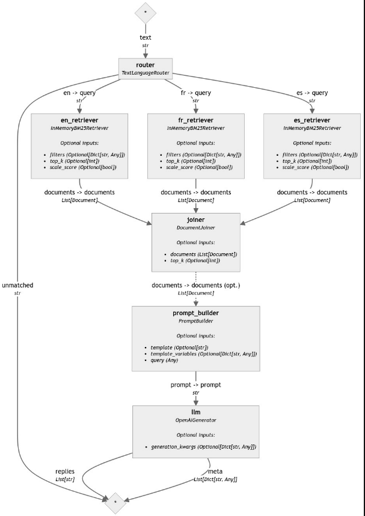

# 分類管道


<br>

## 說明

1. 這是官方在 `2024/04/25` 發佈的 [官方教程](https://haystack.deepset.ai/tutorials/32_classifying_documents_and_queries_by_language)。

<br>

2. 處理多語言輸入是 NLP 應用中的常見需求，`Haystack` 內建組件 `DocumentLanguageClassifier` 可用於檢測文件的語言，透過這便可在 `Haystack 管道` 中創建不同語言的處理分支，並為每種語言添加不同的處理步驟。

<br>

3. 本範例將使用人工編輯 `不同語言` 的 `酒店評論` 作為 `文本樣本`，將其 `轉換為 Haystack 文件` 後進行 `語言分類`，然後每個文件將被寫入語言專用的 `DocumentStore` 中，最後將構建一個多語言的 RAG 管道檢測問題使用的語言，針對該問題僅使用提問語言的文件來生成答案。

<br>

4. 本範例最終目標是構建一個 `Haystack 管道` 來根據 `文件的語言` 進行分類，還可以將 `語言分類` 和 `查詢路由` 集成到 `RAG 管道`中，如此便能根據 `查詢的語言` 進行文檔檢索，並使用相應語言的文檔來輔助生成答案。

<br>

## 使用組件

1. `InMemoryDocumentStore`：文檔存儲，這是一個內存中的數據存儲組件，用於臨時存儲和管理文檔。

<br>

2. `DocumentLanguageClassifier`：語言分類器，用於檢測文檔的語言。這個組件可以自動識別文本內容所使用的自然語言，並標記文檔的語言元數據。

<br>

3. `MetadataRouter`：元數據路由器，MetadataRouter 基於文檔的元數據（如語言、類別等）來路由文檔。它使用預定義的規則來將文檔分配到不同的處理路徑上。

<br>

4. `DocumentWriter`：文檔寫入器，用於將文檔寫入到指定的文檔存儲中。這個組件可以將處理後的文檔（例如經過嵌入向量化的文檔）保存到內存、數據庫或其他持久化存儲中，以便後續檢索和查詢。

<br>

5. `TextLanguageRouter`：文本語言路由器，這會根據輸入查詢文本的語言，將查詢路由到不同的處理管道。

<br>

6. `DocumentJoiner`：文檔合併器，用於將多個文檔合併成一個輸出。

<br>

7. `InMemoryBM25Retriever`：BM25檢索器，是一種基於 BM25 演算法的文本檢索器，適用於內存中的文檔存儲。

<br>

8. `PromptBuilder`：提示生成器，用於構建提示文本，將用戶的查詢和文檔內容結合成一個統一的提示，供生成模型使用。

<br>

9. `OpenAIGenerator`：文本生成器，這是一個使用 OpenAI 提供的模型來生成文本的組件。

<br>

## 開始

1. 安裝套件。

    ```bash
    pip install haystack-ai langdetect
    ```

<br>

2. 導入套件。

    ```python
    # 導入所需的模塊
    # 用於創建和管理 Haystack 管道
    from haystack import Document, Pipeline
    # 該類用於創建內存中的文檔存儲，方便快速讀取和寫入數據
    from haystack.document_stores.in_memory import InMemoryDocumentStore
    # 這是一個文檔語言分類器，用於檢測文檔的語言
    from haystack.components.classifiers import DocumentLanguageClassifier
    # 用於根據文檔的元數據（例如語言）將文檔路由到不同的處理節點
    from haystack.components.routers import MetadataRouter
    # 用於將文檔寫入指定的文檔存儲中
    from haystack.components.writers import DocumentWriter
    ```

<br>

3. 準備數據。

    ```python
    # 準備各種語言的酒店評論樣本
    documents = [
        Document(content="Super appartement. Juste au dessus de plusieurs bars qui ferment très tard. A savoir à l'avance. (Bouchons d'oreilles fournis !)"),
        Document(content="El apartamento estaba genial y muy céntrico, todo a mano. Al lado de la librería Lello y De la Torre de los clérigos. Está situado en una zona de marcha, así que si vais en fin de semana , habrá ruido, aunque a nosotros no nos molestaba para dormir"),
        Document(content="The keypad with a code is convenient and the location is convenient. Basically everything else, very noisy, wi-fi didn't work, check-in person didn't explain anything about facilities, shower head was broken, there's no cleaning and everything else one may need is charged."),
        Document(content="It is very central and appartement has a nice appearance (even though a lot IKEA stuff), *W A R N I N G the appartement presents itself as a elegant and as a place to relax, very wrong place to relax - you cannot sleep in this appartement, even the beds are vibrating from the bass of the clubs in the same building - you get ear plugs from the hotel -> now I understand why -> I missed a trip as it was so loud and I could not hear the alarm next day due to the ear plugs.- there is a green light indicating 'emergency exit' just above the bed, which shines very bright at night - during the arrival process, you felt the urge of the agent to leave as soon as possible. - try to go to 'RVA clerigos appartements' -> same price, super quiet, beautiful, city center and very nice staff (not an agency)- you are basically sleeping next to the fridge, which makes a lot of noise, when the compressor is running -> had to switch it off - but then had no cool food and drinks. - the bed was somehow broken down - the wooden part behind the bed was almost falling appart and some hooks were broken before- when the neighbour room is cooking you hear the fan very loud. I initially thought that I somehow activated the kitchen fan"),
        Document(content="Un peu salé surtout le sol. Manque de service et de souplesse"),
        Document(content="Nous avons passé un séjour formidable. Merci aux personnes , le bonjours à Ricardo notre taxi man, très sympathique. Je pense refaire un séjour parmi vous, après le confinement, tout était parfait, surtout leur gentillesse, aucune chaude négative. Je n'ai rien à redire de négative, Ils étaient a notre écoute, un gentil message tout les matins, pour nous demander si nous avions besoins de renseignement et savoir si tout allait bien pendant notre séjour."),
        Document(content="Céntrico. Muy cómodo para moverse y ver Oporto. Edificio con terraza propia en la última planta. Todo reformado y nuevo. Te traen un estupendo desayuno todas las mañanas al apartamento. Solo que se puede escuchar algo de ruido de la calle a primeras horas de la noche. Es un zona de ocio nocturno. Pero respetan los horarios.")
    ]
    ```

<br>

## 寫入文件

1. 建立 `內存文件儲存` 與 `語言分類器`，並將不同語言的文件寫入對應的 `InMemoryDocumentStore`。

    ```python
    # 創建各語言的內存文件存儲：英語、法語、西班牙語
    en_document_store = InMemoryDocumentStore()
    fr_document_store = InMemoryDocumentStore()
    es_document_store = InMemoryDocumentStore()

    # 創建語言分類器
    language_classifier = DocumentLanguageClassifier(
        languages=["en", "fr", "es"]
    )

    # 創建元數據路由器，根據語言將文件路由到對應的寫入器
    router_rules = {
        "en": {"language": {"$eq": "en"}},
        "fr": {"language": {"$eq": "fr"}},
        "es": {"language": {"$eq": "es"}}
    }
    router = MetadataRouter(rules=router_rules)
    # 輸出看一下
    print(router)
    ```

    

<br>

2. 建立寫入器。    

    ```python
    # 創建語言專用的寫入器
    en_writer = DocumentWriter(document_store=en_document_store)
    fr_writer = DocumentWriter(document_store=fr_document_store)
    es_writer = DocumentWriter(document_store=es_document_store)
    ```

<br>

3. 建立 `索引管道`，並將 `英語`、`法語` 和 `西班牙語` 文件分別寫入各自的 `InMemoryDocumentStores`。

    ```python
    # 創建管道
    indexing_pipeline = Pipeline()
    # 添加組件
    indexing_pipeline.add_component(
        instance=language_classifier, name="language_classifier"
    )
    indexing_pipeline.add_component(
        instance=router, name="router"
    )
    indexing_pipeline.add_component(
        instance=en_writer, name="en_writer"
    )
    indexing_pipeline.add_component(
        instance=fr_writer, name="fr_writer"
    )
    indexing_pipeline.add_component(
        instance=es_writer, name="es_writer"
    )

    # 連接組件
    indexing_pipeline.connect("language_classifier", "router")
    indexing_pipeline.connect("router.en", "en_writer")
    indexing_pipeline.connect("router.fr", "fr_writer")
    indexing_pipeline.connect("router.es", "es_writer")
    ```

<br>

4. 得到以下結果。

    ```python
    <haystack.core.pipeline.pipeline.Pipeline object at 0x15a08f640>
    
    🚅 Components
        - language_classifier: DocumentLanguageClassifier
        - router: MetadataRouter
        - en_writer: DocumentWriter
        - fr_writer: DocumentWriter
        - es_writer: DocumentWriter
    
    🛤️ Connections
        - language_classifier.documents -> router.documents (List[Document])
        - router.en -> en_writer.documents (List[Document])
        - router.fr -> fr_writer.documents (List[Document])
        - router.es -> es_writer.documents (List[Document])
    ```

<br>

## 查看管道並運行

1. 繪製管道圖進行觀察。

    ```python
    # 繪製管道圖
    indexing_pipeline.draw("indexing_pipeline.png")
    ```

    

<br>

2. 運行管道。

    ```python
    # 運行管道，顯示寫入每個語言的文件數
    indexing_pipeline.run(
        data={"language_classifier": {"documents": documents}}
    )
    ```

<br>

3. 得到以下結果。

    ```python
    {
        'router': {'unmatched': []},
        'en_writer': {'documents_written': 2},
        'fr_writer': {'documents_written': 3},
        'es_writer': {'documents_written': 2}
    }
    ```

## 檢查文件存儲的內容

1. 檢查文件存儲的內容，每個存儲應該只包含該語言的文件。

    ```python
    print(
        "English documents: ",
        en_document_store.filter_documents()
    )
    print(
        "French documents: ",
        fr_document_store.filter_documents()
    )
    print(
        "Spanish documents: ",
        es_document_store.filter_documents()
    )
    ```

<br>

2. 輸出結果。

    

<br>

## (可選) 創建多語言 RAG 管道

1. 添加環境變數。

    ```python
    from getpass import getpass
    import os
    from dotenv import load_dotenv

    # 導入環境變數
    load_dotenv()
    os.environ["OPENAI_API_KEY"] = os.getenv("OPENAI_API_KEY")
    # 判斷是否寫入，若無則手動提供
    if "OPENAI_API_KEY" not in os.environ:
        os.environ["OPENAI_API_KEY"] = getpass("Enter OpenAI API key:")
    ```

<br>

2. 導入必要庫。

    ```python
    # 導入 RAG 管道所需的組件
    from haystack.components.retrievers.in_memory import InMemoryBM25Retriever
    from haystack.components.joiners import DocumentJoiner
    from haystack.components.builders import PromptBuilder
    from haystack.components.generators import OpenAIGenerator
    from haystack.components.routers import TextLanguageRouter
    ```

<br>

3. 建立模板。

    ```python
    # 定義提示模板
    prompt_template = """
    您將收到有關住宿的評論。
    僅根據給定的評論簡潔地回答問題。
    評論：
    
        {{ doc.content }}
    
    問題：{{ query}}
    答案：
    """
    ```

<br>

## 建立 RAG 管道與組件

1. 為了構建 `多語言 RAG 管道`，將使用 `TextLanguageRouter` 來檢測查詢的語言，然後從相應的文件存儲中獲取該語言的文件。另外，假設之前放入 `文件存儲` 中的評論都是針對同一個住宿的，使用 `RAG 管道`，可以根據選擇的語言查詢有關該公寓的信息。

    ```python
    # 創建 RAG 管道
    rag_pipeline = Pipeline()
    rag_pipeline.add_component(
        instance=TextLanguageRouter(["en", "fr", "es"]),
        name="router"
    )
    rag_pipeline.add_component(
        instance=InMemoryBM25Retriever(document_store=en_document_store),
        name="en_retriever"
    )
    rag_pipeline.add_component(
        instance=InMemoryBM25Retriever(document_store=fr_document_store),
        name="fr_retriever"
    )
    rag_pipeline.add_component(
        instance=InMemoryBM25Retriever(document_store=es_document_store),
        name="es_retriever"
    )
    rag_pipeline.add_component(
        instance=DocumentJoiner(),
        name="joiner"
    )
    rag_pipeline.add_component(
        instance=PromptBuilder(template=prompt_template),
        name="prompt_builder"
    )
    rag_pipeline.add_component(
        instance=OpenAIGenerator(),
        name="llm"
    )
    ```

<br>

2. 連接組件。

    ```python
    # 連接組件
    rag_pipeline.connect("router.en", "en_retriever.query")
    rag_pipeline.connect("router.fr", "fr_retriever.query")
    rag_pipeline.connect("router.es", "es_retriever.query")
    rag_pipeline.connect("en_retriever", "joiner")
    rag_pipeline.connect("fr_retriever", "joiner")
    rag_pipeline.connect("es_retriever", "joiner")
    rag_pipeline.connect("joiner.documents", "prompt_builder.documents")
    rag_pipeline.connect("prompt_builder", "llm")
    ```

<br>

3. 完成時會顯示。

    ```bash
    <haystack.core.pipeline.pipeline.Pipeline object at 0x319c7f9d0>
    🚅 Components
        - language_classifier: DocumentLanguageClassifier
        - router: MetadataRouter
        - en_writer: DocumentWriter
        - fr_writer: DocumentWriter
        - es_writer: DocumentWriter
    🛤️ Connections
        - language_classifier.documents -> router.documents (List[Document])
        - router.en -> en_writer.documents (List[Document])
        - router.fr -> fr_writer.documents (List[Document])
        - router.es -> es_writer.documents (List[Document])
    ```

<br>

4. 繪製管道圖。

    ```python
    # 繪製管道圖
    rag_pipeline.draw("rag_pipeline.png")
    ```

    

<br>

4. 提問：英文查詢。

    ```python
    # 測試英文查詢
    en_question = "Is this apartment conveniently located?"
    result = rag_pipeline.run({
        "router": {"text": en_question},
        "prompt_builder": {"query": en_question}
    })
    print(result["llm"]["replies"][0])
    ```

<br>

5. 提問：西班牙語查詢。

    ```python
    # 測試西班牙語查詢
    es_question = "¿El desayuno es genial?"
    result = rag_pipeline.run({
        "router": {"text": es_question},
        "prompt_builder": {"query": es_question}
    })
    print(result["llm"]["replies"][0])
    ```

<br>

___

_END_