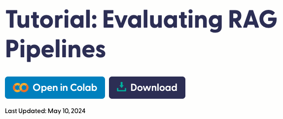

# 評估 RAG 管道



## 說明

1. 這是官方在 `2024/05/10` 發佈的 [官方教程](https://haystack.deepset.ai/tutorials/35_evaluating_rag_pipelines)，操作中需要使用 `OpenAI API Key`。

<br>

2. 範例的目標是使用 `Haystack 的評估工具` 對 RAG 管道進行評估，包括基於 `模型的評估` 和 `統計評估`，尤其是對檢索增強生成 (RAG) 管道的評估。

<br>

3. `RAG 管道`通常至少包括 `檢索與生成` 兩個步驟，要評估一個完整的 RAG 管道，需要分別對這些管道中的步驟進行評估，同時還要對整個單元進行評估。儘管有時可以使用需要標籤的統計指標來評估檢索步驟，但對生成步驟進行相同的評估並不容易。因此，通常依靠基於模型的指標來評估生成步驟，並使用 `LLM` 作為 `評估者`。

<br>

## 使用組件

1. `InMemoryDocumentStore`：

<br>

2. `InMemoryEmbeddingRetriever`：

<br>

3. `PromptBuilder`：

<br>

4. `OpenAIGenerator`：

<br>

5. `DocumentMRREvaluator`：

<br>

6. `FaithfulnessEvaluator`：

<br>

7. `SASEvaluator`：

<br>

## 流程說明

1. 建立一個基於 PubMed 數據回答醫學問題的管道。

<br>

2. 構建一個評估管道，使用一些指標如文件 MRR 和答案忠實性進行評估。

<br>

3. 運行你的 RAG 管道並用評估管道對其輸出進行評估。

<br>

## 開始

1. 安裝依賴。

```bash
pip install haystack-ai "datasets>=2.6.1" sentence-transformers>=2.2.0
```

<br>

2. 建立 RAG 管道並進行評估：本教程中，我們將使用一個帶有問題、上下文和答案的標註 PubMed 數據集。這樣，我們可以將上下文作為文件，並且有需要的一些評估指標所需的標註數據。

```python
# 載入數據集
from datasets import load_dataset
from haystack import Document

# 加載 PubMedQA 數據集，取前 1000 條數據
dataset = load_dataset(
    "vblagoje/PubMedQA_instruction",
    split="train"
)
dataset = dataset.select(range(1000))

# 提取文件
all_documents = [
    Document(content=doc["context"])
    for doc in dataset
]
# 提取問題
all_questions = [
    doc["instruction"]
    for doc in dataset
]
# 提取真實答案
all_ground_truth_answers = [
    doc["response"]
    for doc in dataset
]
```

<br>

## 構建管道

_建立索引管道，並使用 `InMemoryDocumentStore` 將文件寫入 `DocumentStore`，這裡寫入的是緩存。_

<br>

1. 導入組間。

```python
from typing import List
from haystack import Pipeline
from haystack.components.embedders import SentenceTransformersDocumentEmbedder
from haystack.components.writers import DocumentWriter
from haystack.document_stores.in_memory import InMemoryDocumentStore
from haystack.document_stores.types import DuplicatePolicy
```

<br>

2. 建立索引管道對象 `indexing`。

```python
# 建立索引管道
indexing = Pipeline()
```

<br>

3. 建立文件儲存、嵌入器、寫入器。

```python
# 建立 `文件嵌入器`
document_embedder = SentenceTransformersDocumentEmbedder(
    model="sentence-transformers/all-MiniLM-L6-v2"
)

# 建立 `內存文件儲存` 對象
document_store = InMemoryDocumentStore()

# 使用儲存對象建立 `文件寫入器`
document_writer = DocumentWriter(
    document_store=document_store,
    # 重複時跳過
    policy=DuplicatePolicy.SKIP
)
```

<br>

3. 為管道添加管道元件。

```python
# 添加管道元件
indexing.add_component(
    instance=document_embedder,
    name="document_embedder"
)
indexing.add_component(
    instance=document_writer,
    name="document_writer"
)
```

<br>

4. 將已添加的管道元件進行連接。

```python
# 連接管道元件：連接嵌入器和寫入器
indexing.connect(
    "document_embedder.documents",
    "document_writer.documents"
)
```

<br>

5. 運行索引管道 `indexing`。

```python
# 執行索引管道
indexing.run(
    {"document_embedder": {"documents": all_documents}}
)
```

<br>

## 建立 RAG 管道

_將使用 `InMemoryEmbeddingRetriever` 來檢索與查詢相關的文件，並透過 `OpenAIGenerator` 生成查詢的答案。_

<br>

1. 載入環境變數。

```python
import os
from getpass import getpass
from dotenv import load_dotenv

# 載入環境變數
load_dotenv()
os.environ["OPENAI_API_KEY"] = os.getenv("OPENAI_API_KEY")
# 設置 OpenAI API 金鑰
if "OPENAI_API_KEY" not in os.environ:
    os.environ["OPENAI_API_KEY"] = getpass("Enter OpenAI API key:")
```

<br>

2. 導入範例所需依賴庫。

```python
from haystack.components.builders import AnswerBuilder, PromptBuilder
from haystack.components.embedders import SentenceTransformersTextEmbedder
from haystack.components.generators import OpenAIGenerator
from haystack.components.retrievers.in_memory import InMemoryEmbeddingRetriever
```

<br>

3. 定義模板。

```python
# 定義生成答案的模板
template = """
        您必須僅根據給定的上下文資訊回答以下問題。

        上下文:
        
            {{ document.content }}
        

        問題: {{question}}
        答案:
        """
```

<br>

4. 建立 RAG 管道。

```python
# 建立 RAG 管道
rag_pipeline = Pipeline()
```

<br>

5. 添加管道組件。

```python
rag_pipeline.add_component(
    "query_embedder", 
    SentenceTransformersTextEmbedder(
        model="sentence-transformers/all-MiniLM-L6-v2"
    )
)
rag_pipeline.add_component(
    "retriever",
    InMemoryEmbeddingRetriever(document_store, top_k=3)
)
rag_pipeline.add_component(
    "prompt_builder",
    PromptBuilder(template=template)
)
rag_pipeline.add_component(
    "generator",
    OpenAIGenerator(model="gpt-4-turbo")
)
rag_pipeline.add_component(
    "answer_builder",
    AnswerBuilder()
)
```

<br>

6. 連接組件。

```python
# 連接管道的組件
rag_pipeline.connect(
    "query_embedder", "retriever.query_embedding"
)
rag_pipeline.connect(
    "retriever", "prompt_builder.documents"
)
rag_pipeline.connect(
    "prompt_builder", "generator"
)
rag_pipeline.connect(
    "generator.replies", "answer_builder.replies"
)
rag_pipeline.connect(
    "generator.meta", "answer_builder.meta"
)
rag_pipeline.connect(
    "retriever", "answer_builder.documents"
)
```

<br>

## 提問

1. 使用管道的 `run()` 方法可進行 `提問`，要確保將問題提供給所有需要它的組件作為輸入，這些組件包括 `query_embedder`、`prompt_builder` 和 `answer_builder`。

```python
# 問題
question = "小兒肝移植術後早期降鈣素原高是否表示術後效果不佳？"
# 運行管道
response = rag_pipeline.run(
    {
        "query_embedder": {"text": question},
        "prompt_builder": {"question": question},
        "answer_builder": {"query": question}
    }
)
# 輸出
print(response["answer_builder"]["answers"][0].data)
```

<br>

## 評估管道說明

_使用以下指標來評估管道_

<br>

1. 文件平均互惠排名 (Document MRR): 使用真實標籤評估檢索到的文件，檢查真實文件在檢索到的文件列表中的排名。

<br>

2. 語義答案相似性 (Semantic Answer Similarity): 使用真實標籤評估預測的答案，檢查預測答案和真實答案的語義相似性。

<br>

3. 忠實性 (Faithfulness): 使用 LLM 評估生成的答案是否可以從提供的上下文中推斷出來，不需要真實標籤。

<br>

## 進行評估

1. 運行 RAG 管道並確保有這些問題的真實標籤，包括答案和文件，以下操作將從 `25` 個隨機問題和標籤開始。

```python
import random

# 隨機抽取 25 個問題和標籤
# 問題、具體答案、具體文件
questions, ground_truth_answers, ground_truth_docs = zip(
    *random.sample(
        list(zip(
            all_questions,
            all_ground_truth_answers,
            all_documents
        )),
        25
    )
)
```

<br>

2. 運行管道並記錄其返回的答案和檢索到的文件。

```python
# 返回的答案
rag_answers = []
# 索引到的文件
retrieved_docs = []
# 遍歷問題
for question in list(questions):
    # 運行管道
    response = rag_pipeline.run({
        "query_embedder": {"text": question},
        "prompt_builder": {"question": question},
        "answer_builder": {"query": question}
    })
    # 輸出
    print(f"Question: {question}")
    print("Answer from pipeline:")
    print(response["answer_builder"]["answers"][0].data)
    print("\n-----------------------------------\n")

    # 記錄答案
    rag_answers.append(
        response["answer_builder"]["answers"][0].data
    )
    # 紀錄檢索到的文件
    retrieved_docs.append(
        response["answer_builder"]["answers"][0].documents
    )
```

<br>

## 建立評估管道

_雖然每個評估器都是 `Haystack` 中可以單獨運行的 `組件`，但它們也可以添加到管道中，這樣可以構建一個包含所有 `評估指標` 的 `評估管道`。_

<br>

1. 導入庫。

```python
from haystack.components.evaluators.document_mrr import DocumentMRREvaluator
from haystack.components.evaluators.faithfulness import FaithfulnessEvaluator
from haystack.components.evaluators.sas_evaluator import SASEvaluator
```

<br>

2. 建立評估管道。

```python
# 建立評估管道
eval_pipeline = Pipeline()
```

<br>

3. 建立管道組件：組件的第一個參數是 `名稱`，將在管道中作為 `識別符`。

```python
eval_pipeline.add_component(
    "doc_mrr_evaluator",
    DocumentMRREvaluator()
)
eval_pipeline.add_component(
    "faithfulness",
    FaithfulnessEvaluator()
)
eval_pipeline.add_component(
    "sas_evaluator",
    SASEvaluator(model="sentence-transformers/all-MiniLM-L6-v2")
)
```

<br>

4. 運行評估管道。

```python
# 運行評估管道
results = eval_pipeline.run({
    "doc_mrr_evaluator": {
        "ground_truth_documents": list([d] for d in ground_truth_docs),
        "retrieved_documents": retrieved_docs
    },
    "faithfulness": {
        "questions": list(questions),
        "contexts": list([d.content] for d in ground_truth_docs),
        "predicted_answers": rag_answers
    },
    "sas_evaluator": {
        "predicted_answers": rag_answers,
        "ground_truth_answers": list(ground_truth_answers)
    }
})
```

<br>

## 構建評估報告

1. 運行評估管道後可生成完整的評估報告，`Haystack` 提供了一個 `EvaluationRunResult` 來顯示分數報告。

```python
from haystack.evaluation.eval_run_result import EvaluationRunResult

inputs = {
    "question": list(questions),
    "contexts": list([d.content] for d in ground_truth_docs),
    "answer": list(ground_truth_answers),
    "predicted_answer": rag_answers,
}

evaluation_result = EvaluationRunResult(
    run_name="pubmed_rag_pipeline",
    inputs=inputs,
    results=results
)
evaluation_result.score_report()
```

<br>

## 轉換報告格式

1. 可將報告轉換為 Pandas DataFrame。

```python
import pandas as pd

# 將評估結果轉換為 DataFrame
results_df = evaluation_result.to_pandas()
results_df

# 使用 Pandas 過濾結果，顯示語義答案相似性最高的 3 個和最低的 3 個
top_3 = results_df.nlargest(3, 'sas_evaluator')
bottom_3 = results_df.nsmallest(3, 'sas_evaluator')
pd.concat([top_3, bottom_3])
```

<br>

___

_END_