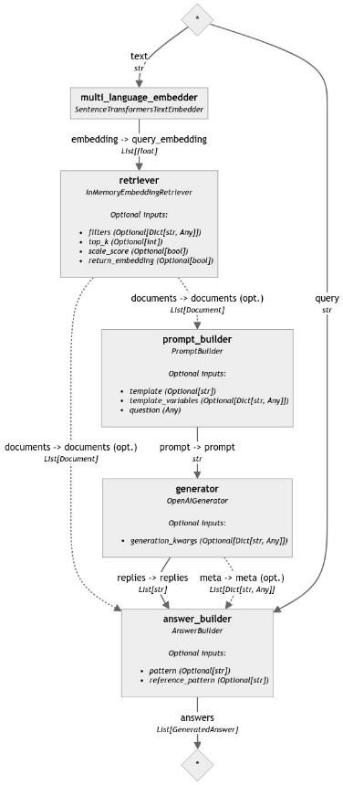

# 評估 RAG 管道


## 說明

1. 這是官方在 `2024/05/10` 發佈的 [官方教程](https://haystack.deepset.ai/tutorials/35_evaluating_rag_pipelines)，操作中需要使用 `OpenAI API Key`。

<br>

2. 範例的目標是使用 `Haystack 的評估工具` 對 RAG 管道進行評估，包括基於 `模型的評估` 和 `統計評估`，尤其是對檢索增強生成 (RAG) 管道的評估。

<br>

3. `RAG 管道`通常至少包括 `檢索與生成` 兩個步驟，要評估一個完整的 RAG 管道，需要分別對這些管道中的步驟進行評估，同時還要對整個單元進行評估。儘管有時可以使用需要標籤的統計指標來評估檢索步驟，但對生成步驟進行相同的評估並不容易。因此，通常依靠基於模型的指標來評估生成步驟，並使用 `LLM` 作為 `評估者`。

<br>

## 使用組件

1. `InMemoryDocumentStore`：

<br>

2. `InMemoryEmbeddingRetriever`：

<br>

3. `PromptBuilder`：

<br>

4. `OpenAIGenerator`：

<br>

5. `DocumentMRREvaluator`：

<br>

6. `FaithfulnessEvaluator`：

<br>

7. `SASEvaluator`：

<br>

## 流程說明

1. 建立一個基於 PubMed 數據回答醫學問題的管道。

<br>

2. 建立一個評估管道，使用一些指標如文件 MRR 和答案忠實性進行評估。

<br>

3. 運行你的 RAG 管道並用評估管道對其輸出進行評估。

<br>

## 開始

1. 安裝依賴。

    ```bash
    pip install haystack-ai "datasets>=2.6.1" sentence-transformers>=2.2.0
    ```

<br>

## 下載數據

_建立管道並評估之前，將使用一個帶有問題、上下文和答案標註的 `PubMed` 數據集。_

1. 下載數據。

    ```python
    # 載入數據集
    from datasets import load_dataset
    from haystack import Document

    # 加載 PubMedQA 數據集
    dataset = load_dataset(
        "vblagoje/PubMedQA_instruction",
        split="train"
    )
    # 僅取前 1000 條數據
    dataset = dataset.select(range(1000))

    # 提取其中的 `context` 作為文件
    all_documents = [
        Document(content=doc["context"])
        for doc in dataset
    ]
    # 提取 `instruction` 作為問題
    all_questions = [
        doc["instruction"]
        for doc in dataset
    ]
    # 提取 `response` 作為真實答案
    all_ground_truth_answers = [
        doc["response"]
        for doc in dataset
    ]
    ```

<br>

2. 會進行下載。

    

<br>

## 建立管道

_建立索引管道，並使用 `InMemoryDocumentStore` 將文件寫入 `DocumentStore`，這裡寫入的是緩存。_

<br>

1. 導入組件。

    ```python
    from typing import List
    from haystack import Pipeline
    from haystack.components.embedders import SentenceTransformersDocumentEmbedder
    from haystack.components.writers import DocumentWriter
    from haystack.document_stores.in_memory import InMemoryDocumentStore
    from haystack.document_stores.types import DuplicatePolicy
    ```

<br>

2. 建立索引管道對象 `indexing`。

    ```python
    # 建立索引管道
    indexing = Pipeline()
    ```

<br>

3. 建立文件儲存、嵌入器、寫入器。

    ```python
    # 建立 `文件嵌入器`
    document_embedder = SentenceTransformersDocumentEmbedder(
        model="sentence-transformers/all-MiniLM-L6-v2"
    )

    # 建立 `內存文件儲存` 對象
    document_store = InMemoryDocumentStore()

    # 使用儲存對象建立 `文件寫入器`
    document_writer = DocumentWriter(
        document_store=document_store,
        # 重複時跳過
        policy=DuplicatePolicy.SKIP
    )
    ```

<br>

4. 為管道添加管道元件。

    ```python
    # 添加管道元件
    indexing.add_component(
        instance=document_embedder,
        name="document_embedder"
    )
    indexing.add_component(
        instance=document_writer,
        name="document_writer"
    )
    ```

<br>

5. 將已添加的管道元件進行連接。

    ```python
    # 連接管道元件：連接嵌入器和寫入器
    indexing.connect(
        "document_embedder.documents",
        "document_writer.documents"
    )
    ```

<br>

6. 可觀察輸出。

    ```bash
    <haystack.core.pipeline.pipeline.Pipeline object at 0x33a517550>
    🚅 Components
    - document_embedder: SentenceTransformersDocumentEmbedder
    - document_writer: DocumentWriter
    🛤️ Connections
    - document_embedder.documents -> document_writer.documents (List[Document])
    ```

<br>

7. 運行索引管道 `indexing`。

    ```python
    # 執行索引管道
    indexing.run(
        {"document_embedder": {"documents": all_documents}}
    )
    ```

<br>

8. 輸出如下。

    

<br>

9. 出圖查看管道。

    ```python
    indexing.draw('ex15-1.png')
    ```

<br>

10. 圖形如下。

    

<br>

## 建立 RAG 管道

_將使用 `InMemoryEmbeddingRetriever` 來檢索與查詢相關的文件，並透過 `OpenAIGenerator` 生成查詢的答案。_

<br>

1. 載入環境變數。

    ```python
    import os
    from getpass import getpass
    from dotenv import load_dotenv

    # 載入環境變數
    load_dotenv()
    os.environ["OPENAI_API_KEY"] = os.getenv("OPENAI_API_KEY")
    # 設置 OpenAI API 金鑰
    if "OPENAI_API_KEY" not in os.environ:
        os.environ["OPENAI_API_KEY"] = getpass("Enter OpenAI API key:")
    ```

<br>

2. 導入範例所需依賴庫。

    ```python
    from haystack.components.builders import AnswerBuilder, PromptBuilder
    from haystack.components.embedders import SentenceTransformersTextEmbedder
    from haystack.components.generators import OpenAIGenerator
    from haystack.components.retrievers.in_memory import InMemoryEmbeddingRetriever
    ```

<br>

3. 定義模板。

    ```python
    # 定義生成答案的模板
    template = """
            您必須僅根據給定的上下文資訊回答以下問題。

            上下文:
            
                {{ document.content }}
            

            問題: {{question}}
            答案:
            """
    ```

<br>

4. 建立 RAG 管道。

    ```python
    # 建立 RAG 管道
    rag_pipeline = Pipeline()
    ```

<br>

5. 添加管道組件。

    ```python
    rag_pipeline.add_component(
        "query_embedder", 
        SentenceTransformersTextEmbedder(
            model="sentence-transformers/all-MiniLM-L6-v2"
        )
    )
    rag_pipeline.add_component(
        "retriever",
        InMemoryEmbeddingRetriever(document_store, top_k=3)
    )
    rag_pipeline.add_component(
        "prompt_builder",
        PromptBuilder(template=template)
    )
    rag_pipeline.add_component(
        "generator",
        OpenAIGenerator(model="gpt-4-turbo")
    )
    rag_pipeline.add_component(
        "answer_builder",
        AnswerBuilder()
    )
    ```

<br>

6. 連接組件。

    ```python
    # 連接管道的組件
    rag_pipeline.connect(
        "query_embedder", "retriever.query_embedding"
    )
    rag_pipeline.connect(
        "retriever", "prompt_builder.documents"
    )
    rag_pipeline.connect(
        "prompt_builder", "generator"
    )
    rag_pipeline.connect(
        "generator.replies", "answer_builder.replies"
    )
    rag_pipeline.connect(
        "generator.meta", "answer_builder.meta"
    )
    rag_pipeline.connect(
        "retriever", "answer_builder.documents"
    )
    ```

<br>

7. 輸出如下。

    ```bash
    <haystack.core.pipeline.pipeline.Pipeline object at 0x38bad2230>
    
    🚅 Components
        - query_embedder: SentenceTransformersTextEmbedder
        - retriever: InMemoryEmbeddingRetriever
        - prompt_builder: PromptBuilder
        - generator: OpenAIGenerator
        - answer_builder: AnswerBuilder
    
    🛤️ Connections
        - query_embedder.embedding -> retriever.query_embedding (List[float])
        - retriever.documents -> prompt_builder.documents (List[Document])
        - retriever.documents -> answer_builder.documents (List[Document])
        - prompt_builder.prompt -> generator.prompt (str)
        - generator.replies -> answer_builder.replies (List[str])
        - generator.meta -> answer_builder.meta (List[Dict[str, Any]])
    ```

<br>

## 提問

1. 使用管道的 `run()` 方法可進行 `提問`，要確保將問題提供給所有需要它的組件作為輸入，這些組件包括 `query_embedder`、`prompt_builder` 和 `answer_builder`。

    ```python
    # 問題：小兒肝移植術後早期降鈣素原高是否表示術後效果不佳？
    question = "Do high levels of procalcitonin in the early phase after?"

    # 運行管道
    response = rag_pipeline.run(
        {
            "query_embedder": {"text": question},
            "prompt_builder": {"question": question},
            "answer_builder": {"query": question}
        }
    )
    # 輸出
    print(response["answer_builder"]["answers"][0].data)
    ```

<br>

2. 結果。

    ```bash
    Batches: 100%|██████████| 1/1 [00:00<00:00, 11.75it/s]
    huggingface/tokenizers: The current process just got forked, after parallelism has already been used. Disabling parallelism to avoid deadlocks...
    To disable this warning, you can either:
        - Avoid using `tokenizers` before the fork if possible
        - Explicitly set the environment variable TOKENIZERS_PARALLELISM=(true | false)
    Yes, high levels of procalcitonin in the early phase after pediatric liver transplantation indicate a poor postoperative outcome. Patients with high procalcitonin levels on postoperative day 2 were observed to have higher International Normalized Ratio values on postoperative day 5 and suffered more often from primary graft non-function. Additionally, these patients experienced longer stays in the pediatric intensive care unit and required prolonged mechanical ventilation. These indications collectively suggest a correlation between early postoperative elevations in procalcitonin and compromised postoperative recovery.
    ```

<br>

## 使用中文提問

_在 Haystack 的最新官方文件中並無刪除或斷開組件連接得方法，若要使用中文，就必須重建管道。_

<br>

1. 原本使用的模型是 `sentence-transformers/all-MiniLM-L6-v2`，這模型是針對英文文本進行訓練的，對於中文文本的支持可能有限，因此在處理中文查詢時無法生成高質量的嵌入，導致檢索和生成的結果不理想。

<br>

2. 改用支持多語言的嵌入模型和生成模型 `sentence-transformers/paraphrase-multilingual-MiniLM-L12-v2`，這個模型能夠更好地處理多語言文本，特別注意，雖然組件名稱在管道中必須是唯一的，但這裡因為會建立新的管道，所以名稱沿用無妨，唯獨嵌入模型部分重新命名為 `multi_language_embedder`。

<br>

3. 建立新的管道。

    ```python
    # 建立 RAG 管道
    new_rag_pipeline = Pipeline()
    ```

<br>

4. 改用新的嵌入模型。

    ```python
    # 改用支持多語言的嵌入模型
    new_rag_pipeline.add_component(
        # 這是新的嵌入模型名稱
        "multi_language_embedder",
        SentenceTransformersTextEmbedder(
            # 使用新的嵌入模型
            model="sentence-transformers/paraphrase-multilingual-MiniLM-L12-v2"
        )
    )
    # 其餘組件設定維持不便
    new_rag_pipeline.add_component(
        "retriever",
        InMemoryEmbeddingRetriever(document_store, top_k=3)
    )
    new_rag_pipeline.add_component(
        "prompt_builder",
        PromptBuilder(template=template)
    )
    new_rag_pipeline.add_component(
        "generator",
        OpenAIGenerator(model="gpt-4-turbo")
    )
    new_rag_pipeline.add_component(
        "answer_builder",
        AnswerBuilder()
    )
    ```

<br>

5. 連接組件。

    ```python
    # 連接管道的組件
    new_rag_pipeline.connect(
        "multi_language_embedder", "retriever.query_embedding"
    )
    new_rag_pipeline.connect(
        "retriever", "prompt_builder.documents"
    )
    new_rag_pipeline.connect(
        "prompt_builder", "generator"
    )
    new_rag_pipeline.connect(
        "generator.replies", "answer_builder.replies"
    )
    new_rag_pipeline.connect(
        "generator.meta", "answer_builder.meta"
    )
    new_rag_pipeline.connect(
        "retriever", "answer_builder.documents"
    )
    ```

<br>

6. 輸出如下。

    ```bash
    <haystack.core.pipeline.pipeline.Pipeline object at 0x391b3a470>

    🚅 Components
        - multi_language_embedder: SentenceTransformersTextEmbedder
        - retriever: InMemoryEmbeddingRetriever
        - prompt_builder: PromptBuilder
        - generator: OpenAIGenerator
        - answer_builder: AnswerBuilder

    🛤️ Connections
        - multi_language_embedder.embedding -> retriever.query_embedding (List[float])
        - retriever.documents -> prompt_builder.documents (List[Document])
        - retriever.documents -> answer_builder.documents (List[Document])
        - prompt_builder.prompt -> generator.prompt (str)
        - generator.replies -> answer_builder.replies (List[str])
        - generator.meta -> answer_builder.meta (List[Dict[str, Any]])
    ```

7. 查看管道。

    ```python
    new_rag_pipeline.draw('new_rag_pipeline.png')
    ```

    

<br>

## 自定義輸出圖片函數

1. 建立一個資料夾 `utils`，添加一個模組 `draw_pipeline.py`，編輯內容如下。

    ```python
    # 導入需要的函數和模組
    from IPython.display import Image, display  # 用於顯示圖片的 IPython 函數


    # 定義擴展的 draw 函數
    def draw_and_display(pipeline, image_path):
        """
        擴展 draw 函數，生成圖片後直接在 Jupyter Notebook 中顯示。

        :param pipeline: 要繪製的管道對象
        :param image_path: 保存圖片的路徑
        """
        # 生成並保存管道圖片
        pipeline.draw(image_path)

        # 讀取並顯示圖片
        display(Image(filename=image_path))
    ```

<br>

2. 在 `JupyterNotebook` 中調用，儲存圖片後同時會顯示在儲存格中。

    ```python
    from utils.draw_pipeline import draw_and_display

    draw_and_display(new_rag_pipeline, 'new_rag_pipeline.png')
    ```

<br>

## 使用中文進行提問

1. 使用中文進行提問。

    ```python
    # 問題
    question = "小兒肝移植術後早期降鈣素原高是否表示術後效果不佳？"

    # 運行管道
    response = new_rag_pipeline.run(
        {
            # 使用新的嵌入模型 `multi_language_embedder`
            "multi_language_embedder": {"text": question},
            "prompt_builder": {"question": question},
            "answer_builder": {"query": question}
        }
    )
    # 輸出
    print(response["answer_builder"]["answers"][0].data)
    ```

<br>

2. 結果。

    ```bash
    是的，小兒肝移植術後早期降鈣素原(PCT)水平的升高與術後效果不佳有關。在上述的研究中，顯示術後第二天PCT水平高的患者在術後第五天有更高的國際標準化比率值，更常出現原發性移植物無功能的情況，並且在兒科重症監護病房停留時間更長，以及需要更長時間的機械通氣。这些結果說明PCT水平的升高與術後效果不佳有關，尤其是在肝功能及病人恢復方面。
    ```

<br>

## 評估管道說明

_使用以下指標來評估管道_

<br>

1. 文件平均互惠排名 (Document MRR)：使用真實標籤評估檢索到的文件，檢查真實文件在檢索到的文件列表中的排名。

<br>

2. 語義答案相似性 (Semantic Answer Similarity)：使用真實標籤評估預測的答案，檢查預測答案和真實答案的語義相似性。

<br>

3. 忠實性 (Faithfulness): 使用 `LLM` 評估生成的答案是否可以從提供的上下文中推斷出來，不需要真實標籤。

<br>

## 進行評估

1. 運行 `RAG` 管道並確保有這些問題的真實標籤，包括答案和文件，以下操作將從 `25` 個隨機問題和標籤開始。

    ```python
    import random

    # 隨機抽取 25 個問題和標籤
    # 問題、具體答案、具體文件
    questions, ground_truth_answers, ground_truth_docs = zip(
        *random.sample(
            list(zip(
                all_questions,
                all_ground_truth_answers,
                all_documents
            )),
            25
        )
    )
    ```

<br>

2. 運行管道並記錄其返回的答案和檢索到的文件。

    ```python
    # 返回的答案
    rag_answers = []
    # 索引到的文件
    retrieved_docs = []
    # 遍歷問題
    for question in list(questions):
        # 運行管道
        response = new_rag_pipeline.run({
            "multi_language_embedder": {"text": question},
            "prompt_builder": {"question": question},
            "answer_builder": {"query": question}
        })
        # 輸出
        print(f"Question: {question}")
        print("Answer from pipeline:")
        print(response["answer_builder"]["answers"][0].data)
        print("\n-----------------------------------\n")

        # 記錄答案
        rag_answers.append(
            response["answer_builder"]["answers"][0].data
        )
        # 紀錄檢索到的文件
        retrieved_docs.append(
            response["answer_builder"]["answers"][0].documents
        )
    ```

<br>

3. 以上代碼是用來測試和驗證多語言支持的 RAG 管道，隨機抽取了一些問題，並使用管道生成答案，然後檢查這些答案的正確性，以下以輸出結果的第一個為例。具體說，每個問題的答案都應該是基於上下文中的信息生成的，並且能夠回答具體的問題。

    ```bash
    Batches: 100%|██████████| 1/1 [00:00<00:00,  3.13it/s]
    # 這是輸入給管道的問題
    Question: Do [ EuroSCORE underestimate the mortality risk in cardiac valve surgery of Mexican population ]?
    # 表示管道能夠正確地從文本中提取相關信息並生成詳細的回答
    Answer from pipeline:
    Yes, the EuroSCORE does underestimate the mortality risk in cardiac valve surgery of the Mexican population. The data from the study conducted at the Instituto Nacional de Cardiología Ignacio Chávez (INCICh) in México showed that the actual total mortality rate was 9.68%, which was significantly higher than the mortality predicted by the additive (5%) and logistic (5.6%) EuroSCORE models. In addition, the Hosmer-Lemeshow test results had a P<.001 for both models, suggesting that the models did not fit the data well, indicating poor calibration in predicting mortality in this particular population.
    -----------------------------------
    ...省略
    ```

<br>

## 建立評估管道

_雖然每個評估器都是 `Haystack` 中可以單獨運行的 `組件`，但它們也可以添加到管道中，這樣可以建立一個包含所有 `評估指標` 的 `評估管道`。_

<br>

1. 導入庫。

    ```python
    from haystack.components.evaluators.document_mrr import DocumentMRREvaluator
    from haystack.components.evaluators.faithfulness import FaithfulnessEvaluator
    from haystack.components.evaluators.sas_evaluator import SASEvaluator
    ```

<br>

2. 建立評估管道。

    ```python
    # 建立評估管道
    eval_pipeline = Pipeline()
    ```

<br>

3. 建立管道組件：組件的第一個參數是 `名稱`，將在管道中作為 `識別符`。

    ```python
    eval_pipeline.add_component(
        "doc_mrr_evaluator",
        DocumentMRREvaluator()
    )
    eval_pipeline.add_component(
        "faithfulness",
        FaithfulnessEvaluator()
    )
    eval_pipeline.add_component(
        "sas_evaluator",
        SASEvaluator(model="sentence-transformers/all-MiniLM-L6-v2")
    )
    ```

<br>

4. 運行評估管道。

    ```python
    # 運行評估管道
    results = eval_pipeline.run({
        "doc_mrr_evaluator": {
            "ground_truth_documents": list([d] for d in ground_truth_docs),
            "retrieved_documents": retrieved_docs
        },
        "faithfulness": {
            "questions": list(questions),
            "contexts": list([d.content] for d in ground_truth_docs),
            "predicted_answers": rag_answers
        },
        "sas_evaluator": {
            "predicted_answers": rag_answers,
            "ground_truth_answers": list(ground_truth_answers)
        }
    })
    ```

<br>

5. 輸出圖片。

    ```python
    draw_and_display(eval_pipeline, "eval_pipeline.png")
    ```

    

<br>

## 建立評估報告

1. 運行評估管道後可生成完整的評估報告，`Haystack` 提供了一個 `EvaluationRunResult` 來顯示分數報告。

    ```python
    from haystack.evaluation.eval_run_result import EvaluationRunResult

    inputs = {
        "question": list(questions),
        "contexts": list([d.content] for d in ground_truth_docs),
        "answer": list(ground_truth_answers),
        "predicted_answer": rag_answers,
    }

    evaluation_result = EvaluationRunResult(
        run_name="pubmed_rag_pipeline",
        inputs=inputs,
        results=results
    )
    evaluation_result.score_report()
    ```

<br>

2. 輸出分數。

    ```bash
    metrics	score
    0	doc_mrr_evaluator	0.713333
    1	faithfulness	0.880000
    2	sas_evaluator	0.658183
    ```

<br>

## 轉換報告格式

_轉換為 Pandas DataFrame 並儲存為 CSV 文件_

<br>

1. 可將報告轉換為 Pandas DataFrame。

    ```python
    import pandas as pd

    # 將評估結果轉換為 DataFrame
    results_df = evaluation_result.to_pandas()
    print(results_df)

    # 保存 DataFrame 為 CSV 文件
    results_df.to_csv("evaluation_results.csv", index=False)
    ```

<br>

2. 除了儲存為 `.csv` 文件外，也會輸出結果。

    

<br>

3. 過濾結果。

    ```python
    # 使用 Pandas 過濾結果，顯示語義答案相似性最高的 3 個和最低的 3 個
    top_3 = results_df.nlargest(3, 'sas_evaluator')
    bottom_3 = results_df.nsmallest(3, 'sas_evaluator')
    combined_results = pd.concat([top_3, bottom_3])

    # 保存過濾後的結果為另一個 CSV 文件
    combined_results.to_csv("top_and_bottom_results.csv", index=False)

    # 顯示過濾後的結果
    combined_results
    ```

<br>

4. 儲存並輸出結果。

    

<br>

___

_END_