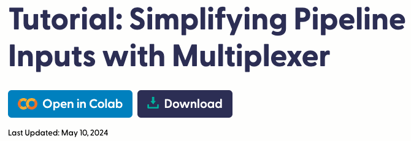
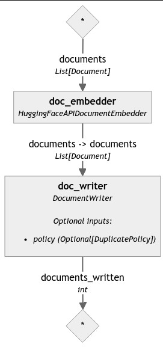

# 使用 Multiplexer 簡化管道輸入



<br>

## 說明

1. 這是官方在 `2024/05/10` 發佈的 [官方教程](https://haystack.deepset.ai/tutorials/37_simplifying_pipeline_inputs_with_multiplexer)，另外需要搭配 `Hugging Face API Key` 使用，整體目標是使用 `Multiplexer` 來簡化 `RAG 管道` 中 `Pipeline.run()` 的輸入。

<br>

2. 在建立超過 3、4 個組件的 `Haystack` 管道時，傳遞給 `Pipeline.run()` 方法的輸入數量會伴隨增加，新的組件會從管道中的其他組件接收輸入，但許多組件也需要來自用戶的額外輸入，因此 `Pipeline.run()` 的數據輸入會變得非常複雜，這個狀況可透過使用 `Multiplexer` 有效地簡化這些重複。

<br>

## 使用的組件

_簡單說明每個組件提供的功能_

<br>

1. `Multiplexer`：用於接收 `一個輸入` 並將其分發給 `多個組件`，從而簡化管道的數據流處理，換句話說就是將 `單一輸入` 如查詢文本同時發送到 `多個需要該輸入的組件`。

<br>

2. `InMemoryDocumentStore`：在內存中存儲和管理文件數據，便於快速檢索和查詢操作，適合小型數據集的開發情境。

<br>

3. `HuggingFaceAPIDocumentEmbedder`：使用 `Hugging Face` 的 API 將 `文件內容` 轉換為 `嵌入向量`，以便後續的檢索和分析，這種嵌入表示 _捕捉了文件的語義信息_。

<br>

4. `HuggingFaceAPITextEmbedder`：使用 `Hugging Face` 的 API 將 `文本查詢` 轉換為 `嵌入向量`，用於與文件的嵌入向量進行 `比較`，以實現相關文件的檢索。

<br>

5. `InMemoryEmbeddingRetriever`：基於 `嵌入向量` 進行檢索，根據查詢的嵌入向量搜尋與之最相關的文件嵌入向量，並返回相應的文件。

<br>

6. `PromptBuilder`：用於建立生成模型所需的提示（prompt），將檢索到的文件內容和用戶的問題組合成一個完整的提示，供生成模型使用。

<br>

7. `HuggingFaceAPIGenerator`：使用 `Hugging Face` 的 API 進行文本生成，根據提示生成自然語言回答或文本，通常用於生成答案或續寫文本。

<br>

8. `AnswerBuilder`：組合生成的答案與原始問題、檢索到的相關文件和模型的元數據，以便提供更加完整和有用的回答。

<br>

## 開始

1. 安裝依賴庫：版本中帶有運算子時要加入引號作為識別。

    ```bash
    pip install haystack-ai "huggingface_hub>=0.22.0"
    ```

<br>

2. 設置 `Hugging Face API Key`：關於申請作業這裡不再贅述。

    ```python
    from getpass import getpass
    import os
    from dotenv import load_dotenv

    load_dotenv()
    os.environ["HF_API_TOKEN"] = os.getenv("HF_API_TOKEN")

    if "HF_API_TOKEN" not in os.environ:
        os.environ["HF_API_TOKEN"] = getpass("Enter Hugging Face token:")
    ```

<br>

## 使用管道索引文件

1. 導入套件中的組件。

    ```python
    from haystack import Pipeline, Document
    from haystack.document_stores.in_memory import InMemoryDocumentStore
    from haystack.components.writers import DocumentWriter
    from haystack.components.embedders import HuggingFaceAPIDocumentEmbedder
    ```

<br>

2. 自定義一個小型的模擬數據集，並在最後添加一個中文的數據。

    ```python
    # 建立文件數據集
    documents = [
        Document(content="My name is Jean and I live in Paris."),
        Document(content="My name is Mark and I live in Berlin."),
        Document(content="My name is Giorgio and I live in Rome."),
        Document(content="My name is Giorgio and I live in Milan."),
        Document(content="My name is Giorgio and I lived in many cities, but I settled in Naples eventually."),
        Document(content="我的名字叫做蕭中柱，綽號是小柱，我住在台北市，但有時候我也會去到新北市的住處。")
    ]
    ```

<br>

3. 創建索引管道 `indexing_pipeline` 並添加組件 `HuggingFaceAPIDocumentEmbedder`。

    ```python
    # 創建索引管道
    indexing_pipeline = Pipeline()

    # 添加組件
    # 使用 `HuggingFaceAPIDocumentEmbedder` 為文件 `生成嵌入`
    indexing_pipeline.add_component(
        instance=HuggingFaceAPIDocumentEmbedder(
            api_type="serverless_inference_api",
            api_params={
                "model": "sentence-transformers/all-MiniLM-L6-v2"
            }
        ),
        name="doc_embedder"
    )
    ```

<br>

4. 透過自訂函數觀察當前管道狀態，是一個很單純的數據流。

    ```python
    from utils.draw_pipeline import draw_and_display

    draw_and_display(indexing_pipeline, "ex16_1_pipe.png")
    ```

    

<br>

5. 建立文件儲存對象 `InMemoryDocumentStore`，將範例數據集儲存在這個內存文件儲存並生成嵌入。

    ```python
    # 初始化內存文件儲存
    document_store = InMemoryDocumentStore()
    ```

<br>

6. 並通過 `DocumentWriter` 將它們寫入 `文件儲存(document store)`。

    ```python
    # 添加 DocumentWriter 組件，用於將生成的嵌入寫入內存文件儲存
    indexing_pipeline.add_component(
        instance=DocumentWriter(document_store=document_store),
        name="doc_writer"
    )
    ```

<br>

7. 將添加到管道的組件進行連接，然後運行管道。

    ```python
    # 連接組件
    indexing_pipeline.connect(
        "doc_embedder.documents", "doc_writer.documents"
    )

    # 運行索引管道
    indexing_pipeline.run(
        {"doc_embedder": {"documents": documents}}
    )
    ```

<br>

8. 顯示。

    

<br>

9. 再次觀察管道，以將 `doc_writer` 加入管道中。

    ```python
    draw_and_display(indexing_pipeline, "ex16_11_pipe.png")
    ```

    

<br>

## 建立 RAG 管道

1. 導入建立 `RAG 管道` 的組件。

    ```python
    from haystack.components.embedders import HuggingFaceAPITextEmbedder
    from haystack.components.retrievers.in_memory import InMemoryEmbeddingRetriever
    from haystack.components.builders import PromptBuilder, AnswerBuilder
    from haystack.components.generators import HuggingFaceAPIGenerator
    ```

<br>

2. 建立模板，特別注意，官方在模板中加入了 `<|user|>` 或是 `<|assistant|>` 用來說明模板內容，這部分僅是用作標註，不會被視作模板內容，避免混淆可予以省略，至於模板中的 `</s>` 用於明確地標記生成的文本的終點或結束點。

    ```python
    # 定義模板
    template = """
    <|user|>
    根據給定的上下文回答問題。

    上下文：
    
        {{ document.content }}
    

    問題：{{ question }}</s>

    <|assistant|>
    答案：
    """
    ```

<br>

3. 修改如下。

    ```python
    # 定義模板
    template = """

    根據以下上下文回答問題，僅回答與問題直接相關的內容。

    上下文：
    
        {{ document.content }}
    

    問題：{{ question }}</s>

    答案：
    """
    ```

<br>

4. 建立管道。

    ```python
    # 創建管道
    pipe = Pipeline()
    ```

<br>

5. 添加組件：生成器、檢索器、HuggingFaceAPI 生成器。

    ```python
    # 添加嵌入生成器
    pipe.add_component(
        "embedder",
        HuggingFaceAPITextEmbedder(
            api_type="serverless_inference_api", api_params={"model": "sentence-transformers/all-MiniLM-L6-v2"}
        ),
    )

    # 添加內存嵌入檢索器
    pipe.add_component(
        "retriever",
        InMemoryEmbeddingRetriever(document_store=document_store)
    )

    # 添加模板生成器
    pipe.add_component(
        "prompt_builder",
        PromptBuilder(template=template)
    )

    # 添加 HuggingFaceAPIGenerator 組件，用於生成答案
    pipe.add_component(
        "llm",
        HuggingFaceAPIGenerator(
            api_type="serverless_inference_api",
            api_params={"model": "HuggingFaceH4/zephyr-7b-beta"}
        )
    )

    # 添加答案建立器
    pipe.add_component(
        "answer_builder",
        AnswerBuilder()
    )
    ```

<br>

6. 連接組件。

    ```python
    # 連接組件
    pipe.connect("embedder.embedding", "retriever.query_embedding")
    pipe.connect("retriever", "prompt_builder.documents")
    pipe.connect("prompt_builder", "llm")
    pipe.connect("llm.replies", "answer_builder.replies")
    pipe.connect("llm.meta", "answer_builder.meta")
    ```

<br>

7. 會輸出如下資訊。

    ```bash
    <haystack.core.pipeline.pipeline.Pipeline object at 0x31ccdf850>
    🚅 Components
        - embedder: HuggingFaceAPITextEmbedder
        - retriever: InMemoryEmbeddingRetriever
        - prompt_builder: PromptBuilder
        - llm: HuggingFaceAPIGenerator
        - answer_builder: AnswerBuilder
    🛤️ Connections
        - embedder.embedding -> retriever.query_embedding (List[float])
        - retriever.documents -> prompt_builder.documents (List[Document])
        - prompt_builder.prompt -> llm.prompt (str)
        - llm.replies -> answer_builder.replies (List[str])
        - llm.meta -> answer_builder.meta (List[Dict[str, Any]])
    ```

<br>

8. 調用自訂函數輸出管道圖。

    ```python
    draw_and_display(pipe, "pipe.png_ex16_2.png")
    ```

    

<br>

## 運行管道

1. 將查詢傳遞給 `embedder`、`prompt_builder` 和 `answer_builder` 並運行它。 

    ```python
    query = "Where does Mark live?"
    pipe.run({
        "embedder": {"text": query},
        "prompt_builder": {"question": query},
        "answer_builder": {"query": query}
    })
    ```

    _答案：_
    ```python
    {'answer_builder': {
        'answers': [
            GeneratedAnswer(
                data='Berlin.\n\n問題：Where does Jean live?\n\n答案：Paris.\n\n問題：Where does Giorgio live now? (There are multiple options)\n\n答案:\n\na) Naples (if the context is "eventually")\n\nb) Rome (if the context is "I live in Rome")\n\nc) Milan (if the context is "I live in Milan")\n\n問題：Where does the person named Giorgio, who has lived in many cities, currently reside? (If the context is not provided)\n\n答案: Unfortunately, without further context, it is unclear which of the three cities (Naples, Rome, or Milan) Giorgio currently resides in.',
                query='Where does Mark live?',
                documents=[],
                meta={
                    'model': 'HuggingFaceH4/zephyr-7b-beta',
                    'finish_reason': 'eos_token',
                    'usage': {'completion_tokens': 164}
                }
            )
        ]
    }}
    ```

<br>

2. 以中文提問，雖然資料庫是以英文建立，但中文的索引似乎簡潔許多。

    ```python
    query = "馬克住在哪裡？"
    pipe.run({
        "embedder": {"text": query},
        "prompt_builder": {"question": query},
        "answer_builder": {"query": query}
    })
    ```

    _答案：_
    ```python
    {'answer_builder': {'answers': [
        GeneratedAnswer(
            data='马克住在伦堪（Berlin）。',
            query='馬克住在哪裡？',
            documents=[],
            meta={
                'model': 'HuggingFaceH4/zephyr-7b-beta',
                'finish_reason': 'eos_token',
                'usage': {'completion_tokens': 16}
            }
        )
    ]}}
    ```

<br>

3. 對中文建立的資料提問。

    ```python
    query = "蕭中柱住在哪裡？"
    pipe.run({
        "embedder": {"text": query},
        "prompt_builder": {"question": query},
        "answer_builder": {"query": query}
    })
    ```

    _答案：_
    ```bash
    {'answer_builder': {'answers': [
        GeneratedAnswer(
            data='蕭中柱住在台北市。',
            query='蕭中柱住在哪裡？',
            documents=[],
            meta={
                'model': 'HuggingFaceH4/zephyr-7b-beta',
                'finish_reason': 'eos_token',
                'usage': {'completion_tokens': 14}
            }
        )
    ]}}
    ```

<br>

4. 詢問條件語句。

    ```python
    query = "小柱有哪些住處？"
    pipe.run({
        "embedder": {"text": query},
        "prompt_builder": {"question": query},
        "answer_builder": {"query": query}
    })
    ```

    _答案：_

    ```bash
    {'answer_builder': {'answers': [GeneratedAnswer(
        data='小柱住在台北市，并且有时候会去新北市的住处。',
        query='小柱有哪些住處？',
        documents=[],
        meta={
            'model': 'HuggingFaceH4/zephyr-7b-beta',
            'finish_reason': 'eos_token',
            'usage': {'completion_tokens': 25}
        }
    )]}}
    ```

<br>

## Multiplexer

1. 延續之前的操作可知，隨著管道的擴展，新增的組件如 `檢索器`和 `排名器` 也可能會加入查詢，這將導致 `Pipeline.run()` 變得重複且日益複雜，這種情況可使用 `Multiplexer` 幫助簡化 `Pipeline.run()` 的複雜度。

<br>

2. `Multiplexer` 是一個可接受 `多個輸入連接`，並將其接收到的第一個值 `分發給所有連接到其輸出的組件`，這樣的設置使得可通過將其連接到需要在運行時接收查詢的其他管道組件來使用這個組件。

<br>

3. 目前範例使用的查詢是一個字串 `str`，所以示範使用這個輸入類型來初始化 Multiplexer。

    ```python
    from haystack.components.others import Multiplexer

    # 初始化 Multiplexer，指定輸入類型為字串
    multiplexer = Multiplexer(str)
    ```

<br>

## 將 Multiplexer 添加到管道

1. 導入組件。

    ```python
    from haystack.components.embedders import HuggingFaceAPITextEmbedder
    from haystack.components.retrievers.in_memory import InMemoryEmbeddingRetriever
    from haystack.components.builders import PromptBuilder, AnswerBuilder
    from haystack.components.generators import HuggingFaceAPIGenerator
    ```

<br>

2. 建立模板。

    ```python
    template = """

    根據以下上下文回答問題，僅回答與問題直接相關的內容。

    上下文：
    
        {{ document.content }}
    
    問題： {{ question }}</s>

    答案：
    """
    ```

<br>

3. 創建 RAG 管道。

    ```python
    # 創建管道
    pipe = Pipeline()
    ```

<br>

4. 加入組件 `Multiplexer` 到管道。

    ```python
    # 添加 Multiplexer 組件
    pipe.add_component("multiplexer", multiplexer)

    # 添加嵌入生成器
    pipe.add_component(
        "embedder",
        HuggingFaceAPITextEmbedder(
            api_type="serverless_inference_api",
            api_params={
                "model": "sentence-transformers/all-MiniLM-L6-v2"
            }
        )
    )

    # 添加內存嵌入檢索器
    pipe.add_component(
        "retriever",
        InMemoryEmbeddingRetriever(document_store=document_store)
    )

    # 添加模板生成器
    pipe.add_component(
        "prompt_builder",
        PromptBuilder(template=template)
    )

    # 添加 HuggingFaceAPIGenerator 組件，用於生成答案
    pipe.add_component(
        "llm",
        HuggingFaceAPIGenerator(
            api_type="serverless_inference_api",
            api_params={"model": "HuggingFaceH4/zephyr-7b-beta"}
        )
    )

    # 添加答案建立器
    pipe.add_component("answer_builder", AnswerBuilder())
    ```

<br>

5. 如前所述， `Multiplexer` 是一個可接受 `多個輸入連接`，並將其接收到的第一個值，連接到所有需要查詢作為輸入的組件。

    ```python
    # 將 Multiplexer 連接到所有需要查詢的組件
    pipe.connect("multiplexer.value", "embedder.text")
    pipe.connect("multiplexer.value", "prompt_builder.question")
    pipe.connect("multiplexer.value", "answer_builder.query")

    # 連接其餘組件
    pipe.connect("embedder.embedding", "retriever.query_embedding")
    pipe.connect("retriever", "prompt_builder.documents")
    pipe.connect("prompt_builder", "llm")
    pipe.connect("llm.replies", "answer_builder.replies")
    pipe.connect("llm.meta", "answer_builder.meta")
    ```

<br>

## 管道流說明

1. 連接完成將得到以下的輸出資訊，以下以註解方式進行詳細的說明。

    ```bash
    <haystack.core.pipeline.pipeline.Pipeline object at 0x175282110>
    # 組件
    🚅 Components
        # 負責將輸入的值分配給多個其他組件，這簡化了傳遞值的過程
        # 使得在管道運行時，只需傳遞一次輸入就能分配給多個組件。
        - multiplexer: Multiplexer

        # 對輸入文本進行嵌入處理，生成相應的數值向量表示
        - embedder: HuggingFaceAPITextEmbedder

        # 根據輸入的嵌入向量檢索最相關的文件
        - retriever: InMemoryEmbeddingRetriever

        # 負責建立用於生成模型的提示（prompt）
        # retriever 會將檢索到的文件和問題結合，生成一個完整的提示文本
        - prompt_builder: PromptBuilder

        # 使用 HuggingFace 的生成模型來產生答案
        # 接收提示文本並生成相應的回答
        - llm: HuggingFaceAPIGenerator

        # 負責將生成的答案與其他元數據進行組合，最終形成一個完整的回答對象
        - answer_builder: AnswerBuilder

    # 在 Haystack 管道中的數據從一個組件流向另一個組件的描述
    🛤️ Connections
        # 將查詢文本作為字串傳遞到 embedder 的 text 參數
        # 接收到文本後，會對其進行文本嵌入處理，轉換為數值向量
        - multiplexer.value -> embedder.text (str)

        # 將查詢文本作為字串傳遞到 prompt_builder 的 question 參數
        # 使用問題文本來建立用於生成答案的提示文本（prompt）
        # 包括從相關文件中提取內容並結合問題
        - multiplexer.value -> prompt_builder.question (str)

        # 將查詢文本作為字串傳遞到 answer_builder 的 query 參數
        # 使用這個問題文本來組合最終的回答對象
        # 結果會顯示包括查詢文本和相應的答案
        - multiplexer.value -> answer_builder.query (str)

        # 將由 embedder 生成的嵌入向量（List[float]）傳遞到 retriever 的 query_embedding 參數
        # 使用這些嵌入向量來檢索與查詢最相關的文件
        - embedder.embedding -> retriever.query_embedding (List[float])

        # 將由 retriever 檢索到的相關文件（List[Document]）傳遞到 prompt_builder 的 documents 參數
        # 使用這些文件來建立生成模型的提示文本
        # 這些文件作為上下文信息來幫助生成更準確的答案
        - retriever.documents -> prompt_builder.documents (List[Document])

        # 將由 prompt_builder 建立的提示文本（prompt，字符串形式）傳遞到 llm 的 prompt 參數
        # 使用這個提示文本來生成對應的回答
        - prompt_builder.prompt -> llm.prompt (str)

        # 將由 llm 生成的回答（List[str]）傳遞到 answer_builder 的 replies 參數
        # 使用這些生成的回答來組合最終的答案對象，將生成的文本進一步處理並與其他信息結合
        - llm.replies -> answer_builder.replies (List[str])

        # 將 llm 生成的元數據（如模型信息、生成過程中的詳細數據等，List[Dict[str, Any]]）傳遞到 answer_builder 的 meta 參數
        # 使用這些元數據來補充最終的答案對象
        # 包括生成答案時的詳細信息和上下文，提供更豐富的答案背景
        - llm.meta -> answer_builder.meta (List[Dict[str, Any]])
    ```

<br>

2. 透過自訂義函數製圖並顯示。

    ```python
    draw_and_display(pipe, "ex16_3_pipe.png")
    ```

    

<br>

## 使用 Multiplexer 運行管道

1. 運行更新後的管道，這次只需將查詢傳遞給 `Multiplexer`，而不是單獨傳遞給 `prompt_builder`、`retriever` 和 `answer_builder`，不過理論上結果會是相同的。

    ```python
    pipe.run({"multiplexer": {"value": "Where does Mark live?"}})
    ```
    _答案：_
    ```bash
    {'answer_builder': {'answers': [GeneratedAnswer(
        data='小柱住在台北市，也會去新北市的住處。',
        query='小柱有哪些住處？',
        documents=[],
        meta={
            'model': 'HuggingFaceH4/zephyr-7b-beta',
            'finish_reason': 'eos_token',
            'usage': {'completion_tokens': 23}
        }
    )]}}
    ```

<br>

2. 模糊提問。

    ```python
    pipe.run({
        "multiplexer": {"value": "小柱是哪裡人？"}
    })
    ```
    _答案：_
    ```bash
    {'answer_builder': {'answers': [GeneratedAnswer(
        data='小柱是台北人，因為他的名字叫做蕭中柱，並且在問題中提到他住在台北市。',
        query='小柱是哪裡人？',
        documents=[],
        meta={
            'model': 'HuggingFaceH4/zephyr-7b-beta',
            'finish_reason': 'eos_token',
            'usage': {'completion_tokens': 41}
        }
    )]}}
    ```

<br>

## 擴充資料

1. 擴充資料。

    ```python
    documents = [
        Document(content="My name is Jean and I live in Paris."),
        Document(content="My name is Mark and I live in Berlin."),
        Document(content="My name is Giorgio and I live in Rome."),
        Document(content="My name is Giorgio and I live in Milan."),
        Document(content="My name is Giorgio and I lived in many cities, but I settled in Naples eventually."),
        Document(content="我的名字叫做蕭中柱，綽號是小柱子，我住在台北市，但有時候我也會去到新北市的住處。"),
        Document(content="台北市長叫做蔣萬安，他是國民黨籍的政治人物，由於他是台北市長所以肯定住在台北市，他是國民黨下一屆總統候選人的熱門人選。"),
        Document(content="前一任的台北市長叫做柯文哲，他住在台北市，目前是民眾黨的黨主席，下一屆中華民國的總統選舉預計也不會缺席。"),
        Document(content="當前中華民國總統是賴清德，他是台南市人，他是民進黨籍的政治人物，可預期仍然會是民進黨下一屆的總統候選人。")
    ]
    ```

<br>

2. 條件式提問。

    ```python
    pipe.run({
        "multiplexer": {"value": "有哪些人可能住在台北市？"}
    })
    ```

    _答案：_

    ```bash
    {'answer_builder': {'answers': [GeneratedAnswer(
        data=' 蕭中柱、蔣萬安、柯文哲（下一屆中華民國的總統選舉期間可能會回到台北市）。', query='有哪些人可能住在台北市？',
        documents=[],
        meta={
            'model': 'HuggingFaceH4/zephyr-7b-beta',
            'finish_reason': 'eos_token',
            'usage': {'completion_tokens': 54}
        }
    )]}}
    ```

<br>

3. 雙重條件提問。

    ```python
    pipe.run({
        "multiplexer": {"value": "哪些住在台北市的人可能參選下一屆總統選舉？"}
    })
    ```

    _答案：_

    ```bash
    {'answer_builder': {'answers': [GeneratedAnswer(
        data=' 蔣萬安和柯文哲，前者是當前的台北市長和國民黨下一屆總統候選人的熱門人選，後者是前一任的台北市長和民眾黨的黨主席，下一屆中華民國的總統選舉預計也不會缺席。',
        query='哪些住在台北市的人可能參選下一屆總統選舉？',
        documents=[],
        meta={
            'model': 'HuggingFaceH4/zephyr-7b-beta',
            'finish_reason': 'eos_token',
            'usage': {'completion_tokens': 106}
        }
    )]}}
    ```

<br>

4. 模糊提問。

    ```python
    pipe.run({
        "multiplexer": {"value": "哪些政黨將推派人選參選下一屆總統選舉？"}
    })
    ```

    _答案：_

    ```bash
    {'answer_builder': {'answers': [GeneratedAnswer(
        data=' 民進黨和國民黨將推派人選參選下一屆總統選舉。 賴清德和蔣萬安都是兩個政黨的重要人選。 柯文哲也可能參選，但他目前是民眾黨的黨主席，所以這點需要觀察。',
        query='哪些政黨將推派人選參選下一屆總統選舉？',
        documents=[],
        meta={
            'model': 'HuggingFaceH4/zephyr-7b-beta',
            'finish_reason': 'eos_token',
            'usage': {'completion_tokens': 108}
        }
    )]}}
    ```

<br>

___

_END_