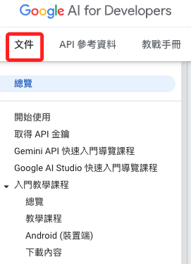
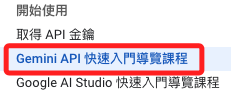

# Gemini API

_文件總覽_



<br>

## 說明

1. 以下彙整官方文件總覽，從最初的 `開始使用` 開始，萃取有用的部分作為筆記。

<br>

## 快速入門導覽

    

<br>

1. 取得 API Key：可將其寫入 `環境變數`，當函數參數未指定 `google_api_key` 時，將自動從環境參數中讀取。

    ```bash
    export API_KEY=<YOUR_API_KEY>
    ```

<br>

2. 安裝套件。

    ```bash
    pip install -q -U google-generativeai
    ```

<br>

3. 初始化模型。

    ```python
    import google.generativeai as genai
    import os

    genai.configure(api_key=os.environ["API_KEY"])

    model = genai.GenerativeModel('gemini-1.5-flash')
    ```

<br>

4. 生成文字。

    ```python
    response = model.generate_content(
        "Write a story about a AI and magic"
    )
    print(response.text)
    ```

<br>

___

_END_