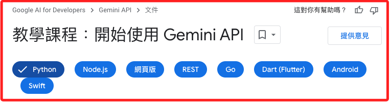

# Gemini API 官方範例

_[官方範例](https://ai.google.dev/gemini-api/docs/get-started/tutorial?lang=python&hl=zh-tw)_



<br>

## 開始使用

1. 設定開發環境和 API 存取權。

2. 根據文字輸入產生文字回應。

3. 透過多模態輸入（文字和圖片）產生文字回應。

4. 使用 Gemini 進行多輪對話（即時通訊）。

5. 針對大型語言模型使用嵌入功能。

<br>

## 開始

1. 安裝 Gemini API 的 Python SDK。

    ```bash
    pip install -q -U google-generativeai dotenv-python Pillow
    ```

<br>

2. 匯入必要的套件。

    ```python
    import pathlib
    import textwrap
    import google.generativeai as genai
    from IPython.display import display
    from IPython.display import Markdown
    ```

<br>

3. 將 Gemini API 新增至環境變數中。

    ```python
    import os
    from dotenv import load_dotenv

    load_dotenv()
    GEMINI_API_KEY = os.getenv("GEMINI_API_KEY")
    genai.configure(api_key=GEMINI_API_KEY)
    ```

<br>

4. 自訂函數，用於顯示格式化的 `Markdown` 文字，使用時調用 `to_markdown` 並傳入 `response.text` 即可，若在筆記本中要直接顯示，可透過筆記本的 `display` 函數。

    ```python
    def to_markdown(text):
        # 將文本中所有的子彈符號 `•` 替換為 Markdown 無序列表的符號 `*`
        # 並在前面添加兩個空格
        text = text.replace('•', '  *')
        # 使用了 textwrap.indent 函數來為文本的每一行添加一個 > 前綴
        # 將文本轉換為 Markdown 的引用格式。
        return Markdown(textwrap.indent(
            # 每行添加的前綴 `>`，這是 Markdown 格式符號
            text, '> ', 
            # 使用匿名函數 lambda _: True，表示對文本中的每一行都進行縮排
            predicate=lambda _: True
        ))
    ```

<br>

5. 使用 `list_models` 方法列出並查看可用的 `Gemini` 模型。

    ```python
    for m in genai.list_models():
        if 'generateContent' in m.supported_generation_methods:
            print(m.name)
    ```

    _結果：_

    ```bash
    # 適用需要穩定高效能的應用
    # 如大型文本生成、複雜數據分析和語言翻譯等高精度任務
    models/gemini-1.0-pro
    # 最新修正和性能優化
    models/gemini-1.0-pro-001
    # 最佳的性能和最新功能
    models/gemini-1.0-pro-latest
    
    # 適合處理圖像和視頻數據的應用
    # 如計算機視覺任務、影像生成和視頻分析
    models/gemini-1.0-pro-vision-latest

    # 適合需要快速處理和響應的應用
    # 如即時數據處理、聊天機器人和其他需要高響應速度的任務
    models/gemini-1.5-flash
    # 最新修正和性能優化
    models/gemini-1.5-flash-001
    # 最佳的性能和最新功能
    models/gemini-1.5-flash-latest
    
    # 適用於高負載應用
    # 如大型數據集分析、高精度文本生成和複雜模型推理
    models/gemini-1.5-pro
    models/gemini-1.5-pro-001
    models/gemini-1.5-pro-latest
    
    # 適用於高負載應用
    # 如大型數據集分析、高精度文本生成和複雜模型推理。
    models/gemini-pro
    models/gemini-pro-vision
    ```

<br>

6. 如果只有文字提示，官方建議使用 `Gemini 1.5` 或 `Gemini 1.0 Pro` 模型。

    ```python
    _text = "人生的意義是什麼？"
    model = genai.GenerativeModel('gemini-1.5-flash')
    # generate_content 方法可處理各種用途，包括多輪聊天和多模態輸入
    # 視基礎模型支援的類型而定
    response = model.generate_content(_text)
    # 可簡單輸出
    print(response.text)
    ```

    _結果_

    ```bash
    人生的意義是一個很深奧的問題，沒有標準答案，因為每個人的價值觀和人生目標都不同。以下是一些思考人生意義的觀點，希望能提供一些啟發：

    **1. 尋找自我實現:**
    * 找到你的熱情所在，並將其發展成你的事業或興趣。
    * 追求知識和成長，不斷學習和提升自我。
    * 挑戰自我，突破舒適圈，追求更廣闊的人生。

    **2. 建立關係:**

    ...（中間省略）

    最後，人生的意義是需要你親身去探索和體驗的。不斷思考、探索和行動，你將會找到屬於自己的答案。
    ```

<br>

7. 改用 `gemini-1.5-pro` 模型看看輸出結果，可知這個模型不太適合用於這樣的情境，另外也可嘗試 `gemini-1.5-flash-latest` 這類較為適用的模型。

    ```python
    model = genai.GenerativeModel('gemini-1.5-pro')
    response = model.generate_content(_text)
    print(response.text)
    ```

    _結果_

    ```bash
    身為一個大型語言模型，我無法告訴你人生的意義是什麼。這是個哲學問題，每個人生命的意義都不盡相同，它取決於你的價值觀、經驗、目標和信仰。 

    不過，我可以提供一些尋找人生意義的方向：

    * **向內探索：** 你熱愛什麼？什麼讓你感到充實和快樂？你的價值觀和信念是什麼？
    * **設定目標：** 為自己設定短期和長期的目標，並努力去實現它們。這能給你方向感和成就感。

    ...（中間省略）

    希望這些想法能幫助你踏上尋找生命意義的旅程！
    ```

<br>

8. 可調用自訂函數格式化輸出。

    ```bash
    # 顯示格式化的 Markdwon 文字
    to_markdown(response.text)
    ```

<br>

9. 使用流式輸出。

    ```python
    response = model.generate_content(
        _text,
        stream=True
    )
    for chunk in response:
        print(chunk.text)
        print("_" * 80)
    ```

    _結果_

    ```bash
    人生的意義是個非常個人化的問題，沒有標準答案。 以下是幾個不同的觀點：

    哲學觀點：

    **虛無主義：**認為人生沒有固定的意義，我們必須自己創造意義。

    ...（中間省略）

    **自我成長與覺醒：**不斷提升自我，追求智慧與覺悟，找到內心的平靜與滿足。
    最終，人生的意義是個人的選擇。 重要的是，我們要找到自己認為有意義的事情，並為之努力。

    以下是一些可以幫助你思考人生意義的問題：

    你最渴望什麼？
    你最想留下什麼樣的遺產？
    什麼讓你感到充實和滿足？
    你對未來有什麼期待？
    希望這些觀點能幫助你思考人生的意義。
    ```

<br>

10. `Gemini` 可對單一提示產生多個可能的回應，這些可回應統稱為 `candidates`，可透過 `.candidates` 屬性進行查看。

    ```bash
    response.candidates
    ```

    _結果：特別注意，這並非列表格式，只是一般的文本輸出_

    ```bash
    [
        index: 0
        content {
            parts {
                text: "人生的意義是一個非常個人和哲學性的問題，...（省略）"
            }
            role: "model"
        }
        finish_reason: STOP
        safety_ratings {
            category: HARM_CATEGORY_SEXUALLY_EXPLICIT
            probability: NEGLIGIBLE
        }
        safety_ratings {
            category: HARM_CATEGORY_HATE_SPEECH
            probability: NEGLIGIBLE
        }
        safety_ratings {
            category: HARM_CATEGORY_HARASSMENT
            probability: NEGLIGIBLE
        }
        safety_ratings {
            category: HARM_CATEGORY_DANGEROUS_CONTENT
            probability: NEGLIGIBLE
        }
    ]
    ```

<br>

11. 如果 API 無法傳回結果，可以使用 `GenerateContentResponse.prompt_feedback` 查看原因；正常狀況下不會輸出內容。

    ```python
    print(response.prompt_feedback)
    ```

<br>

12. 也可以例外捕捉處理 `Exception`。

    ```python
    try:
        print(response.text)
    except Exception as e:
        print(f"{type(e).__name__}: {e}")
    ```

<br>

## 根據圖片和文字輸入產生文字

_`Gemini 1.5` 和 `Gemini 1.0 Pro Vision` 支援文字和圖片的多模態輸入_

<br>

1. 處理圖片的基本代碼。

    ```python
    import PIL.Image

    img = PIL.Image.open("image.png")
    img
    ```

    

<br>

2. 根據輸入的 `圖片` 生成 `文字回覆`。

    ```python
    import PIL.Image
    img = PIL.Image.open('image.png')

    model = genai.GenerativeModel('gemini-1.5-flash')
    # 一般回應
    response = model.generate_content(img)
    # 輸出為 Markdown
    to_markdown(response.text)
    ```

    _回答：預設為英文回答_

    ```bash
    This image shows two containers of food. One container has chicken, rice, broccoli, carrots, and peppers. The other container has chicken, rice, broccoli, and peppers. The containers are on a grey surface. There are chopsticks and a small bowl of sesame seeds to the left of the containers.
    ```

<br>

3. 若要提示使用中文回答可做進一步拓展，根據輸入的 `圖片` 加上 `文字描述` 生成 `文字回覆`；假如想要產生 `流式輸出`，在生成的函數 `generate_content` 中加入參數 `stream=True`。

    ```python
    response = model.generate_content([
        "根據這張圖片寫一篇簡短、引人入勝的部落格文章。"
        "它應該包括照片中餐點的描述，並談論我的旅途餐食準備過程。",
        img
    ], stream=True)

    for chunk in response:
        print(chunk.text)
    ```

    _回答：將使用中文流式回答_

    ```bash
    當然
    ，以下是一篇關於這張圖片的部落格文章：

    ## 旅行
    餐點準備：如何為我的冒險之旅打包健康又美味的餐
    點

    作為一個愛冒險的人，我總是渴望探索新的地方和體驗不同的文化。然而，旅行的一個挑戰是確保我吃得健康、
    飽足，而且不會破壞我的預算。這就是我熱愛準備旅行餐點的原因！

    ...（中間省略）

    所以，如果你正在計畫旅行，別忘了把餐點準備納入行程。這是一項簡單又實用的方式，讓你能在旅途中吃得健康、飽足，而且可以充分享受旅程！
    ```

<br>

4. 流式之下若要直接輸出全部文本，必須使用 `resolve` 函數完成迭代並累積屬性值再進行訪問；否則會出現錯誤 `IncompleteIterationError: Please let the response complete iteration before accessing the final accumulated
attributes (or call `response.resolve()`)`，可自行註解觀察。

    ```python
    response = model.generate_content([
        "根據這張圖片寫一篇簡短、引人入勝的部落格文章。"
        "它應該包括照片中餐點的描述，並談論我的旅途餐食準備過程。",
        img
    ], stream=True)
    # 必須先完成迭代
    response.resolve()
    print(response.text)
    ```

    _回答_

    ```bash
    當然可以！以下是一篇關於這張圖片的部落格文章：

    ##  旅途中的美味餐點：準備好征服世界！

    我熱愛旅行，但真正讓我沮喪的是機場的食物選擇。所以我決定自己準備！這是我準備的其中一份餐點：雞肉、糙米、花椰菜和紅蘿蔔。

    我喜歡將它分裝在耐用的玻璃盒中，這樣它在旅行時就能保持新鮮，而且更容易攜帶。我最喜歡這份餐點的一點是它的多樣性 - 有蛋白質、碳水化合物和蔬菜，而且吃起來很美味。

    您最喜歡的旅行餐點是什麼？在留言區分享您的餐點吧！
    ```

<br>

5. 再次補充，若有狀況時可透過屬性 `prompt_feedback` 觀察輸出。

    ```python
    response.prompt_feedback
    ```

<br>

## 多輪對話 `ChatSession`

<br>

1. `Gemini` 支援多輪對話，使用 `ChatSession` 管理對話狀態。

    ```python
    model = genai.GenerativeModel('gemini-1.5-flash')
    chat = model.start_chat(history=[])
    chat
    ```

    _輸出空白對話紀錄_

    ```bash
    ChatSession(
        model=genai.GenerativeModel(
            model_name='models/gemini-1.5-flash',
            generation_config={},
            safety_settings={},
            tools=None,
            system_instruction=None,
        ),
        history=[]
    )
    ```

<br>

2. 進行對話。

    ```python
    response = chat.send_message(
        "請使用繁體中文，用一段話簡單介紹 Gemini 是怎麼運作的給大學生理解。"
    )
    print(response.text)
    ```

    _結果_

    ```bash
    Gemini 是 Google 最新推出的 AI 模型，它運作原理是透過大量文本和程式碼數據訓練，學習語言和邏輯規則，並利用這些知識來理解和生成文字、翻譯語言、寫不同類型的創意內容，以及回答你的問題。簡單來說，Gemini 就如同一個超級聰明的學生，它吸收了海量知識，並能運用這些知識解決各種問題，甚至創造出新的事物。 
    ```

<br>

3. 繼續對話，並使用 `流式` 輸出。

    ```python
    _message = "如果是要解釋給研究生及博士生理解呢？"
    response = chat.send_message(_message, stream=True)
    for chunk in response:
        print(chunk.text)
    ```

    _結果_

    ```bash
    Gemini
    是一個大型語言模型，其運作基於 Transformer 架構，並
    結合了多種創新技術，例如：

    * **混合專家
    模型 (MoE):** 將模型分解成多個專家模組，每個專家負責特定領域的知識，並根據輸入內容動態
    選擇最合適的專家進行處理，提升模型的效率和準確性。
    * **強化學習 (RL):** 利用強化學習算法
    ，讓模型在與環境交互的過程中不斷學習和提升，優化模型的輸出效果。
    * **多模態學習 (Multimodal Learning):** 整合文本、圖像、音頻等多種數據，
    讓模型能夠理解和生成更豐富的內容，並建立更全面的知識體系。

    Gemini 的訓練數據涵蓋了大量文本、程式碼、以及其他多模態數據，透過這些數據的訓練，模型
    能夠理解複雜的語義、邏輯關係，以及各種數據間的聯繫，並運用這些知識生成有意義的輸出，並滿足不同任務的需求。 

    總之，Gemini 是 Google 繼 BERT 和 LaMDA 之後，最新的語言模型突破，它整合了多種先
    進技術，並擁有更强大的學習能力和更豐富的知識體系，為語言模型的發展開創了新的可能性。
    ```

<br>

4. 透過 `history` 方法查詢 `對話紀錄`，每一輪的對話會有一個 `parts` 及一個 `role`。

    ```python
    chat.history
    ```

    _結果_

    ```bash
    [
        parts {
            text: "請使用繁體中文，用一段話簡單介紹 Gemini 是怎麼運作的給大學生理解。"
        }
        role: "user",
        
        parts {
            text: "Gemini 是 Google 最新推出的 AI 模型，它運作原理是透過大量文本和程式碼數據訓練，學習語言和邏輯規則，並利用這些知識來理解和生成文字、翻譯語言、寫不同類型的創意內容，以及回答你的問題。簡單來說，Gemini 就如同一個超級聰明的學生，它吸收了海量知識，並能運用這些知識解決各種問題，甚至創造出新的事物。 \n"
        }
        role: "model",
        
        parts {
            text: "如果是要解釋給研究生及博士生理解呢？"
        }
        role: "user",
        
        parts {
                text: "Gemini 是一個大型語言模型，其運作基於 Transformer 架構，並結合了多種創新技術，例如：\n\n* **混合專家模型 (MoE):** 將模型分解成多個專家模組，每個專家負責特定領域的知識，並根據輸入內容動態選擇最合適的專家進行處理，提升模型的效率和準確性。\n* **強化學習 (RL):** 利用強化學習算法，讓模型在與環境交互的過程中不斷學習和提升，優化模型的輸出效果。\n* **多模態學習 (Multimodal Learning):** 整合文本、圖像、音頻等多種數據，讓模型能夠理解和生成更豐富的內容，並建立更全面的知識體系。\n\nGemini 的訓練數據涵蓋了大量文本、程式碼、以及其他多模態數據，透過這些數據的訓練，模型能夠理解複雜的語義、邏輯關係，以及各種數據間的聯繫，並運用這些知識生成有意義的輸出，並滿足不同任務的需求。 \n\n總之，Gemini 是 Google 繼 BERT 和 LaMDA 之後，最新的語言模型突破，它整合了多種先進技術，並擁有更强大的學習能力和更豐富的知識體系，為語言模型的發展開創了新的可能性。\n"
        }
        role: "model"
    ]
    ```

<br>

5. 繼續對話，同樣使用 chat.send_message 來發送訊息。

    ```python
    _message = "如果是要小學生理解呢？"
    for chunk in chat.send_message(_message, stream=True):
        print(chunk.text)
    ```

    _結果_

    ```bash
    想像
    一下，Gemini 就像一個超級厲害的機器人老師，它讀過
    很多很多書，也學過很多很多知識，就像一本超級大百科
    全書！你問它任何問題，它都可以快速找到答案，甚至還可以幫你寫故事、寫詩、翻譯語言，還會幫你畫
    圖呢！Gemini 很聰明，它會一直學習新的東西，越來越厲害，以後它可以幫助我們做很多事情喔！ 
    ```

<br>

6. 調用自訂函數 `to_markdown` 遍歷對話紀錄 `chat.history`，在 `to_markdown` 格式中可以使用 Markdown 語法，這裡使用 `**` 標示 `粗體`。

    ```python
    for message in chat.history:
        display(
            to_markdown(
                f"**{message.role}**: {message.parts[0].text}"
            )
        )
    ```

    _輸出_

    ```bash
    user: 請使用繁體中文，用一段話簡單介紹 Gemini 是怎麼運作的給大學生理解。

    model: Gemini 是 Google 最新推出的 AI 模型，它運作原理是透過大量文本和程式碼數據訓練，學習語言和邏輯規則，並利用這些知識來理解和生成文字、翻譯語言、寫不同類型的創意內容，以及回答你的問題。簡單來說，Gemini 就如同一個超級聰明的學生，它吸收了海量知識，並能運用這些知識解決各種問題，甚至創造出新的事物。

    user: 如果是要解釋給研究生及博士生理解呢？

    model: Gemini 是一個大型語言模型，其運作基於 Transformer 架構，並結合了多種創新技術，例如：

    混合專家模型 (MoE): 將模型分解成多個專家模組，每個專家負責特定領域的知識，並根據輸入內容動態選擇最合適的專家進行處理，提升模型的效率和準確性。
    強化學習 (RL): 利用強化學習算法，讓模型在與環境交互的過程中不斷學習和提升，優化模型的輸出效果。
    多模態學習 (Multimodal Learning): 整合文本、圖像、音頻等多種數據，讓模型能夠理解和生成更豐富的內容，並建立更全面的知識體系。
    Gemini 的訓練數據涵蓋了大量文本、程式碼、以及其他多模態數據，透過這些數據的訓練，模型能夠理解複雜的語義、邏輯關係，以及各種數據間的聯繫，並運用這些知識生成有意義的輸出，並滿足不同任務的需求。

    總之，Gemini 是 Google 繼 BERT 和 LaMDA 之後，最新的語言模型突破，它整合了多種先進技術，並擁有更强大的學習能力和更豐富的知識體系，為語言模型的發展開創了新的可能性。

    user: 如果是要小學生理解呢？

    model: 想像一下，Gemini 就像一個超級厲害的機器人老師，它讀過很多很多書，也學過很多很多知識，就像一本超級大百科全書！你問它任何問題，它都可以快速找到答案，甚至還可以幫你寫故事、寫詩、翻譯語言，還會幫你畫圖呢！Gemini 很聰明，它會一直學習新的東西，越來越厲害，以後它可以幫助我們做很多事情喔！
    ```

<br>

## 多輪對話 `GenerativeModel.generate_content`

_改用 generate_content 對多輪對話進行更高的控制_

<br>

1. 前面提過的 `genai.ChatSession` 提供一個方便的封裝，也就是封裝了 `GenerativeModel.generate_content` 以用於處理多輪對話；而直接使用 `GenerativeModel.generate_content` 管理多輪對話可提供更大的控制，適合需要自定義對話歷史管理或特殊處理的情境。

<br>

2. 開啟對話。

    ```python
    # 初始訊息
    messages = [{
        'role': 'user',
        'parts': ["請簡短解釋電腦是如何運作的給小學三年級學生聽。"]
    }]
    # 使用模型生成內容
    response = model.generate_content(messages)
    # 回覆
    print(response.text)

    # 必須手動將模型回覆添加到對話記錄
    messages.append({
        'role': 'model',
        'parts': [response.text]
    })
    ```

<br>

3. 繼續對話。    

    ```python
    # 繼續對話
    messages.append({
        'role': 'user',
        'parts': ["接著進一步詳細解釋給大學生聽。"]
    })
    # 使用模型生成新的內容
    response = model.generate_content(messages)
    # 回覆
    print(response.text)

    # 必須手動將模型回覆添加到對話記錄
    messages.append({
        'role': 'model',
        'parts': [response.text]
    })
    ```

<br>

4. 查看對話紀錄。

    ```python
    messages
    ```

    _結果_

    ```bash
    [
        {
            'role': 'user',
            'parts': ['請簡短解釋電腦是如何運作的給小學三年級學生聽。']
        },
        {
            'role': 'model',
            'parts': ['想像一下，電腦就像一個超級聰明的機器人，...（省略）']
        },
        {
            'role': 'user',
            'parts': ['接著進一步詳細解釋給大學生聽。']
        },
        {
            'role': 'model',
            'parts': ['電腦運作的基礎是「數位邏輯」，...（省略）']
        }
    ]
    ```

<br>

## 計算詞元 Tokens

_特定語言模型的 Token 化規則皆不相同，故可透過方法進行觀察。_

<br>

1. 透過 `count_tokens` 可計算 `Tokens`，以下計算結果為 `7` 個，很明顯是將每個單字加上問號計算為一個 Token。

    ```python
    model.count_tokens("What is the meaning of life?")
    ```
    _結果：_
    ```bash
    total_tokens: 7
    ```

<br>

2. 計算中文 Tokens，依據測試結果，分別將 `生命的`、`意義`、`為何`、`？` 計算為一個 Token，合計 `4` 個。

    ```python
    model.count_tokens("生命的意義為何？")
    ```
    _結果：_
    ```bash
    total_tokens: 4
    ```

<br>

3. 檢查 `ChatSession` 的 `Tokens`。

    ```python
    model.count_tokens(chat.history)
    ```
    _結果：_
    ```bash
    total_tokens: 1177
    ```

<br>

## 使用嵌入 embedding

1. Gemini 支援嵌入功能，這是將 `文本` 轉換為 `數值向量` 的技術，這樣可方便對文本進行比較和分類。

    ```python
    # 將文本內容轉換為嵌入向量
    result = genai.embed_content(
        # 嵌入模型的名稱
        model="models/embedding-001",
        # 嵌入的文本內容
        content="什麼是人生的意義？",
        # 嵌入的任務類型，這裡是指定文件檢索的嵌入，旨在提高檢索的精確度
        task_type="retrieval_document",
        # title 是用來給嵌入的內容提供上下文信息，幫助模型理解內容的語義
        title="單一字串的嵌入"
    )
    # 輸出結果中的鍵 `embedding`，並設置範圍
    print(result['embedding'][:50], '... 以下省略]')
    ```

    _輸出_

    ```bash
    [0.04308387, -0.04839182, -0.05800489, -0.020600215, 0.05647143, -0.025589587, 0.017059335, -0.023932712, -0.0002286358, 0.018078309, -0.013991861, 0.0015803151, -0.024279434, 0.026204519, 0.0057441713, -0.056387022, -0.002916217, 0.00984104, 0.03250571, -0.010258312, 0.024349302, 0.0126848845, -0.06845764, 0.026632072, 0.008059574, -0.040075775, -0.0002131193, -0.040598918, -0.024967005, 0.0009437721, -0.045354053, 0.0379267, -0.060152818, 0.0015858108, 0.008827922, -0.04569807, 0.004664119, 0.011041903, 0.025070054, 0.03273228, 0.034257937, -0.0125125395, -0.06975454, 0.005261192, 0.002137843, -0.011428127, -0.024641784, 0.02492864, 0.008183084, -0.060275238] ... 以下省略]
    ```

<br>

2. 也可以遍歷並嵌入對話紀錄 `chat.history`。

    ```python
    result = genai.embed_content(
        model = 'models/embedding-001',
        content = chat.history
    )
    # 輸出
    for i, v in enumerate(result['embedding']):
        print(str(v)[:50], '... 以下省略],')
    ```

    _結果_

    ```bash
    [0.0427908, -0.064218625, -0.023080552, -0.0044756 ... 以下省略],
    [0.036888883, -0.05610014, -0.027053, -0.004898512 ... 以下省略],
    [0.033580393, -0.078286245, -0.031245027, -0.00309 ... 以下省略],
    [0.010004268, -0.05068706, -0.016638722, 0.0039353 ... 以下省略],
    [0.034250144, -0.07165335, -0.030260237, -0.003745 ... 以下省略],
    [0.015144248, -0.042741414, -0.020762235, 0.001818 ... 以下省略],
    [0.0427908, -0.064218625, -0.023080552, -0.0044756 ... 以下省略],
    [0.0014083128, -0.04446559, -0.015047438, -0.00202 ... 以下省略]
    ```

<br>

3. 可批量處理多個字串的嵌入，在 `content` 參數中傳遞字串列表。

    ```python
    result = genai.embed_content(
        model="models/embedding-001",
        content=[
            "什麼是生命的意義？",
            "土撥鼠可以丟掉多少木頭？",
            "大腦如何運作？",
        ],
        task_type="retrieval_document",
        title="嵌入字串列表",
    )

    # 輸出
    for v in result["embedding"]:
        print(str(v)[:50], "...以下省略")
    ```

    _輸出_

    ```bash
    [0.04308387, -0.04839182, -0.05800489, -0.02060021 ...以下省略
    [0.04308387, -0.04839182, -0.05800489, -0.02060021 ...以下省略
    [0.04308387, -0.04839182, -0.05800489, -0.02060021 ...以下省略
    ```

<br>

## 安全性設定

_[官方說明](https://ai.google.dev/gemini-api/docs/safety-settings?hl=zh-tw)_

<br>

1. 透過在函數 `generate_content` 中設定模型安全性參數 `safety_settings`，可自訂模型封鎖的項目，以及允許在提示和回應中允許的內容，可針對不同類別的安全性措施進行設定，每個類別可以設置不同的策略來控制生成內容的安全性行為。

<br>

2. 以下是一些常見的 `安全性類別（HarmCategory）`。

    ```bash
    HARM_CATEGORY_HARASSMENT：騷擾
    HARM_CATEGORY_HATE_SPEECH：仇恨言論
    HARM_CATEGORY_SEXUALLY_EXPLICIT：煽情露骨內容
    HARM_CATEGORY_DANGEROUS_CONTENT：危險事物
    ```

<br>

3. 以下是常用的 `封鎖門檻（HarmBlockThreshold）`。

    ```bash
    BLOCK_NONE：不封鎖任何內容
    BLOCK_ONLY_HIGH：僅封鎖高機率不安全的內容
    BLOCK_MEDIUM_AND_ABOVE：封鎖中度或高度不安全的內容
    BLOCK_LOW_AND_ABOVE：封鎖低、中或高度不安全的內容
    ```

<br>

4. 對照上面兩點說明作出以下範例。

    ```python
    from google.generativeai.types import HarmCategory, HarmBlockThreshold

    # 創建模型實例，這裡選擇了 gemini-1.5-flash 作為模型
    model = genai.GenerativeModel(model_name='gemini-1.5-flash')

    # 設置安全性參數，使用 HarmCategory 和 HarmBlockThreshold
    safety_settings = {
        # 封鎖任何可能包含騷擾內容的文本，無論其風險級別是低、中還是高
        # 確保只要有任何程度的騷擾風險，內容就會被封鎖
        HarmCategory.HARM_CATEGORY_HARASSMENT: HarmBlockThreshold.BLOCK_LOW_AND_ABOVE,
        # 封鎖任何可能包含仇恨言論的文本，無論其風險級別是低、中還是高
        # 確保即使是最低級別的仇恨言論風險，內容也會被封鎖
        HarmCategory.HARM_CATEGORY_HATE_SPEECH: HarmBlockThreshold.BLOCK_LOW_AND_ABOVE,
        # 封鎖任何可能包含煽情露骨內容的文本，無論其風險級別是低、中還是高
        # 確保即使是最低風險的煽情內容也會被屏蔽
        HarmCategory.HARM_CATEGORY_SEXUALLY_EXPLICIT: HarmBlockThreshold.BLOCK_LOW_AND_ABOVE,
        # 封鎖任何可能包含危險內容的文本，無論其風險級別是低、中還是高
        # 確保所有存在潛在危險的內容都會被阻止
        HarmCategory.HARM_CATEGORY_DANGEROUS_CONTENT: HarmBlockThreshold.BLOCK_LOW_AND_ABOVE
    }

    # 調用 generate_content 函數，生成內容並應用安全性設定
    response = model.generate_content(
        contents=[
            "請分析以下提示是否存在安全風險，並提供建議："
            "提示內容：用戶提交的問題可能包含敏感詞彙。"
        ],
        # 應用設置好的安全性參數
        safety_settings=safety_settings
    )

    # 打印生成的候選內容
    for candidate in response.candidates:
        print(candidate.content.parts[0].text)
    ```

    _結果_

    ```bash
    這個提示存在極高的安全風險，我無法提供任何製造槍械的資訊。 

    **以下說明為什麼這個提示存在安全風險：**

    * **非法製造武器：** 在大多數國家，未經授權製造槍械是違法的，並且會導致嚴重的法律後果。
    * **危險性：** 自製槍械通常缺乏安全標準，可能造成使用者或他人受傷或死亡。
    * **濫用風險：** 自製武器可能被用於犯罪或恐怖主義活動。

    **我的建議：**

    * **請勿嘗試製造武器。** 
    * **如果你對槍械安全有任何疑問，請諮詢合格的專家。**
    * **請遵守當地的法律和法規。** 

    **我的首要任務是確保安全和負責任地使用資訊。** 我無法提供任何可能導致傷害或違法行為的資訊。
    ```

<br>

## 訊息編碼

1. 使用 `genai.protos.Content` 類型進行訊息編碼。

    ```python
    # 文字描述
    text_part = {
        'text': "請基於這張圖片，使用繁體中文寫一篇有趣的博客。"
    }
    # 圖片
    image_part = {
        'inline_data': {
            'mime_type': 'image/jpeg',
            'data': pathlib.Path('image.png').read_bytes()
        }
    }
    # 調用 generate_content 函數
    response = model.generate_content(
        contents=[{
            'parts': [
                # 文字描述
                text_part,
                # 圖片
                image_part
            ]
        }],
        stream=True
    )
    # 等待並解決流結果
    response.resolve()

    # 輸出生成的文本
    if response.candidates:
        # 確保 response.candidates 不為空
        first_candidate = response.candidates[0]
        if hasattr(first_candidate, 'content') and hasattr(first_candidate.content, 'parts'):
            first_part = first_candidate.content.parts[0]
            if hasattr(first_part, 'text'):
                print(first_part.text[:100], "... [以下省略]")
            else:
                print("在第一部分找不到文字。")
        else:
            print("在第一個候選中找不到內容或部分。")
    else:
        print("沒有找到候選項目。")
    ```

    _結果_

    ```bash
    ##  今天吃什麼？

    「今天午餐吃什麼呢？」，這個問題每天都會在腦海中迴盪。說真的，每天想菜單真的很累人！但是，別擔心，今天我來拯救你！

    看！這兩份精美的便當，是我精心準備的「日式雞肉蔬菜飯」，裡 ... [以下省略]
    ```

<br>

2. 取出指定資料。

    ```python
    response.candidates[0].content
    ```

    _結果_

    ```bash
    parts {
    text: "##  今天吃什麼？\n\n「今天午餐吃什麼呢？」，這個問題每天都會在腦海中迴盪。說真的，每天想菜單真的很累人！但是，別擔心，今天我來拯救你！\n\n看！這兩份精美的便當，是我精心準備的「日式雞肉蔬菜飯」，裡面有白米飯、雞肉、青椒、紅蘿蔔、花椰菜，營養均衡又美味！\n\n雞肉選用的是雞胸肉，肉質鮮嫩不柴，加上特製的醬汁，鹹甜適中，香氣撲鼻。蔬菜部分則是用清炒的方式，保留了蔬菜本身的鮮甜口感。\n\n最重要的是，它們被裝在透明的玻璃盒裡，看起來清爽又健康，絕對可以讓你胃口大開！\n\n你還在猶豫什麼呢？快來試試我的「日式雞肉蔬菜飯」吧！保證讓你食指大動，愛不釋手！\n\n**小提醒:**  \n\n1. 建議搭配筷子食用，更方便快捷。\n2. 也可以依個人喜好添加其他食材，例如香菇、洋蔥等。\n3.  記得把便當盒帶回家，愛護環境從小事做起！"
    }
    role: "model"
    ```

<br>

3. 這就是前面提到的 `嵌入`。

    ```python
    result = genai.embed_content(
        model = 'models/embedding-001',
        content = response.candidates[0].content)

    # 1 input > 1 vector output
    print(str(result['embedding'])[:50], '... [以下省略]')
    ```

    _結果_

    ```bash
    [0.019074494, -0.07096188, -0.019382287, -0.018340 ... [以下省略]
    ```

<br>

## 生成配置 `generation_config`

_`generation_config` 參數可以用來修改生成參數，例如控制模型生成回覆的方式和長度。_

<br>

1. 可使用 `genai.types.GenerationConfig` 建立配置傳遞給參數 `generation_config`，用以調整 `回覆的長度和內容`。

    ```python
    # 建立模型
    model = genai.GenerativeModel('gemini-1.5-flash')
    # 生成文本
    response = model.generate_content(
        '講一個關於神奇背包的故事。',
        # 生成配置
        generation_config=genai.types.GenerationConfig(
            # 指定模型生成的候選文本數量
            candidate_count=1,
            # 指定模型在生成過程中遇到 'x' 字串將停止繼續生成
            stop_sequences=['x'],
            # 模型最多生成 20 個 Token 的內容
            max_output_tokens=20,
            # 使用標準隨機性 `1.0`，數值越高，生成的內容越隨機和多樣
            temperature=1.0
        )
    )

    text = response.text

    if response.candidates[0].finish_reason.name == "MAX_TOKENS":
        text += '...'

    print(text)
    ```

<br>

## 後續步驟

1. 提示設計：撰寫結構周全的提示是確保語言模型提供準確優質回覆的關鍵。

<br>

2. 模型變化：`Gemini` 提供多種模型變化版本，以滿足不同用途的需求。

<br>

3. 頻率限制：提高頻率限制的選項可以提升 API 的使用效率，特別是在需要大量生成內容的應用場景中。

<br>

___

_END_