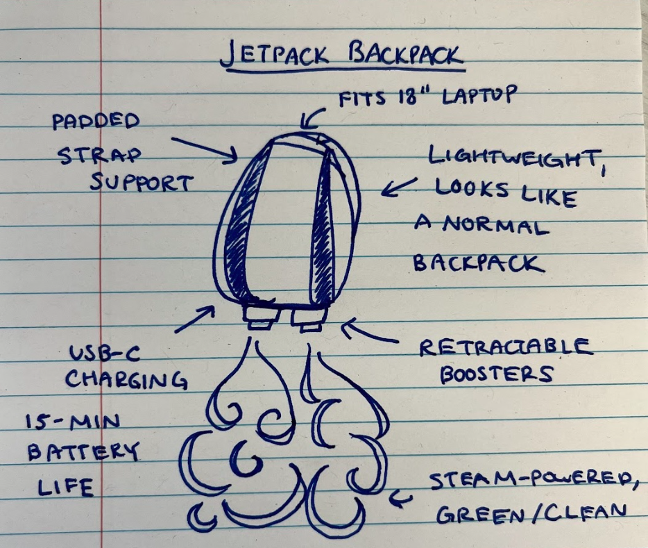

# Gemini API 的視覺功能 

_彙整 [官方的說明文件](https://ai.google.dev/gemini-api/docs/vision?lang=python&hl=zh-tw)_


## 簡介

1. `Gemini API` 可對傳遞給它的 `圖片` 和 `影片` 進行推論，包含 `描述或回答有關內容的問題`、`摘要內容`、`從內容中推斷信息`，並將推論輸出為 `純文本`。

2. `Gemini 1.5 Pro` 和 `1.5 Flash` 支持最多 `3,600` 張圖片文件。

3. 圖片必須是以下類型之一：`PNG`、`JPEG`、`WEBP`、`HEIC`、`HEIF`，每張圖片等同於 `258` 個 tokens，另外，模型沒有特定的像素數限制，但較大的圖片會縮小到最大分辨率 `3072x3072`，而較小的圖片會放大到 `768x768` 像素，放大與縮小皆會維持原比例。


## 使用文件 API 上傳圖片

1. 下載官方提供的 [範例圖片 jetpack.jpg](https://storage.googleapis.com/generativeai-downloads/images/jetpack.jpg)，像素 `1068x906`。

    

2. 導入環境變數。

```python
import google.generativeai as genai
import os
from dotenv import load_dotenv

load_dotenv()

# 設置 API 金鑰，請替換為您的實際金鑰
GOOGLE_API_KEY = os.getenv("GEMINI_API_KEY")
# 配置 Google API 使用您的金鑰
genai.configure(api_key=GOOGLE_API_KEY)
```

3. 使用 `upload_file` 方法上傳圖片並輸出 URI。

    ```python
    # 上傳文件並打印確認信息
    sample_file = genai.upload_file(
        path="jetpack.jpg",
        display_name="Jetpack drawing"
    )
    print(
        f"上傳檔案 '{sample_file.display_name}' 為： {sample_file.uri}"
    )
    ```
    _輸出_

    ```bash
    上傳檔案 'Jetpack drawing' 為： https://generativelanguage.googleapis.com/v1beta/files/bjhg067wr4qn
    ```

4. 顯示圖片內容。

    ```python
    import PIL.Image
    sample_file_1 = PIL.Image.open('jetpack.jpg')
    ```

    

5. 驗證圖片文件上傳並獲取元數據。

    ```python
    # 獲取文件元數據
    file = genai.get_file(name=sample_file.name)
    print(f"檢索檔案 '{file.display_name}' 為： {sample_file.uri}")
    ```

    _輸出_

    ```bash
    檢索檔案 'Jetpack drawing' 為： https://generativelanguage.googleapis.com/v1beta/files/bjhg067wr4qn
    ```

6. 使用上傳的圖片和文本提示生成內容。

    ```python
    import textwrap
    from IPython.display import Markdown
    
    # 選擇 Gemini 模型
    model = genai.GenerativeModel(
        model_name="gemini-1.5-pro"
    )

    # 提示模型生成內容
    response = model.generate_content([
        sample_file,
        "請以繁體中文描述如何製造這個產品。"
    ])

    # 將輸出轉換為 Markdown 格式並顯示
    def to_markdown(text):
        text = text.replace('•', '  *')
        return Markdown(textwrap.indent(
            text, '> ', 
            predicate=lambda _: True
        ))
    # 輸出
    to_markdown(response.text)
    ```
    _回答：_

    ```bash
    這是一個關於製造噴射背包的產品說明：

    噴射背包

    這個產品是一個結合時尚外觀和實用功能的噴射背包。

    功能：

    外觀設計: 外觀輕巧，類似一般的背包，方便日常使用。
    容量: 可容納 18 吋筆記型電腦。
    舒適性: 配備加厚背帶，提供舒適的背負體驗。
    動力系統:
    採用可伸縮的推進器，提供升力。
    以蒸汽為動力，環保清潔。
    電池續航力可達 15 分鐘。
    充電: 配備 USB-C 充電接口，方便充電。
    製造流程:

    設計階段: 首先需要設計背包的外觀、尺寸和功能，並繪製詳細的設計圖。
    材料選擇: 選擇輕便、耐用且符合環保標準的材料來製作背包主體、背帶和推進器外殼。
    推進系統研發: 這部分是技術核心，需要研發高效、安全的蒸汽動力系統，並設計可伸縮的推進器結構。
    電池技術: 開發容量大、重量輕且續航力强的電池，以支持 15 分鐘的飛行時間。
    組裝生產: 將背包主體、推進器、動力系統和電池等部件組裝起來，並進行嚴格的品質檢測。
    市場推廣:

    強調產品的時尚外觀和實用功能，吸引追求潮流和便利的消費者。
    推出不同顏色和款式的背包，滿足不同消費者的需求。
    與科技公司和時尚品牌合作，提升產品的知名度和吸引力。
    注意事項:

    在產品研發和生產過程中，需要注意安全性和可靠性，確保產品符合相關安全標準。
    需要取得相關部門的批准和許可，才能合法銷售和使用噴射背包。
    總之，製造噴射背包需要結合時尚設計、先進科技和嚴謹的生產流程，才能創造出既美觀又實用的產品。
    ```

## 本地上傳多個圖片文件

1. 使用官方提供的兩個圖片 `piranha.jpg`、`firefighter.jpg`，下載並打開圖片文件。

    ```python
    import PIL.Image

    sample_file_2 = PIL.Image.open('piranha.jpg')
    sample_file_3 = PIL.Image.open('firefighter.jpg')
    ```

    

<br>

    


2. 提示多個圖片生成內容：

    ```python
    # 選擇 Gemini 模型
    model = genai.GenerativeModel(model_name="gemini-1.5-pro")

    # 創建提示
    prompt = "Write an advertising jingle showing how the product in the first image could solve the problems shown in the second two images."

    # 提示模型生成內容
    response = model.generate_content([prompt, sample_file, sample_file_2, sample_file_3])

    # 將輸出轉換為 Markdown 格式並顯示
    print(to_markdown(response.text))
    ```

## 獲取對象的邊界框

1. 提示獲取邊界框：

    ```python
    # 選擇 Gemini 模型
    model = genai.GenerativeModel(model_name="gemini-1.5-pro")

    # 創建提示
    prompt = "Return a bounding box for the piranha. \n [ymin, xmin, ymax, xmax]"

    # 提示模型生成內容
    response = model.generate_content([sample_file_2, prompt])

    # 打印生成的內容
    print(response.text)
    ```

## 使用影片作為提示

## 技術細節（影片）

- Gemini 1.5 Pro 和 Flash 支持最多大約一小時的視頻數據。
- 影片必須是以下視頻格式 MIME 類型之一：
  - video/mp4
  - video/mpeg
  - video/mov
  - video/avi
  - video/x-flv
  - video/mpg
  - video/webm
  - video/wmv
  - video/3gpp

## 上傳視頻文件並生成內容

1. 下載影片：

    ```bash
    !wget https://storage.googleapis.com/generativeai-downloads/images/GreatRedSpot.mp4
    ```

2. 上傳影片並打印 URI：

    ```python
    # 上傳影片並打印確認信息
    video_file_name = "GreatRedSpot.mp4"
    print(f"Uploading file...")
    video_file = genai.upload_file(path=video_file_name)
    print(f"Completed upload: {video_file.uri}")
    ```

3. 驗證文件上傳並檢查狀態：

    ```python
    import time

    # 檢查文件是否準備好使用
    while video_file.state.name == "PROCESSING":
        print('.', end='')
        time.sleep(10)
        video_file = genai.get_file(video_file.name)

    if video_file.state.name == "FAILED":
        raise ValueError(video_file.state.name)
    ```

4. 使用影片和文本提示生成內容：

    ```python
    # 創建提示
    prompt = "Summarize this video. Then create a quiz with answer key based on the information in the video."

    # 選擇 Gemini 模型
    model = genai.GenerativeModel(model_name="gemini-1.5-pro")

    # 發送請求
    print("Making LLM inference request...")
    response = model.generate_content([video_file, prompt], request_options={"timeout": 600})

    # 打印生成的內容並渲染 Markdown
    print(to_markdown(response.text))
    ```

## 在內容中參考時間戳

1. 創建帶有時間戳的提示：

    ```python
    # 創建提示
    prompt = "What are the examples given at 01:05 and 01:19 supposed to show us?"

    # 選擇 Gemini 模型
    model = genai.GenerativeModel(model_name="gemini-1.5-pro")

    # 發送請求
    print("Making LLM inference request...")
    response = model.generate_content([prompt, video_file], request_options={"timeout": 600})

    # 打印生成的內容
    print(response.text)
    ```

## 轉錄視頻並提供視覺描述

1. 轉錄視頻和視覺描述：

    ```python
    # 創建提示
    prompt = "Transcribe the audio, giving timestamps. Also provide visual descriptions."

    # 選擇 Gemini 模型
    model = genai.GenerativeModel(model_name="gemini-1.5-pro")

    # 發送請求
    print("Making LLM inference request...")
    response = model.generate_content([prompt, video_file], request_options={"timeout": 600})

    # 打印生成的內容
    print(response.text)
    ```

## 列出文件

1. 列出所有文件：

    ```python
    # 列出所有文件
    for file in genai.list_files():
        print(f"{file.display_name}, URI: {file.uri}")
    ```

## 刪除文件

1. 刪除文件：

    ```python
    # 刪除文件
    genai.delete_file(video_file.name)
    print(f'Deleted file {video_file.uri}')
    ```

## 下一步

本指南展示了如何使用 `generateContent` 函數從圖片和影片輸入生成文本輸出。要了解更多，請參閱以下資源：
- 使用媒體文件作為提示：Gemini API 支持使用文本、圖片、音頻和視頻數據作為提示，這被稱為多模態提示。
- 系統指令：系統指令讓你可以根據具體需求和使用情境來引導模型的行為。
- 安全指南：有時生成 AI 模型會產生意想不到的輸出，如不準確、有偏見或冒犯的內容。後處理和人工評估對於減少此類輸出帶來的風險至關重要。