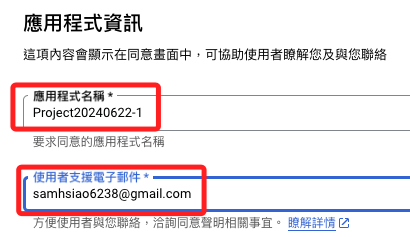
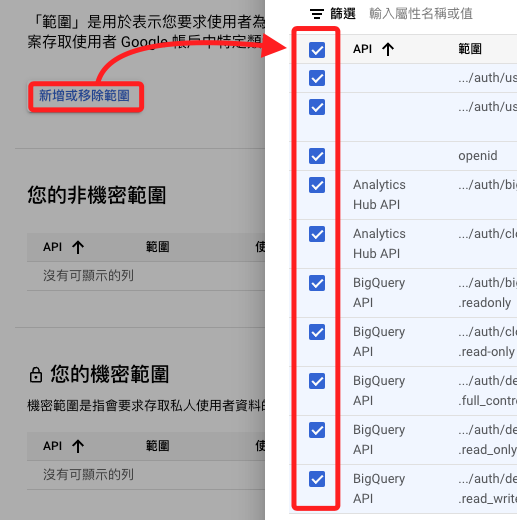
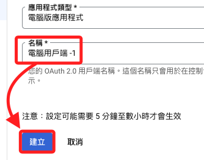

# OAuth

_可參考 [官方說明](https://ai.google.dev/gemini-api/docs/oauth?hl=zh-tw)_


<br>

## 創建 OAuth 憑證

1. 進行 `模型調整` 時，僅有 `API Key` 是不夠的，因為 `模型調整` 涉及的 `敏感數據` 和高級操作，需要更高級別的 `安全性權限` 管理，所以進行 `OAuth 驗證`，。

<br>

2. 進入 [主控台](https://console.cloud.google.com/)，展開導覽選單，滑動到 `API 與服務` 並點擊 `憑證`。

    

<br>

3. 點擊 `專案選單`，在彈出的視窗中，可點擊 `新增專案` 或 `選取現有專案`。

    

<br>

## 新增專案

1. 點擊 `新增專案` 後，輸入 `專案名稱`，接著點擊 `建立`。

    

<br>

2. 完成時在 `通知` 中會顯示相關資訊。

    

<br>

3. 回到 `憑證` 畫面後，務必選取正確的專案再進行後續步驟。

    

<br>

## 建立憑證

1. 點擊 `建立憑證` 展開選單，接著點 `OAuth 客戶端 ID`。

    

<br>

2. 點擊 `設定同意畫面`，這裡的訊息是說明 `客戶端 ID` 用於向 `Google` 的 `OAuth 伺服器` 識別 `單一應用程式`，如果應用程式會在多個平台上運行，則每個平台都需要設定獨立的客戶端 ID。

    

<br>

3. 當前專案是用於學習使用 Google Cloud 服務，所以選擇 `External` 方式即可，接著點擊 `建立`。

    

<br>

## 應用程式資訊

1. 在 `應用程式名稱` 欄位中，輸入 `Project20240622-1`，並透過下拉選單選擇電子郵件。

    

<br>

2. 在 `開發人員聯絡資訊` 輸入自己的電子郵件地址，這適用於專案有異動時的通知，然後點擊 `儲存並繼續`。

    

<br>

## Edit app registration

1. 在 `授權範圍` 部分，點擊 `新增或移除範圍`，並在彈出的視窗中全選即可；若略過新增範圍設定，之後遇到需要為應用程式新增範圍時，再透過此步驟進行修改和驗證即可。

    

<br>

2. 接著點擊彈出視窗左下角的 `更新` 關閉彈出視窗，接著滑動到下方點擊 `儲存並繼續`。

    

<br>

3. 點擊 `+ ADD USERS`，在跳出的視窗中，輸入自己及其他授權測試的使用者郵件地址，並點擊 `新增`。

    

<br>

4. 點擊 `儲存並繼續`。

    

<br>

5.  滑動到下方，點擊回到主控台 `BACK TO DASHBOARD`。

    

<br>

## 回到憑證頁籤

_完成前一個步驟時會在 `OAuth 同意畫面` 頁籤_

<br>

1. 再次點擊 `建立憑證`，選取 `OAuth 客戶端 ID`。

    

<br>

2. 在 `應用程式類型` 中選擇 `電腦版應用程式`。

    

<br>

3. 輸入名稱或使用預設的 `電腦用戶端 -1`，依照畫面說明 `您的 OAuth 2.0 用戶端名稱。這個名稱只會用於在控制台中識別用戶端，不會向使用者顯示`，然後點擊 `建立`。

    

<br>

4. 再跳出來的視窗中先點擊 `下載 JSON`，然後點擊 `確認`。

    

<br>

## 進入檔案管理

1. 在 `下載資料夾` 中會看到這個憑證，這是一個 `JSON` 文件。

    

<br>

2. 這個文件預設的名稱太長，可修改為 `client_secret.json`。

    

<br>

3. 將這個密鑰文件複製到接下來的程式碼範例資料夾中，並將檔案名稱加入 `.gitignore` 文件中，假如文件不存在則進行新增，建議無論是否使用版本控制，皆預先進行這個步驟。

    

<br>

## 使用本地命令進行驗證

_使用 `gcloud` 命令進行驗證_

<br>

1. 進入 `密鑰文件` 所在的資料夾中，命令運行後會將 `client_secret.json 文件` 轉換為應用程式可用的 `憑證 Credentials`：以下指令中的 `\` 是換行符號，如果在 `Colab` 上執行則在指令中加上參數 `--no-browser`。

    ```bash
    gcloud auth application-default login \
        --client-id-file=client_secret.json \
        --scopes='https://www.googleapis.com/auth/cloud-platform,https://www.googleapis.com/auth/generative-language.tuning'
    ```

<br>

2. 這行指令將啟動瀏覽器，要求登錄 `Google` 帳戶並授予應用所需的權限，接著點擊 `繼續`。

    

<br>

3. 點擊 `全選` 然後 `繼續`。

    

<br>

4. 完成授權後，會生成一個 `Credentials` 並儲存在本地，這些憑證將由任何請求應用程式預設憑證 (ADC) 的庫使用。

    ```bash
    Credentials saved to file: [/Users/samhsiao/.config/gcloud/application_default_credentials.json]

    These credentials will be used by any library that requests Application Default Credentials (ADC).
    ```

<br>

## 使用 Curl 測試

_使用 `curl` 進行測試，使用指定的 `專案 ID` 訪問 `Google API`，並正確進行 `OAuth 認證`，如此便可確認該專案已經啟用指定的 API，並可這執行相關操作。_

<br>

1. 使用前面步驟取得的 `access_token` 和 `project_id` 進行檢查，以下指令中需要輸入 `自己的 Project ID`。

    ```bash
    access_token=$(gcloud auth application-default print-access-token)
    project_id=<自己的 Project ID>
    ```

    _替換後_
    
    ```bash
    access_token=$(gcloud auth application-default print-access-token)
    project_id=myproject-20240622
    ```

<br>

2. 使用 `curl` 測試以確認能夠存取 `API`。

    ```bash
    curl -X GET https://generativelanguage.googleapis.com/v1/models \
        -H 'Content-Type: application/json' \
        -H "Authorization: Bearer ${access_token}" \
        -H "x-goog-user-project: ${project_id}" | grep '"name"'
    ```

    

<br>

## Python 用戶端測試

_啟用服務並進行測試_

1. 在瀏覽器中訪問 `Generative Language API` 的 [服務啟動頁面](https://console.developers.google.com/apis/api/generativelanguage.googleapis.com/overview?project=826653416557)，點擊 `啟用`。

    

<br>

2. API 下方有關於收費的資訊可以進行閱讀。

    

<br>

3. 回到終端機中，安裝 `Google 用戶端函式庫`。

    ```bash
    pip install google-generativeai
    ```

<br>

2. 使用 Python 程式碼進行測試。

    ```python
    import google.generativeai as genai

    print('可用的基礎模型：')
    for m in genai.list_models():
        print(m.name)
    ```

    _輸出_

    ```bash
    可用的基礎模型：
    models/chat-bison-001
    models/text-bison-001
    models/embedding-gecko-001
    models/gemini-1.0-pro
    models/gemini-1.0-pro-001
    models/gemini-1.0-pro-latest
    models/gemini-1.0-pro-vision-latest
    models/gemini-1.5-flash
    models/gemini-1.5-flash-001
    models/gemini-1.5-flash-latest
    models/gemini-1.5-pro
    models/gemini-1.5-pro-001
    models/gemini-1.5-pro-latest
    models/gemini-pro
    models/gemini-pro-vision
    models/embedding-001
    models/text-embedding-004
    models/aqa
    ```

<br>

___

_END_