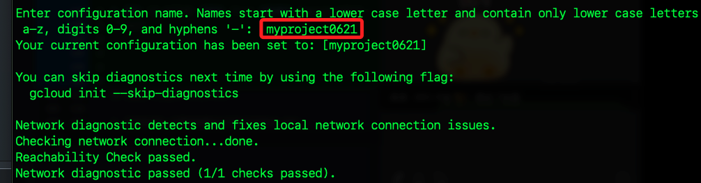

# 模型調整

_Gemini API 模型調整指南_

_使用 Python 進行模型調整，目前只有 `gemini-1.0-pro-001` 模型提供調整功能，詳見 [官方網址](https://ai.google.dev/gemini-api/docs/model-tuning/python?hl=zh-tw) 說明_


## 說明

1. 這個教程將使用 `Python 客戶端庫` 來調整 `Gemini API` 背後的 `文本生成模型`。

2. 特別注意，目前調整僅適用於 `gemini-1.0-pro-001` 模型。

## 設置步驟

_官方教學引導在 Colab 運作，這裡是在本地電腦上進行_

1. 驗證：`Gemini API` 允許使用自己的數據來調整模型，由於這涉及到數據和調整後的模型，因此需要比 API 金鑰更嚴格的 `訪問控制`，在運行之前，需要為項目設置 `OAuth 驗證`。


2. 開啟官方 [Google Cloud SDK 安裝頁面](https://cloud.google.com/sdk/docs/install)，選擇操作系統下載安裝檔案，點擊進行解壓縮。


3. 在解壓縮後的資料夾開啟終端機，運行以下安裝指令。

```bash
./install.sh
```

4. 是否協助：N。


5. 是否設置環境變數：Y。


6. 使用預設的 `.zshrc`：ENTER。


7. 安裝預設版本的模組。


8. 運行以下指令或重啟終端機讓環境變數設定生效。

```bash
source ~/.zshrc
```

_以上完成安裝_


## 初始化 Google Cloud SDK

1. 安裝完成後，打開終端運行以下命令可初始化 SDK。

```bash
gcloud init
```

2. 假如已有設置就會看到如下畫面，輸入 `2` 執行 `Create a new configuration`。


3. 為設置 `configuration` 命名。



4. 若原本已有登入帳號，可直接輸入 `1` 選取，或輸入 `2` 重新登入，會開啟瀏覽器選擇 `Google` 帳號，進行授權的確認。


_完成後會回到終端機繼續_

## 建立 OAuth

1. 選取專案，這裡我選取跟前面操作中相同的專案。


2. 若需要其他服務可執行以下指令。
```bash
# 了解如何更改個別設置
gcloud help config
# 查看可互動的服務
gcloud --help
# 查看指令的清單
gcloud cheat-sheet
```


## 創建 OAuth 憑據

你需要創建一組 OAuth 憑據來驗證你的應用。步驟如下：

1. 打開 [Google Cloud Console](https://console.cloud.google.com/)。
2. 選擇你的項目。
3. 導航到 ##API 和服務 > 憑據##。
4. 點擊 ##創建憑據 > OAuth 2.0 客戶端 ID##。
5. 填寫相關信息並創建憑據，下載 `client_secret.json` 文件。

#### 4. 使用本地命令進行驗證

在本地環境中，使用 `gcloud` 命令進行驗證：

1. ##下載憑據##：確保你已經下載了 `client_secret.json` 文件，並將其保存到一個方便的位置，例如你的項目目錄。

2. ##運行驗證命令##：

   打開終端，導航到存放 `client_secret.json` 文件的目錄，然後運行以下命令：

   ```bash
   gcloud auth application-default login --client-id-file=client_secret.json --scopes='https://www.googleapis.com/auth/cloud-platform,https://www.googleapis.com/auth/generative-language.tuning'
   ```

   - 這行命令將啟動瀏覽器，要求你登錄 Google 帳戶並授予應用所需的權限。
   - 完成授權後，會生成一個驗證令牌，你需要在終端中輸入該令牌以完成驗證。

#### 5. 在 Python 環境中使用憑據

現在你可以在 Python 腳本中使用這些憑據進行 API 調用。以下是如何導入和配置的範例代碼：

```python
import google.generativeai as genai

# 初始化生成模型
model = genai.GenerativeModel(
    model_name="gemini-1.5-pro"
)

# 假設 sample_file 是已經上傳的文件
# 提示模型生成內容
response = model.generate_content([
    sample_file,
    "描述如何製造這個產品。"
])

# 打印生成的內容
print(response.text)
```

### 總結

1. ##安裝 Google Cloud SDK##：下載並安裝必要的工具。
2. ##初始化 SDK##：進行基本配置，選擇項目。
3. ##創建 OAuth 憑據##：在 Google Cloud Console 中生成 `client_secret.json` 文件。
4. ##驗證##：使用本地命令行工具進行 OAuth 驗證。
5. ##運行 Python 腳本##：使用這些憑據在 Python 腳本中調用 Gemini API。

這些步驟應該能幫助你在本地設置並成功運行與 Google Cloud 和 Gemini API 的集成。如果還有其他問題或需要進一步的幫助，請隨時告訴我！ 

#### 安裝客戶端庫

```bash
pip install -q google-generativeai
```

#### 導入所需庫

```python
import google.generativeai as genai
```

### 列出現有的調整模型

```python
for i, m in zip(range(5), genai.list_tuned_models()):
  print(m.name)
```

### 創建調整模型

要創建調整模型，你需要將數據集傳遞給 `genai.create_tuned_model` 方法。你可以直接在調用中定義輸入和輸出值，也可以從文件導入數據框後傳遞給方法。

#### 示例：調整生成下一個數字的模型

```python
base_model = [
    m for m in genai.list_models()
    if "createTunedModel" in m.supported_generation_methods][0]

import random

name = f'generate-num-{random.randint(0,10000)}'
operation = genai.create_tuned_model(
    # 這裡可以使用調整模型。設置 `source_model="tunedModels/..."`
    source_model=base_model.name,
    training_data=[
        {'text_input': '1', 'output': '2'},
        {'text_input': '3', 'output': '4'},
        {'text_input': '-3', 'output': '-2'},
        {'text_input': 'twenty two', 'output': 'twenty three'},
        {'text_input': 'two hundred', 'output': 'two hundred one'},
        {'text_input': 'ninety nine', 'output': 'one hundred'},
        {'text_input': '8', 'output': '9'},
        {'text_input': '-98', 'output': '-97'},
        {'text_input': '1,000', 'output': '1,001'},
        {'text_input': '10,100,000', 'output': '10,100,001'},
        {'text_input': 'thirteen', 'output': 'fourteen'},
        {'text_input': 'eighty', 'output': 'eighty one'},
        {'text_input': 'one', 'output': 'two'},
        {'text_input': 'three', 'output': 'four'},
        {'text_input': 'seven', 'output': 'eight'},
    ],
    id=name,
    epoch_count=100,
    batch_size=4,
    learning_rate=0.001,
)
```

#### 檢查調整進度

```python
model = genai.get_tuned_model(f'tunedModels/{name}')
model.state
```

### 等待調整完成

```python
import time

for status in operation.wait_bar():
  time.sleep(30)
```

### 取消調整任務

如果需要，可以隨時取消調整任務：

```python
# operation.cancel()
```

### 查看損失曲線

```python
import pandas as pd
import seaborn as sns

model = operation.result()
snapshots = pd.DataFrame(model.tuning_task.snapshots)
sns.lineplot(data=snapshots, x='epoch', y='mean_loss')
```

### 評估調整後的模型

```python
model = genai.GenerativeModel(model_name=f'tunedModels/{name}')

result = model.generate_content('55')
print(result.text)  # 預期輸出：'56'

result = model.generate_content('123455')
print(result.text)  # 預期輸出：'123456'

result = model.generate_content('four')
print(result.text)  # 預期輸出：'five'

result = model.generate_content('quatre')  # 法語的 4
print(result.text)  # 法語的 5 是 'cinq'

result = model.generate_content('III')  # 羅馬數字 3
print(result.text)  # 羅馬數字 4 是 'IV'

result = model.generate_content('七')  # 日語的 7
print(result.text)  # 日語的 8 是 '八'
```

### 更新調整模型的描述

```python
genai.update_tuned_model(f'tunedModels/{name}', {"description": "This is my model."})

model = genai.get_tuned_model(f'tunedModels/{name}')
print(model.description)  # 預期輸出：'This is my model.'
```

### 刪除調整模型

```python
genai.delete_tuned_model(f'tunedModels/{name}')
try:
  m = genai.get_tuned_model(f'tunedModels/{name}')
  print(m)
except Exception as e:
  print(f"{type(e)}: {e}")
```

以上是完整的模型調整指南，展示了如何創建、檢查進度、取消、評估和刪除調整模型。希望這些內容對你有所幫助！