# 模型調整

_Gemini API 模型調整指南_

_使用 Python 進行模型調整，目前只有 `gemini-1.0-pro-001` 模型提供調整功能，詳見 [官方網址](https://ai.google.dev/gemini-api/docs/model-tuning/python?hl=zh-tw) 說明_


<br>

## 說明

1. 所謂的 `調整模型（tuning model）` 就是在一個已經預先訓練過的大模型基礎上，通過提供特定的 `訓練數據`，進一步訓練以適應 `特定的應用場景`，這過程也稱為 `微調（fine-tuning）`。

<br>

2. 這個教程將使用 `Python 客戶端庫` 來調整 `Gemini API` 背後的 `文本生成模型`。

<br>

3. 特別注意，目前調整僅適用於 `gemini-1.0-pro-001` 模型。

<br>

## 設置步驟

_官方教學引導在 Colab 運作，這裡是在本地電腦上進行_

<br>

1. 驗證：`Gemini API` 允許使用自己的數據來調整模型，由於這涉及到數據和調整後的模型，因此需要比 API 金鑰更嚴格的 `訪問控制`，在運行之前，需要為項目設置 `OAuth 驗證`。

<br>

2. 開啟官方 [Google Cloud SDK 安裝頁面](https://cloud.google.com/sdk/docs/install)，選擇操作系統下載安裝檔案，點擊進行解壓縮。

    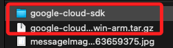

<br>

3. 在解壓縮後的資料夾開啟終端機，運行以下安裝指令。

    ```bash
    ./install.sh
    ```

<br>

4. 是否協助：N。

    

<br>

5. 是否設置環境變數：Y。

    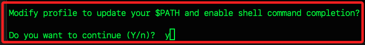

<br>

6. 使用預設的 `.zshrc`：ENTER。

    

<br>

7. 安裝預設版本的模組：Y。

    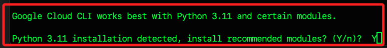

<br>

8. 可查看設定文件 `~/.zshrc`。

    ```bash
    # PATH for the Google Cloud SDK.
    if [ -f '/Users/samhsiao/Downloads/google-cloud-sdk/path.zsh.inc' ];
    then . '/Users/samhsiao/Downloads/google-cloud-sdk/path.zsh.inc';
    fi

    # enables shell command completion for gcloud.
    if [ -f '/Users/samhsiao/Downloads/google-cloud-sdk/completion.zsh.inc' ];
    then . '/Users/samhsiao/Downloads/google-cloud-sdk/completion.zsh.inc';
    fi
    ```

<br>

9. 運行以下指令或重啟終端機讓環境變數設定生效。

    ```bash
    source ~/.zshrc
    ```

<br>

_以上完成安裝_

<br>

## 開始之前

1. 先查詢已經存在的配置。

    ```bash
    gcloud config configurations list
    ```

    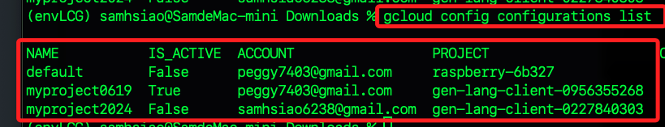

<br>

2. 假如要刪除本地 `IS_ACTIVE` 狀態為 `False` 的指定配置。

    ```bash
    gcloud config configurations delete default
    ```

    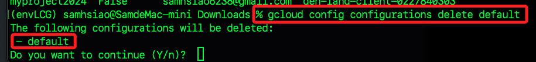

<br>

3. 若要刪除 `IS_ACTIVE` 狀態為 `True` 的配置為 `myproject0619`，必須先切換到其他配置，但若該配置為當前唯一配置，就必須先建立一個臨時的配置如 `tempconfig`。

    ```bash
    gcloud config configurations create tempconfig
    ```

    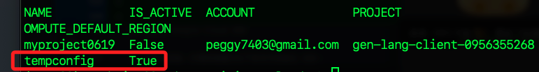

<br>

4. 若有其他配置，則透過手動切換到另一個配置，並可透過指令確認切換後的狀態。

    ```bash
    gcloud config configurations activate tempconfig
    ```
    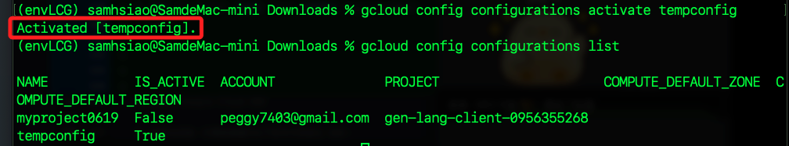

<br>

5. 刪除指定的閒置設置。

    ```bash
    gcloud config configurations delete myproject0619
    ```

    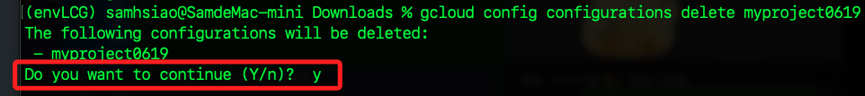

<br>

## 初始化 Google Cloud SDK

1. 安裝完成後，打開終端運行以下命令可初始化 SDK。

    ```bash
    gcloud init
    ```

<br>

2. 輸入 `2` 執行 `Create a new configuration`。

    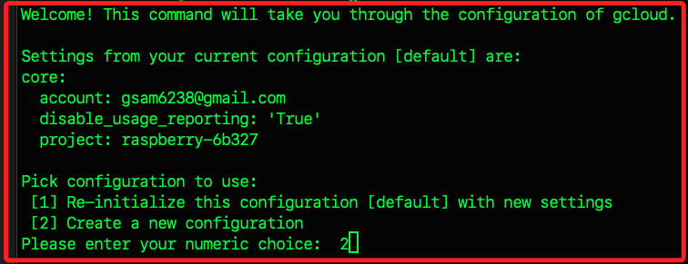

<br>

3. 為設置 `configuration` 命名，這裡假設是 `myproject0621`，切記只可以有 _小寫字母、數字、`-`，並以小寫字母開頭_。

    

<br>

4. 接著選擇登入帳號，若要登入既有帳號可輸入對應的數字，如截圖中 `[1] ~ [3]`，或輸入 `[4] Log in with a new account`，若點擊 `Log in with a new account` 後會開啟瀏覽器選擇 `Google` 帳號進行授權的確認。

    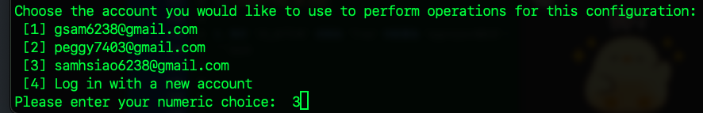

<br>

5. 否則進入下一步選擇專案。

    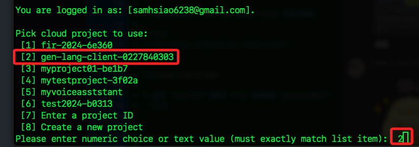

<br>

6. 完成時，畫面會顯示其他可執行指令。

    ```bash
    # 了解如何更改個別設置
    gcloud help config
    # 查看可互動的服務
    gcloud --help
    # 查看指令的清單
    gcloud cheat-sheet
    ```

<br>

## 進入 [主控台](https://cloud.google.com/?hl=zh_tw)

1. 點擊 `專案下拉選單`，可看到並切換到指定的專案。

    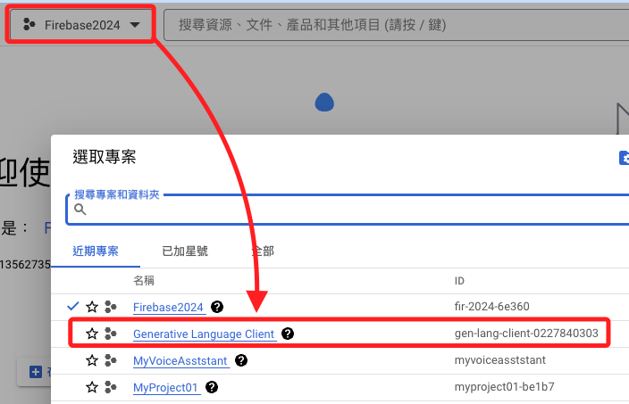

<br>

2. 點擊 [Google Cloud 資訊主頁](https://console.cloud.google.com/) ，可進入指定專案中；以上兩個步驟可以互換，就是先在導覽中切換到資訊主頁，再選擇指定專案。

    

<br>


## 調整模型

1. 先安裝和更新 `jupyter` 和 `ipywidgets`，這是確保在 `Jupyter Notebook` 環境中能夠正常使用進度條及其他視覺化工具，這些工具在數據科學和機器學習領域非常重要，可更方便地進行數據探索、模型訓練和結果展示。。

    ```bash
    pip install --upgrade jupyter ipywidgets
    ```

<br>

2. 列出可用模型。

    ```python
    import google.generativeai as genai

    # 列出所有可用的模型
    available_models = genai.list_models()

    # 輸出支持調整的模型
    for model in available_models:
        if "createTunedModel" in model.supported_generation_methods:
            print(f"Model ID: {model.name}, Name: {model.display_name}")
    ```

    _輸出_

    ```bash
    Model ID: models/gemini-1.0-pro-001, Name: Gemini 1.0 Pro 001 (Tuning)
    ```

<br>

3. 準備訓練數據，以下數據主要是用來訓練一個能夠進行 `數字遞增轉換` 的模型，目的是教模型如何將給定的數字增大一個單位並生成對應的下一個數字，包括數字形式和文本形式。

    ```python
    training_data = (
        [
            # 簡單的數字增量
            {"text_input": "1", "output": "2"},
            {"text_input": "3", "output": "4"},
            # 負數的增量
            {"text_input": "-3", "output": "-2"},
            # 數字文字形式的增量
            {"text_input": "twenty two", "output": "twenty three"},
            # 高數字文字形式的增量
            {"text_input": "two hundred", "output": "two hundred one"},
            # 跨越進位的增量
            {"text_input": "ninety nine", "output": "one hundred"},
            {"text_input": "8", "output": "9"},
            {"text_input": "-98", "output": "-97"},
            # 含千位分隔符的增量
            {"text_input": "1,000", "output": "1,001"},
            {"text_input": "10,100,000", "output": "10,100,001"},
            {"text_input": "thirteen", "output": "fourteen"},
            {"text_input": "eighty", "output": "eighty one"},
            {"text_input": "one", "output": "two"},
            {"text_input": "three", "output": "four"},
            {"text_input": "seven", "output": "eight"},
        ]
    )
    ```

<br>

4. 創建調整模型，從 `list_models()` 中獲取的 `模型 ID` 來創建一個新的 `調整模型`，要創建調整模型，需要將數據集傳遞給 `genai.create_tuned_model` 方法，可以直接在調用中定義輸入和輸出值，也可以從文件導入數據框後傳遞給方法。

    ```python
    import google.generativeai as genai
    import random

    # 設置調整模型的名稱
    model_id = 'models/gemini-1.0-pro-001'
    name = f'generate-num-{random.randint(0, 10000)}'
    # 創建調整模型
    operation = genai.create_tuned_model(
        # 使用支持調整的模型 ID
        source_model=model_id,
        # 提供訓練數據
        training_data=training_data,
        # 調整模型的唯一標識
        id=name,
        # 訓練週期數
        epoch_count=10,
        # 每批訓練數據的大小
        batch_size=2,
        # 學習速率
        learning_rate=0.001,
        # 設置模型的顯示名稱
        display_name="我的調整模型"
    )
    # 等待操作完成
    operation.result()
    print(f"調整模型創建完成，模型 ID: {name}")
    ```

    _輸出_

    ```bash
    調整模型創建完成，模型 ID: generate-num-5083
    ```

<br>

5. 檢查調整模型的狀態，在輸出中，`模型狀態 2` 表示模型已經準備就緒、處於 `READY` 狀態。

    ```python
    # 獲取調整模型的詳細信息
    model = genai.get_tuned_model(f'tunedModels/{name}')
    print(f"模型狀態: {model.state}")

    # 列出已調整的模型
    for i, m in zip(range(5), genai.list_tuned_models()):
        print(f"Model ID: {m.name}, Name: {m.display_name}")
    ```

    _輸出_

    ```bash
    模型狀態: 2
    Model ID: tunedModels/generate-num-1353, Name: 我的調整模型
    ```

<br>

## 評估調整後的模型

1. 檢查其輸出是否符合預期。

    ```python
    # 創建生成內容的模型對象
    model = genai.GenerativeModel(model_name=f'tunedModels/{name}')

    # 測試模型輸出
    test_cases = {
        '55': '56',
        '123455': '123456',
        'four': 'five',
        # 法語的 4 和 5
        'quatre': 'cinq',
        # 羅馬數字
        'III': 'IV',
        # 日語的 7 和 8
        '七': '八'
    }

    for input_text, expected_output in test_cases.items():
        result = model.generate_content(input_text)
        print(f"Input: {input_text}, Output: {result.text}, Expected: {expected_output}")
    ```

    _輸出_

    ```bash
    Input: 55, Output: 56, Expected: 56
    Input: 123455, Output: 12346, Expected: 123456
    Input: four, Output: five, Expected: five
    Input: quatre, Output: cinq, Expected: cinq
    Input: III, Output: IV, Expected: IV
    Input: 七, Output: 八, Expected: 八
    ```

<br>

2. 查看損失曲線，可了解模型在訓練過程中的收斂情況，使用 Pandas 和 Seaborn 來繪製損失曲線。

    ```python
    import pandas as pd
    import seaborn as sns
    import matplotlib.pyplot as plt

    # 獲取調整模型的快照信息，構建 DataFrame
    snapshots = pd.DataFrame(model_info.tuning_task.snapshots)

    # 繪製損失曲線
    plt.figure(figsize=(10, 6))
    sns.lineplot(data=snapshots, x='epoch', y='mean_loss')
    plt.xlabel('Epoch')
    plt.ylabel('Mean Loss')
    plt.title('Training Loss Curve')
    plt.show()
    ```

    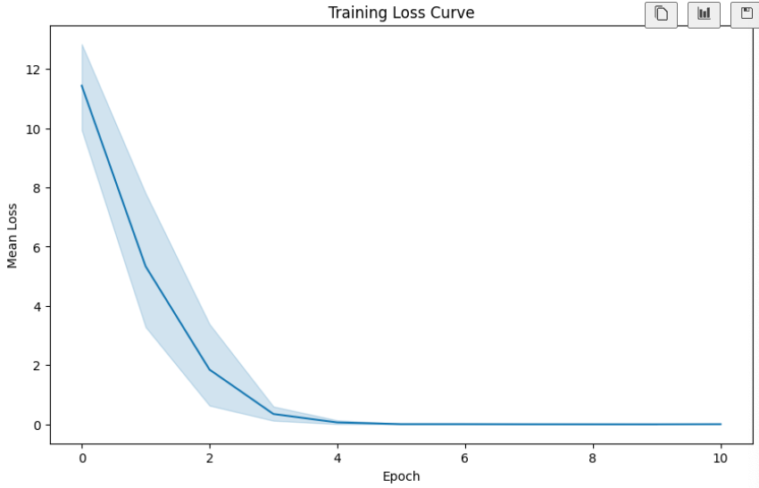

<br>

3. 更新調整模型的描述，以便以後能夠更好地識別和管理它。

    ```python
    # 更新調整模型的描述
    genai.update_tuned_model(
        f"tunedModels/{name}",
        {"description": "This is my model."}
    )

    # 驗證更新
    model_info = genai.get_tuned_model(f"tunedModels/{name}")
    # 預期輸出：'This is my model.'
    print(f"模型描述: {model_info.description}")
    ```

    _輸出_

    ```bash
    模型描述: This is my model.
    ```

<br>

4. 如果不再需要這個調整模型，你可以刪除它來釋放資源。

    ```python
    # 刪除調整模型
    genai.delete_tuned_model(f'tunedModels/{name}')
    try:
        model_info = genai.get_tuned_model(f'tunedModels/{name}')
        print(model_info)
    except Exception as e:
        # 預期輸出：404 Not Found
        print(f"{type(e)}: {e}")
    ```

    _輸出_

    ```bash
    <class 'google.api_core.exceptions.NotFound'>: 404 Tuned model tunedModels/generate-num-1353 does not exist.
    ```

<br>

## 查詢並刪除

_多次運行後可能會產生多個模型_

<br>

1. 列出和批次刪除已調整模型。

    ```python
    import google.generativeai as genai

    # 列出所有已調整的模型，將生成器轉換為列表
    tuned_models = list(genai.list_tuned_models())

    # 打印出所有模型的ID和名稱
    print("已調整的模型列表:")
    for model in tuned_models:
        print(f"Model ID: {model.name}, Name: {model.display_name}")

    # 批次刪除模型
    for model in tuned_models:
        try:
            # 刪除模型
            genai.delete_tuned_model(model.name)
            print(f"已刪除模型: Model ID: {model.name}, Name: {model.display_name}")
        except Exception as e:
            print(f"刪除模型失敗: Model ID: {model.name}, Name: {model.display_name}, Error: {e}")

    # 列出刪除後的模型列表，並轉換為列表
    remaining_models = list(genai.list_tuned_models())

    print("刪除後的模型列表:")
    for model in remaining_models:
        print(f"Model ID: {model.name}, Name: {model.display_name}")

    # 確認所有模型是否已刪除
    if not remaining_models:
        print("所有模型已刪除")
    else:
        print(f"仍有 {len(remaining_models)} 個模型未刪除")
    ```

<br>

___

_END_
