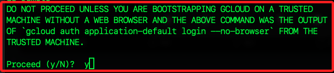

# REST API 模型調整

_使用 `curl 指令` 或 `Python request` 說明如何調整 `Gemini API` 的 `文字生成模型`。_

## 說明

1. 前一小節是使用 `Python 客戶端 SDK` 來進行模型調整，驗證方式是 `OAuth 認證`，整合了大部分功能，可以進行全面的操作。

2. 接下來將使用 `REST API` 和 `curl` 指令進行模型調整，驗證方式將使用 `gcloud` 和 `REST API` 進行身份驗證，支持 `Python` 的環境中也可以使用，適合對具體功能的精細控制，例如直接構建 HTTP 請求。

## 設定和驗證

1. `Gemini API` 允許基於自己的數據來調整模型，由於這涉及到您的數據和經過調整的模型，因此需要更嚴格的存取控制，以下示範使用 `gcloud 指令` 將 `client_secret.json` 文件轉換為可用來驗證的憑證。

```python
import os

# 請確保 'client_secret.json' 檔案存在於目前目錄或指定路徑
client_secret_file = 'client_secret.json'

if not os.path.exists(client_secret_file):
    raise FileNotFoundError(
        f"client_secret.json 文件不在路徑中：{client_secret_file}"
    )

# 執行 gcloud 登入
os.system(
    f"gcloud auth application-default login --client-id-file={client_secret_file} --scopes='https://www.googleapis.com/auth/cloud-platform,https://www.googleapis.com/auth/generative-language.tuning'"
)

```

## 如果在本地機器上運行

1. 在有瀏覽器的本地機器上運行以下命令，並將輸出結果複製回來
```bash
gcloud auth application-default login --remote-bootstrap="https://accounts.google.com/o/oauth2/auth?response_type=code&client_id=<你的client_id>&scope=https://www.googleapis.com/auth/cloud-platform+https://www.googleapis.com/auth/generative-language.tuning&state=state_code&access_type=offline&code_challenge=code_challenge&code_challenge_method=S256&token_usage=remote"
```

2. 實際指令如下。
```bash
gcloud auth application-default login --remote-bootstrap="https://accounts.google.com/o/oauth2/auth?response_type=code&client_id=146122527240-qh0vcuetgdll1t8ukdgcbq01md36krdd.apps.googleusercontent.com&scope=https://www.googleapis.com/auth/cloud-platform+https://www.googleapis.com/auth/generative-language.tuning&state=12345&access_type=offline&code_challenge=abcde12345&code_challenge_method=S256&redirect_uri=http://localhost&token_usage=remote"
```

## 指令說明

1. client_id：從 JSON 檔案中獲取。
2. scope：指定權限範圍，包括存取 `Google Cloud Platform` 和 `產生語言模型` 的權限。
3. state：這是一個防止 CSRF 攻擊的安全碼，可以使用任意字串作為值，例如 12345。
4. access_type：設定為 `offline`，以便在沒有使用者互動的情況下取得刷新令牌。
5. code_challenge：這是用於 PKCE 的程式碼挑戰，需要使用 `SHA256` 編碼生成，可以使用任意字串，例如 abcde12345。實際情況下需要用正確的值替換。
6. code_challenge_method：設定為 S256，這是 PKCE 的標準方。
7. redirect_uri：從您的 JSON 檔案中獲取，即 http://localhost。

運行後會有安全性提示，點擊 `Y` 即可。


輸入指令結果：`https://localhost:8085/?state=state_code&code=auth_code&scope=auth_scope`

憑證會被保存到：`/content/.config/application_default_credentials.json`

## 使用 CURL 呼叫 REST API

以下是如何使用 curl 指令來呼叫 REST API 進行模型調整的例子。

## 設定變數

首先，設定一些環境變數，以便後續的 REST API 調用使用：

```bash
export access_token=$(gcloud auth application-default print-access-token)
export project_id=my-project-id
export base_url=https://generativelanguage.googleapis.com
```

以下是 Python 代碼，使用 `os` 庫來設置環境變數：

```python
import os

# 獲取訪問令牌
access_token = !gcloud auth application-default print-access-token
access_token = '\n'.join(access_token)

# 設置環境變數
os.environ['access_token'] = access_token
os.environ['project_id'] = "[輸入您的專案 ID]"
os.environ['base_url'] = "https://generativelanguage.googleapis.com"
```

## 列出調整過的模型

列出當前可用的調整模型，驗證您的認證設置：

```bash
curl -X GET ${base_url}/v1beta/tunedModels \
    -H "Content-Type: application/json" \
    -H "Authorization: Bearer ${access_token}" \
    -H "x-goog-user-project: ${project_id}"
```

## 建立調整過的模型

創建一個新的調整模型，並提供訓練數據：

```bash
curl -X POST $base_url/v1beta/tunedModels \
    -H 'Content-Type: application/json' \
    -H "Authorization: Bearer ${access_token}" \
    -H "x-goog-user-project: ${project_id}" \
    -d '
    {
        "display_name": "number generator model",
        "base_model": "models/gemini-1.0-pro-001",
        "tuning_task": {
            "hyperparameters": {
                "batch_size": 2,
                "learning_rate": 0.001,
                "epoch_count": 5
            },
            "training_data": {
                "examples": [
                    {"text_input": "1", "output": "2"},
                    {"text_input": "3", "output": "4"},
                    {"text_input": "-3", "output": "-2"},
                    {"text_input": "twenty two", "output": "twenty three"},
                    {"text_input": "two hundred", "output": "two hundred one"},
                    {"text_input": "ninety nine", "output": "one hundred"},
                    {"text_input": "8", "output": "9"},
                    {"text_input": "-98", "output": "-97"},
                    {"text_input": "1,000", "output": "1,001"},
                    {"text_input": "10,100,000", "output": "10,100,001"},
                    {"text_input": "thirteen", "output": "fourteen"},
                    {"text_input": "eighty", "output": "eighty one"},
                    {"text_input": "one", "output": "two"},
                    {"text_input": "three", "output": "four"},
                    {"text_input": "seven", "output": "eight"}
                ]
            }
        }
    }' | tee tunemodel.json
```

## 取得調整後模型的狀態

可以通過模型的名稱來檢查模型的狀態，使用 Python 解析 JSON 回應：

```python
import json

# 解析 JSON 文件
first_page = json.load(open('tunemodel.json'))
os.environ['modelname'] = first_page['metadata']['tunedModel']

print(os.environ['modelname'])
```

檢查模型狀態，使用 `curl` 命令：

```bash
curl -X GET ${base_url}/v1beta/${modelname} \
    -H 'Content-Type: application/json' \
    -H "Authorization: Bearer ${access_token}" \
    -H "x-goog-user-project: ${project_id}" | grep state
```

## 執行推論

當模型調整完成後，可以使用該模型進行推論。這裡是一個例子，使用模型來生成文字：

```bash
curl -X POST $base_url/v1beta/$modelname:generateContent \
    -H 'Content-Type: application/json' \
    -H "Authorization: Bearer ${access_token}" \
    -H "x-goog-user-project: ${project_id}" \
    -d '{
        "contents": [{
        "parts": [{
            "text": "LXIII"
            }]
        }]
    }' 2> /dev/null
```

## 檢查模型輸出

檢查生成的文字，並解析回應內容：

```json
{
  "candidates": [
    {
      "content": {
        "parts": [
          {
            "text": "LXIV"
          }
        ],
        "role": "model"
      },
      "finishReason": "STOP",
      "index": 0,
      "safetyRatings": [
        {
          "category": "HARM_CATEGORY_SEXUALLY_EXPLICIT",
          "probability": "NEGLIGIBLE"
        },
        {
          "category": "HARM_CATEGORY_HATE_SPEECH",
          "probability": "NEGLIGIBLE"
        },
        {
          "category": "HARM_CATEGORY_HARASSMENT",
          "probability": "LOW"
        },
        {
          "category": "HARM_CATEGORY_DANGEROUS_CONTENT",
          "probability": "NEGLIGIBLE"
        }
      ]
    }
  ],
  "promptFeedback": {
    "safetyRatings": [
      {
        "category": "HARM_CATEGORY_SEXUALLY_EXPLICIT",
        "probability": "NEGLIGIBLE"
      },
      {
        "category": "HARM_CATEGORY_HATE_SPEECH",
        "prob

ability": "NEGLIGIBLE"
      },
      {
        "category": "HARM_CATEGORY_HARASSMENT",
        "probability": "NEGLIGIBLE"
      },
      {
        "category": "HARM_CATEGORY_DANGEROUS_CONTENT",
        "probability": "NEGLIGIBLE"
      }
    ]
  }
}
```

## 透過 Python 發送 REST API 請求

您可以使用任何支持 HTTP 請求的庫來調用 REST API。以下是使用 Python `requests` 庫來調用 API 的例子。

## 設定變數

首先設置變數：

```python
import requests
import json

access_token = !gcloud auth application-default print-access-token
access_token = '\n'.join(access_token)

project = '[輸入您的專案 ID]'
base_url = "https://generativelanguage.googleapis.com"
```

## 列出調整過的模型

列出當前可用的調整模型，驗證您的認證設置：

```python
headers = {
    'Authorization': 'Bearer ' + access_token,
    'Content-Type': 'application/json',
    'x-goog-user-project': project
}

result = requests.get(
    url=f'{base_url}/v1beta/tunedModels',
    headers=headers,
)

print(result.json())
```

## 建立經過調整的模型

與 curl 範例相同，使用 `requests.post` 來傳入數據集：

```python
operation = requests.post(
    url=f'{base_url}/v1beta/tunedModels',
    headers=headers,
    json={
        "display_name": "number generator",
        "base_model": "models/gemini-1.0-pro-001",
        "tuning_task": {
            "hyperparameters": {
                "batch_size": 4,
                "learning_rate": 0.001,
                "epoch_count": 5
            },
            "training_data": {
                "examples": [
                    {"text_input": "1", "output": "2"},
                    {"text_input": "3", "output": "4"},
                    {"text_input": "-3", "output": "-2"},
                    {"text_input": "twenty two", "output": "twenty three"},
                    {"text_input": "two hundred", "output": "two hundred one"},
                    {"text_input": "ninety nine", "output": "one hundred"},
                    {"text_input": "8", "output": "9"},
                    {"text_input": "-98", "output": "-97"},
                    {"text_input": "1,000", "output": "1,001"},
                    {"text_input": "10,100,000", "output": "10,100,001"},
                    {"text_input": "thirteen", "output": "fourteen"},
                    {"text_input": "eighty", "output": "eighty one"},
                    {"text_input": "one", "output": "two"},
                    {"text_input": "three", "output": "four"},
                    {"text_input": "seven", "output": "eight"}
                ]
            }
        }
    }
)

print(operation.json())
```

## 取得調整後模型的狀態

使用調整後的模型名稱來檢查模型的狀態：

```python
name = operation.json()["metadata"]["tunedModel"]

tuned_model = requests.get(
    url=f'{base_url}/v1beta/{name}',
    headers=headers,
)

print(tuned_model.json())
```

以下是每 5 秒檢查一次狀態，直到狀態不再是 `CREATING` 為止：

```python
import time

op_json = operation.json()
response = op_json.get('response')
error = op_json.get('error')

while response is None and error is None:
    time.sleep(5)
    
    operation = requests.get(
        url=f'{base_url}/v1/{op_json["name"]}',
        headers=headers,
    )

    op_json = operation.json()
    response = op_json.get('response')
    error = op_json.get('error')

    percent = op_json['metadata'].get('completedPercent')
    if percent is not None:
        print(f"{percent:.2f}% - {op_json['metadata']['snapshots'][-1]}")
        print()

if error is not None:
    raise Exception(error)
```

## 執行推論

使用調整後的模型進行推論，這裡是使用日文數字進行測試的例子：

```python
m = requests.post(
    url=f'{base_url}/v1beta/{name}:generateContent',
    headers=headers,
    json={
        "contents": [{
            "parts": [{
                "text": "六"
            }]
        }]
    }
)

print(m.json())
```

## 結論

調整模型可以根據不同需求進行個性化設計，增強模型在特定任務上的表現。無論是使用 curl 還是 Python，都可以方便地進行模型調整和推論。

## 後續步驟

如果您想進一步瞭解如何使用 Gemini API 的 Python SDK 進行調整，請參閱相關的快速入門導覽。