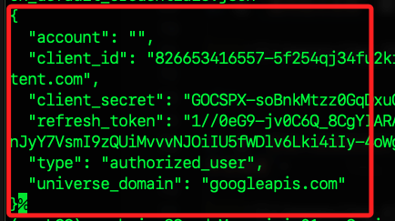

# REST API 模型調整

_參考 [官方說明](https://ai.google.dev/gemini-api/docs/model-tuning/rest?hl=zh-tw)_


_使用 `curl 指令` 或 `Python 代碼` 調整 `Gemini API` 的 `文字生成模型`。_

<br>

## 說明

1. 前一小節是使用 `Python 客戶端 SDK` 來進行模型調整，接下來將使用 `REST API` 和 `curl` 指令進行模型調整，依據服務的規定同樣須為專案設定 `OAuth`，模型部分同樣是使用 `gemini-1.0-pro-001`，因為這是目前僅有提供調整功能的模型。

<br>

2. 設定了 `OAuth` 後將使用 `gcloud` 和 `REST API` 進行身份驗證，同時也支持 `Python` 代碼進行。

<br>

## 設定和驗證

1. `Gemini API` 可基於自己的數據來調整模型，由於這涉及個人的資料，因此 `存取權控管機制` 比 `API 金鑰` 更嚴格，關於 `OAuth` 設定可以參考 [官方說明](https://ai.google.dev/gemini-api/docs/oauth?hl=zh-tw) 或前一小節筆記；以下筆記中會使用 `gcloud 指令` 將 `client_secret.json` 文件轉換為可用來驗證的憑證。

<br>

2. 將前一小節所下載的密鑰文件 `client_secret.json` 複製到當前腳本所在路徑，並在 `.gitignore` 中添加該 JSON 文件名稱，特別注意要使用相同的專案進行後續設置。

    ```json
    client_secret.json
    ```

<br>

## 通過 Google Cloud 進行驗證

1. 執行以下腳本，會自動開啟瀏覽器進入驗證程序。

    ```python
    import os

    # 該文件已儲存在目前目錄
    client_secret_file = 'client_secret.json'
    # 檢查
    if not os.path.exists(client_secret_file):
        raise FileNotFoundError(
            f"client_secret.json 文件不在路徑中：{client_secret_file}"
        )
    # 執行 gcloud 登入
    os.system(
        f"gcloud auth application-default login --client-id-file={client_secret_file} --scopes='https://www.googleapis.com/auth/cloud-platform,https://www.googleapis.com/auth/generative-language.tuning'"
    )
    ```

<br>

2. 指定的 Google 帳號後（此處跳過這個畫面），顯示以下畫面後，點擊 `繼續`。

    

<br>

3. 在 `存取的範圍` 中選擇 `全選`，接著點擊 `繼續`。

    

<br>

4. 瀏覽器會顯示已經通過驗證，可關閉瀏覽器。

    

<br>

5. 終端機中會顯示以下訊息，其中 `Credentials` 在本機上的儲存路徑。

    ```bash
    Credentials saved to file: [/Users/samhsiao/.config/gcloud/application_default_credentials.json]

    These credentials will be used by any library that requests Application Default Credentials (ADC).
    ```

<br>

6. 可在終端機中查看路徑中的 `Credentials` 文件。

    ```bash
    # 查看檔案是否存在
    ls ~/.config/gcloud/application_default_credentials.json
    # 查看文件內容
    cat ~/.config/gcloud/application_default_credentials.json
    ```

<br>

7. 可確認憑證與已儲存的 `client_secret.json` 文件內容是一致的。

    

<br>

## 透過自動化腳本進行驗證

1. 以下是一個自動化 Python 腳本，根據 `client_secret.json` 文件產生用於 `OAuth 認證` 的 `gcloud 指令`；該腳本會自動產生 `code_verifier` 和 `code_challenge`，並插入到 `gcloud` 命令中。

    ```python
    import base64
    import hashlib
    import os
    import json


    def generate_code_verifier(length=64):
        """ 產生一個隨機的 code_verifier"""
        if length < 43 or length > 128:
            raise ValueError("code_verifier 長度必須在 43 至 128 位元組之間")
        code_verifier = (
            base64.urlsafe_b64encode(os.urandom(length)).decode("utf-8").rstrip("=")
        )
        return code_verifier


    def generate_code_challenge(code_verifier):
        """使用 SHA-256 對 code_verifier 進行哈希，然後進行 Base64 URL 安全編碼"""
        code_challenge = (
            base64.urlsafe_b64encode(hashlib.sha256(code_verifier.encode("utf-8")).digest())
            .decode("utf-8")
            .rstrip("=")
        )
        return code_challenge


    # 讀取 client_secret.json 文件
    with open("client_secret.json", "r") as file:
        client_info = json.load(file)

    # 獲取 client_id
    client_id = client_info["installed"]["client_id"]

    # 生成 code_verifier 和 code_challenge
    code_verifier = generate_code_verifier()
    code_challenge = generate_code_challenge(code_verifier)

    '''
    指令說明：
    1. client_id：從 JSON 檔案中獲取。
    2. scope：指定權限範圍，包括存取 `Google Cloud Platform` 和 `產生語言模型` 的權限。
    3. state：這是一個防止 CSRF 攻擊的安全碼，可以使用任意字串作為值，例如 12345。
    4. access_type：設定為 `offline`，以便在沒有使用者互動的情況下取得刷新令牌。
    5. code_challenge：這是用於 PKCE 的程式碼挑戰，需要使用 `SHA256` 編碼生成，可以使用任意字串，例如 abcde12345。實際情況下需要用正確的值替換。
    6. code_challenge_method：設定為 S256，這是 PKCE 的標準方。
    7. redirect_uri：從您的 JSON 檔案中獲取，即 http://localhost。
    '''

    # 生成 gcloud 命令
    gcloud_command = (
        f'gcloud auth application-default login --remote-bootstrap="https://accounts.google.com/o/oauth2/auth'
        f"?response_type=code"
        f"&client_id={client_id}"
        f"&scope=https://www.googleapis.com/auth/cloud-platform+https://www.googleapis.com/auth/generative-language.tuning"
        f"&state=12345"
        f"&access_type=offline"
        f"&code_challenge={code_challenge}"
        f"&code_challenge_method=S256"
        f"&redirect_uri=http://localhost"
        f'&token_usage=remote"'
    )

    # 輸出 gcloud 命令
    # print("Generated gcloud command:")
    print(gcloud_command)
    ```

<br>

2. 執行後生成終端機指令，進行複製。

    

<br>

1. 複製上一個步驟輸出的指令做全選複製，再貼到終端機中運行，會顯示安全提示，輸入 `Y`。

    

<br>

_以下步驟與前一個方法相同_

<br>

4. 選擇帳號。

    

<br>

5. 點擊 `繼續`。

    

<br>

6. 選取 `全選` 後 `繼續`。

    

<br>

7. 瀏覽器會顯示已經通過驗證，可關閉瀏覽器。

    

<br>

## 檢查當前設定的專案

1. 檢查 gcloud 當前使用的專案，這個命令會返回當前配置的專案 ID。

    ```bash
    gcloud config get-value project
    ```

<br>

2. 假如顯示的專案並不正確。

    

<br>

3. 透過指令切換專案。

    ```bash
    gcloud config set project myproject-20240622
    ```

<br>

4. 再次檢查，其中 `[myproject0621]` 是 `當前 gcloud CLI 使用的配置名稱`，而 `myproject-20240622` 是 `Google Cloud 專案 ID`。

    

<br>

5. 查看所有的 gcloud 配置。

    ```bash
    gcloud config configurations list
    ```

    

<br>

## 設定配額

1. 手動指定配額專案，以確保使用的專案是正確的。

    ```bash
    gcloud auth application-default set-quota-project myproject-20240622
    ```

<br>

2. 顯示專案 `[myproject-20240622]` 未啟用 `API [cloudresourcemanager.googleapis.com]`，輸入 `Y` 啟用。

    

<br>

3. 確認 `憑證 Credentials` 文件中的專案 ID 無誤。

    ```bash
    cat ~/.config/gcloud/application_default_credentials.json
    ```

    

<br>

6. 若要刪除憑證文件進行重設，可透過 `rm` 指令。

    ```bash
    rm ~/.config/gcloud/application_default_credentials.json
    ```

<br>

7. 重新授權後可再次查看。

    ```bash
    gcloud auth application-default login
    ```

<br>

8. 檢查當前使用的憑證和授權狀態。

    ```bash
    gcloud auth list
    ```

    

<br>

9. 確保在 `myproject-20240622` 專案中已啟用需要的 API。

    ```bash
    gcloud services enable generativelanguage.googleapis.com --project=myproject-20240622
    ```

<br>

## 返回終端機並再次授權

1. 回到終端機中，會看到生成一個 `gcloud` 指令，可複製貼在終端機中運行，除非使用的電腦沒有瀏覽器，否則不需要保留參數 `--no-browser`。

    ```bash
    gcloud auth application-default login
    ```

<br>

2. 會再次開啟瀏覽器，選擇所要使用的 Google 帳號，接著點擊 `繼續`。

    

<br>

4. 接著點擊 `允許`。

    

<br>

5. 瀏覽器會顯示已經通過驗證，可關閉瀏覽器。

    

<br>

6. 回到終端機中，可以看到幾項資訊，包含憑證儲存位置、憑證可應用被請求、配額專案已新增至 `ADC` 等。

    ```bash
    Credentials saved to file: [/Users/samhsiao/.config/gcloud/application_default_credentials.json]

    These credentials will be used by any library that requests Application Default Credentials (ADC).

    Quota project "myproject-20240622" was added to ADC which can be used by Google client libraries for billing and quota. Note that some services may still bill the project owning the resource.
    ```

<br>

## 檢查驗證狀態

1. 完成後，執行指令確認完成認證，並獲得可用於訪問 Google Cloud 服務與資源的 `令牌 access token`。

    ```bash
    gcloud auth application-default print-access-token
    ```

<br>

2. 同樣可查看憑證。

    ```bash
    cat ~/.config/gcloud/application_default_credentials.json
    ```

<br>

## 手動設置環境變數

_設定環境變數給 REST API 調用使用_

<br>

1. 將 `access_token` 設置為環境變數。

    ```bash
    export access_token=$(gcloud auth application-default print-access-token)
    ```

<br>

2. 替換 Google Cloud 項目 ID，如此 API 會將請求發送到指定的項目中，`<project-id>` 可在 JSON 文件中找到。

    ```bash
    export project_id=<替換 project-id>
    # 在本範例中是
    export project_id=myproject-20240622
    ```

<br>

3. 設置 `base_url` 為 `https://generativelanguage.googleapis.com`，這樣可確保所有的 `API` 請求都會發送到這個 `URL`。

    ```bash
    export base_url=https://generativelanguage.googleapis.com
    ```

<br>

4. 透過 `printenv` 或 `export -p` 指令查詢當前所有的環境變數設定。

    

<br>

5. 若要查詢指定的環境變數設定值，可在 `printenv` 指令後加入環境變數鍵名稱。

    ```bash
    printenv base_url
    ```

    

<br>

## 使用腳本設置環境變數

_特別注意，透過 `export` 所設定的環境變數是臨時性的，在所運行的終端機中有效，所以此時在腳本的筆記本中運行查詢將會無效。_

<br>

1. 透過以下腳本可完成如同前述的環境變數設置。

    ```python
    import os
    import json

    # 讀取 client_secret.json 文件，並提取 project_id
    with open('client_secret.json', 'r') as file:
        data = json.load(file)
        project_id = data['installed']['project_id']

    # 獲取訪問令牌
    access_token = !gcloud auth application-default print-access-token
    access_token = '\n'.join(access_token)

    # 設置環境變數
    os.environ['access_token'] = access_token
    os.environ['project_id'] = project_id
    os.environ['base_url'] = "https://generativelanguage.googleapis.com"

    # 驗證設置是否成功
    print("Access Token:", os.environ['access_token'])
    print("Project ID:", os.environ['project_id'])
    print("Base URL:", os.environ['base_url'])
    ```

<br>

2. 可得到正確的環境變數。

    

<br>

## 獲取模型資訊

1. 若有授權問題，可再次執行 `OAuth 2.0 授權流程` 來獲取 `access_toke`。

    ```bash
    gcloud auth application-default login
    ```

<br>

2. 從 `Google Cloud` 的 `Generative Language API` 獲取經過調整的模型列表，可藉此確認前面設定的正確性。

    ```bash
    curl -X GET ${base_url}/v1beta/tunedModels \
        -H "Content-Type: application/json" \
        -H "Authorization: Bearer ${access_token}" \
        -H "x-goog-user-project: ${project_id}"
    ```

<br>

2. 會顯示鍵名為 `tunedModels` 的列表，這包含多個調整過的模型，每個模型都有一組詳細的屬性。

    

<br>

## 列出調整過的模型

1. 列出當前可用的調整模型，驗證您的認證設置。

    ```bash
    base_url="https://generativelanguage.googleapis.com"
    access_token="ya29.a0AXooCgvxHiKkC8QP0T
    
    ...（省略中間敏感資訊）

    sWaCgYKAfkSARASFQHGX2Mi3vedmMiUtgURHee9nzyF3A0171"
    project_id="gen-lang-client-0227840303"

    curl -X GET "${base_url}/v1beta/tunedModels" \
        -H "Content-Type: application/json" \
        -H "Authorization: Bearer ${access_token}" \
        -H "x-goog-user-project: ${project_id}"
    ```

<br>

## 建立調整過的模型

1. 創建一個新的調整模型，並提供訓練數據。

    ```bash
    curl -X POST $base_url/v1beta/tunedModels \
        -H 'Content-Type: application/json' \
        -H "Authorization: Bearer ${access_token}" \
        -H "x-goog-user-project: ${project_id}" \
        -d '
        {
            "display_name": "number generator model",
            "base_model": "models/gemini-1.0-pro-001",
            "tuning_task": {
            "hyperparameters": {
                "batch_size": 2,
                "learning_rate": 0.001,
                "epoch_count":5,
            },
            "training_data": {
                "examples": {
                "examples": [
                    {
                        "text_input": "1",
                        "output": "2",
                    },{
                        "text_input": "3",
                        "output": "4",
                    },{
                        "text_input": "-3",
                        "output": "-2",
                    },{
                        "text_input": "twenty two",
                        "output": "twenty three",
                    },{
                        "text_input": "two hundred",
                        "output": "two hundred one",
                    },{
                        "text_input": "ninety nine",
                        "output": "one hundred",
                    },{
                        "text_input": "8",
                        "output": "9",
                    },{
                        "text_input": "-98",
                        "output": "-97",
                    },{
                        "text_input": "1,000",
                        "output": "1,001",
                    },{
                        "text_input": "10,100,000",
                        "output": "10,100,001",
                    },{
                        "text_input": "thirteen",
                        "output": "fourteen",
                    },{
                        "text_input": "eighty",
                        "output": "eighty one",
                    },{
                        "text_input": "one",
                        "output": "two",
                    },{
                        "text_input": "three",
                        "output": "four",
                    },{
                        "text_input": "seven",
                        "output": "eight",
                    }
                ]
                }
            }
            }
        }' | tee tunemodel.json
    ```

<br>

2. 結果顯示，並在資料夾中建立了一個 `tunemodel.json` 模型文件。

    

## 取得調整後模型的狀態

1. 可以通過模型的名稱來檢查模型的狀態，使用 Python 解析 JSON 回應。

    ```python
    import json

    # 解析 JSON 文件
    first_page = json.load(open('tunemodel.json'))
    os.environ['modelname'] = first_page['metadata']['tunedModel']

    print(os.environ['modelname'])
    ```

    _結果_

    ```bash
    tunedModels/number-generator-model-gyw26dhike7r
    ```

<br>

2. 透過指令設置模型。

    ```bash
    export modelname="tunedModels/number-generator-model-gyw26dhike7r"
    ```

<br>

3. 檢查模型狀態，使用 `curl` 命令。

    ```bash
    curl -X GET ${base_url}/v1beta/${modelname} \
        -H 'Content-Type: application/json' \
        -H "Authorization: Bearer ${access_token}" \
        -H "x-goog-user-project: ${project_id}" | grep state
    ```

<br>

4. 顯示 `ACTIVE` 表示已經正常啟動。

    

<br>

## 安裝工具

1. 由於 jq 工具未安裝，建議先安裝該工具來更方便地查看和格式化 JSON 輸出。

    ```bash
    brew install jq
    ```

<br>


_以下未完_

<br>

## 執行推論

1. 當模型調整完成後，可以透過以下腳本使用模型來生成文字進行推論。

```bash
curl -X POST $base_url/v1beta/$modelname:generateContent \
    -H 'Content-Type: application/json' \
    -H "Authorization: Bearer ${access_token}" \
    -H "x-goog-user-project: ${project_id}" \
    -d '{
        "contents": [{
        "parts": [{
            "text": "LXIII"
            }]
        }]
    }' 2> /dev/null
```

<br>

## 檢查模型輸出

檢查生成的文字，並解析回應內容：

```json
{
  "candidates": [
    {
      "content": {
        "parts": [
          {
            "text": "LXIV"
          }
        ],
        "role": "model"
      },
      "finishReason": "STOP",
      "index": 0,
      "safetyRatings": [
        {
          "category": "HARM_CATEGORY_SEXUALLY_EXPLICIT",
          "probability": "NEGLIGIBLE"
        },
        {
          "category": "HARM_CATEGORY_HATE_SPEECH",
          "probability": "NEGLIGIBLE"
        },
        {
          "category": "HARM_CATEGORY_HARASSMENT",
          "probability": "LOW"
        },
        {
          "category": "HARM_CATEGORY_DANGEROUS_CONTENT",
          "probability": "NEGLIGIBLE"
        }
      ]
    }
  ],
  "promptFeedback": {
    "safetyRatings": [
      {
        "category": "HARM_CATEGORY_SEXUALLY_EXPLICIT",
        "probability": "NEGLIGIBLE"
      },
      {
        "category": "HARM_CATEGORY_HATE_SPEECH",
        "prob

ability": "NEGLIGIBLE"
      },
      {
        "category": "HARM_CATEGORY_HARASSMENT",
        "probability": "NEGLIGIBLE"
      },
      {
        "category": "HARM_CATEGORY_DANGEROUS_CONTENT",
        "probability": "NEGLIGIBLE"
      }
    ]
  }
}
```

<br>

## 透過 Python 發送 REST API 請求

您可以使用任何支持 HTTP 請求的庫來調用 REST API。以下是使用 Python `requests` 庫來調用 API 的例子。

## 設定變數

首先設置變數：

```python
import requests
import json

access_token = !gcloud auth application-default print-access-token
access_token = '\n'.join(access_token)

project = '[輸入您的專案 ID]'
base_url = "https://generativelanguage.googleapis.com"
```

<br>

## 列出調整過的模型

列出當前可用的調整模型，驗證您的認證設置：

```python
headers = {
    'Authorization': 'Bearer ' + access_token,
    'Content-Type': 'application/json',
    'x-goog-user-project': project
}

result = requests.get(
    url=f'{base_url}/v1beta/tunedModels',
    headers=headers,
)

print(result.json())
```

## 建立經過調整的模型

與 curl 範例相同，使用 `requests.post` 來傳入數據集：

```python
operation = requests.post(
    url=f'{base_url}/v1beta/tunedModels',
    headers=headers,
    json={
        "display_name": "number generator",
        "base_model": "models/gemini-1.0-pro-001",
        "tuning_task": {
            "hyperparameters": {
                "batch_size": 4,
                "learning_rate": 0.001,
                "epoch_count": 5
            },
            "training_data": {
                "examples": [
                    {"text_input": "1", "output": "2"},
                    {"text_input": "3", "output": "4"},
                    {"text_input": "-3", "output": "-2"},
                    {"text_input": "twenty two", "output": "twenty three"},
                    {"text_input": "two hundred", "output": "two hundred one"},
                    {"text_input": "ninety nine", "output": "one hundred"},
                    {"text_input": "8", "output": "9"},
                    {"text_input": "-98", "output": "-97"},
                    {"text_input": "1,000", "output": "1,001"},
                    {"text_input": "10,100,000", "output": "10,100,001"},
                    {"text_input": "thirteen", "output": "fourteen"},
                    {"text_input": "eighty", "output": "eighty one"},
                    {"text_input": "one", "output": "two"},
                    {"text_input": "three", "output": "four"},
                    {"text_input": "seven", "output": "eight"}
                ]
            }
        }
    }
)

print(operation.json())
```

## 取得調整後模型的狀態

使用調整後的模型名稱來檢查模型的狀態：

```python
name = operation.json()["metadata"]["tunedModel"]

tuned_model = requests.get(
    url=f'{base_url}/v1beta/{name}',
    headers=headers,
)

print(tuned_model.json())
```

以下是每 5 秒檢查一次狀態，直到狀態不再是 `CREATING` 為止：

```python
import time

op_json = operation.json()
response = op_json.get('response')
error = op_json.get('error')

while response is None and error is None:
    time.sleep(5)
    
    operation = requests.get(
        url=f'{base_url}/v1/{op_json["name"]}',
        headers=headers,
    )

    op_json = operation.json()
    response = op_json.get('response')
    error = op_json.get('error')

    percent = op_json['metadata'].get('completedPercent')
    if percent is not None:
        print(f"{percent:.2f}% - {op_json['metadata']['snapshots'][-1]}")
        print()

if error is not None:
    raise Exception(error)
```

## 執行推論

使用調整後的模型進行推論，這裡是使用日文數字進行測試的例子：

```python
m = requests.post(
    url=f'{base_url}/v1beta/{name}:generateContent',
    headers=headers,
    json={
        "contents": [{
            "parts": [{
                "text": "六"
            }]
        }]
    }
)

print(m.json())
```

## 結論

調整模型可以根據不同需求進行個性化設計，增強模型在特定任務上的表現。無論是使用 curl 還是 Python，都可以方便地進行模型調整和推論。

## 後續步驟

如果您想進一步瞭解如何使用 Gemini API 的 Python SDK 進行調整，請參閱相關的快速入門導覽。