# Google Cloud Function

<br>

## 說明

1. `Cloud Function` 是一種 `無伺服器` 運算模型，允許開發者撰寫並執行輕量級的、獨立的小程式片段，這些小程式被稱為 `函數（Function）`。

<br>

2. 這些函數會在特定的事件發生時被觸發執行，例如 `HTTPS 請求`、`資料庫變更`、`Cloud Pub/Sub 消息` 等。

<br>

3. 主要雲端服務提供商如 `Google Cloud`、`AWS`、`Azure` 都支持以 `Python` 編寫的 Cloud Functions，這個範例會使用 `Google Cloud Function API`。

<br>

## 特點

1. 無伺服器：無需自行管理伺服器基礎設施，僅需專注於程式碼邏輯。

2. 事件驅動：函數會在指定事件發生時自動執行。

3. 自動擴展：根據流量需求自動擴展和縮減運算資源。

4. 高效開發：專注於業務邏輯，無需處理伺服器管理和基礎設施維護。

5. 靈活擴展：根據需求自動擴展，無需手動調整資源。

6. 節省成本：按使用量計費，無需長期預付大量資源費用。

<br>

## 用途

1. API 驅動的應用：可以作為 API 端點來處理 HTTP 請求。

2. 後端服務：如數據處理、文件轉換、消息通知等。

3. 事件響應：處理各類事件，如資料庫觸發、檔案上傳等。

4. Webhooks：處理外部系統的 Webhook 回調。

5. 微服務：建立分散的小型服務，負責不同的業務邏輯。

6. 數據處理：如圖片處理、數據轉換和格式化等。

<br>

## 核心概念

_簡單介紹幾個重要的環節，將在後續實作中進行詳解。_

<br>

1. 函數入口：也就是 `Cloud Function` 的主邏輯，對於 `HTTP 觸發器` 來說，通常是一個處理 `HTTP 請求` 的函數。

<br>

2. 事件驅動：函數會根據特定事件被觸發執行，事件來源包括 `HTTP 請求`、`Pub/Sub 消息`、`Cloud Storage 變更` 等。

<br>

3. 環境變數：可以通過 `環境變數` 配置函數運行時所需的參數，如 `API Key`、`資料庫 URL` 等。

<br>

## 開始範例操作

_可使用 `Google Cloud Console` 或 `gcloud CLI` 建立並部署 `Cloud Function`，以下使用 `Console` 建立一個簡單的範例，可回應一個 HTTP 請求並返回指定的字串。_

<br>

## 建立與部署

1. 建立本地資料夾，特別注意，在這個簡單的範例中可不用建立本地的文件，相關範例腳本在 Console 中會自動生成，但基於未來正式流程的建立，這裡還是從這個步驟開始。

    ```bash
    mkdir _exGeminiBot_ && cd _exGeminiBot_
    ```

<br>

2. 編輯 `requirements.txt`，用於編輯需要安裝的套件。

    ```json
    # 目前先保留空的
    ```

<br>

3. 編寫主腳本 `main.py`：這個範例是一個可訪問的 HTTP。

    ```python
    def hello_world(request):
        return '你好，這是我測試 Cloud Function 的函數。'
    ```

<br>

## 登錄 Google Cloud Console

1. 前往 [Google Cloud Console](https://console.cloud.google.com/)。

<br>

2. 選擇或建立一個新的 `Google Cloud 專案`。

<br>

3. 搜尋並啟用 `Cloud Functions API`。

    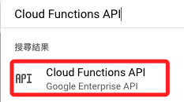

<br>

4. 進入 `Cloud Functions` 後點擊 `建立函式`。

    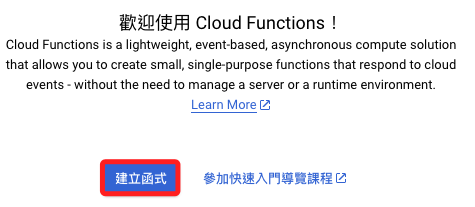

<br>

## 進行 Cloud Function 基本設定

1. `環境` 選擇官方推薦的 `第 2 代`，特別注意 `第 2 代` 是基於 `Cloud Run` 的，所以與 `Cloud Run` 共享資源配額和限制，其餘對於兩代差異的說明彙整如下表。

    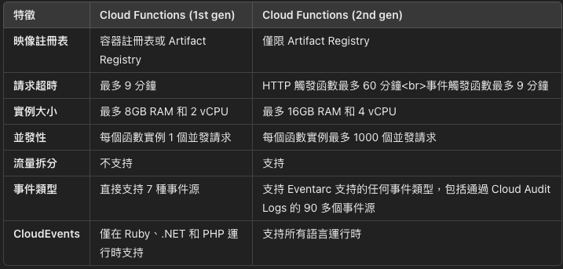

<br>

2. 函數名稱可自己定義，這裡示範填入 `my_hello_world`，特別注意這個並非是腳本中的函數名稱，而是 `Cloud Function` 的名稱。

    

<br>

3. 區域選擇基本上以靠近的區域為佳，按規則說明只能建立在專案設定時的區域，但實務上似乎不會出錯，所以這裡設定為台灣 `asia-east1`。

    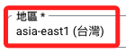

<br>

4. 觸發器選擇 `HTTPS`。

    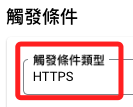

<br>

5. 當前僅進行測試，所以選取 `允許未經身份驗證的叫用要求`。

    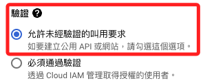

<br>

6. 下方還有 `環境變數` 的設置，這裡先略過，進入 `下一步`。

    

<br>

## 程式碼頁面

1. 執行階段 `Run Time` 選擇對應的 `Python` 版本如 `Python 3.11`。

    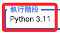

<br>

2. 接著先使用雲端編輯器，所以在 `原始碼` 部分選擇 `內嵌編輯器`，此時下方會依據選擇環境出現兩個預設的腳本 `main.py`、`requirements.txt`。

    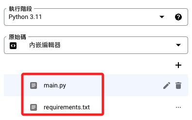

<br>

3. 如果有相關的套件則需對 `requirements.txt` 進行編輯。

<br>

4. 為了實測環境的設置，接著對 `main.py` 略作修改，將預設的函數名稱修改為 `hello_world`，接著在上方 `進入點` 中填入這個更改過的函數名，預設是 `hello_http`，務必記得修改。

    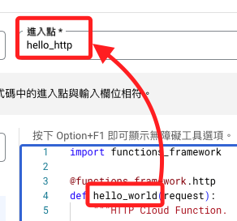

<br>

5. 腳本內容就依據官方範例，返回值部分可以稍做修改以利觀察。

    ```python
    import functions_framework

    @functions_framework.http
    def hello_world(request):
        """HTTP Cloud Function.
        Args:
            request (flask.Request): The request object.
            <https://flask.palletsprojects.com/en/1.1.x/api/#incoming-request-data>
        Returns:
            The response text, or any set of values that can be turned into a
            Response object using `make_response`
            <https://flask.palletsprojects.com/en/1.1.x/api/#flask.make_response>.
        """
        request_json = request.get_json(silent=True)
        request_args = request.args

        if request_json and 'name' in request_json:
            name = request_json['name']
        elif request_args and 'name' in request_args:
            name = request_args['name']
        else:
            name = 'World'
        return '我是小柱， {} 你好!'.format(name)
    ```

<br>

6. 部署前可先進行測試，點擊 `開始測試`。

    

<br>

7. 點擊 `授權`。

    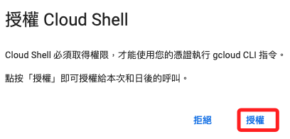

<br>

8. 環境建置完成會顯示 `Function is ready to test`，點擊 `執行測試` 會顯示預期中的結果，也就是返回字串。

    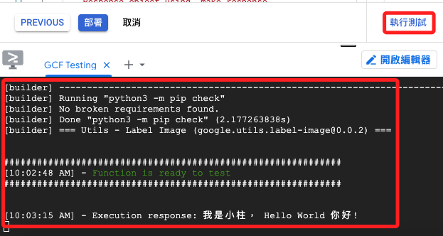

<br>

## 部署 Cloud Function

1. 點擊 `Deploy` 來部署函數。

    

<br>

2. 部署過成功，右上方的鬧鐘圖標會顯示紅色並且圍繞環狀進度條。

    

<br>

3. 完成時，複製左上方的網址進行訪問。

    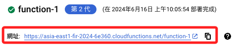

<br>

4. 每次刷新網頁就會觸發這個函數並返回值。

    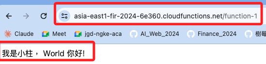

<br>

## 特別注意

1. 確保定期檢查和管理已部署的 Cloud Functions，避免產生不必要的費用。

2. 可以刪除不再使用的函數，避免浪費資源。

<br>

___

_END_