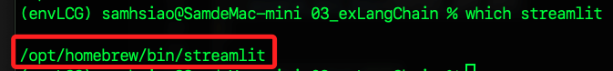

# 結合 LangChain

<br>

## 說明

1. 以下使用 `Streamlit`、`LangChain` 和 `Google Gemini API` 製作一個文本生成應用的完整範例。

<br>

2. 本範例使用模型為 `gemini-pro`，透過腳本，用戶可輸入文本並獲得來自 `Google Gemini` 的生成回應。

<br>

## 安裝所需套件

1. 使用全新虛擬環境 `envLCG`。

    ```bash
    python -m venv envLCG
    ```

<br>

2. 使用以下命令安裝必要的庫，特別注意，套件 `tenacity` 的當前版本與 `langchain-core` 存在衝突，所以指定較低的版本。

    ```bash
    pip install streamlit langchain-google-genai langchain-core tenacity==8.3.0
    ```

<br>

## 關於 Streamlit 全局安裝所引發的錯誤

_在某些教程中會引導將 Streamlit 安裝在全局環境中，導致於在虛擬環境中會出現衝突。_

<br>

1. 檢查 `streamlit` 安裝路徑，可能發現 `Streamlit` 路徑並非在當前的虛擬環境 `envLCG` 中，這可能會導致後續運行的失敗，這是一個常見的狀況，所以要進行修正。

    ```bash
    which streamlit
    ```

    

<br>

2. 由於當前 `Streamlit` 是由 `Homebrew` 所管理，更新先更新 `brew` 以繼續後續指令。

    ```bash
    brew update
    ```

<br>

3. 嘗試透過 `brew` 解除安裝 `Streamlit`。

    ```bash
    brew uninstall streamlit
    ```

<br>

4. 若無法解除，使用前面 `which` 查詢的路徑進行強制刪除。

    ```bash
    sudo rm -rf /opt/homebrew/bin/streamlit
    ```

<br>

5. 再次查詢確認。

    

<br>

_回到專案中_

<br>

## 配置環境變數

_這個範例因為使用了 Streamlit，所以使用相同套件來管理敏感資訊_

<br>

1. 建立資料夾及密鑰腳本。

    ```bash
    mkdir .streamlit && touch .streamlit/secrets.toml
    ```

<br>

2. 將 `Google Gemini API` 金鑰寫入文件中。

    ```bash
    GEMINI_API_KEY = "<填入自己的 API Key>"
    ```

<br>

## Streamlit 應用

1. 建立 `app.py`。

    ```python
    # app.py
    import streamlit as st
    from langchain_google_genai import ChatGoogleGenerativeAI
    from langchain_core.messages import HumanMessage


    # Google Gemini API 金鑰
    GEMINI_API_KEY = st.secrets["GEMINI_API_KEY"]
    # 檢查是否存在
    if GEMINI_API_KEY is None:
        st.error("環境變數 GEMINI_API_KEY 未設置，請檢查 .env 文件。")
        st.stop()

    # 使用模型
    model_name = "gemini-pro"
    # 建立模型
    model = ChatGoogleGenerativeAI(
        model=model_name,
        google_api_key=GEMINI_API_KEY
    )

    # 設置 Streamlit 標題
    st.title("Gemini API 文本生成器")

    # 建立文本輸入框讓用戶輸入問題
    user_input = st.text_input("請輸入你的問題：")

    # 當用戶點擊 `生成` 按鈕時執行的操作
    if st.button("生成"):
        if not user_input:
            st.warning("請輸入一些文本。")
        else:
            try:
                # 依據用戶輸入，建立 HumanMessage 實體
                message = HumanMessage(content=user_input)
                # 傳入 `HumanMessage 實體`，並使用模型生成回應文本
                response = model.stream([message])
                # 建立一個空的 Streamlit 元件，以便後續更新輸出
                output_placeholder = st.empty()
                generated_text = ""

                # 使用流式方式逐步顯示生成的文本
                for chunk in response:
                    generated_text += chunk.content
                    output_placeholder.text(generated_text)

                # 顯示成功信息，指示文本生成完成
                st.success("文本生成已完成。")

            except Exception as e:
                st.error(f"發生錯誤： {str(e)}")
    ```

<br>

2. 運行。

    ```bash
    streamlit run app.py
    ```

<br>

3. 透過瀏覽器訪問 `http://localhost:8501`，並輸入查詢文字。

    

<br>

4. 流式輸出完成後會顯示。

    

<br>

___

_END_