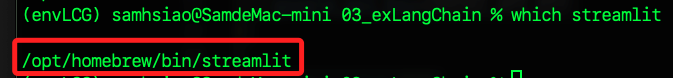
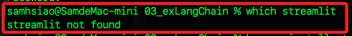

# 關於 Streamlit 全局安裝所引發的錯誤

_在某些教程中會引導將 Streamlit 安裝在全局環境中，導致於在虛擬環境中會出現衝突。_

<br>

## 說明

1. 檢查 `streamlit` 安裝路徑，可能發現 `Streamlit` 路徑並非在當前的虛擬環境 `envLCG` 中，這可能會導致後續運行的失敗，這是一個常見的狀況，所以要進行修正。

    ```bash
    which streamlit
    ```

    

<br>

2. 由於當前 `Streamlit` 是由 `Homebrew` 所管理，更新先更新 `brew` 以繼續後續指令。

    ```bash
    brew update
    ```

<br>

3. 嘗試透過 `brew` 解除安裝 `Streamlit`。

    ```bash
    brew uninstall streamlit
    ```

<br>

4. 若無法解除，使用前面 `which` 查詢的路徑進行強制刪除。

    ```bash
    sudo rm -rf /opt/homebrew/bin/streamlit
    ```

<br>

5. 再次查詢確認。

    

<br>

___

_END_
