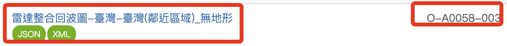
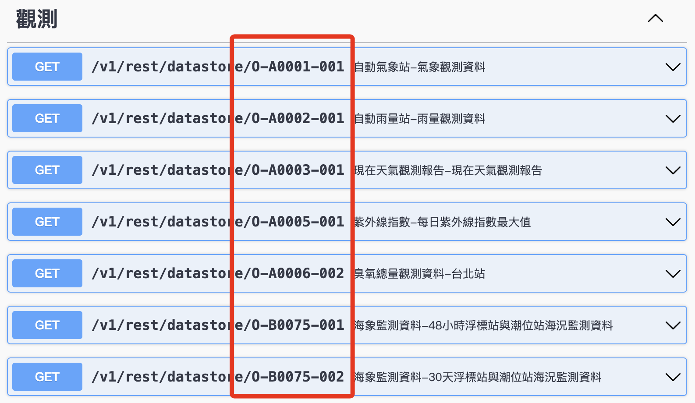
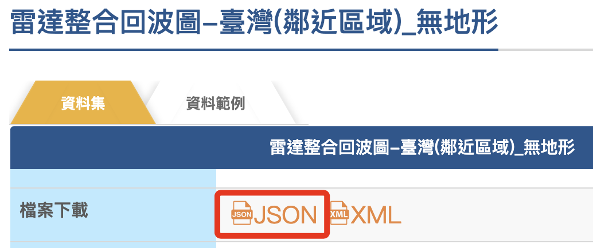
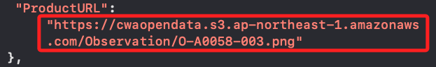
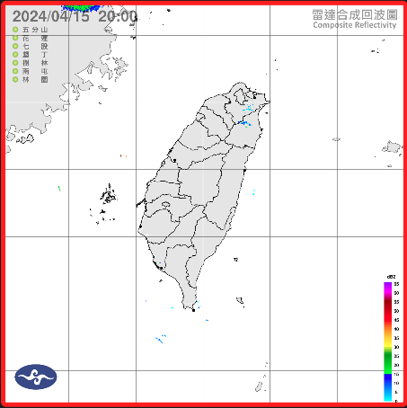
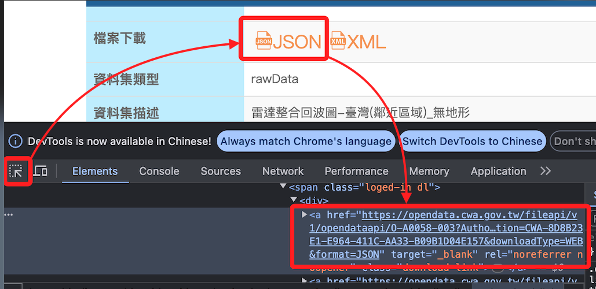
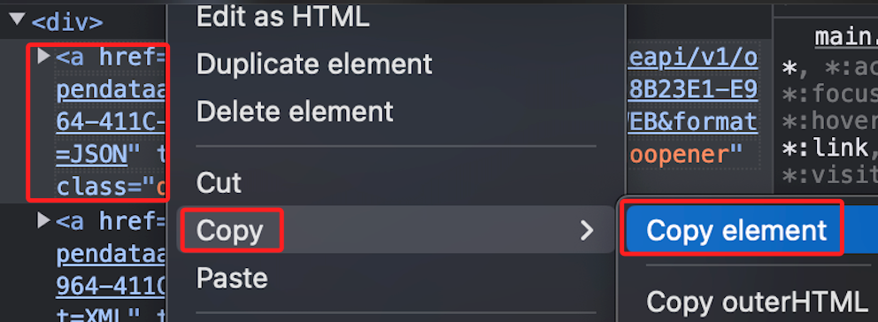
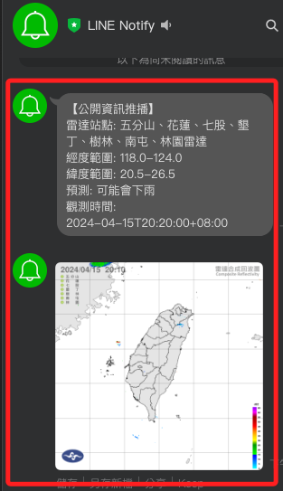

# 雷達整合回波圖

_再示範氣象資訊中的雷達整合回波圖_

<br>

## 說明

1. 雷達整合回波圖的資料編號是 `O-A0058-003`。

    

<br>

2. 這次在文件中並無該項目。

    

<br>

3. 點擊 JSON 會自動進行下載。

    

<br>

4. 裡面僅有 `PNG` 圖檔的連結。

    

<br>

5. 將連結複製下來並透過瀏覽器查看。

    ```python
    https://cwaopendata.s3.ap-northeast-1.amazonaws.com/Observation/O-A0058-003.png
    ```

<br>

6. 會自動下載這張圖片。

    

<br>

7. 透過 Chrome 的 `F12` 觀察 `JSON` 的文本。

    

<br>

8. 點擊右鍵可以進行複製。

    

<br>

9. 貼上連結備用。

    ```python
    url = 'https://opendata.cwa.gov.tw/fileapi/v1/opendataapi/O-A0058-003?Authorization=<這是個人的 API 授權碼>&amp;downloadType=WEB&amp;format=JSON'
    ```

<br>

10. 完整腳本。

    ```python
    import requests
    import os
    from dotenv import load_dotenv
    load_dotenv()

    WEATHER_API_TOKEN = os.getenv('WEATHER_API_TOKEN')
    LINE_NOTIFY_TOKEN = os.getenv('LINE_NOTIFY_TOKEN')

    # 使用 API endpoint 以及授權
    url = f"https://opendata.cwa.gov.tw/fileapi/v1/opendataapi/O-A0058-003?Authorization={WEATHER_API_TOKEN}&downloadType=WEB&format=JSON"

    # 透過 API 取得資料
    response = requests.get(url)
    data_json = response.json()

    # 取出主要節點
    radar_data = data_json["cwaopendata"]["dataset"]

    # 取出資料
    radar_desc = radar_data["datasetInfo"]["parameterSet"]["parameter"]["radarName"]
    lon_range = radar_data["datasetInfo"]["parameterSet"]["LongitudeRange"]
    lat_range = radar_data["datasetInfo"]["parameterSet"]["LatitudeRange"]
    image_url = radar_data["resource"]["ProductURL"]
    radar_time = radar_data["DateTime"]

    # 可在這裡實作一個基於雷達影像分析的簡單降雨預測邏輯。
    # 例如，可能會推斷密集的雷達回波表明正在下雨。
    # 這裡暫時不加入判斷的代碼，僅預設訊息為「可能會下雨」
    rain_prediction = "可能會下雨"

    # 組合訊息：注意 f-string 內若有縮排，訊息也會縮排
    msg = f"\n\
    雷達站點: {radar_desc}\n\
    經度範圍: {lon_range}\n\
    緯度範圍: {lat_range}\n\
    預測: {rain_prediction}\n\
    觀測時間: {radar_time}"

    # LINE Notify token
    token = LINE_NOTIFY_TOKEN
    # LINE Notify Authorization header
    headers = {"Authorization": "Bearer " + token}
    payload = {
        # 訊息
        "message": msg,
        # 縮圖
        "imageThumbnail": image_url,
        # 完整圖
        "imageFullsize": image_url,
    }

    # 發送通知
    notify_response = requests.post(
        "https://notify-api.line.me/api/notify",
        headers=headers,
        data=payload
    )

    # 輸出結果
    print(
        notify_response.status_code,
        notify_response.text
    )

    ```

<br>

## 結果

1. 成果圖。

    

<br>

___

_END_