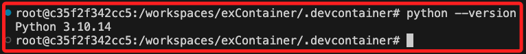

# Dockerfile

_接續前步驟所完成的容器，以下展示透過自動化腳本重建容器的步驟 。_

<br>

## 步驟

<br>

1. 在資料夾 `.devcontainer` 中手動新增文件 `Dockerfile`， _無副檔名_ 。

   

<br>

2. 依照指示安裝 Docker 到容器中。

   

<br>

3. 編輯文件 `Dockerfile`，這裡要觀察變化，所以將版本號改為 `3.10-bullseye`。

   ```dockerfile
   # 使用指定映像
   FROM python:3.10-bullseye

   # 安裝必要庫
   RUN apt-get update && apt-get install -y git zsh && rm -rf /var/lib/apt/lists/*
   ```

<br>

4. 關於 Docker 說明文件及相關映像的版本號，可以參考 [Docker Hub](https://hub.docker.com/) 的官方版本，進入後搜尋 `python`。

   

<br>

5. 找到對應的版本，點擊進入後檔案內容很多，也可以使用這個版本來建立，但非常耗時，尤其在建立 Codespace 的時候，所以這裡省略。

   

<br>

6. 修改配置文件 `devcontainer.json` ，依據新的版本號修改 `name`，將 `image` 註解起來，並添加 `build` 設置來指向 `Dockerfile`。

   ```json
    {
        "name": "Python 3.10.14",
        //"image": "mcr.microsoft.com/devcontainers/python:1-3.12-bullseye",
        "build": {
            "dockerfile": "Dockerfile"
        },
        "postCreateCommand": "pip install --upgrade pip"
    }
   ```

<br>

7. 再次重建 `Rebuild`，順利完成表示以上設置都正確，依照指示按下 `ENTER`。

   

<br>

8. 透過查詢版本確認變更。

    

<br>

___

_以上完成透過 Dockerfile 安裝容器 。_
