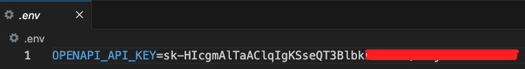

# 專案說明

_來源的部分先省略，之後再補上，這裡先說我的解析_。

<br>

## 專案介紹

1. 此專案利用現代 NLP 工具和圖形資料庫技術來建立高互動性的應用程序，它不僅提供了豐富的用戶互動方式，同時也利用了 `LLM` 的強大語言理解能力來提升信息檢索和數據解釋的效率。 

2. 這個專案的主要設計概念是結合 `Streamlit` 和 `Langchain` 來實現一個互動式的對話式界面，這個界面可以通過 `OpenAI` 的語言模型 `LLM` 與 `Neo4j` 圖形資料庫進行互動，以提供基於圖數據的問答和數據視覺化。

<br>

## 使用套件說明

1. Streamlit：在這個專案中，`Streamlit` 用作應用程序的前端和用戶界面，允許用戶通過網頁與系統互動。
   
2. Langchain：用於快速建立和部署數據驅動的 Web 應用程序，這是一個用於結合語言模型與外部資料來源的 Python 庫。在這個專案中，`Langchain` 用來整合 OpenAI 的 `GPT-4` 模型與 Neo4j 圖形資料庫，實現智能的問答系統。
   
3. Neo4j：一個高性能的圖形資料庫，支持儲存複雜的網絡結構的數據，這個專案中使用 Neo4j 來儲存和管理圖形數據，並通過查詢語言 `Cypher` 來檢索相關信息。
   
4. Graphviz：用於生成和呈現圖形結構的工具，這在專案中用於將圖形數據視覺化，以便於用戶理解數據之間的關聯和結構。

<br>

## 相關錯誤排除

_關於範例腳本運行時出現的錯誤，以下進行排除紀錄_

<br>

1. 更新套件

    ```bash
    pip install -U langchain-openai
    ```

<br>

2. 更新導入庫。

    ```python
    # from langchain.chat_models import ChatOpenAI
    from langchain_openai import ChatOpenAI
    # from langchain.graphs import Neo4jGraph
    from langchain_community.graphs import Neo4jGraph
    ```

<br>

3. 在容器中安裝套件。

    ```bash
    sudo apt-get update && sudo apt-get install curl telnet -y
    ```

<br>

4. 測試。

    ```bash
    telnet demo.neo4jlabs.com 7687
    ```

<br>

## 關於 `graphviz` 安裝

1. 指令。

    ```bash
    pip install graphviz && brew install graphviz
    ```

<br>

2. 當在 Python 中使用 `graphviz` 庫時，實際上需要調用  `graphviz`  的系統級二進制文件來執行操作。因此，除了在 Python 虛擬環境中安裝 `graphviz` Python 庫，仍然需要在系統層面安裝其相應的二進制文件和庫，以確保所有功能都可以正常工作，特別注意，這並不代表可以省去在虛擬環境安裝套件。

<br>


## 步驟記錄

_包含了容器的重建_

1. 因為使用容器，所以不用建立或指定虛擬環境，建立專案資料夾並啟動 VSCode。
```bash
cd ~/Desktop && mkdir neo4jBot && cd neo4jBot && code .
```

2. 在當前路徑中建立容器資料夾，並建立`開發容器配置文件`，檔名為 `devcontainer.json`，這是用來配置 VSCode 中的開發容器環境所用，進階用戶可參考使用 `Dockerfile` 進行環境建置。
```bash
mkdir .devcontainer && touch .devcontainer/devcontainer.json
```

3. 關於使用 `映像檔案`、`Dockerfiles` 或 `Docker Compose` 安裝的相關技術可參考 [ Dev Container 官方說明](https://containers.dev/guide/dockerfile)。


4. 編輯 `devcontainer.json` 內容如下。
```json
{
  "name": "Python 3",
  "image": "mcr.microsoft.com/devcontainers/python:1-3.11-bullseye",
  "customizations": {
    "codespaces": {
      "openFiles": ["README.md", "src/app.py"]
    },
    "vscode": {
      "settings": {},
      "extensions": ["ms-python.python", "ms-python.vscode-pylance"]
    }
  },
  "updateContentCommand": "[ -f packages.txt ] && sudo apt update && sudo apt upgrade -y && sudo xargs apt install -y <packages.txt; [ -f requirements.txt ] && pip3 install --user -r requirements.txt; pip3 install --user streamlit; echo '✅ Packages installed and Requirements met'",
  "postAttachCommand": {
    "server": "streamlit run src/app.py --server.enableCORS false --server.enableXsrfProtection false"
  },
  "portsAttributes": {
    "7687": {
      "label": "Neo4j Bolt Port",
      "onAutoForward": "ignore"
    },
    "8501": {
      "label": "Streamlit Application",
      "onAutoForward": "openPreview"
    }
  },
  "forwardPorts": [8501, 7687]
}
```

5. 建立套件統籌文件 `requirements.txt`。
```bash
touch requirements.txt
```

6. 加入以下套件。
```bash
streamlit==1.26.0
openai
langchain
langchain-openai
neo4j
graphviz==0.20.1
pydantic==2.3.0
python-dotenv
```

7. 建立 .env 文件，並寫入 OpenAI 的 API Key。
```bash
touch .env
```


8. 點擊 `在容器中重新開啟`，這時便會啟動容器的建立。


___


_END_

