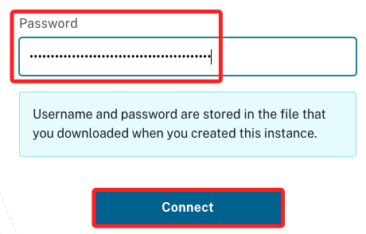
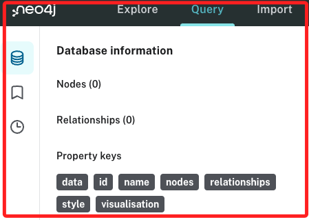

# Neo4j


<br>

## 說明

1. 在 Streamlit 部落格中有篇文章寫到這個應用，請參考 [文章](https://blog.streamlit.io/building-a-streamlit-and-scikit-learn-app-with-chatgpt/) 。

<br>

2. Neo4j [官方資料庫](https://demo.neo4jlabs.com:7473/browser/)。

<br>

3. 從 [官網首頁](https://neo4j.com/) 可以登入 `Aura Login`。

    

<br>

## 步驟

1. 進入 [官網](https://neo4j.com/cloud/platform/aura-graph-database/?ref=blog.streamlit.io) 並點擊 `Start Free`。

    

<br>

2. 使用 Google。

    

<br>

3. 同意。

    

<br>

4. 免費。

    

<br>

5. 下載憑證。

    

<br>

6. 內容如下。

    

<br>

7. 選擇身份。

    

<br>

8. 等候一陣子。

    

<br>

9. 完成時點擊 `Open`。

    

<br>

10. 點擊 `Accept`。

    

<br>

11. 在前面 `下載憑證` 的步驟時有取得 `USERNAME` 以及 `PASSWORD`，在欄位中填入密碼，然後點擊 `Connect`。

    

<br>

12. 接下來是引導教學 `Guides`，點擊右下角的 `Continue with blank database`。

    

<br>

13. 完成以上步驟會見到以下畫面。

    

<br>

14. 安裝庫。

    ```bash
    pip install neo4j streamlit
    ```

<br>

15. 這裡安裝的版本是 `5.20.0`。

    

<br>

16. 建立並進入專案資料夾後啟動 VSCode。

    ```bash
    makir _exNeo4j_ && cd _exNeo4j_ && code .
    ```

<br>

17. 建立一個腳本 `utility.py`，並編輯代碼如下。

    ```python
    from neo4j import GraphDatabase


    # 連接到 Neo4j 資料庫
    def get_neo4j_session(uri, user, password):
        driver = GraphDatabase.driver(uri, auth=(user, password))
        return driver.session()


    # 載入電影數據
    def load_movie_data(session):
        query = "MATCH (m:Movie) RETURN m.title AS title, m.released AS released LIMIT 10"
        result = session.run(query)
        movies = [
            {
                "title": record["title"],
                "released": record["released"]
            } for record in result
        ]
        return movies

    ```

<br>

18. 建立主腳本 `app.py`。

    ```python
    import streamlit as st
    from utility import get_neo4j_session, load_movie_data

    # 資料庫連接資訊
    URI = "neo4j+s://<db_id>.databases.neo4j.io"
    USER = "neo4j"
    PASSWORD = "your_password"


    # Streamlit 主函數
    def main():
        st.title("Neo4j Movie Data")

        # 連接到資料庫
        session = get_neo4j_session(URI, USER, PASSWORD)

        # 載入數據
        movies = load_movie_data(session)

        # 顯示數據
        if movies:
            for movie in movies:
                st.write(f"Title: {movie['title']}, Released: {movie['released']}")
        else:
            st.write("No data found.")

        # 關閉數據庫對話
        session.close()


    if __name__ == "__main__":
        main()

    ```

<br>

## 處理敏感資訊

1. 安裝 `python-dotenv`。

    ```bash
    pip install python-dotenv
    ```

<br>

2. 在專案資料夾內建立一個 `.env` 文件。

    ```bash
    touch .env
    ```

<br>

3. 依據下載的憑證，填寫 `.env` 文件。

    ```json
    NEO4J_URI=neo4j+s://<db_id>.databases.neo4j.io
    NEO4J_USER=neo4j
    NEO4J_PASSWORD=your_password
    ```
    _如下_
    

<br>

4. 修改主腳本 `app.py` 載入 `.env` 文件。

    ```python
    import streamlit as st
    from utility import get_neo4j_session, load_movie_data
    # 載入 dotenv
    from dotenv import load_dotenv
    import os

    # 載入環境變數
    load_dotenv()

    # 資料庫連接資訊
    URI = os.getenv("NEO4J_URI")
    USER = os.getenv("NEO4J_USER")
    PASSWORD = os.getenv("NEO4J_PASSWORD")


    # Streamlit 主函數
    def main():
        st.title("Neo4j Movie Data")

        # 連接到資料庫
        session = get_neo4j_session(URI, USER, PASSWORD)

        # 載入數據
        movies = load_movie_data(session)

        # 顯示數據
        if movies:
            for movie in movies:
                st.write(f"Title: {movie['title']}, Released: {movie['released']}")
        else:
            st.write("No data found.")

        # 關閉數據庫對話
        session.close()


    if __name__ == "__main__":
        main()

    ```

<br>

5. 目前資料庫中並未有實質取得，所以先建立一個模擬數據的腳本。
    ```python
    '''模擬數據'''
    from neo4j import GraphDatabase
    import os
    from dotenv import load_dotenv

    # 載入環境變數
    load_dotenv()

    # 取得環境變數
    URI = os.getenv("NEO4J_URI")
    USER = os.getenv("NEO4J_USER")
    PASSWORD = os.getenv("NEO4J_PASSWORD")

    # 連接到 Neo4j 數據庫
    driver = GraphDatabase.driver(URI, auth=(USER, PASSWORD))


    def create_movies(session):
        # 創建電影數據
        create_query = """
        CREATE (a:Movie {title: 'The Matrix', released: 1999}),
            (b:Movie {title: 'The Matrix Reloaded', released: 2003}),
            (c:Movie {title: 'The Matrix Revolutions', released: 2003}),
            (d:Movie {title: 'John Wick', released: 2014}),
            (e:Movie {title: 'John Wick: Chapter 2', released: 2017})
        """
        session.run(create_query)
        print("Movies created in the database.")


    # 執行建立電影數據庫的操作
    with driver.session() as session:
        create_movies(session)

    # 關閉資料庫連接
    driver.close()
    ```

<br>

6. 運行腳本後可寫入模擬數據。

    

<br>

7. 透過網頁連線資料庫可瀏覽內容。

    

<br>

8. 運行主腳本。

    ```bash
    streamlit run app.py
    ```

<br>

9. 會自動開啟瀏覽器。

    

<br>

___

_END_