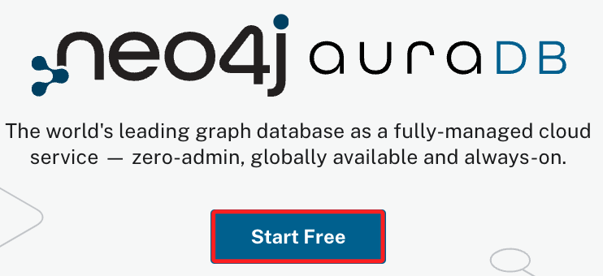
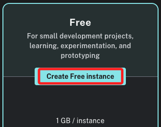
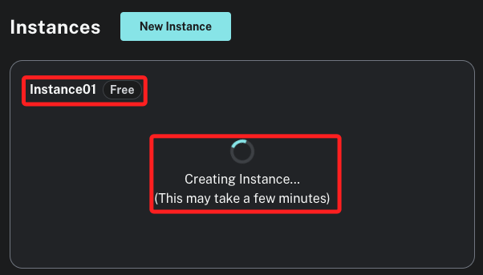

# Neo4j


<br>

## 說明

1. 在 Streamlit 部落格中的 [文章](https://blog.streamlit.io/building-a-streamlit-and-scikit-learn-app-with-chatgpt/) 介紹了豐富的應用，並引導如何兼容使用 `Streamlit`、`scikit-learn` 與 `ChatGPT` 。

    

<br>

2. 這篇筆記會示範如何建立一個簡單的 `Streamlit` 應用，並訪問 `Neo4j` 資料庫進行讀寫。

<br>

3. 若要建立結合了 `Streamlit`、`neo4j` 與 `OpenAI` 的範例，也可參考 [簡易範例](https://github.com/neo4j-graph-examples/movies?tab=readme-ov-file)，或參考 [完整範例](https://github.com/tomasonjo/streamlit-neo4j-hackathon) 獲取相關說明。

<br>

4. 關於資料庫的部分，可先從 [Neo4j 官網首頁](https://neo4j.com/) 點擊 `Aura Login` 進行登入。

    

<br>

5. 關於 Neo4j 資料庫的連線測試可使用 [ Neo4j官方資系統](https://demo.neo4jlabs.com:7473/browser/) 進行。

<br>

## 步驟

_以下介紹詳細的操作步驟_

<br>

1. 進入 [官網](https://neo4j.com/cloud/platform/aura-graph-database/?ref=blog.streamlit.io) 並點擊 `Start Free`。

    

<br>

2. 使用 Google 建立帳號即可。

    

<br>

3. 同意隱私條款 `I agree`。

    

<br>

4. 點擊 `New Instance` 再次建立新的實體。

    

<br>

5. 點擊建立免費的實體 `Create Free instance`。

    

<br>

6. 下載憑證檔案到本地電腦上 `Download and continue`，每次建立新的實體都會有新的憑證。

    

<br>

7. 內容如下，之後在腳本或是連線時都會需要用到。

    

<br>

8. 選擇身份，這裡示範是 `新手菜鳥`。

    

<br>

9. 建立的過程需要等候一小時間，切勿關閉視窗。

    

<br>

10. 完成時點擊 `Open`。

    

<br>

11. 點擊 `Accept`。

    

<br>

12. 在前面 `下載憑證` 的步驟時有取得 `USERNAME` 以及 `PASSWORD`，在欄位中填入其中的 `PASSWORD`，然後點擊 `Connect`。

    

<br>

13. 接下來是引導教學 `Guides`，點擊右下角的 `Continue with blank database` 跳過這個步驟。

    

<br>

14. 完成以上步驟會見到以下的資料庫畫面。

    

_以上完成註冊與建立實體的基本程序_

<br>

## 本機操作

1. 在虛擬環境統籌管理的資料夾內建立新的虛擬環境。

    ```bash
    python -m venv envNeo4j
    ```

<br>

2. 建立並進入專案資料夾，這裡示範建立在桌面。

    ```bash
    cd ~/Desktop && mkdir exST01 && cd exST01
    ```

<br>

3. 安裝相關庫。

    ```bash
    pip install neo4j streamlit
    ```

<br>
   
4. 若要批次安裝，可使用以下指令將 `requirements.txt` 文件內的套件一次安裝。

    ```bash
    pip install -r requirements.txt
    ```
    
    _文件內容_
    
    ```bash
    # 後補
    ...
    ```

<br>

5. 安裝完成會顯示版本 `5.20.0`。

    

<br>
   
6. 或透過指令查詢安裝版本。

    ```bash
    pip show neo4j
    ```

    

<br>

7. 在專案資料夾中啟動 VSCode。

    ```bash
    code .
    ```

<br>

8. 建立一個腳本 `utility.py`，並編輯代碼如下。

    ```bash
    touch utility.py
    ```

    _腳本內容_
    ```python
    from neo4j import GraphDatabase


    # 連接到 Neo4j 資料庫
    def get_neo4j_session(uri, user, password):
        driver = GraphDatabase.driver(uri, auth=(user, password))
        return driver.session()


    # 載入電影數據
    def load_movie_data(session):
        query = "MATCH (m:Movie) RETURN m.title AS title, m.released AS released LIMIT 10"
        result = session.run(query)
        movies = [
            {
                "title": record["title"],
                "released": record["released"]
            } for record in result
        ]
        return movies

    ```

<br>

9. 建立主腳本 `app.py`，其中 URI、USER、PASSWORD 需要使用自己憑證內的資訊，關於這些敏感資訊將在下一個步驟說明建立方式。

    
    
    _腳本內容_
    ```python
    import streamlit as st
    from utility import get_neo4j_session, load_movie_data

    # 資料庫連接資訊
    URI = "neo4j+s://<db_id>.databases.neo4j.io"
    USER = "neo4j"
    PASSWORD = "your_password"


    # Streamlit 主函數
    def main():
        st.title("Neo4j Movie Data")

        # 連接到資料庫
        session = get_neo4j_session(URI, USER, PASSWORD)

        # 載入數據
        movies = load_movie_data(session)

        # 顯示數據
        if movies:
            for movie in movies:
                st.write(f"Title: {movie['title']}, Released: {movie['released']}")
        else:
            st.write("No data found.")

        # 關閉資料庫對話
        session.close()


    if __name__ == "__main__":
        main()

    ```

<br>

## 處理敏感資訊

_緊接著上一個步驟來處理_

<br>

1. 安裝 `python-dotenv`。

    ```bash
    pip install python-dotenv
    ```

<br>

2. 在專案資料夾內建立一個 `.env` 文件。

    ```bash
    touch .env
    ```

<br>

3. 依據下載的憑證，填寫 `.env` 文件。

    ```json
    NEO4J_URI=neo4j+s://<db_id>.databases.neo4j.io
    NEO4J_USERNAME=neo4j
    NEO4J_PASSWORD=your_password
    ```
    
    _如下_
    
    

<br>

4. 修改主腳本 `app.py` 載入 `.env` 文件。

    ```python
    import streamlit as st
    from utility import get_neo4j_session, load_movie_data
    # 載入 dotenv
    from dotenv import load_dotenv
    import os

    # 載入環境變數
    load_dotenv()

    # 資料庫連接資訊
    URI = os.getenv("NEO4J_URI")
    USER = os.getenv("NEO4J_USERNAME")
    PASSWORD = os.getenv("NEO4J_PASSWORD")


    # Streamlit 主函數
    def main():
        st.title("Neo4j Movie Data")

        # 連接到資料庫
        session = get_neo4j_session(URI, USER, PASSWORD)

        # 載入數據
        movies = load_movie_data(session)

        # 顯示數據
        if movies:
            for movie in movies:
                st.write(f"Title: {movie['title']}, Released: {movie['released']}")
        else:
            st.write("No data found.")

        # 關閉資料庫對話
        session.close()


    if __name__ == "__main__":
        main()

    ```

<br>

5. 目前資料庫中並未有實質取得，所以先在腳本中建立模擬數據並寫入資料庫。
    ```python
    '''模擬數據'''
    from neo4j import GraphDatabase
    import os
    from dotenv import load_dotenv

    # 載入環境變數
    load_dotenv()

    # 取得環境變數
    URI = os.getenv("NEO4J_URI")
    USER = os.getenv("NEO4J_USER")
    PASSWORD = os.getenv("NEO4J_PASSWORD")

    # 連接到 Neo4j 資料庫
    driver = GraphDatabase.driver(URI, auth=(USER, PASSWORD))


    def create_movies(session):
        # 建立電影數據
        create_query = """
        CREATE (a:Movie {title: 'The Matrix', released: 1999}),
            (b:Movie {title: 'The Matrix Reloaded', released: 2003}),
            (c:Movie {title: 'The Matrix Revolutions', released: 2003}),
            (d:Movie {title: 'John Wick', released: 2014}),
            (e:Movie {title: 'John Wick: Chapter 2', released: 2017})
        """
        session.run(create_query)
        print("Movies created in the database.")


    # 執行建立電影資料庫的操作
    with driver.session() as session:
        create_movies(session)

    # 關閉資料庫連接
    driver.close()
    ```

<br>

6. 運行腳本後可寫入模擬數據。

    

<br>

7. 透過網頁連線資料庫可瀏覽內容。

    

<br>

8. 運行主腳本。

    ```bash
    streamlit run app.py
    ```

<br>

9. 會自動開啟瀏覽器。

    

<br>

___

_END_