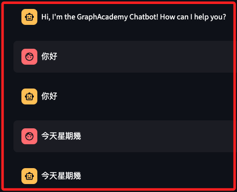
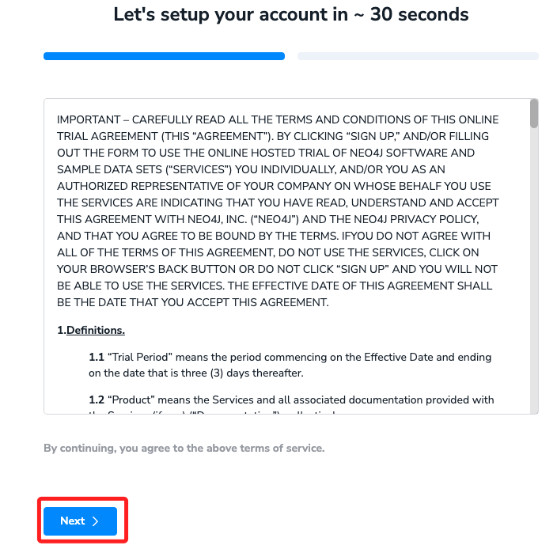
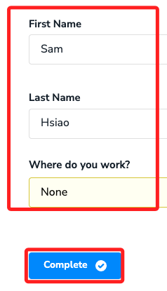
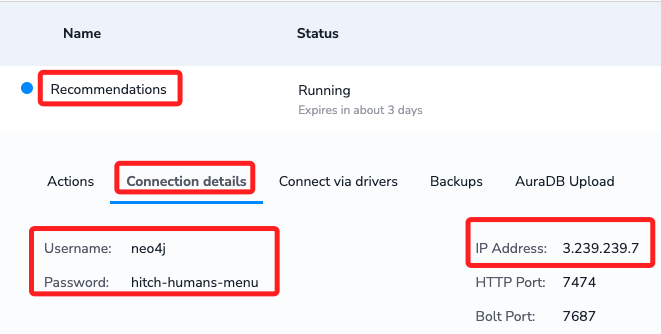

# Bot

<br>

## 說明

1. 範例的 [教程網址](https://graphacademy.neo4j.com/courses/llm-chatbot-python/1-project-setup/)。

    

<br>

2. 可參考 [GitHub](https://github.com/neo4j-graphacademy/llm-chatbot-python?tab=readme-ov-file)。

<br>

## 步驟

1. 因為 `Langchain` 模組不支援 `Python 3.12` 以上版本，所以要查詢並確認當前環境的版本號可用。

    ```bash
    python --version
    ```

<br>

2. 建立虛擬環境。

    ```bash
    python -m venv envllmChatBot
    ```

<br>

3. 修改環境參數

    ```bash
    sudo nano ~/.zshrc
    ```

<br>

4. 加入，然後儲存 `control+o`、退出 `control+x`

    ```bash
    source /Users/samhsiao/Documents/PythonVenv/envllmChatBot/bin/activate
    ```

<br>

5. 啟動虛擬環境。

    ```bash
    source ~/.zshrc
    ```

<br>

6. 進入要存放的路徑中，這裡示範存放在桌面，然後下載 git，並進入下載的資料夾。

    ```bash
    cd ~/Desktop && git clone https://github.com/neo4j-graphacademy/llm-chatbot-python && cd llm-chatbot-python
    ```

<br>

7. 透過指令安裝套件。

    ```bash
    pip install -r requirements.txt
    ```

<br>

8. 另外安裝一個套件，因為沒安裝在後面會出現錯誤。

    ```bash
    pip install langchainhub
    ```

<br>

9. 如指示更新就照做。

    ```bash
    pip install --upgrade pip
    ```

<br>

10. 嘗試運行主腳本 `bot.py`。

    ```bash
    streamlit run bot.py
    ```

<br>

11. 當前的機器人只會回應相同訊息。

    

<br>

12. 退出運行 `control+c` 並開啟 VSCode。

    ```bash
    code . && streamlit run bot.py
    ```

<br>

## 建立 LLM 實體

1. 進入 [OpenAI 官網]( platform.openai.com) 取得 API Key，這裡先跳過。

<br>

2. 在本地運行，所以使用 `.env`，儲存 `OPENAI_API_KEY` 及 `OPENAI_MODEL`，先運行 `gpt-3.5-turbo` 試試，或是換作 `GPT-4` 試試。

    ```bash
    touch .env .gitignore
    ```

<br>

3. 編輯 `.gitignore`。

    ```json
    __pycache__
    # 之後若部署在 Streamlit 服務器上會使用到
    .streamlit/secrets.toml
    .env
    .DS_Store
    ```

<br>

4. 在 `.env` 寫入敏感資訊，其中 `OPENAI_MODEL` 查詢官網。

    ```json
    OPENAI_API_KEY=sk-...
    OPENAI_MODEL=gpt-4-turbo
    ```

<br>

5. 安裝套件。

    ```bash
    pip install python-dotenv
    ```

<br>

6. 改寫官方的 `llm.py`。

    ```python
    from langchain_openai import ChatOpenAI
    from langchain_openai import OpenAIEmbeddings
    # 環境變數
    import os
    from dotenv import load_dotenv
    #
    load_dotenv()

    # 取得環境變數
    OPENAI_API_KEY = os.getenv("OPENAI_API_KEY")
    OPENAI_MODEL = os.getenv("OPENAI_MODEL")

    # 建立 ChatOpenAI 實體
    llm = ChatOpenAI(
        openai_api_key=OPENAI_API_KEY,
        model=OPENAI_MODEL,
    )

    # OpenAIEmbeddings 是用來生成和處理嵌入向量（embeddings）
    # 這些嵌入向量是從使用 OpenAI 模型（如 GPT-4）生成的文本中獲取的
    embeddings = OpenAIEmbeddings(openai_api_key=OPENAI_API_KEY)

    ```

<br>

7. 建立 [Neo4j Sandbox](https://sandbox.neo4j.com/onboarding)。

    

<br>

8. 輸入一些基本資訊。

    

<br>

9. 展開可查看訊息，這與教程寫的一樣。

    ```bash
    # Connection URL
    3.239.239.7
    # Username
    neo4j
    # Password
    hitch-humans-menu
    ```

    

<br>

10. 修改 `.env` 文件，將 Sandbox 資訊寫入。

    ```bash
    OPENAI_API_KEY=sk-...
    OPENAI_MODEL=gpt-4-turbo

    NEO4J_URI = "bolt://3.239.239.7:7687"
    NEO4J_USERNAME = "neo4j"
    NEO4J_PASSWORD = "hitch-humans-menu"
    ```

<br>

11. 接著編輯 `graph.py`。

    ```bash
    from langchain_community.graphs import Neo4jGraph
    # dotenv
    import os
    from dotenv import load_dotenv
    # 環境參數
    load_dotenv()

    # 取得環境變數
    NEO4J_URI = os.getenv("NEO4J_URI")
    NEO4J_USERNAME = os.getenv("NEO4J_USERNAME")
    NEO4J_PASSWORD = os.getenv("NEO4J_PASSWORD")

    # Neo4j Graph
    graph = Neo4jGraph(
        url=NEO4J_URI,
        username=NEO4J_USERNAME,
        password=NEO4J_PASSWORD,
    )

    ```

<br>

12. 接著編輯 `agent.py`。

    ```python
    # agent.py
    from langchain.tools import Tool
    from langchain.agents import AgentExecutor, create_react_agent
    from langchain import hub
    from langchain.chains.conversation.memory import ConversationBufferWindowMemory
    from solutions.llm import llm
    from solutions.tools.vector import kg_qa
    from solutions.tools.finetuned import cypher_qa

    # tools 的列表定義了其他狀況發生時的設定
    tools = [
        Tool.from_function(
            name="General Chat",
            description="For general chat not covered by other tools",
            func=llm.invoke,
            return_direct=True,
        ),
        Tool.from_function(
            name="Cypher QA",
            description="Provide info about movies questions using Cypher",
            func=cypher_qa,
            return_direct=True,
        ),
        Tool.from_function(
            name="Vector Search Index",
            description="Provides info about movie plots using Vector Search",
            func=kg_qa,
            return_direct=True,
        ),
    ]

    # 調用 langchain 函數 ConversationBufferWindowMemory
    memory = ConversationBufferWindowMemory(
        memory_key="chat_history",
        k=5,
        return_messages=True,
    )

    # 調用 langchain 函數 hub.pull() 生成
    agent_prompt = hub.pull("hwchase17/react-chat")
    # 調用 langchain 函數 create_react_agent，傳入 `llm`、`tools`、`Agent 的回應`
    agent = create_react_agent(llm, tools, agent_prompt)
    agent_executor = AgentExecutor(
        agent=agent, tools=tools, memory=memory, verbose=True
    )

    # 這是原本的函數，改寫添加了判斷的機制
    # def generate_response(prompt):
    #     response = agent_executor.invoke({"input": prompt})
    #     return response["output"]


    def generate_response(prompt):
        try:
            # 回應
            response = agent_executor.invoke({"input": prompt})
            #
            if isinstance(response['output'], dict):
                print('=agent.py -> 備註：回應是一個 dict=')
                response_output = ''
                for item in response['output']:
                    if response_output:
                        response_output += ', '
                    response_output += str(item)
            else:
                # 回應訊息
                print('=agent.py -> 備註：回應訊息=')
                response_output = str(response['output'])
            return response_output
        except Exception as e:
            print('=agent.py -> 備註：回應發生錯誤=')
            return f"Error processing response: {str(e)}"

    ```

<br>

13. 改寫 `vector.py`。

    ```python
    # vector.py
    from langchain_community.vectorstores.neo4j_vector import Neo4jVector
    from langchain.chains import RetrievalQA
    from solutions.llm import llm, embeddings
    #
    import os
    from dotenv import load_dotenv
    #
    load_dotenv()

    #
    NEO4J_URI = os.getenv("NEO4J_URI")
    NEO4J_USERNAME = os.getenv("NEO4J_USERNAME")
    NEO4J_PASSWORD = os.getenv("NEO4J_PASSWORD")


    neo4jvector = Neo4jVector.from_existing_index(
        embeddings,                 # <1>
        url=NEO4J_URI,              # <2>
        username=NEO4J_USERNAME,    # <3>
        password=NEO4J_PASSWORD,    # <4>
        index_name="moviePlots",    # <5>
        node_label="Movie",         # <6>
        text_node_property="plot",  # <7>
        embedding_node_property="plotEmbedding",  # <8>
        retrieval_query="""
        RETURN
            node.plot AS text,
            score,
            {
                title: node.title,
                directors: [ (person)-[:DIRECTED]->(node) | person.name ],
                actors: [ (person)-[r:ACTED_IN]->(node) | [person.name, r.role] ],
                tmdbId: node.tmdbId,
                source: 'https://www.themoviedb.org/movie/'+ node.tmdbId
            } AS metadata
        """,
    )

    retriever = neo4jvector.as_retriever()

    kg_qa = RetrievalQA.from_chain_type(
        llm,  # <1>
        chain_type="stuff",  # <2>
        retriever=retriever,  # <3>
    )

    ```

<br>

## 補充其他尚未修正的腳本

1. **cypher.py**

    ```python
    # cypher.py
    from langchain.chains import GraphCypherQAChain

    from llm import llm
    from graph import graph

    cypher_qa = GraphCypherQAChain.from_llm(
        llm,            # <1>
        graph=graph,    # <2>
    )
    ```

<br>

2. **fewshot.py**

    ```python
    # fewshot.py
    from langchain.chains import GraphCypherQAChain
    from langchain.prompts.prompt import PromptTemplate
    from solutions.llm import llm
    from solutions.graph import graph

    CYPHER_GENERATION_TEMPLATE = """
    You are an expert Neo4j Developer translating user questions into Cypher to
    answer questions about movies and provide recommendations.
    Convert the user's question based on the schema.

    Use only the provided relationship types and properties in the schema.
    Do not use any other relationship types or properties that are not provided.

    Fine Tuning:

    For movie titles that begin with "The", move "the" to the end.
    For example "The 39 Steps" becomes "39 Steps,
    The" or "the matrix" becomes "Matrix, The".

    Example Cypher Statements:

    1. How to find how many degrees of separation there are between two people:
    '''
    MATCH path = shortestPath(
    (p1:Person {{name: "Actor 1"}})-[:ACTED_IN|DIRECTED*]-
    (p2:Person {{name: "Actor 2"}})
    )
    WITH path, p1, p2, relationships(path) AS rels
    RETURN
    p1 {{ .name, .born, link:'https://www.themoviedb.org/person/'+ p1.tmdbId }}
    AS start,
    p2 {{ .name, .born, link:'https://www.themoviedb.org/person/'+ p2.tmdbId }}
    AS end,
    reduce(output = '', i in range(0, length(path)-1) |
        output + CASE
        WHEN i = 0 THEN
        startNode(rels[i]).name + CASE WHEN type(rels[i]) = 'ACTED_IN' THEN '
        played '+ rels[i].role +' in 'ELSE ' directed ' END +
        endNode(rels[i]).title
        ELSE
            ' with '+ startNode(rels[i]).name + ', who '+ CASE WHEN type(rels[i]) =
            'ACTED_IN' THEN 'played '+ rels[i].role +' in '
        ELSE 'directed '
        END + endNode(rels[i]).title
        END
    ) AS pathBetweenPeople
    '''

    Schema:
    {schema}

    Question:
    {question}
    """
    cypher_prompt = PromptTemplate.from_template(CYPHER_GENERATION_TEMPLATE)


    cypher_qa = GraphCypherQAChain.from_llm(
        llm, graph=graph, verbose=True, cypher_prompt=cypher_prompt
    )
    ```

<br>

3. **finetuned.py**

    ```python
    # finetuned.py
    from langchain.chains import GraphCypherQAChain
    from langchain.prompts.prompt import PromptTemplate
    from solutions.llm import llm
    from solutions.graph import graph

    CYPHER_GENERATION_TEMPLATE = """
    You are an expert Neo4j Developer translating user questions into
    Cypher to answer questions about movies and provide recommendations.
    Convert the user's question based on the schema.

    Use only the provided relationship types and properties in the schema.
    Do not use any other relationship types or properties that are not provided.

    Fine Tuning:

    For movie titles that begin with "The", move "the" to the end.
    For example "The 39 Steps" becomes "39 Steps,
    The" or "the matrix" becomes "Matrix, The".


    Schema:
    {schema}

    Question:
    {question}

    Cypher Query:
    """
    cypher_prompt = PromptTemplate.from_template(CYPHER_GENERATION_TEMPLATE)
    cypher_qa = GraphCypherQAChain.from_llm(
        llm,
        graph=graph,
        verbose=True,
        cypher_prompt=cypher_prompt
    )

    ```

<br>

4. **general.py**

    ```python
    # general.py
    from langchain.tools import Tool
    from solutions import llm

    tools = [
        Tool.from_function(
            name="General Chat",
            description="For general chat not covered by other tools",
            func=llm.invoke,
            return_direct=True
        )
    ]
    ```

<br>

5. **prompts.py**

    ```python
    # from langchain.prompts.prompt import PromptTemplate
    # from langchain.prompts.chat import (
    #     ChatPromptTemplate,
    #     SystemMessagePromptTemplate,
    #     HumanMessagePromptTemplate,
    # )

    # from langchain.chains import GraphCypherQAChain


    # from langchain.chains.graph_qa.prompts import {
    #   CYPHER_GENERATION_PROMPT, CYPHER_QA_PROMPT
    # }

    FEWSHOT_CYPHER_GENERATION_TEMPLATE = """
    You are an expert Neo4j Developer translating user questions
    into Cypher to answer questions about movies and provide recommendations.
    Convert the user's question based on the schema.
    For movie titles that begin with "The", move "the" to the end,
    For example "The 39 Steps" becomes "39 Steps,
    The" or "the matrix" becomes "Matrix, The".

    If no context is returned, do not attempt to answer the question.

    Use only the provided relationship types and properties in the schema.
    Do not use any other relationship types or properties that are not provided.

    Schema:
    {schema}

    Examples:

    Find movies and their genres:
    MATCH (m:Movie)-[:IN_GENRE]->(g)
    WHERE m.title = "Goodfellas"
    RETURN m.title AS title, collect(g.name) AS genres

    Recommend a movie by actor:
    MATCH (subject:Person)-[:ACTED_IN|DIRECTED]->(m)<-[:ACTED_IN|DIRECTED]-(p),
    (p)-[role:ACTED_IN|DIRECTED]->(m2)
    WHERE subject.name = "Al Pacino"
    RETURN
    m2.title AS recommendation,
    collect([ p.name, type(role) ]) AS peopleInCommon,
    [ (m)-[:IN_GENRE]->(g)<-[:IN_GENRE]-(m2) | g.name ] AS genresInCommon
    ORDER BY size(incommon) DESC, size(genresInCommon) DESC LIMIT 2

    Note: Do not include any explanations or apologies in your responses.
    Do not respond to any questions that might ask anything else than
    for you to construct a Cypher statement.
    Do not include any text except the generated Cypher statement.

    Use Neo4j 5 Cypher syntax.
    When checking a property is not null, use `IS NOT NULL`.

    Question: {question}
    """
    ```

<br>

6. **scoped.py**

    ```python
    # scoped.py
    from langchain.agents import AgentExecutor, create_react_agent
    from langchain.tools import Tool
    from langchain.chains.conversation.memory import ConversationBufferWindowMemory
    from solutions.llm import llm
    from solutions.tools.vector import kg_qa
    from solutions.tools.finetuned import cypher_qa
    from langchain.prompts import PromptTemplate


    tools = [
        Tool.from_function(
            name="General Chat",
            description="For general chat not covered by other tools",
            func=llm.invoke,
            return_direct=True,
        ),
        Tool.from_function(
            name="Cypher QA",
            description="Provide info about movies questions using Cypher",
            func=cypher_qa,
            return_direct=True,
        ),
        Tool.from_function(
            name="Vector Search Index",
            description="Provides info about movie plots using Vector Search",
            func=kg_qa,
            return_direct=True,
        ),
    ]

    memory = ConversationBufferWindowMemory(
        memory_key="chat_history",
        k=5,
        return_messages=True,
    )


    agent_prompt = PromptTemplate.from_template(
    """
    You are a movie expert providing information about movies.
    Be as helpful as possible and return as much information as possible.
    Do not answer any questions that do not relate to movies, actors or directors.

    Do not answer any questions using your pre-trained knowledge,
    only use the info provided in the context.

    TOOLS:
    ------

    You have access to the following tools:

    {tools}

    To use a tool, please use the following format:

    '''
    Thought: Do I need to use a tool? Yes
    Action: the action to take, should be one of [{tool_names}]
    Action Input: the input to the action
    Observation: the result of the action
    '''

    When you have a response to say to the Human,
    or if you do not need to use a tool, you MUST use the format:

    '''
    Thought: Do I need to use a tool? No
    Final Answer: [your response here]
    '''

    Begin!

    Previous conversation history:
    {chat_history}

    New input: {input}
    {agent_scratchpad}
    """
    )

    agent = create_react_agent(llm, tools, agent_prompt)
    agent_executor = AgentExecutor(
        agent=agent, tools=tools, memory=memory, verbose=True
    )
    ```

<br>

## 部署到 Streamlit 服務器上

_待續_