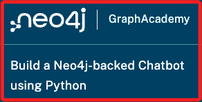

# Bot

_範例的 [教程網址](https://graphacademy.neo4j.com/courses/llm-chatbot-python/1-project-setup/)_



可參考 [GitHub](https://github.com/neo4j-graphacademy/llm-chatbot-python?tab=readme-ov-file)

_待續_

## 步驟

安裝套件。
```bash
pip install streamlit
```

建立第一個腳本 `app.py`，以下內容從教程複製。
```python
import streamlit as st

st.set_page_config(
    page_title="Hello",
    page_icon="👋",
)

st.write("# Welcome to Streamlit! 👋")

st.markdown("""
This component supports **markdown formatting**, which is handy.

[Check out their documentation](https://docs.streamlit.io) for more information on how to get started.
""")
```

運行腳本。
```
streamlit run app.py
```

因為 `Langchain` 模組不支援 `Python 3.12` 以上版本，所以要查詢當前環境的版本號。
```bash
python --version
```

進入要存放的路徑中，這裡示範存放在桌面，然後下載 git，並進入下載的資料夾。
```bash
cd ~/Desktop && git clone https://github.com/neo4j-graphacademy/llm-chatbot-python && cd llm-chatbot-python
```

透過指令安裝套件
```bash
pip install -r requirements.txt
```

嘗試運行主腳本 `bot.py`。
```bash
streamlit run bot.py
```