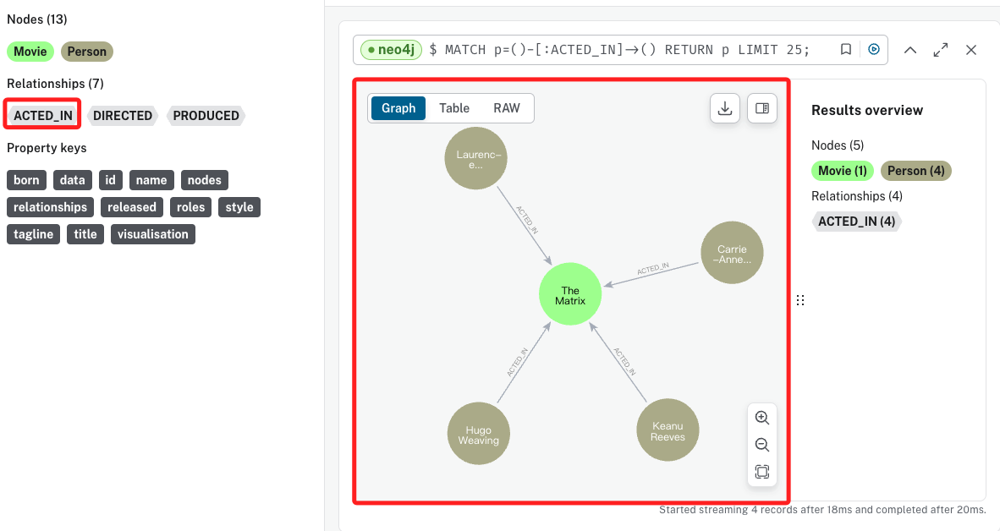
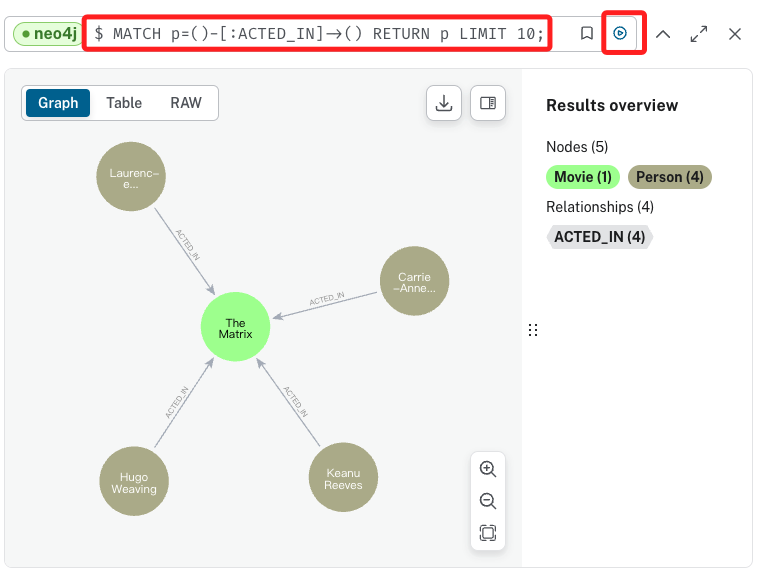

# 自建資料庫

_為了觀察 Neo4j 的特性，以下透過腳本建立一個具有關聯性的資料庫來進行演釋。_

<br>

## 範例

1. 建立腳本 `insert_data.ipynb` 並貼上以下程式碼。

    ```python
    # insert_data.ipynb
    from neo4j import GraphDatabase
    import os
    from dotenv import load_dotenv

    # 載入環境變數
    load_dotenv()

    # 取得環境變數
    URI = os.getenv("NEO4J_URI")
    USER = os.getenv("NEO4J_USERNAME")
    PASSWORD = os.getenv("NEO4J_PASSWORD")

    driver = GraphDatabase.driver(URI, auth=(USER, PASSWORD))


    def create_sample_data():
        """向資料庫中插入範例數據，建立電影和演員節點及其關係"""
        cypher_query = """
        CREATE (TheMatrix:Movie {title:"The Matrix", released:1999, tagline:"Welcome to the Real World"})
        CREATE (Keanu:Person {name:"Keanu Reeves", born:1964})
        CREATE (Carrie:Person {name:"Carrie-Anne Moss", born:1967})
        CREATE (Laurence:Person {name:"Laurence Fishburne", born:1961})
        CREATE (Hugo:Person {name:"Hugo Weaving", born:1960})
        CREATE (LillyW:Person {name:"Lilly Wachowski", born:1967})
        CREATE (LanaW:Person {name:"Lana Wachowski", born:1965})
        CREATE (JoelS:Person {name:"Joel Silver", born:1952})
        CREATE (Keanu)-[:ACTED_IN {roles:["Neo"]}]->(TheMatrix)
        CREATE (Carrie)-[:ACTED_IN {roles:["Trinity"]}]->(TheMatrix)
        CREATE (Laurence)-[:ACTED_IN {roles:["Morpheus"]}]->(TheMatrix)
        CREATE (Hugo)-[:ACTED_IN {roles:["Agent Smith"]}]->(TheMatrix)
        CREATE (LillyW)-[:DIRECTED]->(TheMatrix)
        CREATE (LanaW)-[:DIRECTED]->(TheMatrix)
        CREATE (JoelS)-[:PRODUCED]->(TheMatrix)
        """
        with driver.session() as session:
            session.run(cypher_query)
            print("Sample data created.")


    if __name__ == "__main__":
        create_sample_data()
        driver.close()
    ```

<br>

2. 完成。

    

<br>

3. 在資料庫中進行刷新。

    

<br>

4. 可點擊 `Relationships` 中的標籤進行觀察。

    

<br>

5. 上方欄位中顯示的就是這個操作的語法。

    

<br>

6. 可複製語法貼在新的欄位中，然後點擊右方的運行，這個語法也可在後續的程式碼中進行執行。

    

<br>

___

_END