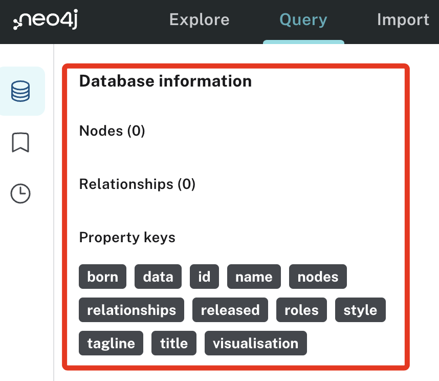

# 清空資料庫

<br>

1. 程式碼。

    ```python
    # clear_data.ipynb
    from neo4j import GraphDatabase
    import os
    from dotenv import load_dotenv

    # 取得環境變數
    URI = os.getenv("NEO4J_URI")
    USER = os.getenv("NEO4J_USERNAME")
    PASSWORD = os.getenv("NEO4J_PASSWORD")

    driver = GraphDatabase.driver(URI, auth=(USER, PASSWORD))

    def clear_data():
        """刪除資料庫中的所有節點與關係"""
        cypher_query = '''
        MATCH (n)
        DETACH DELETE n
        '''
        with driver.session() as session:
            session.run(cypher_query)
            print("All data has been cleared from the database.")

    if __name__ == "__main__":
        clear_data()
        driver.close()
    ```

<br>

2. 運行後去資料庫介面中點擊下方的 `刷新`，可確認資料庫內的資料都刪除了。

    

<br>

___

_END