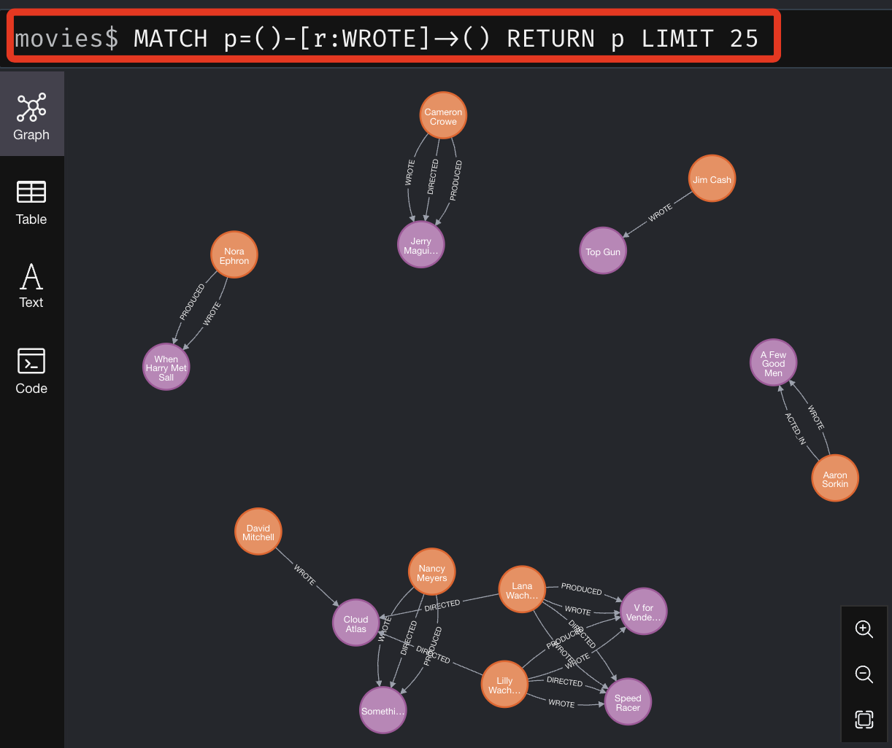
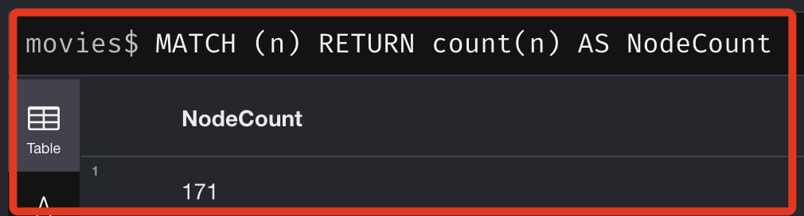

# 官方資料庫

<br>

## 說明

_參考 [官方說明](https://neo4j.com/docs/getting-started/appendix/example-data/) 以及 [官方 GitHub 腳本](https://github.com/neo4j-graph-examples/movies/blob/main/code/python/example.py)_

1. 查詢當前驅動器版本。

    ```bash
    pip show neo4j
    ```

<br>

2. 結果。

    ```bash
    Name: neo4j
    Version: 5.20.0
    Summary: Neo4j Bolt driver for Python
    Home-page: 
    Author: 
    Author-email: "Neo4j, Inc." <drivers@neo4j.com>
    License: Apache License, Version 2.0
    Location: /Users/samhsiao/Documents/PythonVenv/envST/lib/python3.10/site-packages
    Requires: pytz
    Required-by: 
    ```

<br>

## 範例

1. 連接到官方電影資料庫。

    ```python
    from neo4j import GraphDatabase
    import os
    from dotenv import load_dotenv

    # 载入环境变量
    load_dotenv()

    # 官方示例连接信息
    DEMO_URI = "neo4j+s://demo.neo4jlabs.com:7687"
    DEMO_DATABASE = "movies"
    DEMO_USER = "movies"
    DEMO_PASSWORD = "movies"

    # 连接官方数据库
    demo_driver = GraphDatabase.driver(DEMO_URI, auth=(DEMO_USER, DEMO_PASSWORD))

    def fetch_data():
        # 从官方数据库获取数据
        query = """
        MATCH (n) RETURN n LIMIT 25
        """
        try:
            with demo_driver.session(database=DEMO_DATABASE) as session:
                results = session.run(query)
                nodes = [{"type": record["n"].labels, "properties": dict(record["n"].items())} for record in results]
                return nodes
        except Exception as e:
            print(f"An error occurred: {e}")
            return []

    if __name__ == "__main__":
        nodes = fetch_data()
        if nodes:
            print(f"Retrieved {len(nodes)} nodes from the database.")
            # 打印节点信息
            for node in nodes:
                print("Node Type:", node["type"], "| Properties:", node["properties"])
        else:
            print("No nodes retrieved.")

    ```

    _結果_
    ```bash
    Retrieved 25 nodes from the database.
    Node Type: frozenset({'Movie'}) | Properties: {'tagline': 'Welcome to the Real World', 'votes': 5254, 'title': 'The Matrix', 'released': 1999}
    Node Type: frozenset({'Person'}) | Properties: {'born': 1964, 'name': 'Keanu Reeves'}
    Node Type: frozenset({'Person'}) | Properties: {'born': 1967, 'name': 'Carrie-Anne Moss'}
    Node Type: frozenset({'Person'}) | Properties: {'born': 1961, 'name': 'Laurence Fishburne'}
    Node Type: frozenset({'Person'}) | Properties: {'born': 1960, 'name': 'Hugo Weaving'}
    Node Type: frozenset({'Person'}) | Properties: {'born': 1967, 'name': 'Lilly Wachowski'}
    Node Type: frozenset({'Person'}) | Properties: {'born': 1965, 'name': 'Lana Wachowski'}
    Node Type: frozenset({'Person'}) | Properties: {'born': 1952, 'name': 'Joel Silver'}
    Node Type: frozenset({'Person'}) | Properties: {'born': 1978, 'name': 'Emil Eifrem'}
    Node Type: frozenset({'Movie'}) | Properties: {'tagline': 'Free your mind', 'votes': 1537, 'title': 'The Matrix Reloaded', 'released': 2003}
    Node Type: frozenset({'Movie'}) | Properties: {'tagline': 'Everything that has a beginning has an end', 'votes': 1229, 'title': 'The Matrix Revolutions', 'released': 2003}
    Node Type: frozenset({'Movie'}) | Properties: {'tagline': 'Evil has its winning ways', 'votes': 191, 'title': "The Devil's Advocate", 'released': 1997}
    Node Type: frozenset({'Person'}) | Properties: {'born': 1975, 'name': 'Charlize Theron'}
    Node Type: frozenset({'Person'}) | Properties: {'born': 1940, 'name': 'Al Pacino'}
    Node Type: frozenset({'Person'}) | Properties: {'born': 1944, 'name': 'Taylor Hackford'}
    Node Type: frozenset({'Movie'}) | Properties: {'tagline': "In the heart of the nation's capital, in a courthouse of the U.S. government, one man will stop at nothing to keep his honor, and one will stop at nothing to find the truth.", 'votes': 367, 'title': 'A Few Good Men', 'released': 1992}
    Node Type: frozenset({'Person'}) | Properties: {'born': 1962, 'name': 'Tom Cruise'}
    Node Type: frozenset({'Person'}) | Properties: {'born': 1937, 'name': 'Jack Nicholson'}
    Node Type: frozenset({'Person'}) | Properties: {'born': 1962, 'name': 'Demi Moore'}
    Node Type: frozenset({'Person'}) | Properties: {'born': 1958, 'name': 'Kevin Bacon'}
    Node Type: frozenset({'Person'}) | Properties: {'born': 1966, 'name': 'Kiefer Sutherland'}
    Node Type: frozenset({'Person'}) | Properties: {'born': 1971, 'name': 'Noah Wyle'}
    Node Type: frozenset({'Person'}) | Properties: {'born': 1968, 'name': 'Cuba Gooding Jr.'}
    Node Type: frozenset({'Person'}) | Properties: {'born': 1957, 'name': 'Kevin Pollak'}
    Node Type: frozenset({'Person'}) | Properties: {'born': 1943, 'name': 'J.T. Walsh'}
    ```

<br>

2. 讀取官方範例並寫入自己的資料庫。

    ```python
    from neo4j import GraphDatabase
    import os
    from dotenv import load_dotenv

    # 载入环境变量
    load_dotenv()

    # 官方示例连接信息
    DEMO_URI = "neo4j+s://demo.neo4jlabs.com:7687"
    DEMO_DATABASE = "movies"
    DEMO_USER = "movies"
    DEMO_PASSWORD = "movies"

    # 自己的数据库连接信息
    YOUR_URI = os.getenv("NEO4J_URI")
    YOUR_USER = os.getenv("NEO4J_USER")
    YOUR_PASSWORD = os.getenv("NEO4J_PASSWORD")

    # 连接官方数据库
    demo_driver = GraphDatabase.driver(DEMO_URI, auth=(DEMO_USER, DEMO_PASSWORD))
    # 连接到自己的数据库
    your_driver = GraphDatabase.driver(YOUR_URI, auth=(YOUR_USER, YOUR_PASSWORD))

    def fetch_data():
        # 从官方数据库获取节点和关系
        query = """
        MATCH (n)-[r]->(m) RETURN n, r, m
        """
        try:
            with demo_driver.session(database=DEMO_DATABASE) as session:
                results = session.run(query)
                data = []
                for record in results:
                    data.append({
                        "start_node": {
                            "labels": list(record["n"].labels),
                            "properties": dict(record["n"].items())
                        },
                        "relationship": {
                            "type": record["r"].type,
                            "properties": dict(record["r"].items())
                        },
                        "end_node": {
                            "labels": list(record["m"].labels),
                            "properties": dict(record["m"].items())
                        }
                    })
                return data
        except Exception as e:
            print(f"An error occurred: {e}")
            return []

    def insert_data(data):
        # 将节点和关系数据插入到自己的数据库
        try:
            with your_driver.session() as session:
                for item in data:
                    start_node_props = ', '.join(f'{k}: ${k}' for k in item['start_node']['properties'].keys())
                    start_query = f"MERGE (n:{':'.join(item['start_node']['labels'])} {{{start_node_props}}}) RETURN id(n)"
                    start_node_id = session.run(start_query, **item['start_node']['properties']).single()[0]
                    
                    end_node_props = ', '.join(f'{k}: ${k}' for k in item['end_node']['properties'].keys())
                    end_query = f"MERGE (n:{':'.join(item['end_node']['labels'])} {{{end_node_props}}}) RETURN id(n)"
                    end_node_id = session.run(end_query, **item['end_node']['properties']).single()[0]
                    
                    rel_props = ', '.join(f'{k}: ${k}' for k in item['relationship']['properties'].keys())
                    rel_query = f"MATCH (a), (b) WHERE id(a) = $start_id AND id(b) = $end_id CREATE (a)-[r:{item['relationship']['type']} {{{rel_props}}}]->(b)"
                    session.run(rel_query, start_id=start_node_id, end_id=end_node_id, **item['relationship']['properties'])

                print("Data and relationships have been inserted into your database.")
        except Exception as e:
            print(f"An error occurred while inserting data: {e}")

    if __name__ == "__main__":
        data = fetch_data()
        if data:
            print(f"Retrieved {len(data)} items from the database.")
            insert_data(data)
        else:
            print("No data retrieved.")

    ```
    _結果_
    ```bash
    Retrieved 253 items from the database.
    Data and relationships have been inserted into your database.
    ```

<br>

3. 點擊資料庫下方的 `刷新`。

    

<br>

4. 出現數據的相關資訊。

    

<br>

5. 點擊 `Relationships` 中的 `ACTED_IN` 觀察圖形化訊息。

    

<br>

6. 但這裡會觀察到，在 `WROTE` 所顯示的結果，自己資料庫與官方資料庫似乎不同。

    _官方_
    

    _自己的_
    

<br>

7. 但透過以下兩個指令查詢的結果是相同的

    ```bash
    MATCH (n)
    RETURN count(n) AS NodeCount
    ```
    

    ```bash
    MATCH ()-[r]->()
    RETURN count(r) AS RelationshipCount
    ```
    


<br>

___

_END_