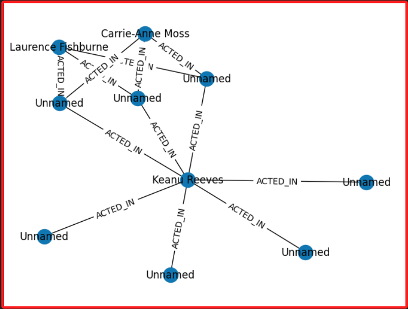

# 繪圖

<br>

## 步驟

1. 安裝套件

    ```python
    pip install networkx
    ```

<br>

2. 程式碼。

    ```python
    from neo4j import GraphDatabase
    import networkx as nx
    import matplotlib.pyplot as plt
    import os
    from dotenv import load_dotenv

    # 環境變數
    load_dotenv()

    # 使用自己的資料庫連接
    YOUR_URI = os.getenv("NEO4J_URI")
    YOUR_USER = os.getenv("NEO4J_USER")
    YOUR_PASSWORD = os.getenv("NEO4J_PASSWORD")

    # 建立 Neo4j 連線
    driver = GraphDatabase.driver(YOUR_URI, auth=(YOUR_USER, YOUR_PASSWORD))


    def fetch_data():
        # 可替換這段語法來繪製不同的圖
        # 或是將這個部分改為參數傳入
        """从Neo4j中提取数据"""
        query = """
        MATCH p=()-[:ACTED_IN]->() RETURN p LIMIT 25;
        """
        data = []
        with driver.session() as session:
            results = session.run(query)
            for record in results:
                for rel in record["p"].relationships:
                    data.append({
                        "start_node": rel.start_node,
                        "end_node": rel.end_node,
                        "type": rel.type,
                        "properties": dict(rel)
                    })
        return data

    # 從 Neo4j 中提取數據
    data = fetch_data()

    # 創建 NetworkX 圖形
    G = nx.Graph()

    for item in data:
        start, end = item["start_node"], item["end_node"]
        G.add_node(start.id, label=start["name"] if "name" in start.keys() else "Unnamed")
        G.add_node(end.id, label=end["name"] if "name" in end.keys() else "Unnamed")
        G.add_edge(start.id, end.id, type=item["type"])

    '''繪圖'''
    # 定義佈局
    pos = nx.spring_layout(G)
    labels = {node: G.nodes[node]['label'] for node in G.nodes()}
    nx.draw(G, pos, labels=labels, with_labels=True)
    nx.draw_networkx_edge_labels(G, pos, edge_labels={(u, v): G[u][v]['type'] for u, v in G.edges()})
    plt.show()

    # 關閉驅動器
    driver.close()
    ```

<br>

3. 成果圖。

    

<br>

___

_END_