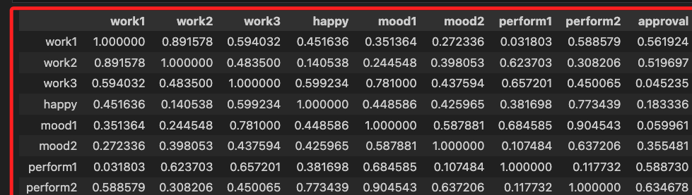
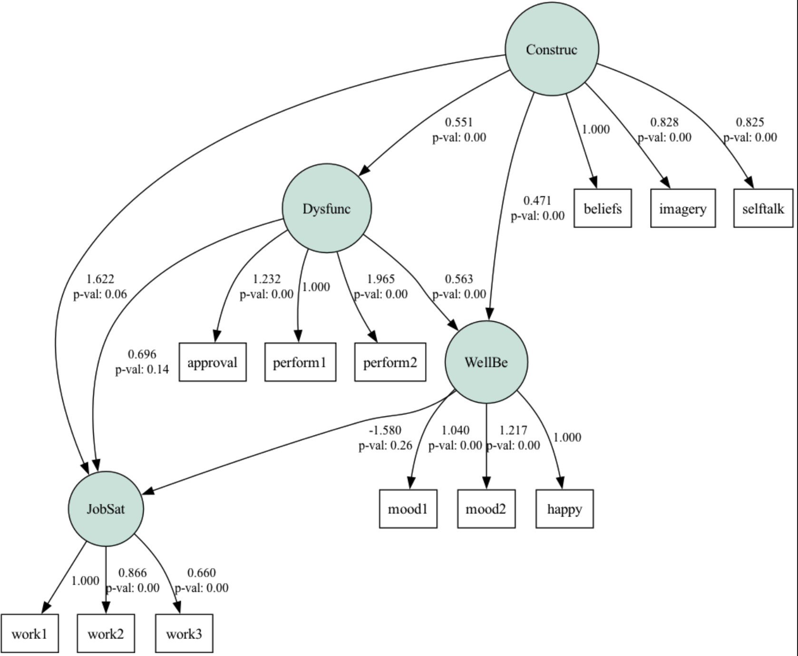
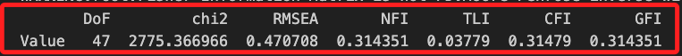

# SEM

_使用 semopy 庫進行結構方程模型分析_

<br>

## 環境安裝

1. 安裝必要庫 `semopy`。

    ```bash
    pip install semopy
    ```

<br>

2. 安裝繪圖工具 `graphviz`，Mac 系統使用以下指令安裝。

    ```bash
    brew install graphviz
    ```

<br>

3. Windows 系統參考 [官網下載說明](https://graphviz.org/download/)。

## 範例說明

<br>

1. 假設有一家大型跨國公司想要探索員工的工作滿意度（Job Satisfaction，簡稱 「JobSat」）如何被其他因素所影響，包括員工的幸福感（Well-being，簡稱「WellBe」）、工作表現（Dysfunctional Behavior，簡稱「Dysfunc」）以及自我認知（Constructive Thinking，簡稱「Construc」）。

<br>

2. 這家公司進行了一項全球性的員工調查收集了各種數據，包括員工的自我報告幸福感、工作表現、工作滿意度，以及他們的一些心理行為特徵，如信念（beliefs）、自我對話（selftalk）、以及心象再現（imagery）等。

<br>

3. 在這個設定中，我們使用SEM（結構方程模型）來探索以下幾個假設：

   - **工作滿意度（JobSat）** 假設受到員工的幸福感、工作表現和自我認知的影響。
   - **幸福感（WellBe）** 可能受到自我認知和工作表現的影響。
   - **工作表現（Dysfunc）** 假設受到自我認知的影響。

<br>

4. 此外，公司還想探索員工的幸福感和情緒（mood1、mood2）之間是否存在特定的關係，以及員工的工作表現是否直接反映在他們的具體工作行為（work1、work2、work3）上。

<br>

5. 在進行了數據收集後，使用了腳本進行數據分析，生成的 `模擬變異數-共變異數矩陣` 代表了從實際調查數據中提取的關鍵變數之間的關聯，在這個範例中使用了腳本隨機生成的。

<br>

6. 腳本的結果將幫助公司理解不同心理和行為因素如何相互作用來影響員工的工作滿意度，從而可以更有效地設計干預措施來提升員工幸福感、改善工作表現，最終提升整體的工作滿意度。

<br>

## 腳本

<br>

1. 模擬數據。

    ```python
    import pandas as pd
    import numpy as np
    import semopy as sem

    # 設定隨機種子以確保結果的可重現性
    np.random.seed(42)

    # 定義變數
    variables = [
        "work1",
        "work2",
        "work3",
        "happy",
        "mood1",
        "mood2",
        "perform1",
        "perform2",
        "approval",
        "beliefs",
        "selftalk",
        "imagery",
    ]

    # 生成模擬的變異數-共變異數矩陣
    cov_matrix_simulated = np.random.rand(
        len(variables),
        len(variables)
    )
    # 使矩陣對稱
    cov_matrix_simulated = (
        cov_matrix_simulated + cov_matrix_simulated.T
    ) / 2
    # 將對角線設置為1，表示變數自身的變異數
    np.fill_diagonal(cov_matrix_simulated, 1)

    # 將模擬的變異數-共變異數矩陣轉換為DataFrame，以符合後續分析的要求
    dataframe = pd.DataFrame(
        data=cov_matrix_simulated, index=variables, columns=variables
    )
    ```

<br>

2. 會得到一個矩陣。

    

<br>

3. 建立結構方程模型。

    ```python
    # 定義SEM模型
    mod = """
    # measurement model
    Construc =~ beliefs + selftalk + imagery
    Dysfunc =~ perform1 + perform2 + approval
    WellBe =~ happy + mood1 + mood2
    JobSat =~ work1 + work2 + work3
    # error covariance
    happy ~~ mood2 
    # structural part
    Dysfunc ~ Construc
    WellBe ~ Construc + Dysfunc
    JobSat ~ Construc + Dysfunc + WellBe
    """

    # 擬合SEM模型
    model = sem.Model(mod)
    res = model.fit(obj="MLW", solver="SLSQP", cov=dataframe, n_samples=263)

    # 取得和顯示估計結果
    estimates = model.inspect(std_est=True)
    stats = sem.calc_stats(model)
    basic_stats = stats[["DoF", "chi2", "RMSEA", "NFI", "TLI", "CFI", "GFI"]]

    # 輸出基本統計量
    print(basic_stats)

    # 或輸出出詳細的分析報表
    print(stats)

    # 繪製模型結構圖，將生成的圖像保存為"model_structure.png"
    sem.semplot(model, "model_structure.png")
    ```

<br>

4. 會建立並儲存圖形檔案。

    

<br>

5. 並會輸出出模型指標，這是模擬數據，不用太在意指標優度。

    

<br>

___

_END_