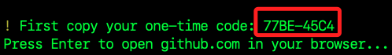
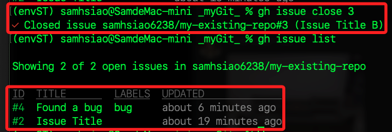

# gh

_以下諸多指令基於 Git 操作，可參考 [官方 GitHub](https://github.com/cli/cli) 或是 [官方說明手冊](https://cli.github.com/manual/) 。_

<br>

## 說明

1. `gh` 是 GitHub 提供的命令行工具，用於管理 GitHub 上的項目，可在 [官網](https://cli.github.com/) 直接下載作業系統對應的版本，或透過 Homebrew 安裝。

    ```bash
    brew install gh
    ```

<br>

2. 將 `GitHub CLI` 添加到 `Codespaces`，在容器設定檔案寫入以下項目，細節可參考 [官方文件](https://docs.github.com/en/codespaces/setting-up-your-project-for-codespaces/configuring-dev-containers/adding-features-to-a-devcontainer-file) 。 

    ```json
    "features": {
    "ghcr.io/devcontainers/features/github-cli:1": {}
    }
    ```

<br>

3. 透過終端機查詢版本已確保安裝完成。

    ```bash
    gh --version
    ```

<br>

4. 查詢狀態。

    ```bash
    gh pr status
    ```

    

<br>

## `gh` 可執行操作

1. 登入。

    ```bash
    gh auth login
    ```

<br>

2. 選擇 `GitHub.com`。

    

<br>

3. 選擇 `HTTPS`。

    

<br>

4. 在接下來的步驟，我選擇以瀏覽器登入。

    

<br>

5. 複製並按下 `ENTER`。

    

<br>

6. 貼上後按下繼續。

    

<br>

7. 點擊授權。

    

<br>

8. 兩階段驗證。

    

<br>

9.  建立倉庫，透過這個指令會啟動 CLI。

    ```bash
    gh repo create
    ```

<br>

10. 三個選項說明如下。

    ```bash
    # 從零開始在 GitHub 上建立一個全新的儲存庫
    Create a new repository on GitHub from scratch
    # 基於一個模板儲存庫來建立新儲存庫
    Create a new repository on GitHub from a template repository
    # 將一個已存在本地的 Git 儲存庫推送到 GitHub 上
    Push an existing local repository to GitHub
    ```

<br>

11. 選擇建立一個全新的儲存庫：`Create a new repository on GitHub from scratch`，輸入自訂名稱，這裡舉例 `_myGit_`。

    

<br>

12. 接著要輸入或選擇 `倉庫描述`、`公開或私有`、`README 文件`、`忽略設定`、`證書` 等一般性設置，最後會詢問是否克隆到本地，選擇 `Y` 之後會下載到運行以上程序所在位置的路徑是，在這示範的路徑是桌面。

    

<br>

13. 可在 VSCode 中開啟，內容暫時都是空的。

    ```bash
    cd _myGit_ && code .
    ```

<br>

14. 假設添加一個 `READMD.md` 文件，便可看到原始檔控制插件上出現提交的提示，可知當前環境已建立完成。

    

<br>

15. 進入 GitHiub 查看相關提交皆已完成。

    

<br>

16. 假如想透過指令一次性完成，可以下達更完整的指令。

    ```bash
    # 建立公開倉庫
    gh repo create my-new-repo --public
    # 建立私有倉庫
    gh repo create my-private-repo --private
    # 建立公開倉庫，並加上描述 `My description`
    gh repo create my-special-repo --public --description "My description" 
    # 建立公開倉庫，並添加忽略文件 `Node`
    gh repo create my-special-repo --public --gitignore Node
    # 建立公開倉庫，並指定一個 `MIT` 許可證
    gh repo create my-licensed-repo --license mit
    ```

<br>

17. 若要透過指令建立依據模板的倉庫 `my-based-on-template-repo`，指令中 `username/template-repo` 要更改為實際的模板儲存庫路徑。

    ```bash
    # 建立基於模板的倉庫
    gh repo create my-based-on-template-repo --template username/template-repo
    ```

<br>

18. 在第三個選項 `將一個已存在於你本地的 Git 儲存庫推送到 GitHub 上` 部分，特別注意，這個本地 Git 倉庫假如已經有一個名為 `orgin` 的 `遠端設定`，也就是已經存在指向其他 URL 的 `orgin` 遠端，此時需先將其刪除。

    ```bash
    # 進入倉庫所在路徑
    cd _myGit_
    # 檢查目前設定的遠端
    git remote -v
    # 移除現有的 'origin' 遠端
    git remote remove origin
    # 建立儲存庫並推送本地變更
    gh repo create my-existing-repo --source=. --public --push
    ```

<br>

## 推送到存在的遠端倉庫

_延續前面步驟_

1. 利用前面提及的 `移除現有的 origin 遠端`，然後觀察會出現的訊息。

    ```bash
    # 移除現有的 'origin' 遠端
    git remote remove origin
    ```
    _提示已經存在_

    

<br>

2. 先複製遠端倉庫 URL。

    ```bash
    https://github.com/samhsiao6238/my-existing-repo.git
    ```

    

<br>

3. 添加到本地儲存庫中。

    ```bash
    git remote add origin https://github.com/samhsiao6238/my-existing-repo.git
    ```

<br>

4. 嘗試修改文件後，並觀察推送後的遠端倉庫；特別注意，以上步驟的順序是先設定遠端倉庫、或是先添加暫存並提交皆可。

    ```bash
    git add .
    git commit -m "existing"
    git push -u origin main
    ```

<br>

## 查看

1. 查看 GitHub 儲存庫。

    ```bash
    gh repo view
    ```

    

<br>

2. 克隆 GitHub 儲存庫；特別注意指定路徑中是否已有相同資料夾名稱。

    ```bash
    # 先退到桌面或其他指定路徑
    cd ~/Desktop
    # 克隆指定的遠端倉庫，要更改以下用戶名、倉庫名
    gh repo clone samhsiao6238/my-existing-repo
    ```

    

<br>

## 請求

1. 進入本地倉庫後，透過指令查詢遠端連線設定，這裡示範進入 `_myGit_`。

    ```bash
    git remote -v
    ```

    

<br>

2. 假如本地倉庫沒有配置遠端，可透過指令添加一個遠端倉庫， URL 格式是 `https://github.com/<用戶名稱>/<倉庫名稱>.git`，需更改其中 `用戶名稱 `與 `倉庫名稱`。

    ```bash
    git remote add origin https://github.com/samhsiao6238/my-existing-repo.git
    ```

<br>

3. 確認分支推送到 GitHub 且正確設置了遠端，便可透過 `gh prpull` 來建立 pull 請求，特別注意，該指令同樣具有 `互動式` 與 `非互動式` 兩個模式。

    ```bash
    gh pr create
    ```

<br>

4. 特別注意，在 GitHub 的標準程序中，`main` 或 `master` 分支通常保留作為穩定或發布用的主分支，而特性開發、修復或改進通常在其他分支上進行，然後通過 pull 請求合併回 main 或 master，所以這裡要建立一個新分支來進行，以下示範使用 `feature-branch` 作為新的分支名稱。

    ```bash
    git checkout -b feature-branch
    ```

    

<br>

5. 延續上題，假如沒有建立新的分支，將會得到以下提示。

    

<br>

6. 進行檔案修改後，暫存並提交。

    ```bash
    git add .
    git commit -m "Fix something"
    ```

    

<br>

7. 建立新分支後再次運行指令 `gh pr create`。

    

<br>

8. 選擇相同倉庫。

    

<br>

9. `Title` 預設就是 `commit` 時的 `message`，按下 `ENTER` 即可。

    

<br>

10. 在 `Body` 部分按下 `ENTER` 跳過。

    

<br>

11. 選擇在瀏覽器開啟。

     

<br>

12. 添加一些描述之後點擊右下角的 `Create pull request`。

    

<br>

13. 接著點擊 `Merge pull request`。

    

<br>

14. 再次確認。

    

<br>

15. 完成後會提示成功合併，可點擊 `Delete branch` 將這個特色分支刪除。

     

<br>

## 管理請求

1. 列出與當前儲存庫相關聯的 pull 請求，透過指令可查看所有開啟（open）、已關閉（closed）或合併（merged）的 pull 請求，另外，也可使用選項來過濾和排序 pull 請求，例如按建立時間、更新時間或涉及特定標籤的 pull 請求等。

    ```bash
    gh pr list
    ```

<br>

2. 預設只會顯示開啟狀態的 pull 請求，如果想查看已關閉或已合併的 pull 請求，可使用對應的選項 `--state closed` 或 `--state merged` 等。

    ```bash
    # 查看所有已關閉的 pull 請求
    gh pr list --state closed
    # 查看所有已合併的 pull 請求
    gh pr list --state merged
    ```

    

<br>

3. 按標籤過濾。

    ```bash
    gh pr list --label "bugfix"
    ```

<br>

## 合併

1. 使用以下指令可進行合併，進行之前要先確認要合併哪個 pull 請求，如果已經在 pull 請求的相關分支上工作，或者你的當前目錄是已經與相應 GitHub 儲存庫關聯的 Git 儲存庫，你可以直接使用此命令，如果在命令行界面中沒有指定 pull 請求，gh 將提示選擇一個當前儲存庫中的開放 pull 請求來合併。。

    ```bash
    gh pr merge
    ```

<br>

2. 在可刪除的情況下，GitHub CLI 會提供合併選項。

    ```bash
    # 建立一個合併提交，此時 pull 請求的提交將保持原樣，並添加到基底分支的歷史中。
    Merge
    # 重新應用 pull 請求中的每個提交到基底分支，無需合併提交。
    Rebase and merge
    # 將 pull 請求中的所有提交壓縮成一個提交再合併到基底分支。
    Squash and merge
    ```

<br>

3. 假如看到以下訊息，代表該 pull 請求已經被合併，可選擇是否刪除本地的分支，這是一個清理步驟，有助於保持本地開發環境整潔。

    

<br>

4. 除了透過以上方式刪除本地分支，也可進行以下指令；特別注意，如果分支尚未合併，透過參數 `-d` 刪除時會啟動保護機制導致刪除失敗，避免意外丟失尚未合併的變更，假如要強制刪除，則改用 `-D` 參數進行強制刪除。

    ```bash
    # 有保護的情況下進行分支刪除
    git branch -d <想要刪除的分支名稱>
    # 強制刪除分支
    git branch -D <想要刪除的分支名稱>
    ```

<br>

## 討論主集 issue

1. 建立 GitHub 上的 `新問題 issue`，可快速報告問題、提出新的功能請求，或開始進行項目相關的討論，

    ```bash
    gh issue create
    ```

<br>

2. 任意填寫 Title，並在 Body 區按下 `ENTER`，接著點擊 `Continue in browser`。

    

<br>

3. 接著會開啟瀏覽器進行編輯，可 `指派給特定的人（Assignees）`、`添加標籤（Labels）`、`關聯到特定的項目（Projects）或里程碑（milestone）`。

    

<br>

4. 設定完成時點擊右下角的 `Submit new issue`。

    

<br>

5. 完成時便可看到這個 Issue 的畫面。

    

<br>

6. 點擊 `Issues` 頁籤可查看清單。

    

<br>

7. 或透過終端機指令查看清單。

    ```bash
    gh issue list
    ```

    

<br>

8. 除了以上互動式的設定，也可透過 CLI 進行非互動式的設定。

    ```bash
    gh issue create --title "Found a bug" --body "Description of the bug" --label bug
    ```

    

<br>

9. 完整可下達的指令如下，相關 `值` 要進行更改，這裡暫時略過、另作補充。

    ```bash
    gh issue create --title "Found a bug" --body "Description of the bug" --assignee username --label bug --project "Project Name" --milestone "Milestone Name"
    ```

<br>

10. 建立後可再次進行查詢。

    ```bash
    gh issue list
    ```

    

<br>

11. 關閉指定 `ID` 的 `問題 issue`，這個 ID 可從清單中查看。

    ```bash
    gh issue close 3
    ```

    

<br>

___

_END_
