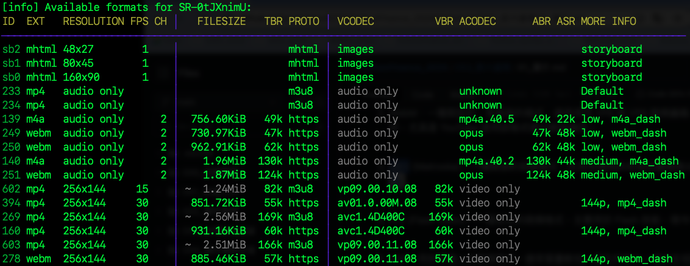

# `yt-dlp`

_建議使用 `yt-dlp` 模組替代 `pytube` 處理影片的下載_

<br>

## 建立虛擬環境

_從建立虛擬環境開始_

<br>

1. 進入指定資料夾。

    ```bash
    cd ~/Documents/PythonVenv
    ```

<br>

2. 建立虛擬環境。

    ```bash
    python -m venv envYTDLP
    ```

<br>

3. 編輯環境參數。

    ```bash
    code ~/.zshrc
    ```

<br>

4. 加入啟動虛擬環境的指令。

    ```bash
    source /Users/samhsiao/Documents/PythonVenv/envYTDLP/bin/activate
    ```

<br>

5. 啟動環境參數設定。

    ```bash
    source ~/.zshrc
    ```

<br>

6. 更新 pip。

    ```bash
    pip install --upgrade pip
    ```

<br>

## 下載 YouTube 影片

1. 安裝 `yt-dlp` 模組。

    ```bash
    pip install yt-dlp
    ```

<br>

2. 完成後，可觀察當前有哪些依賴模組。

    

<br>

3. 進入 YouTube，複製任意要下載影片的網址。

    ```http
    https://www.youtube.com/watch?v=SR-0tJXnimU
    ```

    

<br>

## 建立腳本

_可使用 JupyterNotebook 建立任意腳本_

<br>

1. 導入 `yt-dlp` 模組並下載影片，不設定任何下載參數。

    ```python
    import yt_dlp

    URL = "https://www.youtube.com/watch?v=SR-0tJXnimU"

    # 不指定任何設定
    ydl_opts = {}

    with yt_dlp.YoutubeDL(ydl_opts) as ydl:
        ydl.download([URL])
    ```

    _完成_

    

<br>

2. 會下載 `webm` 格式文件。

    

<br>

3. 可編輯前一個步驟空白的 `ydl_opts` 參數自定義下載。

    ```python
    from yt_dlp import YoutubeDL

    # 主題曲
    URL = "https://www.youtube.com/watch?v=SR-0tJXnimU"

    ydl_opts = {
        # 這會選擇包含音頻和視頻的最佳格式
        'format': 'best',
        # 使用下載文件的標題及副檔名
        # 這是 yt_dlp 自身定義的模板格式，不可使用 f-string
        'outtmpl': '%(title)s.%(ext)s',
    }

    with YoutubeDL(ydl_opts) as ydl:
        ydl.download([URL])
    ```

<br>

4. 會下載 `MP4` 格式。

    

<br>

## 處理音頻

1. 假如覺得音量太高，可使用 `ffmpeg` 通過 Python 調整音頻音量，以下範例將下載的視頻音頻音量降低至 50%；可手動將下載的文件先更名為 `downloaded_video.mp4`。

    ```python
    import yt_dlp
    import subprocess

    # 假設下載的文件名是 'downloaded_video.mp4'
    input_file = 'downloaded_video.mp4'
    output_file = 'output_video_lowered_volume.mp4'

    # 使用 ffmpeg 調整音量，這裡我們將音量減少一半（0.5 倍）
    subprocess.run([
        'ffmpeg', '-i', input_file,
        '-filter:a', 'volume=0.5',
        output_file
    ])

    print(f"修正的文件已儲存為：{output_file}")
    ```

<br>

2. 完成時會得到一個調整過音量的文件。

    

<br>

3. 其中 `subprocess` 模組是 Python 標準庫中的模組，用於建立新的進程、連接其輸入/輸出/錯誤管道，以及獲取返回值，可用來執行外部命令和互動式命令行程式；以下是一個簡單的範例，將字串賦值給變數，並分別將其內容寫入文件或輸出。

    ```python
    import subprocess

    # 使用 subprocess.run() 執行一個簡單的 `echo` 命令
    result = subprocess.run(
        ['echo', 'Hello World'], 
        capture_output=True, 
        text=True
    )

    # 將結果寫入到文件中
    with open('output.txt', 'w') as file:
        file.write(result.stdout)

    # 話直接輸出
    print(result.stdout)
    ```

<br>

## 其他設定

1. 如果要將下載的影片儲存在指定的資料夾，可在 `outtmpl` 中指定路徑，這裡示範為 `myYoutube`；若文件夾不存在，會自動建立。

    ```python
    from yt_dlp import YoutubeDL
    import os

    # 指定儲存路徑 `myYoutube`
    path = "myYoutube/%(title)s.%(ext)s"
    # 下載的 YT 連結
    URL = "https://www.youtube.com/watch?v=SR-0tJXnimU"

    ydl_opts = {
        'format': 'bestvideo+bestaudio/best',
        'outtmpl': path,
    }

    with YoutubeDL(ydl_opts) as ydl:
        ydl.download([URL])
    ```

<br>

2. `yt-dlp` 提供多種影片檔案格式，可以使用 `format` 選項進行指定。

    ```python
    from yt_dlp import YoutubeDL

    URL = "https://www.youtube.com/watch?v=SR-0tJXnimU"

    ydl_opts = {
        # 選擇MP4格式下載
        'format': 'mp4',  
        'outtmpl': '%(title)s.%(ext)s',
    }

    with YoutubeDL(ydl_opts) as ydl:
        ydl.download([URL])
    ```

<br>

## 支援的格式

1. `yt-dlp` 提供多種視頻文件格式，可透過以下指令進行查詢；連結內若有特殊符號時，務必加上引號。

    ```bash
    yt-dlp -F 'https://www.youtube.com/watch?v=SR-0tJXnimU'
    ```

<br>

2. 可查看所有可支援的格式，以及各種格式將下載的內容等資訊。

    

<br>

## 影片格式

1. MP4 (MPEG-4 Part 14)：這是最常見的視頻格式，支持廣泛的設備和平台，並且通常有較好的壓縮比和質量平衡。

<br>

2. WebM：一種開放的、免版稅的格式，通常使用 VP8 或 VP9 視頻編碼，和 Vorbis 或 Opus 音頻編碼。適合網頁應用，尤其是 YouTube 使用該格式進行網頁播放。

<br>

3. MKV (Matroska)：一種開源的容器格式，支持多種視訊和音訊編碼格式。通常用於高質量的影片和多音軌、多字幕文件。

<br>

4. FLV (Flash Video)：一種老式的視頻格式，主要用於 Flash 技術，現今已較少使用，逐漸被 HTML5 播放取代。

<br>

5. 3GP：用於手機上的視頻格式。通常質量較低，但文件較小，適合在低帶寬環境下使用。

<br>

6. AVI (Audio Video Interleave)：一種早期的視頻格式，現在仍然在一些平台上使用。支持多種編碼格式，但相對較少使用。

<br>

7. MOV (QuickTime File Format)：由 Apple 開發的格式，與 MP4 類似，但更多用於 Apple 的 QuickTime 播放器和其他 Apple 設備。

<br>

8. MPEG-TS (Transport Stream)：用於廣播或流式視頻應用的格式。支持多音軌和字幕，是廣播和 IPTV 的常用格式。

<br>

## 音頻格式

1. MP3：常見的音頻格式，用於廣泛的音樂和聲音文件，兼容幾乎所有的設備和平台。

<br>

2. M4A (MPEG-4 Audio)：基於 AAC 壓縮技術的音頻格式，通常用於 Apple 設備和 iTunes。

<br>

3. WebM (Opus or Vorbis)：開源音頻格式，通常用於 Web 應用，質量好且壓縮比高。

<br>

4. OGG (Ogg Vorbis)：一種開源音頻格式，常見於一些開源應用和 Linux 系統。

<br>

5. WAV (Waveform Audio File Format)：一種無壓縮的音頻格式，適用於高質量音頻和專業音頻應用。

<br>

6. FLAC (Free Lossless Audio Codec)：無損音頻格式，適用於高保真音樂存儲和傳輸。

<br>

## 多執行緒

_使用標準函式庫 threading_

<br>

1. 如果需要提升下載效率，可以使用多執行緒方式同時下載多個影片。

    ```python
    import threading
    from yt_dlp import YoutubeDL

    def download_video(url):
        ydl_opts = {
            'format': 'best',
            # 指定下載資料夾 "downloads"
            'outtmpl': 'downloads/%(title)s.%(ext)s',
        }
        with YoutubeDL(ydl_opts) as ydl:
            ydl.download([url])

    # 要下載的影片列表
    urls = [
        "https://www.youtube.com/watch?v=SR-0tJXnimU",
        "https://www.youtube.com/watch?v=9IfmCGZ2zJA",
        # 更多影片網址...
    ]

    threads = []

    # 為每個 URL 建立一個下載執行緒
    for url in urls:
        thread = threading.Thread(
            target=download_video, args=(url,)
        )
        threads.append(thread)
        thread.start()

    # 等待所有執行緒完成
    for thread in threads:
        thread.join()

    print("所有影片下載完成")
    ```

    

<br>

___

_END_