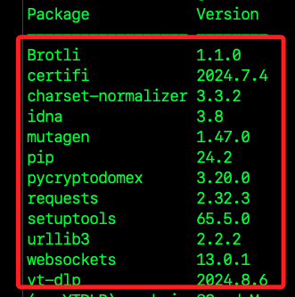
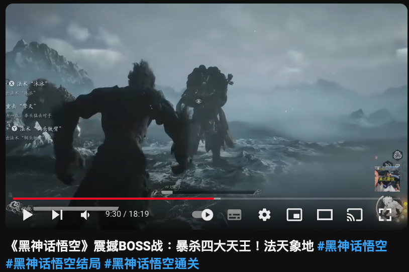
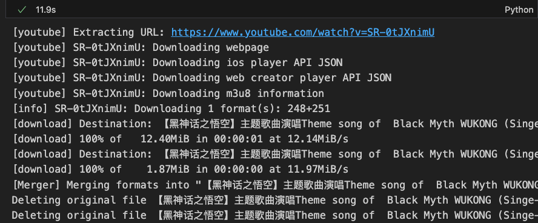
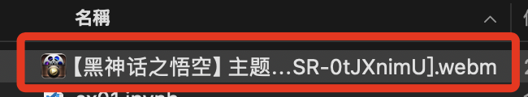
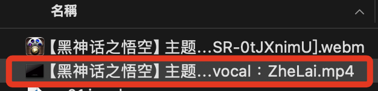
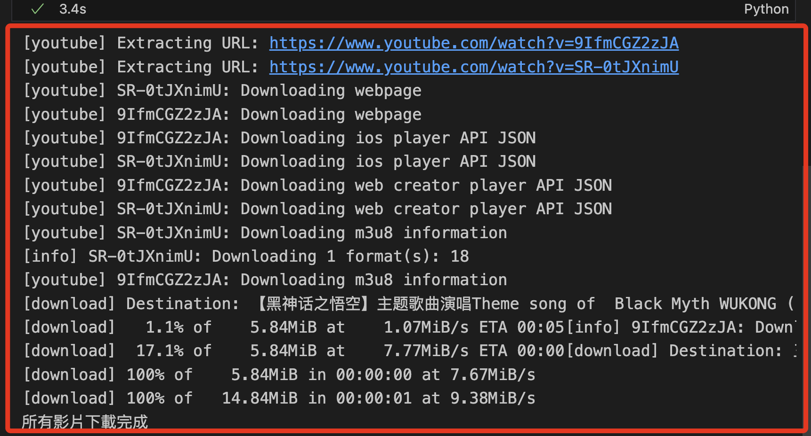
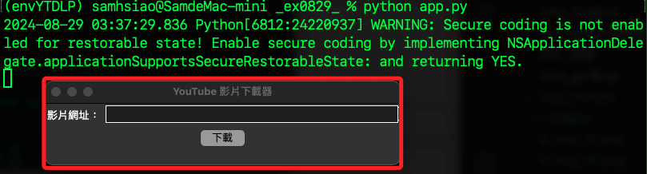

# `yt-dlp`

_建議使用 `yt-dlp` 模組替代 `pytube` 處理影片的下載_

<br>

## 建立虛擬環境

_從建立虛擬環境開始_

<br>

1. 進入指定資料夾。

    ```bash
    cd ~/Documents/PythonVenv
    ```

<br>

2. 建立虛擬環境。

    ```bash
    python -m venv envYTDLP
    ```

<br>

3. 編輯環境參數。

    ```bash
    code ~/.zshrc
    ```

<br>

4. 加入啟動虛擬環境的指令。

    ```bash
    source /Users/samhsiao/Documents/PythonVenv/envYTDLP/bin/activate
    ```

<br>

5. 啟動環境參數設定。

    ```bash
    source ~/.zshrc
    ```

<br>

6. 更新 pip。

    ```bash
    pip install --upgrade pip
    ```

<br>

## 下載 YouTube 影片

1. 安裝 `yt-dlp` 模組。

    ```bash
    pip install yt-dlp
    ```

<br>

2. 完成後，可觀察當前有哪些依賴模組。

    

<br>

3. 進入 YouTube，複製任意要下載影片的網址。

    ```http
    https://www.youtube.com/watch?v=SR-0tJXnimU
    ```

    

<br>

## 建立腳本

_可使用 JupyterNotebook 建立任意腳本_

<br>

1. 導入 `yt-dlp` 模組並下載影片，不設定任何下載參數。

    ```python
    import yt_dlp

    URL = "https://www.youtube.com/watch?v=SR-0tJXnimU"

    # 不指定任何設定
    ydl_opts = {}

    with yt_dlp.YoutubeDL(ydl_opts) as ydl:
        ydl.download([URL])
    ```

    _完成_

    

<br>

2. 會下載 `webm` 格式文件。

    

<br>

3. 可編輯前一個步驟空白的 `ydl_opts` 參數自定義下載。

    ```python
    from yt_dlp import YoutubeDL

    # 主題曲
    URL = "https://www.youtube.com/watch?v=SR-0tJXnimU"

    ydl_opts = {
        # 這會選擇包含音頻和視頻的最佳格式
        'format': 'best',
        # 使用下載文件的標題及副檔名
        # 這是 yt_dlp 自身定義的模板格式，不可使用 f-string
        'outtmpl': '%(title)s.%(ext)s',
    }

    with YoutubeDL(ydl_opts) as ydl:
        ydl.download([URL])
    ```

<br>

4. 會下載 `MP4` 格式。

    

<br>

## 處理音頻

1. 假如覺得音量太高，可使用 `ffmpeg` 通過 Python 調整音頻音量，以下範例將下載的視頻音頻音量降低至 50%；可手動將下載的文件先更名為 `downloaded_video.mp4`。

    ```python
    import yt_dlp
    import subprocess

    # 假設下載的文件名是 'downloaded_video.mp4'
    input_file = 'downloaded_video.mp4'
    output_file = 'output_video_lowered_volume.mp4'

    # 使用 ffmpeg 調整音量，這裡我們將音量減少一半（0.5 倍）
    subprocess.run([
        'ffmpeg', '-i', input_file,
        '-filter:a', 'volume=0.5',
        output_file
    ])

    print(f"修正的文件已儲存為：{output_file}")
    ```

<br>

## 其他設定

1. 如果要將下載的影片儲存在指定的資料夾，可在 `outtmpl` 中指定路徑，這裡示範為 `myYoutube`。

    ```python
    from yt_dlp import YoutubeDL
    import os

    # 指定儲存路徑 `myYoutube`
    path = "myYoutube/%(title)s.%(ext)s"

    URL = "https://www.youtube.com/watch?v=SR-0tJXnimU"

    ydl_opts = {
        'format': 'bestvideo+bestaudio/best',
        'outtmpl': path,
    }

    with YoutubeDL(ydl_opts) as ydl:
        ydl.download([URL])
    ```

<br>

2. `yt-dlp` 提供多種影片檔案格式，可以使用 `format` 選項進行篩選。

    ```python
    from yt_dlp import YoutubeDL

    URL = "https://www.youtube.com/watch?v=SR-0tJXnimU"

    ydl_opts = {
        # 選擇MP4格式下載
        'format': 'mp4',  
        'outtmpl': '%(title)s.%(ext)s',
    }

    with YoutubeDL(ydl_opts) as ydl:
        ydl.download([URL])
    ```

<br>

3. 如果需要提升下載效率，可以使用多執行緒方式同時下載多個影片。

    ```python
    import threading
    from yt_dlp import YoutubeDL

    def download_video(url):
        ydl_opts = {
            'format': 'best',
            'outtmpl': '%(title)s.%(ext)s',
        }
        with YoutubeDL(ydl_opts) as ydl:
            ydl.download([url])

    # 要下載的影片列表
    urls = [
        "https://www.youtube.com/watch?v=SR-0tJXnimU",
        "https://www.youtube.com/watch?v=9IfmCGZ2zJA",
        # 更多影片網址...
    ]

    threads = []

    # 為每個 URL 創建一個下載執行緒
    for url in urls:
        thread = threading.Thread(target=download_video, args=(url,))
        threads.append(thread)
        thread.start()

    # 等待所有執行緒完成
    for thread in threads:
        thread.join()

    print("所有影片下載完成")
    ```

    

<br>

## 整合 Tkinter

_使用圖形介面下載影片_

<br>

1. 建立腳本 `app.py`，並寫入以下代碼。

    ```python
    from tkinter import *
    from yt_dlp import YoutubeDL

    def download_video():
        url = url_entry.get()
        ydl_opts = {
            'format': 'best',
            'outtmpl': '%(title)s.%(ext)s',
        }
        with YoutubeDL(ydl_opts) as ydl:
            ydl.download([url])
        status_label.config(text="下載完成！")

    window = Tk()
    window.title("YouTube 影片下載器")

    url_label = Label(window, text="影片網址：")
    url_label.grid(row=0, column=0)
    url_entry = Entry(window, width=40)
    url_entry.grid(row=0, column=1)

    download_button = Button(
        window, text="下載", command=download_video
    )
    download_button.grid(row=1, column=0, columnspan=2)

    status_label = Label(window, text="")
    status_label.grid(row=2, column=0, columnspan=2)

    window.mainloop()
    ```

<br>

2. 運行腳本。

    ```bash
    python app.py
    ```

<br>

3. 運行後跳出視窗，其中警告 Python 應用程序 app.py 在使用 MacOS 的 GUI 系統tkinter 時，嘗試利用 MacOS 的應用程序狀態恢復功能，但沒有啟用安全編碼功能；這個警告不影響應用程序功能，可選擇忽略它。

    

<br>

___

_END_