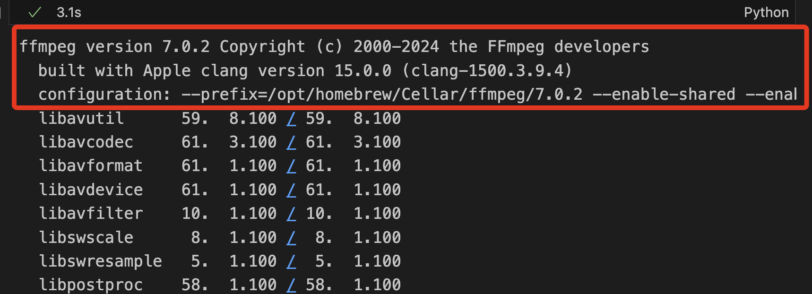
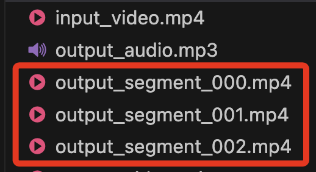
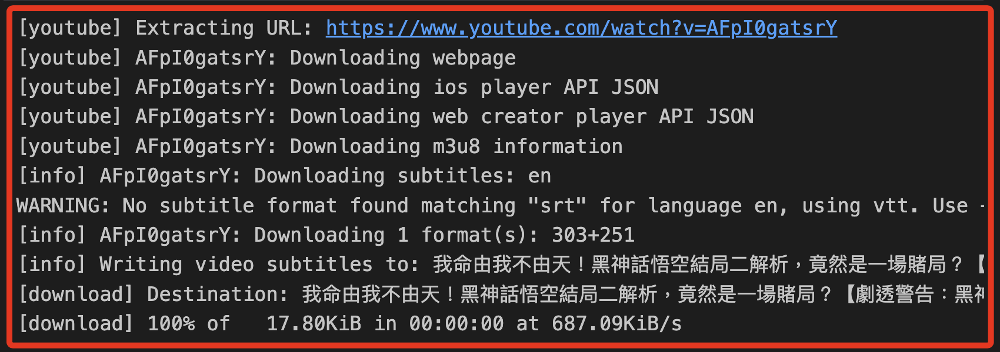

# 進階應用

<br>

## 視頻格式轉換

1. 可使用 Python 和第三方工具如 `ffmpeg` 來轉換視頻格式。

    ```python
    import subprocess

    # 定義輸入和輸出文件
    input_file = "input_video.mp4"
    output_file = "output_video.avi"

    # 使用 ffmpeg 進行格式轉換
    subprocess.run([
        # -i 用來指定接下來的參數為輸入文件
        'ffmpeg', '-i', 
        input_file, 
        output_file
    ])
    ```

<br>

2. 過程中會顯示轉換的細節資訊。

    

<br>

3. `subprocess.run()` 是 `Python 3.5` 中引入的一個便捷函數，用來取代過去使用 `subprocess.Popen` 處理外部命令的複雜性；`subprocess.run()` 用於執行外部命令並等待命令完成，會返回一個 `CompletedProcess` 對象，其中包含了命令的執行結果，例如退出狀態碼、標準輸出和標準錯誤；

<br>

## ffmpeg 的多種參數選項

1. `-c:v`：指定視頻編碼器。例如，`-c:v libx264` 使用 libx264 編碼器。

<br>

2. `-c:a`：指定音頻編碼器。例如，`-c:a aac` 使用 `aac` 編碼器。

<br>

3. `-b:v`：指定視頻的比特率。例如，`-b:v 1M` 設置比特率為 `1 Mbps`。

<br>

4. `-r`：設置幀率。例如，`-r 30` 設置幀率為 `30 fps`。

<br>

5. `-s:`：設置視頻的解析度。例如，`-s 1280x720` 設置為 `720p` 解析度。

<br>

6. `-filter:v`：使用濾鏡處理視頻。例如，`-filter:v "crop=640:480"` 對視頻進行裁剪。

<br>

7. 範例：這段代碼使用 `ffmpeg` 將 `input_video.mp4` 轉換為 `output_video.avi`，使用 `libx264` 編碼器，設置壓縮比特率為 `23`，並且使用 `medium` 預設。

    ```python
    import subprocess

    input_file = "input_video.mp4"
    output_file = "output_video.avi"

    subprocess.run([
        'ffmpeg', 
        '-i', input_file, 
        '-c:v', 'libx264', '-crf', '23', '-preset', 'medium', output_file
    ])
    ```

<br>

## 提取音頻

1. 如果只需要影片中的音頻，可使用 `ffmpeg` 或 `pydub` 模組來提取音頻並保存為 MP3 或其他格式，安裝套件。

    ```bash
    pip install pydub
    ```

<br>

2. 轉換。

    ```python
    from pydub import AudioSegment

    # 讀取影片文件
    video = AudioSegment.from_file("input_video.mp4", "mp4")

    # 將音頻部分保存為 mp3
    video.export("output_audio.mp3", format="mp3")
    ```

<br>

## 影片分割

1. 將影片分割為多個 `60 秒` 的片段。

    ```python
    import subprocess

    # 定義輸入影片文件
    input_file = 'input_video.mp4'

    # 定義片段的時間長度，以秒為單位
    segment_duration = 60

    # 定義輸出文件的名稱格式
    output_format = 'output_segment_%03d.mp4'

    # 使用 ffmpeg 進行影片分割
    subprocess.run([
        'ffmpeg', '-i', input_file,
        '-c', 'copy', '-map', '0',
        '-segment_time', str(segment_duration),
        '-f', 'segment', '-reset_timestamps',
        '1', output_format
    ])
    ```

<br>

2. 源文件還是會存在，只是多了分割後的文件。

    

<br>

3. `'-i', input_file`：指定輸入文件，這裡是 `'input_video.mp4'`。

<br>

4. `'-c', 'copy'`：使用 `copy` 編碼器，表示直接複製源文件的音頻和視頻流，而不是重新編碼。

<br>

5. `'-map', '0'`：指定要複製所有的流，也就是視頻和音頻。

<br>

6. `'-segment_time', str(segment_duration)`：設定每個片段的時間長度 `60 秒`。

<br>

7. `'-f', 'segment'`：指定輸出文件格式為片段模式。

<br>

8. `'-reset_timestamps', '1'`：重置每個片段的時間戳，從零開始。

<br>

9. `output_format`：輸出文件的名稱格式，這裡是 `output_segment_%03d.mp4`，`%03d` 是格式化的序號，從 `001` 開始遞增。

<br>

## 影片合併

1. Python 可使用 `moviepy` 模組實現剪輯或合併影片，先安裝套件。

    ```bash
    pip install moviepy
    ```

<br>

2. 導入，一般習慣寫為以下。

    ```python
    import moviepy.editor as mp
    ```

<br>

3. 檢查所有影片片段的屬性，如果輸出中有任何 `None` 值，這代表該片段無法正確讀取幀率或持續時間，務必確保影片片段沒有損壞並且可以正常播放。

    ```python
    from moviepy.editor import VideoFileClip

    # 檢查影片片段的屬性
    clip1 = VideoFileClip("output_segment_000.mp4")
    clip2 = VideoFileClip("output_segment_001.mp4")
    clip3 = VideoFileClip("output_segment_002.mp4")

    print("Clip 1 FPS:", clip1.fps, "Duration:", clip1.duration)
    print("Clip 2 FPS:", clip2.fps, "Duration:", clip2.duration)
    print("Clip 3 FPS:", clip3.fps, "Duration:", clip3.duration)
    ```


<br>

4. 以下完整代碼使用以下 ffmpeg 命令來合併這些片段，這將合併所有影片片段而不重新編碼，因此合併速度會非常快，並且音頻和視頻質量不會有損失。

    ```python
    import subprocess

    # 定義輸出文件的名稱列表
    video_segments = [
        "output_segment_000.mp4",
        "output_segment_001.mp4",
        "output_segment_002.mp4"
    ]

    # 建立 file_list.txt 並寫入影片片段名稱
    with open('file_list.txt', 'w') as f:
        for segment in video_segments:
            f.write(f"file '{segment}'\n")

    # 使用 ffmpeg 合併影片片段
    subprocess.run([
        'ffmpeg', '-f', 
        'concat', '-safe', '0', 
        '-i', 'file_list.txt', 
        '-c', 'copy', 'merged_video.mp4'
    ])

    ```

<br>

## 影片壓縮

1. 為了節省空間或減少上傳時間，可壓縮影片；`ffmpeg` 提供了一種減少文件大小的方法，同時保持合理的畫質。

    ```python
    import subprocess

    # 使用 ffmpeg 進行影片壓縮
    subprocess.run([
        'ffmpeg', '-i', 'input_video.mp4', 
        '-vcodec', 'libx265', '-crf', '28', 
        'compressed_video.mp4'
    ])
    ```

<br>

2. 壓縮影片相對來說比較耗時。

    

<br>

3. 壓縮完成。

    

<br>

## 自動化工作流程

1. 可編寫腳本自動下載和處理多個影片；例如從不同的 URL 列表中下載影片，然後批量轉換或壓縮它們。

    ```python
    import yt_dlp
    import subprocess
    import os

    def download_and_compress(url, output_path):
        # 確保輸出目錄存在
        if not os.path.exists(output_path):
            os.makedirs(output_path)
        
        ydl_opts = {
            'format': 'best',
            'outtmpl': f'{output_path}/%(title)s.%(ext)s'
        }
        
        with yt_dlp.YoutubeDL(ydl_opts) as ydl:
            info_dict = ydl.extract_info(url, download=True)
            # 獲取實際下載的文件名稱
            downloaded_file = ydl.prepare_filename(info_dict)

        # 根據原始文件名生成壓縮文件名
        base_name = os.path.splitext(os.path.basename(downloaded_file))[0]
        compressed_file = f"{output_path}/{base_name}_compressed.mp4"
        
        # 使用 ffmpeg 進行壓縮
        subprocess.run([
            'ffmpeg', '-i', downloaded_file, 
            '-vcodec', 'libx265', '-crf', '28', 
            compressed_file
        ])

    # 從 URL 列表中批量處理
    urls = [
        "https://www.youtube.com/watch?v=AJw16T1kLf4", 
        "https://www.youtube.com/watch?v=s3vbgEtMF1w"
    ]

    for url in urls:
        download_and_compress(url, "output")
    ```

<br>

## 非同步操作

1. 若要非同步下載和壓縮提高處理多個 URL 的速度，可使用 `concurrent.futures` 模組來實現。這個模組提供了 `ThreadPoolExecutor` 和 `ProcessPoolExecutor` 兩個執行器類，分別用於多線程和多進程操作。

<br>

2. 使用 `ThreadPoolExecutor` 來非同步處理，這個範例是非同步下載，但是同步進行壓縮。

    ```python
    import yt_dlp
    import subprocess
    import os
    from concurrent.futures import ThreadPoolExecutor

    def download_and_compress(url, output_path):
        # 確保輸出目錄存在
        if not os.path.exists(output_path):
            os.makedirs(output_path)
        
        ydl_opts = {
            'format': 'best',
            'outtmpl': f'{output_path}/%(title)s.%(ext)s'
        }
        
        with yt_dlp.YoutubeDL(ydl_opts) as ydl:
            info_dict = ydl.extract_info(url, download=True)
            # 獲取實際下載的文件名稱
            downloaded_file = ydl.prepare_filename(info_dict)

        # 根據原始文件名生成壓縮文件名
        base_name = os.path.splitext(os.path.basename(downloaded_file))[0]
        compressed_file = f"{output_path}/{base_name}_compressed.mp4"
        
        # 使用 ffmpeg 進行壓縮
        subprocess.run([
            'ffmpeg', '-i', downloaded_file, 
            '-vcodec', 'libx265', '-crf', '28', 
            compressed_file
        ])

    # 從 URL 列表中批量處理
    urls = [
        "https://www.youtube.com/watch?v=AJw16T1kLf4", 
        "https://www.youtube.com/watch?v=s3vbgEtMF1w"
    ]

    # 使用 ThreadPoolExecutor 進行非同步下載和壓縮
    with ThreadPoolExecutor(max_workers=len(urls)) as executor:
        # 提交任務給線程池
        futures = [
            executor.submit(
                download_and_compress, url, "output"
            ) for url in urls
        ]

        # 等待所有任務完成
        for future in futures:
            # 可以檢查任務的結果，這裡簡單等待所有完成
            future.result()
    ```

<br>

## 影片字幕提取與處理

1. 如果影片包含字幕，可以使用 Python 提取和處理字幕，例如生成字幕文件如 SRT 或進行語音轉文字處理。

    ```python
    import yt_dlp

    URL = "https://www.youtube.com/watch?v=AFpI0gatsrY"

    ydl_opts = {
        # 列出所有可用的字幕
        'writesubtitles': True,
        'subtitlesformat': 'srt',
        # 不下載影片本身
        'skip_download': True
    }

    with yt_dlp.YoutubeDL(ydl_opts) as ydl:
        ydl.download([URL])
    ```

    

<br>

2. 優化代碼，可指定想要的字幕語言來下載。

    ```python
    import yt_dlp
    import os

    URL = "https://www.youtube.com/watch?v=rlPtekX3xLY"

    ydl_opts = {
        # 啟用自動生成字幕下載
        'writeautomaticsub': True,
        # 指定字幕格式
        'subtitlesformat': 'vtt',
        # 指定簡體中文和繁體中文
        'subtitleslangs': ['zh-Hans', 'zh-Hant'],
        # 不下載影片本身
        'skip_download': True,
    }

    with yt_dlp.YoutubeDL(ydl_opts) as ydl:
        info_dict = ydl.extract_info(URL, download=True)

        # 提取下載文件的標題
        title = info_dict.get('title', None)
        subtitles = info_dict.get('requested_subtitles', None)

        if subtitles:
            for lang_code, sub_info in subtitles.items():
                sub_file = sub_info['filepath']
                # 構建新的文件名
                new_filename = f"{lang_code}.vtt"

                # 確認字幕文件存在，然後重命名
                if os.path.exists(sub_file):
                    os.rename(sub_file, new_filename)
                    print(f"字幕文件已重新命名為: {new_filename}")
        else:
            print("未找到指定語言的字幕。")
    ```

<br>

3. 正則表達，僅提取字幕部分。

    ```python
    import yt_dlp
    import os
    import re

    URL = "https://www.youtube.com/watch?v=rlPtekX3xLY"

    ydl_opts = {
        # 啟用自動生成字幕下載
        'writeautomaticsub': True,
        # 指定字幕格式
        'subtitlesformat': 'vtt',
        # 指定簡體中文和繁體中文
        'subtitleslangs': ['zh-Hans', 'zh-Hant'],
        # 不下載影片本身
        'skip_download': True,
    }

    def extract_text_from_vtt(file_path):
        # 打開 VTT 文件並讀取內容
        with open(file_path, 'r', encoding='utf-8') as file:
            vtt_content = file.read()

        # 使用正則表達式去除非字幕文本 (WEBVTT 標記、時間戳等)
        # 保留不含 "-->" 的行，這些行就是字幕文本
        subtitles = re.findall(r'^(?!WEBVTT|Kind:|Language:|\d{2}:\d{2}:\d{2}\.\d{3} -->).+', vtt_content, re.MULTILINE)

        # 將字幕合併為單個字符串，並返回
        return "\n".join(subtitles).strip()

    with yt_dlp.YoutubeDL(ydl_opts) as ydl:
        info_dict = ydl.extract_info(URL, download=True)

        # 提取下載文件的標題
        title = info_dict.get('title', None)
        subtitles = info_dict.get('requested_subtitles', None)

        if subtitles:
            for lang_code, sub_info in subtitles.items():
                sub_file = sub_info['filepath']
                # 構建新的文件名
                new_filename = f"{lang_code}.vtt"

                # 確認字幕文件存在，然後重命名
                if os.path.exists(sub_file):
                    os.rename(sub_file, new_filename)
                    print(f"字幕文件已重新命名為: {new_filename}")

                    # 提取字幕文本並打印
                    extracted_text = extract_text_from_vtt(new_filename)
                    print(f"提取的字幕文本 ({lang_code}):\n{extracted_text}")

                    # 可以選擇將提取的文本保存到新文件中
                    text_filename = f"{lang_code}_subtitles.txt"
                    with open(text_filename, 'w', encoding='utf-8') as text_file:
                        text_file.write(extracted_text)
                    print(f"字幕文本已保存到文件: {text_filename}")
        else:
            print("未找到指定語言的字幕。")
    ```

<br>

## 影片分析與特徵提取

1. 使用 YOLOv8 的 Python 介面對影片進行物件檢測；先升級套件。

    ```bash
    pip install --upgrade numpy matplotlib
    ```

<br>

2. 安裝套件；假如出現版本衝突，可以使用 `pip uninstall` 移除重新安裝，或建立新的虛擬環境來運行代碼。

    ```bash
    pip install opencv-python ultralytics
    ```

<br>

3. 範例；使用 `cv2.VideoCapture` 只讀取了影像資料而忽略了音頻資料，因此在播放或處理影片時沒有音效。

    ```python
    from ultralytics import YOLO
    import cv2

    # 加載預訓練的 YOLOv8 模型
    model = YOLO("yolov8n.pt")  # 使用官方預訓練的 YOLOv8 模型

    # 設置視頻來源（可以是影片路徑，也可以是攝影機索引，例如 0 表示默認攝像頭）
    video_path = "input_video.mp4"
    cap = cv2.VideoCapture(video_path)

    while cap.isOpened():
        ret, frame = cap.read()
        if ret:
            # 使用 YOLOv8 模型進行預測
            results = model.predict(source=frame)

            # 從結果中提取資訊並在影格上繪製邊界框和標籤
            for result in results:
                # 獲取物件的邊界框、類別和置信度
                # 邊界框座標
                boxes = result.boxes.xyxy.cpu().numpy()
                # 置信度
                scores = result.boxes.conf.cpu().numpy()
                # 類別索引
                class_ids = result.boxes.cls.cpu().numpy()

                for box, score, class_id in zip(
                    boxes, scores, class_ids
                ):
                    x1, y1, x2, y2 = map(int, box)
                    # 獲取類別名稱
                    label = model.names[int(class_id)]
                    confidence = f"{score:.2f}"

                    # 繪製邊界框
                    cv2.rectangle(
                        frame, (x1, y1), (x2, y2), (0, 255, 0), 2
                    )
                    # 繪製類別名稱和置信度
                    cv2.putText(
                        frame,
                        f"{label} {confidence}",
                        (x1, y1 - 10),
                        cv2.FONT_HERSHEY_SIMPLEX,
                        0.5,
                        (0, 255, 0),
                        2,
                    )

            # 顯示結果影格
            cv2.imshow("YOLOv8 Object Detection", frame)

            # 每隔 1 毫秒檢查鍵盤輸入，如果按下 'q' 鍵，則退出迴圈
            if cv2.waitKey(1) & 0xFF == ord("q"):
                break
        else:
            break

    # 釋放 VideoCapture 對象
    cap.release()
    # 關閉所有 OpenCV 窗口
    cv2.destroyAllWindows()
    ```

<br>

4. 同時播放影片和音頻，使用 OpenCV 播放影像，使用 ffplay 播放音頻；這個範例使用 `subprocess.Popen` 而不是 `subprocess.run`，是因為這樣可保留對音頻播放進程的控制，並在需要時終止它。

    ```python
    from ultralytics import YOLO
    import cv2
    import numpy as np
    import subprocess


    def play_audio(audio_path):
        # 使用 Popen 啟動 ffplay 播放音頻，允許後續終止
        process = subprocess.Popen(
            ["ffplay", "-nodisp", "-autoexit", audio_path],
            stdout=subprocess.DEVNULL,
            stderr=subprocess.DEVNULL,
        )
        return process


    # 提取音頻
    video_path = "input_video.mp4"
    audio_path = "input_audio.mp3"
    subprocess.run([
        "ffmpeg", "-i", video_path,
        "-q:a", "0", "-map", "a",
        audio_path, "-y"
    ])

    # 啟動音頻播放的線程
    audio_process = play_audio(audio_path)

    # 加載預訓練的 YOLOv8 模型
    # 使用官方預訓練的 YOLOv8 模型
    model = YOLO("yolov8n.pt")

    # 設置視頻來源
    cap = cv2.VideoCapture(video_path)

    while cap.isOpened():
        ret, frame = cap.read()
        if ret:
            # 建立影格的可寫副本
            frame = np.copy(frame)

            # 使用 YOLOv8 模型進行預測
            results = model.predict(source=frame)

            # 從結果中提取資訊並在影格上繪製邊界框和標籤
            for result in results:
                # 獲取物件的邊界框、類別和置信度
                # 邊界框座標
                boxes = result.boxes.xyxy.cpu().numpy()
                # 置信度
                scores = result.boxes.conf.cpu().numpy()
                # 類別索引
                class_ids = result.boxes.cls.cpu().numpy()

                for box, score, class_id in zip(
                    boxes, scores, class_ids
                ):
                    x1, y1, x2, y2 = map(int, box)
                    # 獲取類別名稱
                    label = model.names[int(class_id)]
                    confidence = f"{score:.2f}"

                    # 繪製邊界框
                    cv2.rectangle(
                        frame, (x1, y1), (x2, y2), (0, 255, 0), 2
                    )
                    # 繪製類別名稱和置信度
                    cv2.putText(
                        frame,
                        f"{label} {confidence}",
                        (x1, y1 - 10),
                        cv2.FONT_HERSHEY_SIMPLEX,
                        0.5,
                        (0, 255, 0),
                        2,
                    )

            # 顯示結果影格
            cv2.imshow("YOLOv8 Object Detection", frame)

            # 每隔 1 毫秒檢查鍵盤輸入，如果按下 'q' 鍵，則退出迴圈
            if cv2.waitKey(1) & 0xFF == ord("q"):
                break
        else:
            break

    # 釋放 VideoCapture 對象
    cap.release()
    # 關閉所有 OpenCV 窗口
    cv2.destroyAllWindows()

    # 結束音頻播放進程
    audio_process.terminate()
    audio_process.wait()
    ```

<br>

5. 在每個影格中偵測到的物件及其置信度被添加到 `detected_objects` 列表中，當播放結束或按下 `q` 時，程式會列印出偵測到的物件種類，僅記錄偵測到的物件種類，不記錄每個物件的信賴指數。

    ```python
    from ultralytics import YOLO
    import cv2
    import numpy as np
    import subprocess


    def play_audio(audio_path):
        """
        使用 ffplay 播放音頻，允許後續終止
        """
        process = subprocess.Popen(
            [
                "ffplay", "-nodisp", "-autoexit",
                audio_path
            ],
            stdout=subprocess.DEVNULL,
            stderr=subprocess.DEVNULL,
        )
        return process


    # 提取音頻
    video_path = "input_video.mp4"
    audio_path = "input_audio.mp3"
    subprocess.run([
        "ffmpeg", "-i", video_path,
        "-q:a", "0", "-map", "a",
        audio_path, "-y"
    ])

    # 啟動音頻播放的線程
    audio_process = play_audio(audio_path)

    # 加載預訓練的 YOLOv8 模型
    # 使用官方預訓練的 YOLOv8 模型
    model = YOLO("yolov8n.pt")

    # 設置視頻來源
    cap = cv2.VideoCapture(video_path)

    # 初始化用於存儲偵測到的物件種類的集合，避免重複
    detected_objects = set()

    while cap.isOpened():
        ret, frame = cap.read()
        if ret:
            # 建立影格的可寫副本
            frame = np.copy(frame)

            # 使用 YOLOv8 模型進行預測
            results = model.predict(source=frame)

            # 從結果中提取資訊並在影格上繪製邊界框和標籤
            for result in results:
                # 獲取物件的邊界框、類別和置信度
                # 邊界框座標
                boxes = result.boxes.xyxy.cpu().numpy()
                # 類別索引
                class_ids = result.boxes.cls.cpu().numpy()

                for box, class_id in zip(boxes, class_ids):
                    x1, y1, x2, y2 = map(int, box)
                    # 獲取類別名稱
                    label = model.names[int(class_id)]

                    # 記錄偵測到的物件種類
                    detected_objects.add(label)

                    # 繪製邊界框
                    cv2.rectangle(
                        frame,
                        (x1, y1), (x2, y2), (0, 255, 0), 2
                    )
                    # 繪製類別名稱
                    cv2.putText(
                        frame,
                        f"{label}",
                        (x1, y1 - 10),
                        cv2.FONT_HERSHEY_SIMPLEX,
                        0.5,
                        (0, 255, 0),
                        2,
                    )

            # 顯示結果影格
            cv2.imshow("YOLOv8 物件偵測", frame)

            # 每隔 1 毫秒檢查鍵盤輸入，如果按下 'q' 鍵，則退出迴圈
            if cv2.waitKey(1) & 0xFF == ord("q"):
                break
        else:
            break

    # 釋放 VideoCapture 對象
    cap.release()
    # 關閉所有 OpenCV 窗口
    cv2.destroyAllWindows()

    # 結束音頻播放進程
    audio_process.terminate()
    audio_process.wait()

    # 列印偵測到的物件列表
    print("播放期間偵測到的物件種類清單：")
    for obj in detected_objects:
        print(f"Object: {obj}")
    ```

<br>

___

_END_

