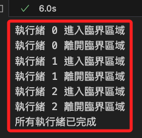
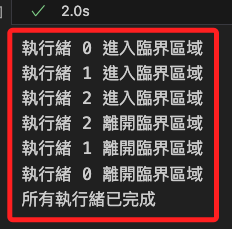
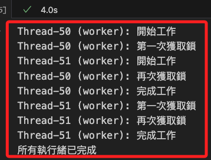
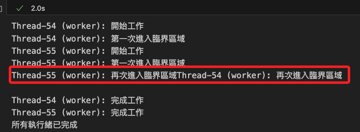
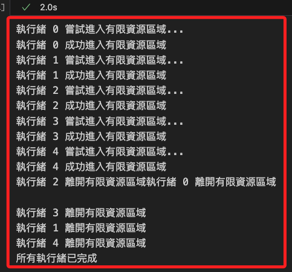
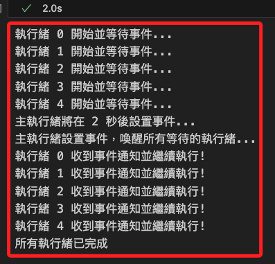
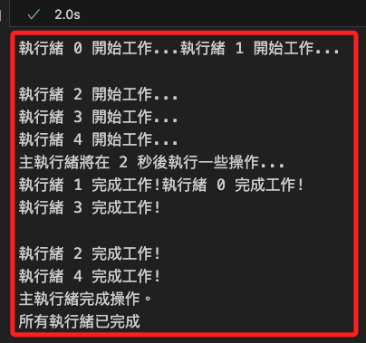

# 多執行緒

_`threading` 模組是 Python 標準庫，用於在程序中建立和管理多個執行緒（threads），也就是使程序可同時運行多個操作，實現並行（concurrency） 從而提高性能和效率；以下以範例說明_

<br>

## 關鍵步驟

1. 建立執行緒：使用 `threading.Thread` 類來建立新的執行緒，並指定目標函數和參數。

<br>

2. 啟動執行緒：使用 `thread.start()` 方法來啟動執行緒，使其開始執行。

<br>

3. 等待執行緒完成：使用 `thread.join()` 方法來等待執行緒完成，通常用於確保所有執行緒都完成後才進行下一步操作。

<br>

4. 同步機制：提供同步語法如 `Lock`、`RLock`、`Semaphore` 和 `Event`，以防止多個執行緒同時訪問共享資源而導致數據競爭問題。

<br>

5. 優點與缺點：優點為提高程序的響應性，讓 I/O 操作或等待時間長的任務在後台執行；而缺點是在 CPython 實現中，GIL 限制了多個執行緒在同一時間只能有一個執行緒執行 Python 字節碼，因此不適合 CPU 密集型任務。

<br>

## 範例

1. 這個範例示範如何使用 `threading` 模組來建立並執行一個簡單的執行緒。

    ```python
    import threading
    import time

    def print_numbers():
        for i in range(5):
            print(i)
            # 模擬一些需要時間的操作
            time.sleep(1)

    def print_letters():
        for letter in ['A', 'B', 'C', 'D', 'E']:
            print(letter)
            # 模擬一些需要時間的操作
            time.sleep(1)

    # 創建兩個子執行緒
    thread1 = threading.Thread(target=print_numbers)
    thread2 = threading.Thread(target=print_letters)

    # 啟動兩個執行緒
    thread1.start()
    thread2.start()

    # 等待兩個執行緒完成
    thread1.join()
    thread2.join()

    print("所有執行緒已完成")
    ```

    

<br>

2. 如果上面的範例中沒有使用執行緒管理 `threading.Thread` 和 `thread.start()`，而是直接在主執行緒中執行 `print_numbers` 函數，那代碼將會在主執行緒中順序執行，而不會有並行的效果，也就是在主執行緒執行完 print_numbers 函數後，才會繼續執行後續的代碼。

    ```python
    import time

    def print_numbers():
        for i in range(5):
            print(i)
            # 模擬一些需要時間的操作
            time.sleep(1)

    def print_letters():
        for letter in ['A', 'B', 'C', 'D', 'E']:
            print(letter)
            # 模擬一些需要時間的操作
            time.sleep(1)

    # 順序執行兩個函數
    print_numbers()
    print_letters()

    print("所有操作已完成")
    ```

    

<br>

## `Lock` (鎖)

1. 一個最基本的同步機制，用來確保某段程式碼同一時間只能由一個執行緒執行；當一個執行緒獲取了鎖，其他執行緒將被阻塞，直到該鎖被釋放。

    ```python
    import threading
    import time

    # 創建一個鎖
    lock = threading.Lock()

    # 定義一個函數，模擬臨界區域的操作
    def critical_section(thread_id):
        # 獲取鎖
        with lock:
            print(f"執行緒 {thread_id} 進入臨界區域")
            # 模擬臨界區域中的工作
            time.sleep(2)
            print(f"執行緒 {thread_id} 離開臨界區域")

    # 創建多個執行緒
    threads = []
    for i in range(3):
        thread = threading.Thread(target=critical_section, args=(i,))
        threads.append(thread)
        thread.start()

    # 等待所有執行緒完成
    for thread in threads:
        thread.join()

    print("所有執行緒已完成")
    ```

    

<br>

2. 如果以上範例未使用 `鎖 (lock)`，那麼多個執行緒可能會同時進入臨界區域，這會導致 `競爭條件（Race Condition）` 的問題，也就是多個執行緒將會同時進入和執行臨界區域的代碼，因為沒有鎖來確保 `互斥訪問`，執行緒不會等待其他執行緒完成工作，打印結果在順序上將是無序的。

    ```python
    import threading
    import time

    # 定義一個函數，模擬臨界區域的操作
    def critical_section(thread_id):
        # 沒有使用鎖
        print(f"執行緒 {thread_id} 進入臨界區域")
        # 模擬臨界區域中的工作
        time.sleep(2)
        print(f"執行緒 {thread_id} 離開臨界區域")

    # 創建多個執行緒
    threads = []
    for i in range(3):
        thread = threading.Thread(target=critical_section, args=(i,))
        threads.append(thread)
        thread.start()

    # 等待所有執行緒完成
    for thread in threads:
        thread.join()

    print("所有執行緒已完成")
    ```

    

<br>

## `RLock` (可重入鎖)

1. `RLock` 是一個可重入鎖，允許同一個執行緒多次獲取同一個鎖，這對於需要多次進入同一臨界區域的情況非常有用；以下展示如何使用 `threading.RLock()` 允許同一個執行緒多次獲取同一把鎖而不會導致死鎖。

    ```python
    import threading
    import time

    # 創建一個可重入鎖
    rlock = threading.RLock()

    # 創建一個用於同步輸出的鎖
    print_lock = threading.Lock()

    def nested_lock():
        with rlock:
            with print_lock:
                print(f"{threading.current_thread().name}: 第一次獲取鎖")
            # 模擬一些操作
            time.sleep(1)

            with rlock:
                with print_lock:
                    print(f"{threading.current_thread().name}: 再次獲取鎖")
                # 模擬一些操作
                time.sleep(1)

    def worker():
        with print_lock:
            print(f"{threading.current_thread().name}: 開始工作")
        nested_lock()
        with print_lock:
            print(f"{threading.current_thread().name}: 完成工作")

    # 創建多個執行緒
    threads = []
    # 創建兩個執行緒以觀察行為
    for i in range(2):
        thread = threading.Thread(target=worker)
        threads.append(thread)
        thread.start()

    # 等待所有執行緒完成
    for thread in threads:
        thread.join()

    with print_lock:
        print("所有執行緒已完成")
    ```

    

<br>

2. 如果這段代碼沒有使用鎖，則可能會發生競爭條件或無序執行。

    ```python
    import threading
    import time

    def nested_lock():
        # 沒有使用鎖的情況
        print(f"{threading.current_thread().name}: 第一次進入臨界區域")
        # 模擬一些操作
        time.sleep(1)

        print(f"{threading.current_thread().name}: 再次進入臨界區域")
        # 模擬一些操作
        time.sleep(1)

    def worker():
        print(f"{threading.current_thread().name}: 開始工作")
        nested_lock()
        print(f"{threading.current_thread().name}: 完成工作")

    # 創建多個執行緒
    threads = []
    # 創建兩個執行緒以觀察行為
    for i in range(2):
        thread = threading.Thread(target=worker)
        threads.append(thread)
        thread.start()

    # 等待所有執行緒完成
    for thread in threads:
        thread.join()

    print("所有執行緒已完成")
    ```

<br>

3. 如果不使用鎖，可能發生多個執行緒同時進入臨界區域（critical section），導致競爭條件和不可預測的行為，輸出也可能會亂序；例如在以下的結果中，Thread-55 的 "再次進入臨界區域" 和 Thread-54 的 "再次進入臨界區域" 混合在同一行。

    

<br>

## `Semaphore` (信號量)

1. 一種計數器，允許一定數量的執行緒同時訪問資源；`Semaphore` 具有一個內部計數器，表示當前可用的資源數量；以下範例設置一個 Semaphore，允許最多兩個執行緒同時進入臨界區域，並模擬多個執行緒同時試圖進入臨界區域的情況。

    ```python
    import threading
    import time

    # 允許最多兩個執行緒同時進入
    semaphore = threading.Semaphore(2)

    def limited_access(thread_id):
        print(f"執行緒 {thread_id} 嘗試進入有限資源區域...")
        # 上下文管理器，用來自動管理 Semaphore 的獲取和釋放
        with semaphore:
            print(f"執行緒 {thread_id} 成功進入有限資源區域")
            # 模擬一些操作，讓執行緒在資源區域內逗留一段時間
            time.sleep(2)
            print(f"執行緒 {thread_id} 離開有限資源區域")

    # 創建五個執行緒，每個執行緒都會嘗試進入臨界區域
    threads = []
    for i in range(5):
        thread = threading.Thread(target=limited_access, args=(i,))
        threads.append(thread)
        thread.start()

    # 等待所有執行緒完成
    for thread in threads:
        thread.join()

    print("所有執行緒已完成")
    ```

    

<br>

2. 從以上代碼中移除 `Semaphore 鎖定機制`，這會導致所有執行緒不受限制地同時進入有限資源區域，這表示所有的執行緒會立即開始執行而不需要等待，從而導致潛在的競爭條件。

    ```python
    import threading
    import time

    def limited_access(thread_id):
        print(f"執行緒 {thread_id} 嘗試進入有限資源區域...")
        
        # 這裡不再使用 semaphore，所以所有執行緒可以同時進入
        print(f"執行緒 {thread_id} 成功進入有限資源區域")
        
        # 模擬一些操作，讓執行緒在資源區域內逗留一段時間
        time.sleep(2)
        
        print(f"執行緒 {thread_id} 離開有限資源區域")

    # 創建多個執行緒來模擬同時訪問
    threads = []
    for i in range(5):
        thread = threading.Thread(target=limited_access, args=(i,))
        threads.append(thread)
        thread.start()

    # 等待所有執行緒完成
    for thread in threads:
        thread.join()

    print("所有執行緒已完成")
    ```

    

<br>

## `Event` (事件)

1. 一種執行緒間的通信方式，用於使一個執行緒等待另一個執行緒的通知。事件物件有兩個狀態：已設置和未設置。當事件被設置時，所有等待事件的執行緒都將被喚醒。

    ```python
    import threading
    import time

    # 創建一個 Event 物件
    event = threading.Event()

    def wait_for_event(thread_id):
        print(f"執行緒 {thread_id} 開始並等待事件...")
        # 等待事件被設置
        event.wait()
        print(f"執行緒 {thread_id} 收到事件通知並繼續執行!")

    def trigger_event():
        print("主執行緒將在 2 秒後設置事件...")
        time.sleep(2)
        # 設置事件，喚醒所有等待的執行緒
        print("主執行緒設置事件，喚醒所有等待的執行緒...")
        event.set()

    # 創建多個執行緒來等待事件
    threads = []
    for i in range(5):
        t = threading.Thread(target=wait_for_event, args=(i,))
        threads.append(t)
        t.start()

    # 創建一個執行緒來設置事件
    trigger_thread = threading.Thread(target=trigger_event)
    trigger_thread.start()

    # 等待所有執行緒完成
    for t in threads:
        t.join()
    trigger_thread.join()

    print("所有執行緒已完成")
    ```

2. 觀察以上代碼的效果，在事件設置之前，所有等待執行緒都被阻塞在 `event.wait()` 語句處，這體現了 Event 的同步機制；當 `event.set()` 被調用後，所有等待的執行緒被同時喚醒，多個執行緒在一個事件的控制下進行協調，這對於多執行緒同步和協作場景非常有用。

    

<br>

3. 如果沒有使用 Event 或類似的同步機制，從代碼中直接刪除 event.wait() 和 event.set() ；這時由於沒有使用 Event 來同步控制，所有的執行緒立即開始並進行工作而不會等待主執行緒完成某些操作，因此執行緒間的運行是非同步且無序的，可能導致錯誤的業務邏輯或無法滿足程序的同步要求。

    ```python
    import threading
    import time

    def wait_for_event(thread_id):
        print(f"執行緒 {thread_id} 開始工作...")
        # 模擬一些操作
        time.sleep(1)
        print(f"執行緒 {thread_id} 完成工作!")

    def trigger_event():
        print("主執行緒將在 2 秒後執行一些操作...")
        time.sleep(2)
        print("主執行緒完成操作。")

    # 創建多個執行緒來執行任務
    threads = []
    for i in range(5):
        t = threading.Thread(target=wait_for_event, args=(i,))
        threads.append(t)
        t.start()

    # 創建一個執行緒來執行一些操作
    trigger_thread = threading.Thread(target=trigger_event)
    trigger_thread.start()

    # 等待所有執行緒完成
    for t in threads:
        t.join()
    trigger_thread.join()

    print("所有執行緒已完成")
    ```

<br>

4. 結果如下，`執行緒 0` 到 `執行緒 4` 同時開始工作並行執行這些操作，這說明 Python 的多執行緒是並行啟動的，所有執行緒幾乎在同一時間點開始執行，所以輸出會無序且混亂。

    

<br>

___

_END_