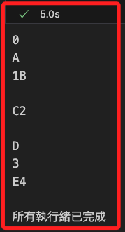

# 多執行緒

_`threading` 模組是 Python 標準庫，用於在程序中建立和管理多個執行緒（threads），也就是使程序可同時運行多個操作，實現並行（concurrency） 從而提高性能和效率；以下以範例說明_

<br>

## 關鍵步驟

1. 建立執行緒：使用 `threading.Thread` 類來建立新的執行緒，並指定目標函數和參數。

<br>

2. 啟動執行緒：使用 `thread.start()` 方法來啟動執行緒，使其開始執行。

<br>

3. 等待執行緒完成：使用 `thread.join()` 方法來等待執行緒完成，通常用於確保所有執行緒都完成後才進行下一步操作。

<br>

4. 同步機制：提供同步語法如 `Lock`、`RLock`、`Semaphore` 和 `Event`，以防止多個執行緒同時訪問共享資源而導致數據競爭問題。

<br>

5. 優點與缺點：優點為提高程序的響應性，讓 I/O 操作或等待時間長的任務在後台執行；而缺點是在 CPython 實現中，GIL 限制了多個執行緒在同一時間只能有一個執行緒執行 Python 字節碼，因此不適合 CPU 密集型任務。

<br>

## 範例

1. 這個範例示範如何使用 `threading` 模組來建立並執行一個簡單的執行緒。

    ```python
    import threading
    import time

    def print_numbers():
        for i in range(5):
            print(i)
            # 模擬一些需要時間的操作
            time.sleep(1)

    def print_letters():
        for letter in ['A', 'B', 'C', 'D', 'E']:
            print(letter)
            # 模擬一些需要時間的操作
            time.sleep(1)

    # 創建兩個子執行緒
    thread1 = threading.Thread(target=print_numbers)
    thread2 = threading.Thread(target=print_letters)

    # 啟動兩個執行緒
    thread1.start()
    thread2.start()

    # 等待兩個執行緒完成
    thread1.join()
    thread2.join()

    print("所有執行緒已完成")
    ```

    

<br>

2. 如果上面的範例中沒有使用執行緒管理 `threading.Thread` 和 `thread.start()`，而是直接在主執行緒中執行 `print_numbers` 函數，那代碼將會在主執行緒中順序執行，而不會有並行的效果，也就是在主執行緒執行完 print_numbers 函數後，才會繼續執行後續的代碼。

    ```python
    import time

    def print_numbers():
        for i in range(5):
            print(i)
            # 模擬一些需要時間的操作
            time.sleep(1)

    def print_letters():
        for letter in ['A', 'B', 'C', 'D', 'E']:
            print(letter)
            # 模擬一些需要時間的操作
            time.sleep(1)

    # 順序執行兩個函數
    print_numbers()
    print_letters()

    print("所有操作已完成")
    ```

    

<br>

## 同步機制詳解

1. `Lock` (鎖)：一個最基本的同步機制，用來確保某段程式碼同一時間只能由一個執行緒執行。當一個執行緒獲取了鎖，其他執行緒將被阻塞，直到該鎖被釋放。

    ```python
    import threading

    lock = threading.Lock()

    def critical_section():
        with lock:
            # 確保這裡的程式碼同一時間只被一個執行緒執行
            print("進入臨界區域")
    ```

<br>

2. `RLock` (可重入鎖)：`RLock` 是一個可重入鎖，允許同一個執行緒多次獲取同一個鎖。這對於需要多次進入同一臨界區域的情況非常有用。

    ```python
    import threading

    rlock = threading.RLock()

    def nested_lock():
        with rlock:
            print("第一次獲取鎖")
            with rlock:
                print("再次獲取鎖")
    ```

<br>

3. `Semaphore` (信號量)：一種計數器，允許一定數量的執行緒同時訪問資源。`Semaphore` 具有一個內部計數器，表示當前可用的資源數量。

    ```python
    import threading
    
    # 允許最多兩個執行緒同時進入
    semaphore = threading.Semaphore(2)

    def limited_access():
        with semaphore:
            print("進入有限資源區域")
    ```

<br>

4. `Event` (事件)：一種執行緒間的通信方式，用於使一個執行緒等待另一個執行緒的通知。事件物件有兩個狀態：已設置和未設置。當事件被設置時，所有等待事件的執行緒都將被喚醒。

    ```python
    import threading
    import time

    event = threading.Event()

    def wait_for_event():
        print("等待事件...")
        # 等待事件被設置
        event.wait()
        print("事件已被設置!")

    def trigger_event():
        time.sleep(2)
        # 設置事件，喚醒所有等待的執行緒
        event.set()

    t1 = threading.Thread(target=wait_for_event)
    t2 = threading.Thread(target=trigger_event)

    t1.start()
    t2.start()

    t1.join()
    t2.join()
    ```

<br>

___

_END_