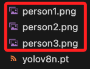

# YOLOv8 人臉偵測和辨識

_YOLOv8 主要是用於物體偵測，但它也可以用於人臉偵測_

<br>

## 步驟概述

1. 使用 YOLOv8 模型從影像或影片中偵測人臉的位置。

<br>

2. 對偵測到的人臉進行特徵提取，例如使用 `FaceNet` 或 `Dlib` 庫，將每張人臉轉換成特徵向量。

<br>

3. 將這些特徵向量與資料庫中的已知人臉特徵向量進行比對，以確定影像中的人臉是否為資料庫中的人物。

<br>

## 範例

_以下使用 YOLOv8 和 `face_recognition` 庫進行人臉偵測和辨識，展示使用 YOLOv8 偵測影像中的人臉，然後使用 `face_recognition` 進行人臉比對_

<br>

1. 安裝所需套件。

    ```bash
    pip install ultralytics opencv-python face_recognition numpy
    ```

<br>

2. 將相片加入專案資料夾內，目前並未另外設定資料夾。

    

<br>

3. 範例。

    ```python
    import cv2
    import face_recognition
    from ultralytics import YOLO

    # 初始化 YOLO 模型
    # YOLOv8n 可用於人臉偵測
    model = YOLO("yolov8n.pt")

    # 加載已知的圖片並進行面部編碼
    known_face_encodings = []
    known_face_names = []

    # 已知的人臉
    known_images = [
        "person1.png", "person2.png", "person3.png"
    ]
    # 標籤
    known_names = [
        "Sam", "Sam", "Peggy"
    ]

    for image_path, name in zip(known_images, known_names):
        image = face_recognition.load_image_file(image_path)
        # 假設每張圖片只含一個人臉
        encoding = face_recognition.face_encodings(image)[0]
        known_face_encodings.append(encoding)
        known_face_names.append(name)

    # 設定相似度閾值，0.6 是默認值，值越小越嚴格
    tolerance_1 = 0.4
    tolerance_2 = 0.38

    # 使用攝像頭作為視頻來源，0 表示默認攝像頭
    cap = cv2.VideoCapture(0)

    if not cap.isOpened():
        print("無法打開攝像頭。")
        exit()

    while True:
        ret, frame = cap.read()
        if not ret:
            print("無法讀取影像。")
            break

        # 使用 YOLO 模型進行人臉偵測
        # 設置 verbose=False 來禁用詳情輸出
        results = model(frame,  verbose=False)

        for result in results:
            for box in result.boxes:
                # 提取 YOLO 檢測框的坐標
                x1, y1, x2, y2 = box.xyxy[0].int().tolist()

                # 在影像上畫出初始的綠色框
                cv2.rectangle(
                    frame, (x1, y1), (x2, y2),
                    (0, 255, 0), 2
                )

                # 提取檢測到的人臉區域
                face_image = frame[y1:y2, x1:x2]

                # 確保臉部框不超出圖像邊界
                if face_image.size != 0:
                    # 將 OpenCV BGR 圖像轉換為 RGB 格式
                    # 因為 face_recognition 使用 RGB 格式
                    rgb_face_image = cv2.cvtColor(face_image, cv2.COLOR_BGR2RGB)

                    # 使用 face_recognition 檢測面部編碼
                    face_encodings = face_recognition.face_encodings(
                        rgb_face_image
                    )

                    # 處理每一個人臉的編碼
                    for encoding in face_encodings:
                        # 計算已知人臉與目標人臉的距離，指的是差異
                        distances = face_recognition.face_distance(
                            known_face_encodings, encoding
                        )
                        # 找到距離最小的匹配
                        min_distance = min(distances)
                        # 當相似度滿足閾值
                        if min_distance < tolerance_1:
                            # 取得最接近的已知人臉索引
                            best_match_index = distances.argmin()
                            name = known_face_names[best_match_index]
                            # 邊框變紅
                            cv2.rectangle(
                                frame, (x1, y1), (x2, y2),
                                (0, 0, 255), 2
                            )

                            # 當距離小於 tolerance_1，填充半透明紅色
                            if min_distance < tolerance_1:
                                overlay = frame.copy()
                                cv2.rectangle(
                                    overlay, (x1, y1), (x2, y2),
                                    (0, 0, 255), -1
                                )
                                # 透明度
                                alpha = 0.4
                                frame = cv2.addWeighted(
                                    overlay, alpha, frame,
                                    1 - alpha, 0
                                )
                        else:
                            name = "Unknown"

                        # 顯示匹配結果
                        cv2.putText(
                            frame,
                            name,
                            (x1, y1 - 10),
                            cv2.FONT_HERSHEY_SIMPLEX,
                            0.9,
                            (36, 255, 12),
                            2,
                        )
                        print(f"偵測到 {name}，相似度: {1 - min_distance:.2f}")

        # 顯示帶有檢測框的影像
        cv2.imshow("YOLOv8 Face Detection", frame)

        # 每隔 1 毫秒檢查鍵盤輸入，如果按下 'q' 鍵，則退出迴圈
        if cv2.waitKey(1) & 0xFF == ord("q"):
            break

    cap.release()
    cv2.destroyAllWindows()
    ```

<br>

___

_END_