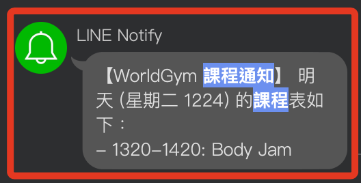

# 取得課表

_可直接查看最後的完整代碼_

<br>

## 準備工作

1. 安裝套件。

    ```bash
    pip install selenium lxml pandas bs4 html5lib requests python-dotenv
    ```

<br>

2. 建立並編輯 `.env` 文件。

<br>

## 步驟紀錄

1. 導入庫。

    ```python
    # 導入庫
    import re
    import pandas as pd
    from selenium import webdriver
    from selenium.webdriver.chrome.service import Service
    from selenium.webdriver.common.by import By
    from selenium.webdriver.chrome.options import Options
    from bs4 import BeautifulSoup
    from selenium.webdriver.support.ui import WebDriverWait
    from selenium.webdriver.support import expected_conditions as EC
    from dotenv import load_dotenv
    import os
    import requests
    from datetime import datetime, timedelta
    ```

<br>

2. 載入環境變數。

    ```python
    # 載入環境變數
    load_dotenv()
    ```

<br>

3. 定義常數。

    ```python
    # 定義要下載的網址
    URL = "https://www.worldgymtaiwan.com/aerobic-schedule-list/taipei-minquan-east"

    # 定義要使用的 CSS 選擇器
    COURSE_NAME_SELECTOR = "div.class-name > p.zh"
    COURSE_TIME_SELECTOR = "div.class-time"

    # LINE Notify 權杖
    LINE_NOTIFY_TOKEN = os.getenv("LINE_NOTIFY")

    # 定義要篩選的課程關鍵字
    ALLOWED_KEYWORDS = [
        "派對", "活力有氧", "Body Jam", "熱舞", "街舞", "MV", "舞蹈"
    ]
    ```

<br>

4. 設定並返回 Selenium WebDriver 實例。

    ```python
    # 設定並返回 Selenium WebDriver 實例
    def setup_webdriver():
        try:
            # 設定 Chrome 瀏覽器選項
            chrome_options = Options()
            # 無頭模式，不顯示瀏覽器界面
            chrome_options.add_argument("--headless")
            chrome_options.add_argument("--disable-gpu")
            chrome_options.add_argument("--no-sandbox")
            chrome_options.add_argument(
                "user-agent=Mozilla/5.0 (Windows NT 10.0; Win64; x64) "
                "AppleWebKit/537.36 (KHTML, like Gecko) "
                "Chrome/115.0.0.0 Safari/537.36"
            )  # 設置 User-Agent
            # 可以添加更多選項，如禁用圖片以加速加載
            chrome_options.add_argument(
                "--blink-settings=imagesEnabled=false"
            )

            # 初始化 ChromeDriver
            service = Service()
            driver = webdriver.Chrome(
                service=service, 
                options=chrome_options
            )
            return driver
        except Exception as e:
            print(f"初始化 WebDriver 時發生錯誤：{e}")
            return None
    ```

<br>

5. 使用 Selenium 下載動態渲染的 HTML 內容。

    ```python
    # 使用 Selenium 下載動態渲染的 HTML 內容
    def download_html_selenium(url):
        # 調用自訂函數建立物件
        driver = setup_webdriver()
        if not driver:
            return None
        
        try:
            print(f"正在打開網址：{url}")
            driver.get(url)
            
            # 使用顯式等待，等待 id='schedule-store' 的元素出現
            print("正在等待頁面加載完成...")
            WebDriverWait(driver, 20).until(
                EC.presence_of_element_located((
                    By.ID, 
                    "schedule-store"
                ))
            )
            
            # 取得頁面源碼
            page_source = driver.page_source
            print("成功取得頁面源碼。")
            return page_source
        except Exception as e:
            print(f"使用 Selenium 取得頁面內容時發生錯誤：{e}")
            return None
        finally:
            driver.quit()

<br>

6. 解析 HTML 內容，提取每天的課程名稱和時間，並整理成 DataFrame。

    ```python
    # 解析 HTML 內容，提取每天的課程名稱和時間，並整理成 DataFrame
    def parse_schedule(html_content):
        try:
            print("正在解析 HTML 內容...")
            soup = BeautifulSoup(html_content, "lxml")
            
            # 嘗試在整個文檔中查找 div.head-title
            head_title_div = soup.find(
                "div", 
                class_=lambda x: x and 'head-title' in x
            )
            if head_title_div:
                date_range_tag = head_title_div.find(
                    "h2", class_="title"
                )
                date_range = date_range_tag.get_text(strip=True) if date_range_tag else "未知日期範圍"
            else:
                print("未找到 class='head-title' 的 div。")
                date_range = "未知日期範圍"
            
            print(f"課程日期範圍：{date_range}")
            
            # 使用正則表達式提取起始和結束日期，去除尾部「團體課程表」
            match = re.search(r'(\d{4})-(\d{4})', date_range)
            if match:
                start_date = int(match.group(1))
                end_date = int(match.group(2))
                print(
                    f"起始日期：{start_date}, 結束日期：{end_date}"
                )
                
                # 生成七天的日期列表
                dates = list(range(start_date, end_date + 1))
                if len(dates) != 7:
                    print(
                        f"起始和結束日期之間的天數不是7天，"
                        f"實際天數為 {len(dates)}"
                    )
                    # 根據實際情況處理，這裡假設只取前7天
                    dates = dates[:7]
            else:
                print("無法提取起始和結束日期。")
                dates = ["未知日期"] * 7
            
            # 定位課表區塊
            schedule_store = soup.find(id="schedule-store")
            if not schedule_store:
                print("未找到 id='schedule-store' 的元素。")
                # 為了調試，輸出出部分 HTML 內容
                print("=== schedule_store ===")
                # 輸出前1000個字元
                print(soup.prettify()[:1000])
                return pd.DataFrame()
            
            # 提取所有七天的星期標籤
            day_elements = schedule_store.select(
                "div.schedule-main-head ul.noneStyle li"
            )
            days = [day.get_text(strip=True) for day in day_elements]
            
            if not days:
                print("未找到任何日期標籤。")
                # 為了調試，輸出出課表區塊的 HTML
                print("=== schedule_store ===")
                # 輸出前1000個字元
                print(schedule_store.prettify()[:1000])
                return pd.DataFrame()
            
            print(f"找到 {len(days)} 天的日期標籤：{days}")
            
            if len(days) != 7:
                print(f"日期標籤數量不等於7，實際為 {len(days)}")
                # 根據實際情況處理，這裡假設只取前7天
                days = days[:7]
                dates = dates[:7]
                print("調整為前7天的日期標籤和日期。")
            
            # 提取所有課程列
            columns = schedule_store.find_all(
                "div", class_="column"
            )
            if not columns:
                print("未找到任何課程列。")
                return pd.DataFrame()
            
            if len(columns) != len(days):
                print(
                    f"課程列數 ({len(columns)}) 與"
                    f"日期標籤數 ({len(days)}) 不匹配。"
                )
                # 選擇繼續並盡量對應
                min_len = min(len(columns), len(days))
                columns = columns[:min_len]
                days = days[:min_len]
                dates = dates[:min_len]
                print(f"將繼續處理前 {min_len} 天的課程。")
            
            schedule_data = []
            
            for i, (day, column) in enumerate(zip(days, columns)):
                # 將日期與星期幾結合，例如 "1223 星期一"
                if isinstance(dates[i], int):
                    date_str = f"{dates[i]:04d}"
                else:
                    date_str = dates[i]
                full_day = f"{date_str} {day}"
                
                # 提取該天所有課程
                classes = column.find_all("div", class_="class")
                if not classes:
                    print(f"在 {full_day} 沒有找到任何課程。")
                    continue
                
                for cls in classes:
                    # 提取課程名稱
                    course_name_tag = cls.select_one(COURSE_NAME_SELECTOR)
                    course_name = course_name_tag.get_text(strip=True) if course_name_tag else "未提供"
                    
                    # 提取課程時間
                    course_time_tag = cls.select_one(COURSE_TIME_SELECTOR)
                    course_time = course_time_tag.get_text(strip=True) if course_time_tag else "未提供"
                    
                    # 排除時間中有 '獨家' 的課程
                    if "獨家" in course_time:
                        continue
                    
                    # 移除時間中的英文簡寫
                    course_time = re.sub(r'[A-Za-z]+$', '', course_time).strip()
                    
                    # 將資料添加到列表中
                    schedule_data.append({
                        "日期": full_day,
                        "時間": course_time,
                        "課程名稱": course_name
                    })
                    print(
                        f"日期: {full_day}, "
                        f"時間: {course_time}, "
                        f"課程名稱: {course_name}"
                    )
            
            if not schedule_data:
                print("未找到任何課程資料。")
                return pd.DataFrame()
            
            # 將資料轉換為 DataFrame
            schedule_df = pd.DataFrame(schedule_data)
            print("解析完成，課程表已整理。")
            
            # 將日期和星期幾分開（如果需要）
            # 例如，將 "1223 星期一" 拆分為 "1223" 和 "星期一"
            schedule_df[['日期碼', '星期']] = schedule_df['日期'].str.extract(
                r'(\d{4})\s+(星期[一二三四五六日])'
            )
            schedule_df['日期與星期'] = \
            schedule_df['日期碼'] + ' ' + schedule_df['星期']
            
            return schedule_df
        except Exception as e:
            print(f"解析課表時發生錯誤：{e}")
            return pd.DataFrame()
    ```

<br>

7. 使用 LINE Notify 服務發送通知訊息。

    ```python
    # 使用 LINE Notify 服務發送通知訊息
    def send_line_notify(message):
        try:
            url = "https://notify-api.line.me/api/notify"
            headers = {
                "Authorization": f"Bearer {LINE_NOTIFY_TOKEN}"
            }
            data = {
                "message": message
            }
            response = requests.post(
                url, headers=headers, data=data
            )
            if response.status_code == 200:
                print("成功發送 LINE 通知。")
            else:
                print(
                    "發送 LINE 通知失敗，"
                    f"狀態碼：{response.status_code}"
                )
        except Exception as e:
            print(f"發送 LINE 通知時發生錯誤：{e}")
    ```

<br>

8. 將課程表保存為 CSV 文件。

    ```python
    # 將課程表保存為 CSV 文件
    def save_schedule_to_csv(schedule_df, output_file="weekly_schedule.csv"):
        try:
            schedule_df.to_csv(
                output_file, 
                encoding="utf-8-sig", 
                index=False
            )
            print(f"課程表已保存到 '{output_file}'。")
        except Exception as e:
            print(f"保存 CSV 文件時發生錯誤：{e}")
    ```

<br>

## 主程式

1. 建立主程式。

    ```python
    def main():
        # 下載 HTML 內容
        html_content = download_html_selenium(URL)
        if not html_content:
            print("無法下載 HTML 內容，腳本終止。")
            return
        
        # 解析課表並取得 DataFrame
        schedule_df = parse_schedule(html_content)
        
        if schedule_df.empty:
            print("課表資料為空或解析失敗。")
        else:
            # 保存為 CSV 文件
            save_schedule_to_csv(schedule_df)
            
            # 取得當前日期和星期幾
            today = datetime.now()
            # Monday=0, Sunday=6
            today_weekday = today.weekday()
            # 計算明天的日期
            next_day = today + timedelta(days=1)
            next_weekday = next_day.weekday()
            # 格式為 MMDD
            next_day_str = next_day.strftime("%m%d")
            
            # 將星期幾轉換為中文
            weekday_map = {
                0: "星期一",
                1: "星期二",
                2: "星期三",
                3: "星期四",
                4: "星期五",
                5: "星期六",
                6: "星期日"
            }
            next_weekday_str = weekday_map.get(
                next_weekday, "未知星期"
            )
            
            # 生成對應的列名
            target_column = f"{next_day_str} {next_weekday_str}"
            
            # 檢查目標列是否存在
            if target_column in schedule_df['日期與星期'].values:
                # 提取該列的所有課程
                day_schedule = schedule_df[
                    schedule_df['日期與星期'] == target_column
                ]
                if day_schedule.empty:
                    message = f"{next_weekday_str} ({next_day_str}) 沒有課程。"
                else:
                    # 篩選包含指定關鍵字的課程
                    filtered_schedule = day_schedule[day_schedule['課程名稱'].str.contains('|'.join(ALLOWED_KEYWORDS))]
                    
                    if filtered_schedule.empty:
                        message = f"{next_weekday_str} ({next_day_str}) 沒有符合條件的課程。"
                    else:
                        message = f"明天 ({next_weekday_str} {next_day_str}) 的課程表如下：\n"
                        for index, row in filtered_schedule.iterrows():
                            time = row['時間']
                            course = row['課程名稱']
                            message += f"- {time}: {course}\n"
            else:
                message = f"找不到 {next_weekday_str} ({next_day_str}) 的課程資料。"
            
            # 發送 LINE 通知
            send_line_notify(message)
            
            # 顯示課表摘要
            print("\n=== 課表摘要 ===")
            print(schedule_df)
    ```

<br>

2. 運行主程式。

    ```python
    if __name__ == "__main__":
        main()
    ```

    

<br>

## 完整程式碼

1. 完整代碼。

    ```python
    import re
    import pandas as pd
    from selenium import webdriver
    from selenium.webdriver.chrome.service import Service
    from selenium.webdriver.common.by import By
    from selenium.webdriver.chrome.options import Options
    from bs4 import BeautifulSoup
    from selenium.webdriver.support.ui import WebDriverWait
    from selenium.webdriver.support import expected_conditions as EC
    from dotenv import load_dotenv
    import os
    import requests
    from datetime import datetime, timedelta

    # 載入環境變數
    load_dotenv()

    # 定義要下載的網址
    URL = "https://www.worldgymtaiwan.com/aerobic-schedule-list/taipei-minquan-east"

    # 定義要使用的 CSS 選擇器
    COURSE_NAME_SELECTOR = "div.class-name > p.zh"
    COURSE_TIME_SELECTOR = "div.class-time"

    # LINE Notify 權杖
    LINE_NOTIFY_TOKEN = os.getenv("LINE_NOTIFY")

    # 定義要篩選的課程關鍵字
    ALLOWED_KEYWORDS = ["派對", "活力有氧", "Body Jam", "熱舞", "街舞", "MV", "舞蹈"]

    def setup_webdriver():
        """
        設定並返回 Selenium WebDriver 實例。
        
        返回:
            webdriver.Chrome: 配置好的 Chrome 瀏覽器實例。
        """
        try:
            # 設定 Chrome 瀏覽器選項
            chrome_options = Options()
            chrome_options.add_argument("--headless")  # 無頭模式，不顯示瀏覽器界面
            chrome_options.add_argument("--disable-gpu")
            chrome_options.add_argument("--no-sandbox")
            chrome_options.add_argument(
                "user-agent=Mozilla/5.0 (Windows NT 10.0; Win64; x64) "
                "AppleWebKit/537.36 (KHTML, like Gecko) "
                "Chrome/115.0.0.0 Safari/537.36"
            )  # 設置 User-Agent
            # 可以添加更多選項，如禁用圖片以加速加載
            chrome_options.add_argument("--blink-settings=imagesEnabled=false")

            # 初始化 ChromeDriver，假設 chromedriver 在 PATH 中
            # 如果 chromedriver 不在 PATH 中，指定 executable_path，如:
            # service = Service(executable_path="path/to/chromedriver")
            service = Service()
            driver = webdriver.Chrome(service=service, options=chrome_options)
            return driver
        except Exception as e:
            print(f"初始化 WebDriver 時發生錯誤：{e}")
            return None

    def download_html_selenium(url):
        """
        使用 Selenium 下載動態渲染的 HTML 內容。
        
        參數:
            url (str): 目標網址。
            
        返回:
            str: HTML 內容。
        """
        driver = setup_webdriver()
        if not driver:
            return None
        
        try:
            print(f"正在打開網址：{url}")
            driver.get(url)
            
            # 使用顯式等待，等待 id='schedule-store' 的元素出現
            print("正在等待頁面加載完成...")
            WebDriverWait(driver, 20).until(
                EC.presence_of_element_located((By.ID, "schedule-store"))
            )
            
            # 取得頁面源碼
            page_source = driver.page_source
            print("成功取得頁面源碼。")
            return page_source
        except Exception as e:
            print(f"使用 Selenium 取得頁面內容時發生錯誤：{e}")
            return None
        finally:
            driver.quit()

    def parse_schedule(html_content):
        """
        解析 HTML 內容，提取每天的課程名稱和時間，並整理成 DataFrame。
        
        參數:
            html_content (str): HTML 內容。
            
        返回:
            pd.DataFrame: 整理後的課程表。
        """
        try:
            print("正在解析 HTML 內容...")
            soup = BeautifulSoup(html_content, "lxml")
            
            # 嘗試在整個文檔中查找 div.head-title
            head_title_div = soup.find("div", class_=lambda x: x and 'head-title' in x)
            if head_title_div:
                date_range_tag = head_title_div.find("h2", class_="title")
                date_range = date_range_tag.get_text(strip=True) if date_range_tag else "未知日期範圍"
            else:
                print("未找到 class='head-title' 的 div。")
                date_range = "未知日期範圍"
            
            print(f"課程日期範圍：{date_range}")
            
            # 使用正則表達式提取起始和結束日期，去除尾部「團體課程表」
            match = re.search(r'(\d{4})-(\d{4})', date_range)
            if match:
                start_date = int(match.group(1))
                end_date = int(match.group(2))
                print(f"起始日期：{start_date}, 結束日期：{end_date}")
                
                # 生成七天的日期列表
                dates = list(range(start_date, end_date + 1))
                if len(dates) != 7:
                    print(f"起始和結束日期之間的天數不是7天，實際天數為 {len(dates)}")
                    # 根據實際情況處理，這裡假設只取前7天
                    dates = dates[:7]
            else:
                print("無法提取起始和結束日期。")
                dates = ["未知日期"] * 7
            
            # 定位課表區塊
            schedule_store = soup.find(id="schedule-store")
            if not schedule_store:
                print("未找到 id='schedule-store' 的元素。")
                # 為了調試，輸出出部分 HTML 內容
                print("=== schedule_store ===")
                print(soup.prettify()[:1000])  # 輸出前1000個字元
                return pd.DataFrame()
            
            # 提取所有七天的星期標籤
            day_elements = schedule_store.select("div.schedule-main-head ul.noneStyle li")
            days = [day.get_text(strip=True) for day in day_elements]
            
            if not days:
                print("未找到任何日期標籤。")
                # 為了調試，輸出出課表區塊的 HTML
                print("=== schedule_store ===")
                print(schedule_store.prettify()[:1000])  # 輸出前1000個字元
                return pd.DataFrame()
            
            print(f"找到 {len(days)} 天的日期標籤：{days}")
            
            if len(days) != 7:
                print(f"日期標籤數量不等於7，實際為 {len(days)}")
                # 根據實際情況處理，這裡假設只取前7天
                days = days[:7]
                dates = dates[:7]
                print("調整為前7天的日期標籤和日期。")
            
            # 提取所有課程列
            columns = schedule_store.find_all("div", class_="column")
            if not columns:
                print("未找到任何課程列。")
                return pd.DataFrame()
            
            if len(columns) != len(days):
                print(f"課程列數 ({len(columns)}) 與日期標籤數 ({len(days)}) 不匹配。")
                # 選擇繼續並盡量對應
                min_len = min(len(columns), len(days))
                columns = columns[:min_len]
                days = days[:min_len]
                dates = dates[:min_len]
                print(f"將繼續處理前 {min_len} 天的課程。")
            
            schedule_data = []
            
            for i, (day, column) in enumerate(zip(days, columns)):
                # 將日期與星期幾結合，例如 "1223 星期一"
                if isinstance(dates[i], int):
                    date_str = f"{dates[i]:04d}"
                else:
                    date_str = dates[i]
                full_day = f"{date_str} {day}"
                
                # 提取該天所有課程
                classes = column.find_all("div", class_="class")
                if not classes:
                    print(f"在 {full_day} 沒有找到任何課程。")
                    continue
                
                for cls in classes:
                    # 提取課程名稱
                    course_name_tag = cls.select_one(COURSE_NAME_SELECTOR)
                    course_name = course_name_tag.get_text(strip=True) if course_name_tag else "未提供"
                    
                    # 提取課程時間
                    course_time_tag = cls.select_one(COURSE_TIME_SELECTOR)
                    course_time = course_time_tag.get_text(strip=True) if course_time_tag else "未提供"
                    
                    # 排除時間中有 '獨家' 的課程
                    if "獨家" in course_time:
                        continue
                    
                    # 移除時間中的英文簡寫
                    course_time = re.sub(r'[A-Za-z]+$', '', course_time).strip()
                    
                    # 將資料添加到列表中
                    schedule_data.append({
                        "日期": full_day,
                        "時間": course_time,
                        "課程名稱": course_name
                    })
                    print(f"日期: {full_day}, 時間: {course_time}, 課程名稱: {course_name}")
            
            if not schedule_data:
                print("未找到任何課程資料。")
                return pd.DataFrame()
            
            # 將資料轉換為 DataFrame
            schedule_df = pd.DataFrame(schedule_data)
            print("解析完成，課程表已整理。")
            
            # 將日期和星期幾分開（如果需要）
            # 例如，將 "1223 星期一" 拆分為 "1223" 和 "星期一"
            schedule_df[['日期碼', '星期']] = schedule_df['日期'].str.extract(r'(\d{4})\s+(星期[一二三四五六日])')
            schedule_df['日期與星期'] = schedule_df['日期碼'] + ' ' + schedule_df['星期']
            
            return schedule_df
        except Exception as e:
            print(f"解析課表時發生錯誤：{e}")
            return pd.DataFrame()


    def send_line_notify(message):
        """
        使用 LINE Notify 服務發送通知訊息。
        
        參數:
            message (str): 要發送的訊息內容。
        """
        try:
            url = "https://notify-api.line.me/api/notify"
            headers = {
                "Authorization": f"Bearer {LINE_NOTIFY_TOKEN}"
            }
            data = {
                "message": message
            }
            response = requests.post(url, headers=headers, data=data)
            if response.status_code == 200:
                print("成功發送 LINE 通知。")
            else:
                print(f"發送 LINE 通知失敗，狀態碼：{response.status_code}")
        except Exception as e:
            print(f"發送 LINE 通知時發生錯誤：{e}")

    def save_schedule_to_csv(schedule_df, output_file="weekly_schedule.csv"):
        """
        將課程表保存為 CSV 文件。
        
        參數:
            schedule_df (pd.DataFrame): 課程表的 DataFrame。
            output_file (str): 輸出 CSV 文件的名稱。
        """
        try:
            schedule_df.to_csv(output_file, encoding="utf-8-sig", index=False)
            print(f"課程表已保存到 '{output_file}'。")
        except Exception as e:
            print(f"保存 CSV 文件時發生錯誤：{e}")

    def main():
        # 下載 HTML 內容
        html_content = download_html_selenium(URL)
        if not html_content:
            print("無法下載 HTML 內容，腳本終止。")
            return
        
        # 解析課表並取得 DataFrame
        schedule_df = parse_schedule(html_content)
        
        if schedule_df.empty:
            print("課表資料為空或解析失敗。")
        else:
            # 保存為 CSV 文件
            save_schedule_to_csv(schedule_df)
            
            # 取得當前日期和星期幾
            today = datetime.now()
            today_weekday = today.weekday()  # Monday=0, Sunday=6
            # 計算明天的日期
            next_day = today + timedelta(days=1)
            next_weekday = next_day.weekday()
            next_day_str = next_day.strftime("%m%d")  # 格式為 MMDD
            
            # 將星期幾轉換為中文
            weekday_map = {
                0: "星期一",
                1: "星期二",
                2: "星期三",
                3: "星期四",
                4: "星期五",
                5: "星期六",
                6: "星期日"
            }
            next_weekday_str = weekday_map.get(next_weekday, "未知星期")
            
            # 生成對應的列名
            target_column = f"{next_day_str} {next_weekday_str}"
            
            # 檢查目標列是否存在
            if target_column in schedule_df['日期與星期'].values:
                # 提取該列的所有課程
                day_schedule = schedule_df[schedule_df['日期與星期'] == target_column]
                if day_schedule.empty:
                    message = f"{next_weekday_str} ({next_day_str}) 沒有課程。"
                else:
                    # 篩選包含指定關鍵字的課程
                    filtered_schedule = day_schedule[day_schedule['課程名稱'].str.contains('|'.join(ALLOWED_KEYWORDS))]
                    
                    if filtered_schedule.empty:
                        message = f"{next_weekday_str} ({next_day_str}) 沒有符合條件的課程。"
                    else:
                        message = f"明天 ({next_weekday_str} {next_day_str}) 的課程表如下：\n"
                        for index, row in filtered_schedule.iterrows():
                            time = row['時間']
                            course = row['課程名稱']
                            message += f"- {time}: {course}\n"
            else:
                message = f"找不到 {next_weekday_str} ({next_day_str}) 的課程資料。"
            
            # 發送 LINE 通知
            send_line_notify(message)
            
            # 顯示課表摘要
            print("\n=== 課表摘要 ===")
            print(schedule_df)

    if __name__ == "__main__":
        main()
    ```

<br>

___

_END_