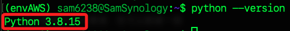
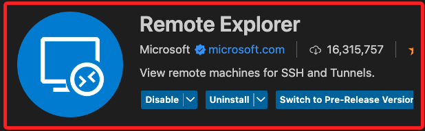

# 部署在 NAS

_將腳本部署到群暉 NAS，並設置每天早上八點自動執行以發送 LINE 通知_

## 準備工作

1. 進入套件中心，確認 NAS 已安裝 Python。

    

2. 使用 SSH 登入 NAS，檢查安裝版本。

```bash
python --version
```



3. 升級 pip。

```bash
python -m pip install --upgrade pip
```

4. 安裝所需的 Python 套件。

    ```bash
    pip install selenium pandas beautifulsoup4 lxml python-dotenv requests
    ```

5. 更新。

```bash
pip install --upgrade selenium
```

6. 檢查版本。

```bash
python -c "import selenium; print(selenium.__version__)"
```

## 安裝 Chromium

_略_

## 建立專案資料夾

1. 建立在 `~`

```bash
cd ~ && mkdir 00_MyScript_2025
```

## 建立虛擬環境

1. 進入 NAS。

```bash
ssh sam6238@nas
```

2. 切換路徑。

```bash
cd /var/services/homes/admin/PythonVenv
```

3. 建立虛擬環境。

```bash
python -m venv envPython
```

4. 編輯腳本；群暉預設的是使用 vim。 

```bash
vim ~/.profile
```

## 使用 VSCode

1. 安裝 `Remote Explorer`。



2. 連線後，寫入。

```bash
# 啟動虛擬環境
if [ -d "/volume1/homes/admin/PythonVenv/envPython" ]; then
    source /volume1/homes/admin/PythonVenv/envPython/bin/activate
fi
```

3. 退出後重新登入就會啟動虛擬環境，或透過以下指令確認虛擬環境是否啟動，如果成功會顯示虛擬環境的路徑。

```bash
echo $VIRTUAL_ENV
```


## 編輯腳本

1. 建立腳本。

```bash
touch exWG_notify.py .env
```

2. 在腳本所在目錄建立 `.env` 文件，並添加 LINE Notify 權杖。

```
LINE_NOTIFY=<填入自己的-Line-通知權杖>
```

2. 確保 `.env` 文件的權限設置正確，以保護敏感訊息。

```bash
chmod 600 .env
```

3. 編輯腳本。

2. 確保腳本具有執行權限。

```bash
chmod +x exWG_notify.py
```

## 測試腳本

1. 在設置自動化之前，先手動運行腳本以確保一切正常。

```bash
python exWG_notify.py
```

## 設置定時任務

1. 登入群暉 DSM，前往 控制台 > 任務排程。

2. 點擊 `建立（Create）` > `排程任務` > `使用者定期任務`。
   
3. 設置任務基本資訊，名稱、用戶、排程

4. 在 `任務設定` 的 `任務` 欄位輸入命令。

```bash
/usr/bin/python /volume1/scripts/schedule_notifier.py
```

1. 保存並測試任務：
   - 點擊 確定 保存任務。
   - 您可以選擇手動執行一次任務以確保其正常運行：
     - 選擇剛剛建立的任務，點擊 運行（Run）。
     - 檢查是否成功發送 LINE 通知。

### 步驟 5：處理 Selenium 的無頭瀏覽器

由於群暉 NAS 可能缺少圖形界面，請確保 Selenium 設置使用無頭模式（已在腳本中設置）。此外，確認 `chromedriver` 可以在無頭環境下運行。如果遇到問題，可以考慮安裝 `xvfb` 虛擬顯示伺服器：

1. 安裝 `xvfb`：
   ```bash
   sudo apt-get install xvfb
   ```

2. 修改定時任務的執行命令：
   - 使用 `xvfb-run` 來運行腳本：
     ```bash
     xvfb-run -a /usr/bin/python3 /volume1/scripts/schedule_notifier.py
     ```

### 步驟 6：確保腳本的穩定性

1. 日誌紀錄：
   - 為了更好地監控腳本運行情況，可以將腳本的輸出重定向到日誌文件。
   - 修改定時任務的執行命令：
     ```bash
     xvfb-run -a /usr/bin/python3 /volume1/scripts/schedule_notifier.py >> /volume1/scripts/schedule_notifier.log 2>&1
     ```
   - 這樣，所有的輸出和錯誤訊息都會記錄到 `schedule_notifier.log` 文件中，便於日後檢查。

2. 處理錯誤和異常：
   - 確保腳本中有適當的錯誤處理，以避免因未捕捉的異常而導致腳本中斷。
   - 考慮在腳本中添加更多的日誌訊息，以便更容易地排查問題。

### 步驟 7：額外優化（可選）

1. 虛擬環境（Virtual Environment）：
   - 為了隔離 Python 環境，您可以在 NAS 上建立虛擬環境。
     ```bash
     python3 -m venv /volume1/scripts/venv
     source /volume1/scripts/venv/bin/activate
     pip install selenium pandas beautifulsoup4 lxml python-dotenv requests
     ```
   - 修改定時任務的執行命令以激活虛擬環境：
     ```bash
     source /volume1/scripts/venv/bin/activate && xvfb-run -a python /volume1/scripts/schedule_notifier.py >> /volume1/scripts/schedule_notifier.log 2>&1
     ```

2. 安全性考量：
   - 確保腳本和 `.env` 文件的權限設置正確，避免敏感資訊洩露。
   - 定期檢查和更新安裝的軟件包，確保系統的安全性。

### 小結

通過上述步驟，您應該能夠成功將 Python 腳本部署到群暉 NAS，並設置為每天早上八點自動執行，以發送 LINE 通知。如果在過程中遇到任何問題，請檢查日誌文件中的錯誤訊息，並根據具體情況進行調整。

祝您順利完成部署！