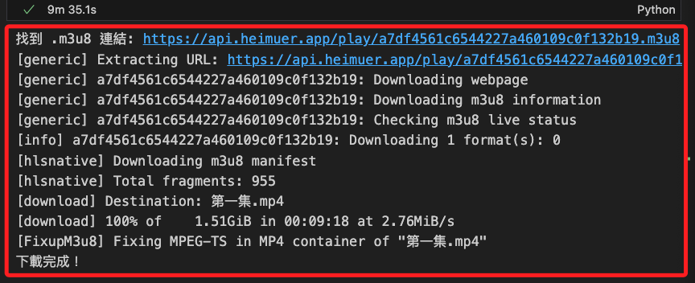

# Cimy

_[官網](https://www.cimy.cc/)_


<br>

## 說明

_以韓劇 `市政廳` 為例_

<br>

1. 下載第一集。

    ```python
    from selenium import webdriver
    from selenium.webdriver.chrome.service import Service
    from selenium.webdriver.common.by import By
    from bs4 import BeautifulSoup
    import yt_dlp
    import re
    import time
    import urllib.parse

    # 設定影片目標 URL 和下載選項
    episode_url = "https://www.cimy.cc/play/12615-1-1/"
    ydl_opts = {
        'format': 'bestvideo+bestaudio/best',
        'merge_output_format': 'mp4',
        'outtmpl': '第一集.%(ext)s'
    }

    # 設置 Selenium Chrome 瀏覽器
    options = webdriver.ChromeOptions()
    options.add_argument("--headless")
    options.add_argument("--no-sandbox")
    options.add_argument("--disable-dev-shm-usage")
    service = Service()
    driver = webdriver.Chrome(service=service, options=options)

    def get_m3u8_url_dynamic(page_url):
        driver.get(page_url)
        time.sleep(3)  # 等待頁面完全加載

        # 解析頁面 HTML 內容
        soup = BeautifulSoup(driver.page_source, 'html.parser')
        m3u8_url = None

        # 檢查每個 iframe 並嘗試獲取其內容中的 m3u8 連結
        for iframe in soup.find_all('iframe'):
            if 'src' in iframe.attrs:
                iframe_src = iframe['src']
                # 確保 URL 是完整的（若不是則自動補全）
                if not urllib.parse.urlparse(iframe_src).scheme:
                    iframe_src = urllib.parse.urljoin(page_url, iframe_src)

                # 訪問嵌入 iframe 網址
                driver.get(iframe_src)
                time.sleep(2)
                m3u8_match = re.search(r'https?://[^\s\'"]+\.m3u8', driver.page_source)
                if m3u8_match:
                    m3u8_url = m3u8_match.group(0)
                    break

        return m3u8_url

    # 開始解析和下載
    m3u8_url = get_m3u8_url_dynamic(episode_url)
    driver.quit()  # 關閉瀏覽器

    if m3u8_url:
        print(f"找到 .m3u8 連結: {m3u8_url}")
        try:
            with yt_dlp.YoutubeDL(ydl_opts) as ydl:
                ydl.download([m3u8_url])
            print("下載完成！")
        except yt_dlp.utils.DownloadError:
            print("下載失敗，請檢查 .m3u8 連結是否有效。")
    else:
        print("未找到有效的 .m3u8 連結。")
    ```

    

<br>

2. 批次下載 `1~20` 集。

    ```python
    from selenium import webdriver
    from selenium.webdriver.chrome.service import Service
    from bs4 import BeautifulSoup
    import yt_dlp
    import re
    import time
    import urllib.parse

    # 基本 URL 結構
    base_episode_url = "https://www.cimy.cc/play/12615-1-{}"  # URL 格式
    ydl_opts = {
        'format': 'bestvideo+bestaudio/best',  # 選擇最高解析度並確保包含音訊
        'merge_output_format': 'mp4',          # 合併為 mp4 格式
    }

    # 設置 Selenium Chrome 瀏覽器
    options = webdriver.ChromeOptions()
    options.add_argument("--headless")
    options.add_argument("--no-sandbox")
    options.add_argument("--disable-dev-shm-usage")
    service = Service()
    driver = webdriver.Chrome(service=service, options=options)

    def get_m3u8_url_dynamic(page_url):
        driver.get(page_url)
        time.sleep(3)  # 等待頁面完全加載

        # 解析頁面 HTML 內容
        soup = BeautifulSoup(driver.page_source, 'html.parser')
        m3u8_url = None

        # 檢查每個 iframe 並嘗試獲取其內容中的 m3u8 連結
        for iframe in soup.find_all('iframe'):
            if 'src' in iframe.attrs:
                iframe_src = iframe['src']
                # 確保 URL 是完整的（若不是則自動補全）
                if not urllib.parse.urlparse(iframe_src).scheme:
                    iframe_src = urllib.parse.urljoin(page_url, iframe_src)

                # 訪問嵌入 iframe 網址
                driver.get(iframe_src)
                time.sleep(2)
                m3u8_match = re.search(r'https?://[^\s\'"]+\.m3u8', driver.page_source)
                if m3u8_match:
                    m3u8_url = m3u8_match.group(0)
                    break

        return m3u8_url

    # 逐集解析和下載
    for episode_number in range(2, 21):
        episode_url = base_episode_url.format(episode_number)
        print(f"正在嘗試下載第 {episode_number} 集: {episode_url}")
        m3u8_url = get_m3u8_url_dynamic(episode_url)
        
        if m3u8_url:
            print(f"第 {episode_number} 集找到 .m3u8 連結: {m3u8_url}")
            output_filename = f"第{episode_number}集.%(ext)s"
            try:
                with yt_dlp.YoutubeDL({**ydl_opts, 'outtmpl': output_filename}) as ydl:
                    ydl.download([m3u8_url])
                print(f"第 {episode_number} 集下載完成！")
            except yt_dlp.utils.DownloadError:
                print(f"第 {episode_number} 集下載失敗，請檢查 .m3u8 連結是否有效。")
        else:
            print(f"第 {episode_number} 集未找到有效的 .m3u8 連結。")

    # 關閉瀏覽器
    driver.quit()
    ```

<br>

___

_繼續優化_