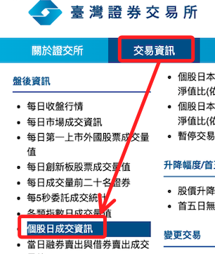
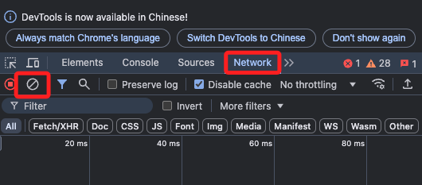
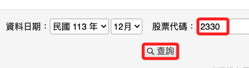
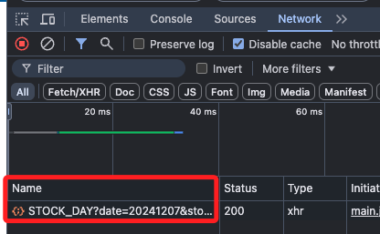
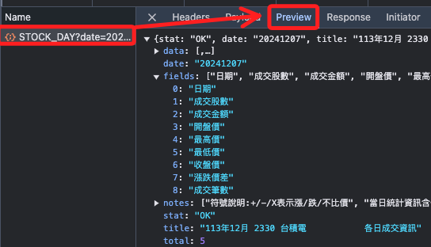
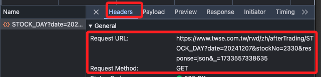
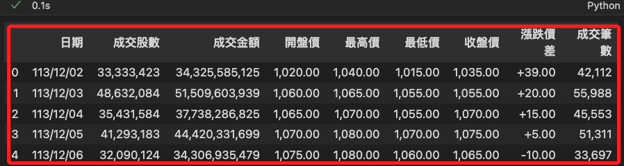

# 基礎爬蟲

_使用 Chrome 為例_

<br>

## 準備工作

1. 靜默安裝基本套件 `requests`、`pandas` 等，可使用終端機運行，若在筆記本中使用魔法指令安裝則需加上 `%`。

    ```bash
    pip install requests pandas -q
    ```

<br>

2. 進入[台灣證券交易所](https://www.twse.com.tw/zh/index.html)，切換頁籤到 `交易資訊`，並在左側選取 `個股日成交資訊`。

    

<br>

3. 點擊 `F12`，切換到 `Network` 頁籤，點擊 `清除`。

    

<br>

4. 輸入股票代碼，點擊查詢。

    

<br>

5. 會出現一個 `STOCK_DAY`。

    

<br>

6. 切換到 `Preview` 可查看是不是所要的資訊。

    

<br>

7. 切換到 `Headewrs` 可查看 URL。

    

<br>

## 腳本

1. 載入套件。

    ```python
    import requests 
    import json
    import pandas as pd
    ```

<br>

2. 編輯腳本。

    ```python
    # 貼上 URL
    url = 'https://www.twse.com.tw/rwd/zh/afterTrading/STOCK_DAY?date=20241207&stockNo=2330&response=json&_=1733557338635'
    # 使用 GET 方法
    response = requests.get(url)
    # 將取得的資料提取 TEXT 並轉換為 JSON
    data = json.loads(response.text)
    # 使用 pandas 顯示
    df = pd.DataFrame(data['data'],columns=data['fields'])
    # df.head()
    df
    ```

    

<br>

___

_END_