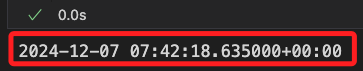

# 基礎爬蟲

_使用 Chrome 為例_

<br>

## 準備工作

1. 靜默安裝基本套件 `requests`、`pandas` 等，可使用終端機運行，若在筆記本中使用魔法指令安裝則需加上 `%`。

    ```bash
    pip install requests pandas -q
    ```

<br>

2. 進入[台灣證券交易所](https://www.twse.com.tw/zh/index.html)，切換頁籤到 `交易資訊`，並在左側選取 `個股日成交資訊`。

    

<br>

3. 在 `Chrome` 中點擊 `F12` 或使用組合鍵 `option+command+I` 開啟開發人員工具；切換到 `Network` 頁籤，先點擊 `清除` 圖標。

    

<br>

4. 在畫面中輸入股票代碼如 `2330`，接著點擊 `查詢` 按鈕。

    

<br>

5. 在出現的資料中有一個以 `STOCK_DAY` 為前綴的項目。

    

<br>

6. 點擊選取，並切換到 `Preview` 頁籤，展開收合的內容查看是不是所要的資訊。

    

<br>

7. 切換到 `Headewrs` 可查看 URL，這就是代碼中要使用的網址，其中尾綴的數字是時間戳，之後會補充說明。

    

<br>

## 腳本

_回到筆記本中_

<br>

1. 載入套件。

    ```python
    import requests 
    import json
    import pandas as pd
    ```

<br>

2. 編輯腳本。

    ```python
    # 貼上瀏覽器所查詢到的 URL
    url = 'https://www.twse.com.tw/rwd/zh/afterTrading/STOCK_DAY?date=20241207&stockNo=2330&response=json&_=1733557338635'
    # 使用 GET 方法
    response = requests.get(url)
    # 將取得的資料提取 TEXT 並轉換為 JSON
    data = json.loads(response.text)
    # 使用 pandas 顯示
    df = pd.DataFrame(data['data'],columns=data['fields'])
    # 輸出查看
    df
    ```

    

<br>

## 關於時間戳

1. 使用以下腳本可轉換時間戳。

    ```python
    from datetime import datetime, timezone

    # 更換為要轉換的時間戳
    timestamp_ms = 1733557338635
    # 將毫秒的時間戳轉換為秒
    timestamp_s = timestamp_ms / 1000

    # 使用 timezone-aware 的方式轉換為 UTC 日期時間
    utc_time = datetime.fromtimestamp(
        timestamp_s, 
        timezone.utc
    )

    print(utc_time)
    ```

    

<br>

___

_END_