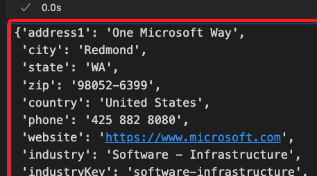
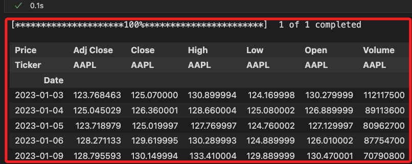
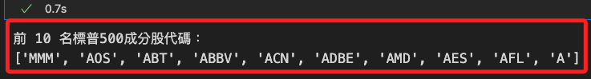
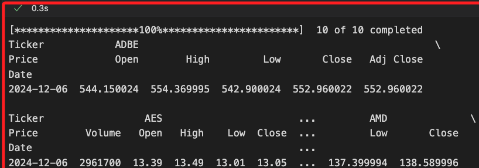
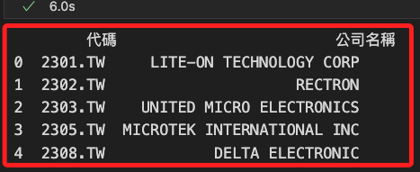
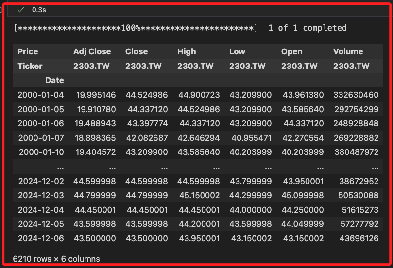
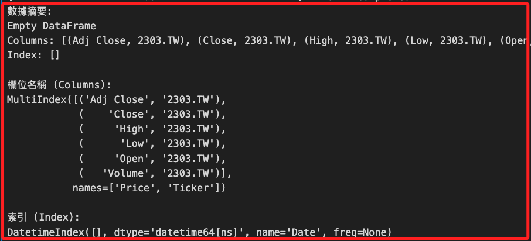
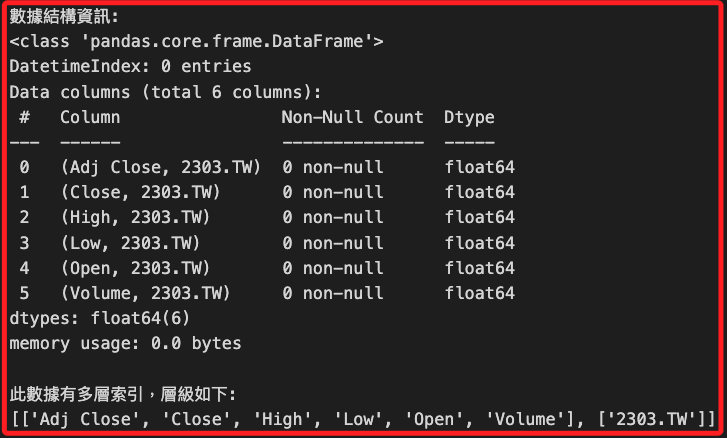

# yfinance

_從 Yahoo Finance 獲取金融數據的 Python 套件_

<br>

## 準備工作

1. 安裝套件。

    ```bash
    pip install yfinance -q
    ```

<br>

2. 獲取個股 `微軟 MSFT` 的基本訊息，會得到一個 JSON 文件，可進一步解析內容。

    ```python
    import yfinance as yf

    msft = yf.Ticker("MSFT")
    # 公司基本信息
    msft.info
    ```

    

<br>

3. 下載 `蘋果 AAPL` 歷史數據。

    ```python
    data = yf.download(
        "AAPL", 
        start="2023-01-01", 
        end="2024-11-01"
    )
    data.head()
    ```

    

<br>

4. 查詢 `S&P 500` 指數的成分股資訊。

    ```python
    import pandas as pd

    # 取得標普500成分股的股票代碼
    def get_sp500_tickers():
        url = "https://en.wikipedia.org/wiki/List_of_S%26P_500_companies"
        # 使用 pandas 讀取網頁表格
        table = pd.read_html(url)
        # 第一個表格包含成分股
        sp500_table = table[0]
        tickers = sp500_table["Symbol"].tolist()
        return tickers

    # 取得成分股
    sp500_tickers = get_sp500_tickers()

    # 顯示前 10 名股票代碼
    print("前 10 名標普500成分股代碼：")
    print(sp500_tickers[:10])
    ```

    

<br>

5. 如果需要額外股票資訊。

    ```python
    data = yf.download(
        sp500_tickers[:10], 
        period="1d", 
        group_by="ticker"
    )
    print(data)
    ```

    

<br>

## 查詢台股資料

_建立新的腳本_

<br>

1. 查詢有效的股票代碼及其公司名稱；假設不知道股票代碼情境下，可透過輸入範圍查詢股票代碼，這裡以 `2300 ~ 2310` 為例；另外，透過內建模組 `logging` 忽略代碼不存在可能產生的錯誤，借此簡化輸出作為觀察。

    ```python
    import yfinance as yf
    import pandas as pd
    import logging

    # 禁止不必要的錯誤日誌
    logging.getLogger("yfinance").setLevel(logging.CRITICAL)
    
    # 測試 2300.TW 到 2309.TW
    codes = [f"{i}.TW" for i in range(2300, 2310)]
    valid_codes = []

    for code in codes:
        try:
            stock = yf.Ticker(code)
            info = stock.info
            # 檢查是否包含 'shortName'
            if 'shortName' in info:
                valid_codes.append({
                    "代碼": code, 
                    "公司名稱": info['shortName']
                })
        except Exception:
            # 忽略錯誤，繼續處理其他代碼
            continue

    # 將結果轉為 DataFrame
    df_valid_codes = pd.DataFrame(valid_codes)

    # 顯示結果
    print(df_valid_codes)
    ```

    

<br>

2. 使用模組取得指定標的的數據，這裡以 `2303.TW` 為例。

    ```python
    # 標的名稱
    prod = "2303.TW"
    # 取得完整期間的數據，參數值設定為 `max`
    data = yf.download(prod, period="max")
    # 輸出
    data
    ```

    

<br>

## 數據結構

1. 透過以下代碼觀察返回的數據結構。

    ```python
    import pandas as pd
    import yfinance as yf

    # 代碼
    symbol = "2303.TW"
    # 載入數據，期間為 100 個交易日
    data = yf.download(symbol, period="100d")

    # 查看數據的基本結構
    print("數據摘要：")
    print(data.head())

    # 查看欄位名稱
    print("\n欄位名稱 (Columns)：")
    print(data.columns)

    # 查看索引
    print("\n索引 (Index)：")
    print(data.index)

    # 查看數據框架的結構
    print("\n數據結構資訊：")
    data.info()

    # 查看是否存在多層索引
    if isinstance(data.columns, pd.MultiIndex):
        print("\n此數據有多層索引，層級如下：")
        print(data.columns.levels)
    else:
        print("\n此數據為單層索引")
    ```

    

<br>

2. 結構。

    

<br>

___

_END_