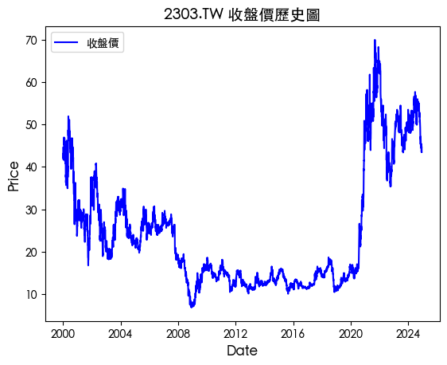

# 基礎繪圖

<br>

## 準備工作

1. 安裝套件。

    ```bash
    pip install matplotlib -q
    ```

<br>

2. 查看當前系統支援的字型。

    ```python
    import matplotlib.font_manager
    print([
        f.name for f in matplotlib.font_manager.fontManager.ttflist
    ])
    ```

    

<br>

## 腳本

_開啟新的筆記本_

<br>

1. 載入套件與字型，這裡使用 macOS 系統自帶的 `繁體黑體` 字體。

    ```python
    import yfinance as yf
    import pandas as pd
    import matplotlib

    # 更改為可用字型名稱
    matplotlib.rc('font', family='Heiti TC')
    ```

<br>

2. 使用以下簡易代碼測試字體。

    ```python
    import matplotlib.pyplot as plt
    import matplotlib
    import numpy as np
    # 測試數據
    x = np.linspace(0, 10, 100)
    y = np.sin(x)

    # 建立圖表
    plt.figure(figsize=(8, 6))
    plt.plot(x, y, label="正弦波")

    # 測試中文字體顯示
    plt.title("測試字體：Heiti TC", fontsize=16)
    plt.xlabel("X 軸", fontsize=12)
    plt.ylabel("Y 軸", fontsize=12)
    plt.legend(loc="upper right", fontsize=10)

    # 顯示網格
    plt.grid(True, linestyle="--", alpha=0.6)

    # 顯示圖表
    plt.show()
    ```

    

<br>

## 繪製線圖

1. 繪製折線圖。

    ```python
    import yfinance as yf
    import pandas as pd
    import matplotlib.pyplot as plt

    # 商品名稱
    prod = "2303.TW"
    # 取得全部資料
    data = yf.download(prod, period="max")

    # 繪製折線圖
    plt.plot(
        data.index, 
        data['Close'], 
        label='收盤價', 
        color='blue'
    )

    # 添加圖例
    plt.legend()

    # 添加標題與軸標籤
    plt.title(f"{prod} 收盤價歷史圖", fontsize=14)
    plt.xlabel("Date", fontsize=12)
    plt.ylabel("Price", fontsize=12)

    # 顯示圖表
    plt.show()
    ```

    

<br>

2. 繪製多條線。

    ```python
    import matplotlib.pyplot as plt

    # 建立一個新圖表
    plt.figure(figsize=(10, 6))

    # 使用 plt.plot 繪圖
    plt.plot(
        (data['Close'].pct_change() + 1).cumprod(), 
        label='報酬率', 
        linewidth=2
    )
    # 繪製第二條線
    plt.plot(
        (data['Adj Close'].pct_change() + 1).cumprod(), 
        label='還原除權息後報酬率', 
        linewidth=2
    )

    # 添加標題和標籤
    plt.title("報酬率與還原除權息後報酬率", fontsize=14)
    plt.xlabel("Date", fontsize=12)
    plt.ylabel("累積報酬率", fontsize=12)

    # 添加圖例
    plt.legend(fontsize=12)

    # 添加網格
    plt.grid()

    # 顯示圖表
    plt.show()
    ```

    

<br>

## 均線圖

1. 合併。

    ```python
    # 設定圖表的大小為寬 10、高 6 英寸
    plt.figure(figsize=(10, 6))

    # 繪製收盤價折線圖
    plt.plot(
        # 2023~2024 年的收盤價
        data.loc['2023':'2024', 'Close'], 
        # 圖例名稱為「收盤價」
        label='收盤價', 
        # 線條寬度為 2
        linewidth=2
    )

    # 繪製20日移動平均線
    plt.plot(
        # rolling 表示移動、mean 是平均
        data.loc['2023':'2024', 'Close'].rolling(20).mean(), 
        label='月均線', 
        linewidth=2
    )

    # 繪製60日移動平均線
    plt.plot(
        data.loc['2023':'2024', 'Close'].rolling(60).mean(), 
        label='季均線', 
        linewidth=2
    )

    # 添加標題
    plt.title("2023-2024 收盤價與均線", fontsize=14)
    # X、Y 軸標籤
    plt.xlabel("Date", fontsize=12)
    plt.ylabel("價格", fontsize=12)
    # 添加圖例
    plt.legend(fontsize=12)
    # 添加網格
    plt.grid()
    # 顯示圖表
    plt.show()
    ```

    

<br>

## K 線圖

_K 線圖用於展示一段時間內股票或其他金融資產價格變動的技術圖表，可以分為 `OHLC 圖` 和 `蠟燭圖` 兩種主要形式；OHLC 就是 `Open-High-Low-Close`。_

<br>

1. 安裝套件。

    ```bash
    pip install mplfinance -q
    ```

<br>

2. 使用 `mplfinance` 繪製線條圖時，預設就是 `ohlc`。

    ```python
    import mplfinance as mpf
    # 簡化欄位名稱，移除 MultiIndex 的第二層索引
    data.columns = data.columns.droplevel(1)

    # 清理資料，將 Open 欄位轉換為數值
    data['Open'] = pd.to_numeric(
        data['Open'], 
        errors='coerce'
    )
    # 移除 NaN 值
    data = data.dropna(subset=['Open'])

    # 繪製線圖，最後 10 筆資料
    mpf.plot(data.iloc[-10:])
    ```

    

<br>

3. 加入參數設定對圖形作優化。

    ```python
    import mplfinance as mpf
    from matplotlib import rcParams
    import matplotlib.pyplot as plt

    # 設置支持中文顯示的字體
    rcParams['font.family'] = 'Heiti TC'
    # 確保負號正常顯示
    rcParams['axes.unicode_minus'] = False

    # 簡化欄位名稱，僅在 MultiIndex 時執行移除第二層索引的操作
    if isinstance(data.columns, pd.MultiIndex):
        data.columns = data.columns.droplevel(1)

    # 清理資料，將 Open 欄位轉換為數值
    data['Open'] = pd.to_numeric(data['Open'], errors='coerce')
    # 移除 NaN 值
    data = data.dropna(subset=['Open'])

    # 使用 returnfig=True 獲取圖表對象
    fig, axlist = mpf.plot(
        data.iloc[-10:],
        # 設置圖表類型為 OHLC 條形圖
        type='ohlc',
        # Y 軸標籤
        ylabel='',
        # 下方標籤留空
        ylabel_lower='',
        # 使用預設樣式
        style='yahoo',
        # 設置圖表尺寸
        figsize=(10, 6),
        # 返回圖形對象
        returnfig=True
    )

    # 手動添加 Y 軸標籤，確保中文字顯示正確
    axlist[0].set_ylabel(
        '價格', 
        fontsize=12, 
        fontname='Heiti TC'
    )

    # 添加中文標題，設置字體
    fig.suptitle(
        "OHLC 條形圖", 
        fontsize=16, 
        fontweight='bold', 
        # 提高標題位置
        y=0.98,
        fontproperties=plt.matplotlib.font_manager.FontProperties(
            family='Heiti TC'
        )
    )

    # 調整圖表布局，保留上方空間給標題
    fig.subplots_adjust(top=0.88)

    # 顯示圖表
    mpf.show()
    ```

    

<br>

# K 線圖

_蠟燭圖_

<br>

1. 基礎圖形。

    ```python
    mpf.plot(data.iloc[-10:], type="candle")
    ```

    

<br>

2. 列出 mplfinance 中支持的所有樣式。

    ```python
    print(mpf.available_styles())
    ```

    

<br>

3. 調整樣式。

    ```python
    mpf.plot(
        data.iloc[-10:], 
        type="candle", 
        style="yahoo"
    )
    ```

    

<br>

4. 轉換 K 線顏色與台灣相同，上漲以紅色表示、下跌以綠色表示。

    ```python
    mcolor = mpf.make_marketcolors(
        up="r", down="g", inherit=True
    )
    mstyle = mpf.make_mpf_style(
        base_mpf_style="yahoo", 
        marketcolors=mcolor
    )
    mpf.plot(
        data.iloc[-10:], 
        type="candle", 
        style=mstyle
    )
    ```

    

<br>

## 繪製 K 線圖與移動均線

1. 代碼。

    ```python
    from matplotlib import font_manager as fm

    # 設定字型為 Heiti TC
    font_prop = fm.FontProperties(family='Heiti TC')

    # 取得全部資料
    data = yf.download(prod, period="max")

    # 簡化欄位名稱（將 MultiIndex 轉換為單層索引）
    data.columns = data.columns.droplevel(1)

    # 確保數據欄位為數字，移除非數字值
    data = data.dropna(subset=[
        "Open", "High", "Low", "Close", "Volume"
    ])
    data = data.astype({
        "Open": "float", 
        "High": "float", 
        "Low": "float", 
        "Close": "float", 
        "Volume": "float"
    })

    # 修改 K 線顏色，上漲紅，下跌綠
    mcolor = mpf.make_marketcolors(
        up="r", down="g", inherit=True
    )
    mstyle = mpf.make_mpf_style(
        base_mpf_style="yahoo", 
        marketcolors=mcolor
    )

    # 計算移動平均線
    data["5ma"] = data["Close"].rolling(5).mean()
    data["20ma"] = data["Close"].rolling(20).mean()
    data["60ma"] = data["Close"].rolling(60).mean()

    # 選取最近 200 筆資料
    data = data.iloc[-200:].copy()

    # 添加移動平均線
    addp = [
        mpf.make_addplot(data["5ma"], color="blue", width=1),
        mpf.make_addplot(data["20ma"], color="orange", width=1),
        mpf.make_addplot(data["60ma"], color="green", width=1),
    ]

    # 繪製蠟燭圖
    fig, axlist = mpf.plot(
        data,
        type="candle",
        style=mstyle,
        addplot=addp,
        ylabel="Price",
        volume=True,
        figratio=(12, 6),
        # 返回圖形對象
        returnfig=True
    )

    # 手動設置標題字型
    axlist[0].set_title(
        "2303.TW 蠟燭圖與移動平均線", fontproperties=font_prop
    )
    # 設定 Y 軸標題，並指定字型
    axlist[0].set_ylabel(
        "價格 (Price)", fontproperties=font_prop
    )
    # 第二個軸是成交量
    axlist[2].set_ylabel(
        "成交量 (Volume)", fontproperties=font_prop
    )

    plt.show()
    ```

    

<br>

___

_END_