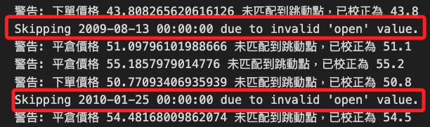
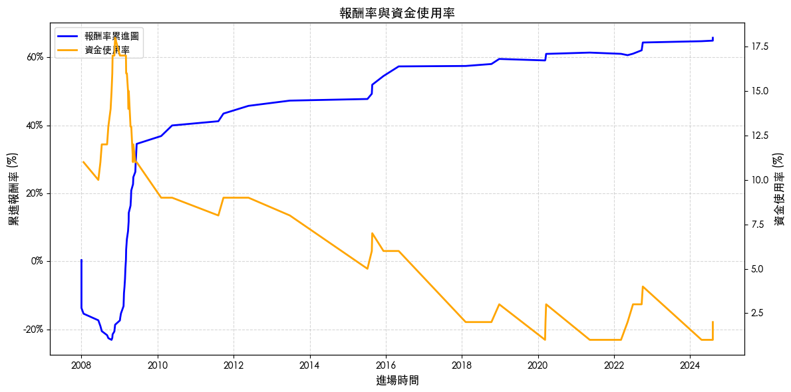

# 網格回測

_正式進入網格交易回測作業_

<br>

## 部位管理

_建立一個模組_

<br>

1. 新增一個腳本作為模組 `grid_backtest.py`。

    ```bash
    touch grid_backtest.py
    ```

<br>

2. 導入庫。

    ```python
    import pandas as pd
    from json import loads
    import requests
    import os
    from datetime import datetime
    ```

<br>

3. 定義主類別 `Trade`。

    ```python
    # 主類別
    class Trade:
        
        # 初始化函數：時間、價格、單位
        def __init__(self, init_time, init_price, init_unit):

            # 建立交易明細表
            self.position_table = pd.DataFrame(
                {
                    "進場時間": [init_time] * init_unit,
                    "進場價格": [init_price] * init_unit,
                    "出場時間": [None] * init_unit,
                    "出場價格": [None] * init_unit,
                }
            )

            # 股票最小跳動點價格集合
            self.stock_price_list = (
                [i / 100 for i in range(1, 1001)]
                + [10 + (i / 100) for i in range(5, 4005, 5)]
                + [50 + (i / 10) for i in range(1, 501)]
                + [100 + (i / 10) for i in range(5, 4005, 5)]
                + [500 + (i) for i in range(1, 501)]
                + [1000 + (i) for i in range(5, 4005, 5)]
            )

        # 查在倉部位
        def position(self):
            return self.position_table[
                self.position_table["出場時間"].isna()
            ].shape[0]

        # 平倉
        def cover(self, time, price):
            excute_price = max([
                i for i in self.stock_price_list if i <= round(price, 2)
            ])
            for index, row in self.position_table.iterrows():
                if row["出場時間"] is None:
                    self.position_table.loc[index, "出場時間"] = time
                    self.position_table.loc[index, "出場價格"] = excute_price
                    break

        # 新倉
        def order(self, time, price):
            excute_price = min([
                i for i in self.stock_price_list if i >= round(price, 2)
            ])
            new_trade = pd.DataFrame(
                [[
                    time, 
                    excute_price, 
                    None, 
                    None, 
                    self.position() + 1
                ]]
            )
            new_trade.columns = [
                "進場時間",
                "進場價格",
                "出場時間",
                "出場價格",
                "買進後持有",
            ]
            self.position_table = pd.concat([
                self.position_table, new_trade
            ])
            self.position_table.reset_index(
                drop=True, 
                inplace=True
            )

        # 轉換年分
        def convertYearFormat(self, date):
            # date = '100年01月01日'
            date1 = date.replace("年", "-").replace("月", "-").replace("日", "")
            date2 = date1.split("-")
            date3 = "-".join([
                str(int(date2[0]) + 1911), 
                date2[1], 
                date2[2]
            ])
            return date3

        def restoreReturn(self, symbol):
            dirname = "data"
            if not os.path.exists(dirname):
                os.makedirs(dirname)
            dividend_filename = f"{dirname}/上市除權息表.csv"
            if not os.path.exists(dividend_filename):
                today = datetime.now().strftime("%Y%m%d")
                url = f"https://www.twse.com.tw/rwd/zh/exRight/TWT49U?startDate=20080101&endDate={today}&response=json&_=1706148539236"
                html = requests.get(url)
                dividend_data = loads(html.text)
                dividend_table = pd.DataFrame(
                    dividend_data["data"], 
                    columns=dividend_data["fields"]
                )
                dividend_table.to_csv(
                    dividend_filename, 
                    index=False, 
                    encoding="cp950"
                )

            # 取得除權息數據
            dividend_table = pd.read_csv(
                dividend_filename, 
                encoding="cp950"
            )
            # 轉換以民國表示的日期
            dividend_table["西元日期"] = dividend_table["資料日期"].apply(
                self.convertYearFormat
            )
            dividend_table_one = dividend_table[dividend_table["股票代號"] == symbol].copy()
            dividend_table_one["西元日期"] = pd.to_datetime(
                dividend_table_one["西元日期"] + " 09:00"
            )


            # 判斷 每一筆交易 當中有沒有包含除權息的資料
            # 明確設為浮點型
            self.position_table["還原除權息"] = 0.0
            for index, row in self.position_table[
                self.position_table["出場時間"].notna()
            ].iterrows():
                # 每一筆交易明細 都要判斷每個除權息日
                for index1, row1 in dividend_table_one.iterrows():
                    if (row["進場時間"] <= row1["西元日期"]) and (
                        row["出場時間"] >= row1["西元日期"]
                    ):
                        self.position_table.loc[index, "還原除權息"] += float(row1["權值+息值"])
    ```

<br>

## 網格交易參數設定

_開啟新的 `.ipynb` 腳本_

<br>

1. 載入庫與字型。

    ```python
    import mplfinance as mpf
    import matplotlib.pyplot as plt
    import pandas as pd
    import yfinance as yf
    from grid_backtest import Trade
    
    # 字型
    plt.rcParams['font.sans-serif'] = ['Microsoft JhengHei']
    ```

<br>

2. 指定標的股，這裡使用 `0050` 的 `元大寶來台灣卓越50`。

    ```python
    # 金融商品設定
    symbol = '0050' 
    ```

<br>

3. 設定網格交易參數。

    ```python
    # 設定初始部位為 50%
    init_ratio = 50
    # 設定網格間距為 8%
    grid_gap = round(0.08, 2)
    # 設定交易單位，每次交易佔總資金為 5%，也就是最多持有 20 個單位
    grid_unit = 5
    # 初始部位是幾個交易單位
    if init_ratio % grid_unit != 0:
        print('***出現錯誤！初始部位要可以被交易單位整除***')
    init_unit = int(init_ratio / grid_unit)
    # 上漲跟下跌網格差距比率
    up_down_grid_gap_diff = 1
    ```

<br>

4. 下載完整數據，預設從 `2008` 年開始。

    ```python
    # 下載數據
    data = yf.download(f'{symbol}.TW')
    ```

    

<br>

5. 若要下載指定的期間，加入起訖日期作為參數。

    ```python
    # 起始日期
    START_DATE = '2020-01-01'
    # 終止日期
    END_DATE = '2023-01-01'

    # 下載數據
    data = yf.download(
        f'{symbol}.TW', 
        start=START_DATE, 
        end=END_DATE
    )
    ```

<br>

6. 接下是以下載完整數據為例，下載後查看結果，共計 `4157` 筆，欄位有 `6` 個。

    ```python
    data
    ```

    

<br>

7. 查看欄位資訊，可看到結果顯示了 `復合欄位資訊`，也就是欄位具備 `多重索引（MultiIndex）`，欄位數據中會包含多層次的訊息；以本例來說，第一個層次是價格資訊，用於描述收盤價、開盤價等，第二個層次是股票代碼，在這就是 `0050.TW`。

    ```python
    print(data.columns)
    ```

    

<br>

## 關於多層次索引

_多層次索引適合表示屬性和層次結構較為複雜的數據，例如股票價格、時間序列等，以下依據前項所得到的欄位資訊進行說明_

<br>

1. 直接使用多層次索引的 `單層名稱` 進行選取。

    ```python
    # 選取 `Adj Close` 的數據
    adj_close_data = data['Adj Close']
    print(adj_close_data)
    ```

    

<br>

2. 直接通過 `元組形式` 指定多層索引的名稱來選取數據。

    ```python
    # 選取 `Close` 及商品代碼為 `0050.TW`
    close_0050 = data[('Close', '0050.TW')]
    print(close_0050)
    ```

    

<br>

3. 使用 `.xs()` 方法選取某一層的所有數據。

    ```python
    # 選擇 'Adj Close' 層次的數據
    adj_close = data.xs(key='Adj Close', level='Price', axis=1)
    print(adj_close)
    ```

    

<br>

4. 使用 `.loc` 從多層次索引中選擇指定的欄位。

    ```python
    # 選取多層次數據範圍
    subset = data.loc[
        :, [('Adj Close', '0050.TW'), ('High', '0050.TW')]
    ]
    print(subset)
    ```

    

<br>

5. 對指定層次進行統計或分析。

    ```python
    # 按 Price 層進行統計
    stats = data.groupby(level='Price', axis=1).mean()
    print(stats)
    ```

    

<br>

## 數據清理

_由於只需欄位中的價格資訊，所以將復合欄位簡化為單層索引，將多層次部分通過下劃線 `_` 連接起來。_

<br>

1. 將 `MultiIndex` 欄位名稱簡化為 `單層索引`。

    ```python
    # 簡化 MultiIndex 為單層索引
    data.columns = [
        '_'.join(col).lower() for col in data.columns
    ]
    print(data.columns)
    ```

<br>

2. 移除商品代碼後綴，保留核心欄位名稱。

    ```python
    data.columns = [
        col.split('_')[0].lower() for col in data.columns
    ]
    print(data.columns)
    ```

    

<br>

## 網格交易參數

1. 設定初始交易參數。

    ```python
    # 期初買入張數
    init_time = data.index[0]
    # 確保欄位名為 'open'
    init_price = data.loc[data.index[0], 'open']
    # 取出第一筆數據的時間和開盤價，作為初始時間和初始價格
    trade_position = Trade(init_time, init_price, init_unit)
    ```

<br>

2. 網格交易策略演算法；特別注意，以下代碼已經加入優化，其中兩筆 `open` 欄位的值無效，已經被排除處理。

    ```python
    # 設置最大迴圈次數，防止無限迴圈
    max_iterations = 100
    # 設置最小價格限制
    min_price_limit = 1e-2

    for index, row in data.iterrows():
        # 跳過數據異常的行
        if row["open"] == 0 or pd.isna(row["open"]):
            print(f"Skipping {index} due to invalid 'open' value.")
            continue

        # 優先執行比較差的狀況(賣出)
        iterations = 0
        while row["open"] >= init_price * (1 + grid_gap * up_down_grid_gap_diff):
            if iterations > max_iterations:
                print(f"Reached max iterations at {index} (sell: open >= target).")
                print(f"Current open: {row['open']}, init_price: {init_price}, target: {init_price * (1 + grid_gap * up_down_grid_gap_diff)}")
                break
            # 模擬網格交易策略中，當價格達到某個條件，更新基準價格。
            # 如價格上漲到設定的網格，基準價格需要上調以匹配網格間距。
            init_price *= 1 + grid_gap * up_down_grid_gap_diff
            # 確保 init_price 不會因多次計算而變得過小，導致非理性結果或浮點數精度問題
            if init_price < min_price_limit:
                print(f"Resetting init_price to minimum at {index}.")
                init_price = min_price_limit
            trade_position.cover(index, row["open"])
            iterations += 1

        iterations = 0
        while row["high"] >= init_price * (1 + grid_gap * up_down_grid_gap_diff):
            if iterations > max_iterations:
                print(f"Reached max iterations at {index} (sell: high >= target).")
                print(f"Current high: {row['high']}, init_price: {init_price}, target: {init_price * (1 + grid_gap * up_down_grid_gap_diff)}")
                break
            # 更新基準價格，根據網格間距和上升比例調整
            init_price *= 1 + grid_gap * up_down_grid_gap_diff
            # 如果更新後的基準價格小於設定的最低限制
            if init_price < min_price_limit:
                print(f"Resetting init_price to minimum at {index}.")
                init_price = min_price_limit
            # 執行賣出操作，按當前基準價格進行交易
            trade_position.cover(index, init_price)
            # 增加迴圈計數器，記錄迴圈執行次數
            iterations += 1

        # 再考慮(買進)
        iterations = 0
        while row["open"] <= init_price * (1 - grid_gap):
            if iterations > max_iterations:
                print(f"Reached max iterations at {index} (buy: open <= target).")
                print(f"Current open: {row['open']}, init_price: {init_price}, target: {init_price * (1 - grid_gap)}")
                break
            init_price *= 1 - grid_gap
            if init_price < min_price_limit:
                print(f"Resetting init_price to minimum at {index}.")
                init_price = min_price_limit
            if trade_position.position() < 100 / grid_unit:
                trade_position.order(index, row["open"])
            iterations += 1

        iterations = 0
        while row["low"] <= init_price * (1 - grid_gap):
            if iterations > max_iterations:
                print(f"Reached max iterations at {index} (buy: low <= target).")
                print(f"Current low: {row['low']}, init_price: {init_price}, target: {init_price * (1 - grid_gap)}")
                break
            init_price *= 1 - grid_gap
            if init_price < min_price_limit:
                print(f"Resetting init_price to minimum at {index}.")
                init_price = min_price_limit
            if trade_position.position() < 100 / grid_unit:
                trade_position.order(index, init_price)
            iterations += 1
    ```

    

<br>

3. 最後一天的資料，將所有部位出場，清空所有持有部位，確保整個回測結束時沒有遺留持倉，便於計算最終的績效指標，例如總收益或年化報酬率。

    ```python
    while trade_position.position() > 0:
        trade_position.cover(index, row['close'])
    ```

<br>

4. 檢查進出紀錄，總共出現 `73` 次交易進出。

    ```python
    trade_position.position_table
    ```

    

<br>

## 除權息

1. 調用函數來反應除權與除息的數據，完成後調用函數再次觀察紀錄。

    ```python
    # 還原除權息
    trade_position.restoreReturn(symbol)
    # 檢查進出紀錄
    trade_position.position_table
    ```

    

<br>

2. 計算報酬率。

    ```python
    position_table = trade_position.position_table
    position_table['單筆報酬'] = (
        position_table['出場價格'] - \
        position_table['進場價格'] + \
        position_table['還原除權息']
    )
    position_table['單筆報酬率'] = \
        position_table['單筆報酬'] / \
        position_table['進場價格'] * \
        (grid_unit/100)
    total_return = (position_table['單筆報酬率']).sum() + 1
    print(f'總報酬率:{round(total_return-1,4)}')
    yearly_return = total_return ** (1/(data.shape[0]/252))-1
    print(f'年化報酬率:{round(yearly_return,4)}')
    ```

    

<br>

## 繪圖

1. 報酬率曲線圖及各時間點資金使用比例。

    ```python
    import matplotlib
    import matplotlib.pyplot as plt
    from matplotlib.ticker import PercentFormatter

    # 使用系統預設字體名稱
    matplotlib.rc('font', family='Heiti TC')
    # 確保負號顯示正常
    matplotlib.rc('axes', unicode_minus=False)

    # 建立圖表
    fig, ax1 = plt.subplots(figsize=(12, 6))

    # 繪製報酬率累進圖
    line1, = ax1.plot(
        position_table.set_index('進場時間')['單筆報酬率'].cumsum(),
        label='報酬率累進圖',
        color='blue',
        linewidth=2
    )
    ax1.set_ylabel(
        "累進報酬率 (%)", 
        fontsize=12
    )
    # 設置為百分比格式
    ax1.yaxis.set_major_formatter(PercentFormatter(1))
    ax1.set_xlabel(
        "進場時間", 
        fontsize=12
    )

    # 繪製資金使用率（副軸）
    ax2 = ax1.twinx()
    line2, = ax2.plot(
        position_table.set_index('進場時間')['買進後持有'],
        label='資金使用率',
        color='orange',
        linewidth=2
    )
    ax2.set_ylabel(
        "資金使用率 (%)", 
        fontsize=12
    )

    # 合併圖例
    lines = [line1, line2]
    labels = [line.get_label() for line in lines]
    ax1.legend(
        lines, 
        labels, 
        loc='upper left', 
        fontsize=12
    )

    # 添加標題
    plt.title(
        "報酬率與資金使用率", 
        fontsize=14
    )

    # 添加網格線
    ax1.grid(
        visible=True, 
        linestyle='--', 
        alpha=0.5
    )

    # 確保佈局不重疊
    plt.tight_layout()

    # 顯示圖表
    plt.show()
    ```

    

<br>

2. 繪製 `K 線圖` 與下單點位；以下使用 `pd.to_datetime` 確保所有時間類型的索引一致，避免 `pd.concat` 操作時出現索引類型不匹配的情況，並應用 `.infer_objects()` 或顯式地轉換數據類型來確保兼容性。

    ```python
    # 確保索引類型一致
    position_table["進場時間"] = pd.to_datetime(position_table["進場時間"])
    position_table["出場時間"] = pd.to_datetime(position_table["出場時間"])
    data.index = pd.to_datetime(data.index)

    # 合併數據
    data1 = pd.concat(
        [
            data, 
            position_table.groupby("進場時間")["進場價格"].first()
        ], 
        axis=1
    )

    # 第二次合併，處理出場價格
    data1 = pd.concat(
        [
            data1,
            position_table.set_index("出場時間")["出場價格"].groupby("出場時間").first(),
        ],
        axis=1,
    )

    # 添加繪圖參數
    addp = []
    addp.append(
        mpf.make_addplot(
            data1["進場價格"], 
            scatter=True, 
            marker="^", 
            color="r"
        )
    )
    addp.append(
        mpf.make_addplot(
            data1["出場價格"], 
            scatter=True, 
            marker="v", 
            color="g"
        )
    )

    # 設置樣式
    mcolor = mpf.make_marketcolors(
        up="red", 
        down="green", 
        inherit=True
    )
    mstyle = mpf.make_mpf_style(
        base_mpf_style="yahoo", 
        marketcolors=mcolor
    )

    # 繪製蠟燭圖
    mpf.plot(
        data, 
        type="candle", 
        addplot=addp, 
        style=mstyle, 
        warn_too_much_data=999999
    )
    ```

    

<br>

___

_END_
