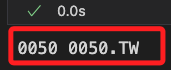
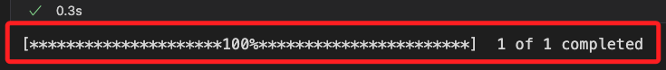
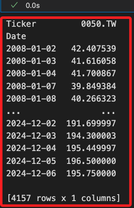
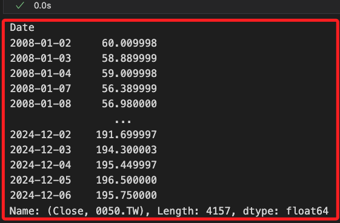
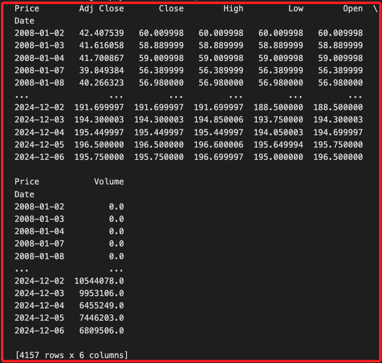

# 網格交易

_開始進行網格交易_

<br>

## 參數設定

_開啟新的 `.ipynb` 腳本_

<br>

1. 設定基礎資訊；原始範例是使用 `0050` 的 `元大寶來台灣卓越50`，可自行設定。

    ```python
    # 導入基本庫
    import yfinance as yf

    # 定義股票代碼基礎部分
    symbol_base = '00795B'
    # 指定起訖起日期，這未必使用
    START_DATE = '2020-01-01'
    END_DATE = '2023-01-01'
    ```

<br>

2. 檢查並轉換股票代碼；這在前面已經說明過，不再贅述。

    ```python
    # 定義尾綴列表
    suffixes = ['.TW', '.TWO']
    # 搜索有效代碼
    valid_symbol = None
    for suffix in suffixes:
        # 組合測試代碼
        symbol = f"{symbol_base}{suffix}"
        try:
            # 測試是否能下載最小數據集
            data = yf.download(symbol, period='1d')
            # 如果數據不為空，則該代碼有效
            if not data.empty:
                valid_symbol = symbol
                print(f"有效代碼：{valid_symbol}")
                break
        except Exception as e:
            print(f"代碼 {symbol} 無效: {e}")

    # 結果
    if valid_symbol:
        print(f"找到有效代碼：{valid_symbol}")
    else:
        print("未找到有效的代碼，請檢查輸入或尾綴列表。")
    ```

    

<br>

3. 載入庫與字型。

    ```python
    import mplfinance as mpf
    import matplotlib.pyplot as plt
    import pandas as pd
    from grid_backtest import Trade

    # 字型
    plt.rcParams['font.sans-serif'] = ['Microsoft JhengHei']
    ```

<br>

4. 將前面步驟驗證過的代碼轉換為後續所需的變數。

    ```python
    # 標的代碼，就是用作檢查的股票代碼
    symbol = symbol_base
    # 就是組合後的股票代碼
    ticker = valid_symbol
    # 簡單輸出查看
    print(symbol, ticker)
    ```

    

<br>

5. 設定網格交易參數。

    ```python
    # 設定初始部位為 50%
    init_ratio = 50
    # 設定網格間距為 8%
    grid_gap = round(0.08, 2)
    # 設定交易單位，每次交易佔總資金為 5%，也就是最多持有 20 個單位
    grid_unit = 5
    # 初始部位是幾個交易單位
    if init_ratio % grid_unit != 0:
        print('***出現錯誤！初始部位要可以被交易單位整除***')
    init_unit = int(init_ratio / grid_unit)
    # 上漲跟下跌網格差距比率
    up_down_grid_gap_diff = 1
    ```

<br>

6. 下載完整數據，預設從 `2008` 年開始。

    ```python
    # 下載數據
    data = yf.download(ticker)
    ```

    

<br>

7. 若要下載指定的期間，加入起訖日期作為參數，期間已在前面步驟建立；若沒有要指定期間，可跳過這步驟。

    ```python
    # 下載指定日期數據
    data = yf.download(
        ticker, 
        start=START_DATE, 
        end=END_DATE
    )
    ```

<br>

8. 接下是以下載完整數據為例，下載後查看結果，共計 `4157` 筆，欄位有 `6` 個。

    ```python
    data
    ```

    

<br>

9. 查看欄位資訊，可看到結果顯示了 `復合欄位資訊`，也就是欄位具備 `多重索引（MultiIndex）`，欄位數據中會包含多層次的訊息；以本例來說，第一個層次是價格資訊，用於描述收盤價、開盤價等，第二個層次是股票代碼，在這就是 `0050.TW`。

    ```python
    print(data.columns)
    ```

    

<br>

## 關於多層次索引

_多層次索引適合表示屬性和層次結構較為複雜的數據，例如股票價格、時間序列等，以下依據前項所得到的欄位資訊進行說明_

<br>

1. 直接使用多層次索引的 `單層名稱` 進行選取。

    ```python
    # 選取 `Adj Close` 的數據
    adj_close_data = data['Adj Close']
    print(adj_close_data)
    ```

    

<br>

2. 直接通過 `數組形式` 指定多層索引的名稱來選取數據。

    ```python
    # 選取 `Close` 及商品代碼為 `0050.TW`
    close_0050 = data[('Close', ticker)]
    print(close_0050)
    ```

    

<br>

3. 使用 `.xs()` 方法選取某一層的所有數據。

    ```python
    # 選擇 'Adj Close' 層次的數據
    adj_close = data.xs(
        key='Adj Close', 
        level='Price', 
        axis=1
    )
    print(adj_close)
    ```

    

<br>

4. 使用 `.loc` 從多層次索引中選擇指定的欄位。

    ```python
    # 選取多層次數據範圍
    subset = data.loc[
        :, [('Adj Close', ticker), ('High', ticker)]
    ]
    print(subset)
    ```

    

<br>

5. 對指定層次進行統計或分析。

    ```python
    # 按 Price 層進行統計
    stats = data.groupby(level='Price', axis=1).mean()
    print(stats)
    ```

    

<br>

## 特徵工程

_由於只需欄位中的價格資訊，所以將復合欄位簡化為單層索引_

<br>

1. 將 `MultiIndex` 欄位名稱簡化為 `單層索引`，將名稱轉換為小寫，並使用下底線 `_` 將名稱結合；特別注意，這會修改原始數據，切勿重複運行。

    ```python
    # 簡化 MultiIndex 為單層索引
    data.columns = [
        '_'.join(col).lower() for col in data.columns
    ]
    print(data.columns)
    ```

    

<br>

2. 使用 `split` 方法移除 `商品代碼` 後綴，僅保留價格資訊的欄位名稱。

    ```python
    data.columns = [
        col.split('_')[0].lower() for col in data.columns
    ]
    print(data.columns)
    ```

    

<br>


