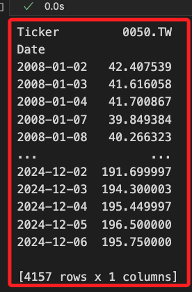
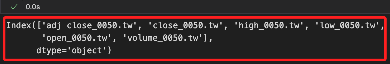
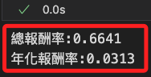
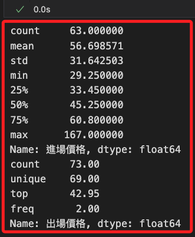
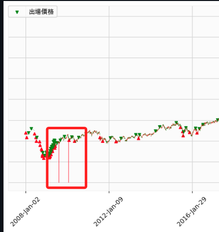
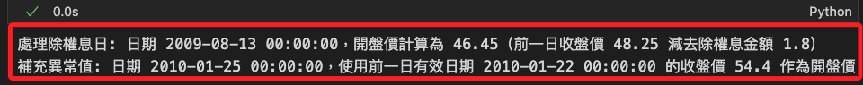
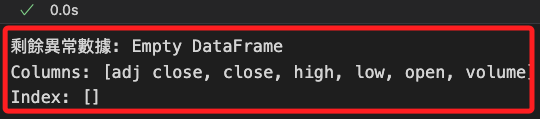

# 網格交易

_開始進行網格交易_

<br>

## 參數設定

_開啟新的 `.ipynb` 腳本_

<br>

1. 設定基礎資訊；原始範例是使用 `0050` 的 `元大寶來台灣卓越50`，可自行設定。

   ```python
   # 導入基本庫
   import yfinance as yf
   # 定義股票代碼基礎部分
   symbol_base = '00795B'
   # 指定起訖起日期，這未必使用
   START_DATE = '2020-01-01'
   END_DATE = '2023-01-01'
   ```

<br>

2. 檢查並轉換股票代碼；這在前面已經說明過，不再贅述。

   ```python
   # 定義尾綴列表
   suffixes = ['.TW', '.TWO']
   # 搜索有效代碼
   valid_symbol = None
   for suffix in suffixes:
       # 組合測試代碼
       symbol = f"{symbol_base}{suffix}"
       try:
           # 測試是否能下載最小數據集
           data = yf.download(symbol, period='1d')
           # 如果數據不為空，則該代碼有效
           if not data.empty:
               valid_symbol = symbol
               print(f"有效代碼：{valid_symbol}")
               break
       except Exception as e:
           print(f"代碼 {symbol} 無效: {e}")

   # 結果
   if valid_symbol:
       print(f"找到有效代碼：{valid_symbol}")
   else:
       print("未找到有效的代碼，請檢查輸入或尾綴列表。")
   ```

   

<br>

3. 載入庫與字型。

   ```python
   import mplfinance as mpf
   import matplotlib.pyplot as plt
   import pandas as pd
   from grid_backtest import Trade

   # 字型
   plt.rcParams['font.sans-serif'] = ['Microsoft JhengHei']
   ```

<br>

4. 將前面步驟驗證過的代碼轉換為後續所需的變數。

   ```python
   # 標的代碼，就是用作檢查的股票代碼
   symbol = symbol_base
   # 就是組合後的股票代碼
   ticker = valid_symbol
   ```

<br>

5. 設定網格交易參數。

   ```python
   # 設定初始部位為 50%
   init_ratio = 50
   # 設定網格間距為 8%
   grid_gap = round(0.08, 2)
   # 設定交易單位，每次交易佔總資金為 5%，也就是最多持有 20 個單位
   grid_unit = 5
   # 初始部位是幾個交易單位
   if init_ratio % grid_unit != 0:
       print('***出現錯誤！初始部位要可以被交易單位整除***')
   init_unit = int(init_ratio / grid_unit)
   # 上漲跟下跌網格差距比率
   up_down_grid_gap_diff = 1
   ```

<br>

6. 下載完整數據，預設從 `2008` 年開始。

   ```python
   # 下載數據
   data = yf.download(ticker)
   ```

   

<br>

7. 若要下載指定的期間，加入起訖日期作為參數。

   ```python
   # 下載指定日期數據
   data = yf.download(
       ticker, 
       start=START_DATE, 
       end=END_DATE
   )
   ```

<br>

8. 接下是以下載完整數據為例，下載後查看結果，共計 `4157` 筆，欄位有 `6` 個。

   ```python
   data
   ```

   

<br>

9. 查看欄位資訊，可看到結果顯示了 `復合欄位資訊`，也就是欄位具備 `多重索引（MultiIndex）`，欄位數據中會包含多層次的訊息；以本例來說，第一個層次是價格資訊，用於描述收盤價、開盤價等，第二個層次是股票代碼，在這就是 `0050.TW`。

   ```python
   print(data.columns)
   ```

   

<br>

## 關於多層次索引

_多層次索引適合表示屬性和層次結構較為複雜的數據，例如股票價格、時間序列等，以下依據前項所得到的欄位資訊進行說明_

<br>

1. 直接使用多層次索引的 `單層名稱` 進行選取。

   ```python
   # 選取 `Adj Close` 的數據
   adj_close_data = data['Adj Close']
   print(adj_close_data)
   ```

   

<br>

2. 直接通過 `數組形式` 指定多層索引的名稱來選取數據。

   ```python
   # 選取 `Close` 及商品代碼為 `0050.TW`
   close_0050 = data[('Close', ticker)]
   print(close_0050)
   ```

   

<br>

3. 使用 `.xs()` 方法選取某一層的所有數據。

   ```python
   # 選擇 'Adj Close' 層次的數據
   adj_close = data.xs(
       key='Adj Close', 
       level='Price', 
       axis=1
   )
   print(adj_close)
   ```

   

<br>

4. 使用 `.loc` 從多層次索引中選擇指定的欄位。

   ```python
   # 選取多層次數據範圍
   subset = data.loc[
       :, [('Adj Close', ticker), ('High', ticker)]
   ]
   print(subset)
   ```

   

<br>

5. 對指定層次進行統計或分析。

   ```python
   # 按 Price 層進行統計
   stats = data.groupby(level='Price', axis=1).mean()
   print(stats)
   ```

   

<br>

## 特徵工程

_由於只需欄位中的價格資訊，所以將復合欄位簡化為單層索引_

<br>

1. 將 `MultiIndex` 欄位名稱簡化為 `單層索引`，將名稱轉換為小寫，並使用下底線 `_` 將名稱結合；特別注意，這會修改原始數據，切勿重複運行。

   ```python
   # 簡化 MultiIndex 為單層索引
   data.columns = [
       '_'.join(col).lower() for col in data.columns
   ]
   print(data.columns)
   ```

   

<br>

2. 使用 `split` 方法移除 `商品代碼` 後綴，僅保留價格資訊的欄位名稱。

   ```python
   data.columns = [
       col.split('_')[0].lower() for col in data.columns
   ]
   print(data.columns)
   ```

   

<br>

## 網格交易參數

1. 設定初始交易參數。

   ```python
   # 取得回測數據中第一筆數據的時間索引
   # 設定交易的初始時間，這是網格交易的起始點
   init_time = data.index[0]
   # 取得初始交易價格，這將作為網格交易策略中的基準價格
   init_price = data.loc[data.index[0], 'open']
   # 建立一個 Trade 實例，並初始化交易狀態
   trade_position = Trade(init_time, init_price, init_unit)
   ```

<br>

2. 網格交易策略演算法；特別注意，以下代碼已經加入優化，其中兩筆 `open` 欄位的值無效，已經被排除處理。

   ```python
   # 設置最大迴圈次數，防止無限迴圈
   max_iterations = 100
   # 設置最小價格限制
   min_price_limit = 1e-2

   for index, row in data.iterrows():
       # 跳過數據異常的行
       if row["open"] == 0 or pd.isna(row["open"]):
           print(f"Skipping {index} due to invalid 'open' value.")
           continue

       # 優先執行比較差的狀況(賣出)
       iterations = 0
       while row["open"] >= init_price * (1 + grid_gap * up_down_grid_gap_diff):
           if iterations > max_iterations:
               print(f"Reached max iterations at {index} (sell: open >= target).")
               print(f"Current open: {row['open']}, init_price: {init_price}, target: {init_price * (1 + grid_gap * up_down_grid_gap_diff)}")
               break
           # 模擬網格交易策略中，當價格達到某個條件，更新基準價格。
           # 如價格上漲到設定的網格，基準價格需要上調以匹配網格間距。
           init_price *= 1 + grid_gap * up_down_grid_gap_diff
           # 確保 init_price 不會因多次計算而變得過小，導致非理性結果或浮點數精度問題
           if init_price < min_price_limit:
               print(f"Resetting init_price to minimum at {index}.")
               init_price = min_price_limit
           trade_position.cover(index, row["open"])
           iterations += 1

       iterations = 0
       while row["high"] >= init_price * (1 + grid_gap * up_down_grid_gap_diff):
           if iterations > max_iterations:
               print(f"Reached max iterations at {index} (sell: high >= target).")
               print(f"Current high: {row['high']}, init_price: {init_price}, target: {init_price * (1 + grid_gap * up_down_grid_gap_diff)}")
               break
           # 更新基準價格，根據網格間距和上升比例調整
           init_price *= 1 + grid_gap * up_down_grid_gap_diff
           # 如果更新後的基準價格小於設定的最低限制
           if init_price < min_price_limit:
               print(f"Resetting init_price to minimum at {index}.")
               init_price = min_price_limit
           # 執行賣出操作，按當前基準價格進行交易
           trade_position.cover(index, init_price)
           # 增加迴圈計數器，記錄迴圈執行次數
           iterations += 1

       # 再考慮(買進)
       iterations = 0
       while row["open"] <= init_price * (1 - grid_gap):
           if iterations > max_iterations:
               print(f"Reached max iterations at {index} (buy: open <= target).")
               print(f"Current open: {row['open']}, init_price: {init_price}, target: {init_price * (1 - grid_gap)}")
               break
           init_price *= 1 - grid_gap
           if init_price < min_price_limit:
               print(f"Resetting init_price to minimum at {index}.")
               init_price = min_price_limit
           if trade_position.position() < 100 / grid_unit:
               trade_position.order(index, row["open"])
           iterations += 1

       iterations = 0
       while row["low"] <= init_price * (1 - grid_gap):
           if iterations > max_iterations:
               print(f"Reached max iterations at {index} (buy: low <= target).")
               print(f"Current low: {row['low']}, init_price: {init_price}, target: {init_price * (1 - grid_gap)}")
               break
           init_price *= 1 - grid_gap
           if init_price < min_price_limit:
               print(f"Resetting init_price to minimum at {index}.")
               init_price = min_price_limit
           if trade_position.position() < 100 / grid_unit:
               trade_position.order(index, init_price)
           iterations += 1
   ```

   

<br>

3. 查看這兩筆數據，確認其數據狀態是否為提供方的遺漏值。

   ```python
   # 過濾出無效數據的行
   invalid_data = data.loc[(data['open'] == 0) | (data['open'].isna())]

   # 輸出無效數據
   print("以下是無效數據的詳細資訊：")
   print(invalid_data)
   ```

   

<br>

4. 基於計算最終的績效指標如 `總收益` 或 `年化報酬率`，當網格交易演算進行到最後一天時清空所有部位，以確保回測結束時沒有任何持倉。

   ```python
   while trade_position.position() > 0:
       trade_position.cover(index, row['close'])
   ```

<br>

5. 確認所有部位已清除。

   ```python
   remaining_positions = trade_position.position_table[
       trade_position.position_table['出場時間'].isna()
   ]

   if remaining_positions.empty:
       print("所有部位已清除，無剩餘持倉。")
   else:
       print("仍有未清除的持倉：")
       print(remaining_positions)
   ```

   

<br>

6. 查看進出紀錄，總共出現 `73` 次交易進出。

   ```python
   trade_position.position_table
   ```

   

<br>

7. 試算期間的總報酬率及年化報酬率。

   ```python
   position_table_0 = trade_position.position_table
   position_table_0['單筆報酬'] = (
       position_table_0['出場價格'] - \
       position_table_0['進場價格']
   )
   position_table_0['單筆報酬率'] = \
       position_table_0['單筆報酬'] / \
       position_table_0['進場價格'] * \
       (grid_unit/100)
   total_return_0 = (position_table_0['單筆報酬率']).sum() + 1
   print(f'總報酬率:{round(total_return_0 - 1, 4)}')
   yearly_return_0 = total_return_0 ** (1 / (data.shape[0] / 252)) - 1
   print(f'年化報酬率:{round(yearly_return_0, 4)}')
   ```

   

<br>

## 除權息

_在網格回測時，將除權息反映到數據中，是因為原本的數據並未將這部分報酬納入計算，可能低估了真實的投資報酬。_

<br>

1. 調用函數來反應除權與除息的數據，完成後調用函數再次觀察紀錄。

   ```python
   # 還原除權息
   trade_position.restoreReturn(symbol)
   # 檢查進出紀錄
   trade_position.position_table
   ```

   

<br>

2. 計算報酬率。

   ```python
   position_table = trade_position.position_table
   position_table['單筆報酬'] = (
       position_table['出場價格'] - \
       position_table['進場價格'] + \
       position_table['還原除權息']
   )
   position_table['單筆報酬率'] = \
       position_table['單筆報酬'] / \
       position_table['進場價格'] * \
       (grid_unit/100)
   total_return = (position_table['單筆報酬率']).sum() + 1
   print(f'總報酬率:{round(total_return-1,4)}')
   yearly_return = total_return ** (1/(data.shape[0]/252))-1
   print(f'年化報酬率:{round(yearly_return,4)}')
   ```

   

<br>

## 繪圖

_使用前面步驟所得的 `position_table` 進行繪圖_

<br>

1. 報酬率曲線圖及各時間點資金使用比例。

   ```python
   import matplotlib
   import matplotlib.pyplot as plt
   from matplotlib.ticker import PercentFormatter

   # 使用系統預設字體名稱
   matplotlib.rc('font', family='Heiti TC')
   # 確保負號顯示正常
   matplotlib.rc('axes', unicode_minus=False)

   # 建立圖表
   fig, ax1 = plt.subplots(figsize=(12, 6))

   # 繪製報酬率累進圖
   line1, = ax1.plot(
       position_table.set_index('進場時間')['單筆報酬率'].cumsum(),
       label='報酬率累進圖',
       color='blue',
       linewidth=2
   )
   ax1.set_ylabel(
       "累進報酬率 (%)", 
       fontsize=12
   )
   # 設置為百分比格式
   ax1.yaxis.set_major_formatter(PercentFormatter(1))
   ax1.set_xlabel(
       "進場時間", 
       fontsize=12
   )

   # 繪製資金使用率（副軸）
   ax2 = ax1.twinx()
   line2, = ax2.plot(
       position_table.set_index('進場時間')['買進後持有'],
       label='資金使用率',
       color='orange',
       linewidth=2
   )
   ax2.set_ylabel(
       "資金使用率 (%)", 
       fontsize=12
   )

   # 合併圖例
   lines = [line1, line2]
   labels = [line.get_label() for line in lines]
   ax1.legend(
       lines, 
       labels, 
       loc='upper left', 
       fontsize=12
   )

   # 添加標題
   plt.title(
       "報酬率與資金使用率", 
       fontsize=14
   )

   # 添加網格線
   ax1.grid(
       visible=True, 
       linestyle='--', 
       alpha=0.5
   )

   # 確保佈局不重疊
   plt.tight_layout()

   # 顯示圖表
   plt.show()
   ```

   

<br>

2. 圖例與線圖重疊，可將圖例移到線圖之外；以下僅針對修改部分說明。

   ```python
   # 合併圖例
   lines = [line1, line2]
   labels = [line.get_label() for line in lines]
   ax1.legend(
       lines, 
       labels, 
       loc='upper left', 
       fontsize=12,
       # 將圖例移至圖形外側
       bbox_to_anchor=(1.05, 1),
       borderaxespad=0.
   )
   ```

   

<br>

## 繪製 `K 線圖`

1. 在繪圖前，檢查 `進場價格` 和 `出場價格` 是否包含極端值。

   ```python
   print(data1["進場價格"].describe())
   print(data1["出場價格"].describe())
   ```

   

<br>

2. 以下使用 `pd.to_datetime` 確保所有時間類型的索引一致，避免 `pd.concat` 操作時出現索引類型不匹配的情況，並應用 `.infer_objects()` 或顯式地轉換數據類型來確保兼容性。

   ```python
   # 確保索引類型一致
   position_table["進場時間"] = pd.to_datetime(position_table["進場時間"])
   position_table["出場時間"] = pd.to_datetime(position_table["出場時間"])
   data.index = pd.to_datetime(data.index)

   # 合併數據
   data1 = pd.concat(
       [
           data, 
           position_table.groupby("進場時間")["進場價格"].first()
       ], 
       axis=1
   )

   # 第二次合併，處理出場價格
   data1 = pd.concat(
       [
           data1,
           position_table.set_index("出場時間")["出場價格"].groupby("出場時間").first(),
       ],
       axis=1,
   )

   # 添加繪圖參數
   addp = []
   addp.append(
       mpf.make_addplot(
           data1["進場價格"], 
           scatter=True, 
           marker="^", 
           color="r"
       )
   )
   addp.append(
       mpf.make_addplot(
           data1["出場價格"], 
           scatter=True, 
           marker="v", 
           color="g"
       )
   )

   # 設置樣式
   mcolor = mpf.make_marketcolors(
       up="red", 
       down="green", 
       inherit=True
   )
   mstyle = mpf.make_mpf_style(
       base_mpf_style="yahoo", 
       marketcolors=mcolor
   )

   # 繪製蠟燭圖
   mpf.plot(
       data, 
       type="candle", 
       addplot=addp, 
       style=mstyle, 
       warn_too_much_data=999999
   )
   ```

   

<br>

3. 分別給進場與出場加入 `label`，然後透過代碼加入圖例。

   ```python
   # 確保索引類型一致
   position_table["進場時間"] = pd.to_datetime(position_table["進場時間"])
   position_table["出場時間"] = pd.to_datetime(position_table["出場時間"])
   data.index = pd.to_datetime(data.index)

   # 合併數據
   data1 = pd.concat(
       [
           data, 
           position_table.groupby("進場時間")["進場價格"].first()
       ], 
       axis=1
   )

   # 第二次合併，處理出場價格
   data1 = pd.concat(
       [
           data1,
           position_table.set_index("出場時間")["出場價格"].groupby("出場時間").first(),
       ],
       axis=1,
   )

   # 添加繪圖參數
   addp = []
   addp.append(
       mpf.make_addplot(
           data1["進場價格"], 
           scatter=True, 
           marker="^", 
           color="r",
           # 加入標註名稱
           label="進場價格"
       )
   )
   addp.append(
       mpf.make_addplot(
           data1["出場價格"], 
           scatter=True, 
           marker="v", 
           color="g",
           # 加入標註名稱
           label="出場價格"
       )
   )

   # 設置樣式
   mcolor = mpf.make_marketcolors(
       up="red", 
       down="green", 
       inherit=True
   )
   mstyle = mpf.make_mpf_style(
       base_mpf_style="yahoo", 
       marketcolors=mcolor
   )

   # 繪製蠟燭圖
   # 返回對象，所以要添加變數承接
   fig, axlist = mpf.plot(
       data, 
       type="candle", 
       addplot=addp, 
       style=mstyle, 
       warn_too_much_data=999999,
       # 返回圖形對象以進行進一步操作
       returnfig=True,
       figratio=(12, 6)
   )
   # 添加圖例
   handles, labels = axlist[0].get_legend_handles_labels()
   axlist[0].legend(
       handles, 
       labels, 
       loc="upper left", 
       fontsize=10, 
       # 這裡不需要調整圖例位置，將空間留給線圖
       # bbox_to_anchor=(1.05, 1),
       borderaxespad=0,
       prop={'family': 'Heiti TC'} 
   )
   ```

   

<br>

4. 補充説明，在線圖左側兩條垂直紅線，這就是前面步驟曾提及的 `open` 有遺漏值的資訊，繪圖時因遺漏值而會出現紅線。

   

<br>

## 進階處理

1. 取得標的的除權息數據，並將其處理為適當的 DataFrame。

   ```python
   import pandas as pd
   import requests

   # 取得除權息資料
   dividend_url = f"https://www.twse.com.tw/rwd/zh/exRight/TWT49U?startDate=20080101&endDate=20241231&response=json"
   dividend_data = requests.get(dividend_url).json()

   # 檢查 API 回應狀態
   if dividend_data.get('stat') != 'OK':
       raise ValueError("除權息數據取得失敗，請檢查 API URL 或網路連線。")

   # 將數據轉換為 DataFrame
   dividend_table = pd.DataFrame(dividend_data["data"], columns=dividend_data["fields"])

   # 轉換民國年為西元年
   def convert_to_gregorian(date_str):
       parts = date_str.split('年')
       year = int(parts[0]) + 1911  # 民國年轉換為西元年
       rest = parts[1]  # 包含月日部分
       return f"{year}年{rest}"

   # 轉換日期格式
   dividend_table["資料日期"] = dividend_table["資料日期"].apply(convert_to_gregorian)
   dividend_table["資料日期"] = pd.to_datetime(dividend_table["資料日期"], format="%Y年%m月%d日")

   # 取得所有除權息日期
   dividend_dates = dividend_table["資料日期"].tolist()

   # 驗證結果
   print(dividend_table.head())
   print(f"總計取得除權息日期: {len(dividend_dates)}")
   ```

   

<br>

2. 處理開牌價出現遺漏值的問題，確保是否為除權息日，若不是則以前一日收盤價作為開盤價，若確實為除權息日，則計算當日開盤價。

   ```python
   # 檢查並清洗異常數據
   for index, row in data.iterrows():
       # 當 open 為 0 或 NaN
       if row["open"] == 0 or pd.isna(row["open"]):
           # 如果是除權息日
           if index in dividend_dates:
               # 查找當日的除權息金額
               dividend_info = dividend_table.loc[dividend_table["資料日期"] == index]
               if not dividend_info.empty:
                   # 提取權值+息值
                   dividend_amount = float(dividend_info["權值+息值"].values[0])
                   # 查找前一日有效的收盤價
                   previous_index = index - pd.Timedelta(days=1)
                   while previous_index not in data.index or pd.isna(data.loc[previous_index, "close"]):
                       previous_index -= pd.Timedelta(days=1)  # 繼續往前找

                   previous_close = data.loc[previous_index, "close"]
                   if previous_close == 0 or pd.isna(previous_close):
                       print(f"異常：日期 {previous_index} 的收盤價也無效，跳過處理。")
                       continue

                   # 計算開盤價（前一日收盤價 - 除權息金額）
                   calculated_open = round(previous_close - dividend_amount, 2)
                   data.at[index, "open"] = calculated_open
                   print(f"處理除權息日: 日期 {index}，開盤價計算為 {calculated_open}（前一日收盤價 {previous_close} 減去除權息金額 {dividend_amount}）")
               else:
                   print(f"異常：日期 {index} 的除權息金額缺失，無法處理。")
           else:
               # 如果不是除權息日
               # 尋找前一日有效的數據
               previous_index = index - pd.Timedelta(days=1)
               while previous_index not in data.index or pd.isna(data.loc[previous_index, "close"]):
                   previous_index -= pd.Timedelta(days=1)  # 繼續往前找

               # 確保找到的收盤價不為 0 或 NaN
               previous_close = data.loc[previous_index, "close"]
               if previous_close == 0 or pd.isna(previous_close):
                   print(f"異常：日期 {previous_index} 的收盤價也無效，跳過處理。")
                   continue

               # 填補開盤價並格式化浮點數
               data.at[index, "open"] = round(previous_close, 2)
               print(f"補充異常值: 日期 {index}，使用前一日有效日期 {previous_index} 的收盤價 {round(previous_close, 2)} 作為開盤價")
   ```

   

<br>

3. 檢查是否仍有異常數據。

   ```python
   remaining_anomalies = data[(data["open"] == 0) | (data["open"].isna())]
   print(f"剩餘異常數據: {remaining_anomalies}")
   ```

   

<br>

4. 再次繪圖就不會看到垂直紅線了；另外，這裡僅僅是驗證產生紅線的原因，之後再補充處理遺漏值之後重新進行回測。

   

<br>

---

_END_
