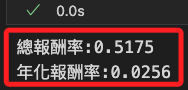

# 網格交易

<br>

## 開始進行 

1. 設定初始交易狀態。

    ```python
    # 取得回測數據中第一筆數據的時間索引
    # 設定交易的初始時間，這是網格交易的起始點
    init_time = data.index[0]
    # 取得初始交易價格，這將作為網格交易策略中的基準價格
    init_price = data.loc[data.index[0], 'open']
    # 建立一個 Trade 實例，並初始化交易狀態
    trade_position = Trade(init_time, init_price, init_unit)
    ```

<br>

2. 查看物件，可知這是一個 `Trade` 類的對象。

    ```python
    trade_position
    ```

    

<br>

## 網格交易演算

1. 展開演算，並加入排除無效欄位的邏輯。

    ```python
    # 設置最大迴圈次數，防止無限迴圈
    max_iterations = 100
    # 設置最小價格限制
    min_price_limit = 1e-2

    for index, row in data.iterrows():
        # 跳過數據異常的行
        if row["open"] == 0 or pd.isna(row["open"]):
            print(f"Skipping {index} due to invalid 'open' value.")
            continue

        # 優先執行比較差的狀況(賣出)
        iterations = 0
        while row["open"] >= init_price * (1 + grid_gap * up_down_grid_gap_diff):
            if iterations > max_iterations:
                print(f"Reached max iterations at {index} (sell: open >= target).")
                print(f"Current open: {row['open']}, init_price: {init_price}, target: {init_price * (1 + grid_gap * up_down_grid_gap_diff)}")
                break
            # 模擬網格交易策略中，當價格達到某個條件，更新基準價格。
            # 如價格上漲到設定的網格，基準價格需要上調以匹配網格間距。
            init_price *= 1 + grid_gap * up_down_grid_gap_diff
            # 確保 init_price 不會因多次計算而變得過小，導致非理性結果或浮點數精度問題
            if init_price < min_price_limit:
                print(f"Resetting init_price to minimum at {index}.")
                init_price = min_price_limit
            trade_position.cover(index, row["open"])
            iterations += 1

        iterations = 0
        while row["high"] >= init_price * (1 + grid_gap * up_down_grid_gap_diff):
            if iterations > max_iterations:
                print(f"Reached max iterations at {index} (sell: high >= target).")
                print(f"Current high: {row['high']}, init_price: {init_price}, target: {init_price * (1 + grid_gap * up_down_grid_gap_diff)}")
                break
            # 更新基準價格，根據網格間距和上升比例調整
            init_price *= 1 + grid_gap * up_down_grid_gap_diff
            # 如果更新後的基準價格小於設定的最低限制
            if init_price < min_price_limit:
                print(f"Resetting init_price to minimum at {index}.")
                init_price = min_price_limit
            # 執行賣出操作，按當前基準價格進行交易
            trade_position.cover(index, init_price)
            # 增加迴圈計數器，記錄迴圈執行次數
            iterations += 1

        # 再考慮(買進)
        iterations = 0
        while row["open"] <= init_price * (1 - grid_gap):
            if iterations > max_iterations:
                print(f"Reached max iterations at {index} (buy: open <= target).")
                print(f"Current open: {row['open']}, init_price: {init_price}, target: {init_price * (1 - grid_gap)}")
                break
            init_price *= 1 - grid_gap
            if init_price < min_price_limit:
                print(f"Resetting init_price to minimum at {index}.")
                init_price = min_price_limit
            if trade_position.position() < 100 / grid_unit:
                trade_position.order(index, row["open"])
            iterations += 1

        iterations = 0
        while row["low"] <= init_price * (1 - grid_gap):
            if iterations > max_iterations:
                print(f"Reached max iterations at {index} (buy: low <= target).")
                print(f"Current low: {row['low']}, init_price: {init_price}, target: {init_price * (1 - grid_gap)}")
                break
            init_price *= 1 - grid_gap
            if init_price < min_price_limit:
                print(f"Resetting init_price to minimum at {index}.")
                init_price = min_price_limit
            if trade_position.position() < 100 / grid_unit:
                trade_position.order(index, init_price)
            iterations += 1
    ```

    

<br>

2. 查看這兩筆數據，確認其數據狀態是否為提供方的遺漏值。

    ```python
    # 過濾出無效數據的行
    invalid_data = data.loc[(data['open'] == 0) | (data['open'].isna())]

    # 輸出無效數據
    print("以下是無效數據的詳細資訊：")
    print(invalid_data)
    ```

    

<br>

3. 基於計算最終的績效指標如 `總收益` 或 `年化報酬率`，當網格交易演算進行到最後一天時清空所有部位，以確保回測結束時沒有任何持倉。

    ```python
    while trade_position.position() > 0:
        trade_position.cover(index, row['close'])
    ```

<br>

4. 確認所有部位已清除。

    ```python
    remaining_positions = trade_position.position_table[
        trade_position.position_table['出場時間'].isna()
    ]

    if remaining_positions.empty:
        print("所有部位已清除，無剩餘持倉。")
    else:
        print("仍有未清除的持倉：")
        print(remaining_positions)
    ```

    

<br>

5. 查看進出紀錄，總共出現 `73` 次交易進出。

    ```python
    trade_position.position_table
    ```

    

<br>

6. 試算期間的總報酬率及年化報酬率。

    ```python
    position_table_0 = trade_position.position_table
    position_table_0['單筆報酬'] = (
        position_table_0['出場價格'] - \
        position_table_0['進場價格']
    )
    position_table_0['單筆報酬率'] = \
        position_table_0['單筆報酬'] / \
        position_table_0['進場價格'] * \
        (grid_unit/100)
    total_return_0 = (position_table_0['單筆報酬率']).sum() + 1
    print(f'總報酬率:{round(total_return_0 - 1, 4)}')
    yearly_return_0 = total_return_0 ** (1 / (data.shape[0] / 252)) - 1
    print(f'年化報酬率:{round(yearly_return_0, 4)}')
    ```

    

<br>

___

_接續下一單元_