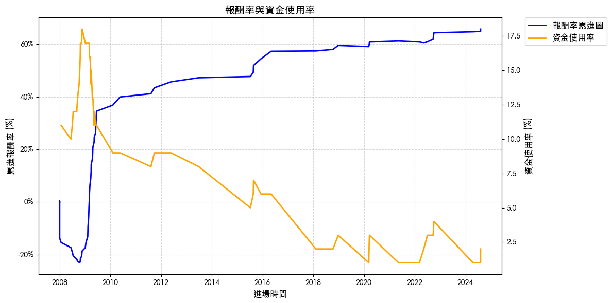

# 網格交易

<br>

## 繪圖

_使用前面步驟所得的 `position_table` 進行繪圖_

<br>

1. 報酬率曲線圖及各時間點資金使用比例；圖形略有瑕疵，圖例與線圖發生重疊。

    ```python
    import matplotlib
    import matplotlib.pyplot as plt
    from matplotlib.ticker import PercentFormatter

    # 使用系統預設字體名稱
    matplotlib.rc('font', family='Heiti TC')
    # 確保負號顯示正常
    matplotlib.rc('axes', unicode_minus=False)

    # 建立圖表
    fig, ax1 = plt.subplots(figsize=(12, 6))

    # 繪製報酬率累進圖
    line1, = ax1.plot(
        position_table.set_index('進場時間')['單筆報酬率'].cumsum(),
        label='報酬率累進圖',
        color='blue',
        linewidth=2
    )
    ax1.set_ylabel(
        "累進報酬率 (%)", 
        fontsize=12
    )
    # 設置為百分比格式
    ax1.yaxis.set_major_formatter(PercentFormatter(1))
    ax1.set_xlabel(
        "進場時間", 
        fontsize=12
    )

    # 繪製資金使用率（副軸）
    ax2 = ax1.twinx()
    line2, = ax2.plot(
        position_table.set_index('進場時間')['買進後持有'],
        label='資金使用率',
        color='orange',
        linewidth=2
    )
    ax2.set_ylabel(
        "資金使用率 (%)", 
        fontsize=12
    )

    # 合併圖例
    lines = [line1, line2]
    labels = [line.get_label() for line in lines]
    ax1.legend(
        lines, 
        labels, 
        loc='upper left', 
        fontsize=12
    )

    # 添加標題
    plt.title(
        "報酬率與資金使用率", 
        fontsize=14
    )

    # 添加網格線
    ax1.grid(
        visible=True, 
        linestyle='--', 
        alpha=0.5
    )

    # 確保佈局不重疊
    plt.tight_layout()

    # 顯示圖表
    plt.show()
    ```

    

<br>

2. 將圖例移到線圖之外。

    ```python
    import matplotlib
    import matplotlib.pyplot as plt
    from matplotlib.ticker import PercentFormatter

    # 使用系統預設字體名稱
    matplotlib.rc('font', family='Heiti TC')
    # 確保負號顯示正常
    matplotlib.rc('axes', unicode_minus=False)

    # 建立圖表
    fig, ax1 = plt.subplots(figsize=(12, 6))

    # 繪製報酬率累進圖
    line1, = ax1.plot(
        position_table.set_index('進場時間')['單筆報酬率'].cumsum(),
        label='報酬率累進圖',
        color='blue',
        linewidth=2
    )
    ax1.set_ylabel(
        "累進報酬率 (%)", 
        fontsize=12
    )
    # 設置為百分比格式
    ax1.yaxis.set_major_formatter(PercentFormatter(1))
    ax1.set_xlabel(
        "進場時間", 
        fontsize=12
    )

    # 繪製資金使用率（副軸）
    ax2 = ax1.twinx()
    line2, = ax2.plot(
        position_table.set_index('進場時間')['買進後持有'],
        label='資金使用率',
        color='orange',
        linewidth=2
    )
    ax2.set_ylabel(
        "資金使用率 (%)", 
        fontsize=12
    )

    # 合併圖例
    lines = [line1, line2]
    labels = [line.get_label() for line in lines]
    ax1.legend(
        lines, 
        labels, 
        loc='upper left', 
        fontsize=12,
        # 將圖例移至圖形外側
        bbox_to_anchor=(1.05, 1),
        borderaxespad=0.
    )

    # 添加標題
    plt.title(
        "報酬率與資金使用率", 
        fontsize=14
    )

    # 添加網格線
    ax1.grid(
        visible=True, 
        linestyle='--', 
        alpha=0.5
    )

    # 確保佈局不重疊
    plt.tight_layout()

    # 顯示圖表
    plt.show()
    ```

    

<br>

## 繪製 `K 線圖`

1. 處理數據，使用 `pd.to_datetime` 確保所有時間類型的索引一致，避免 `pd.concat` 操作時出現索引類型不匹配的情況，並應用 `.infer_objects()` 或顯式地轉換數據類型來確保兼容性。

    ```python
    # 確保索引類型一致
    position_table["進場時間"] = pd.to_datetime(position_table["進場時間"])
    position_table["出場時間"] = pd.to_datetime(position_table["出場時間"])
    data.index = pd.to_datetime(data.index)

    # 合併數據
    data1 = pd.concat(
        [
            data, 
            position_table.groupby("進場時間")["進場價格"].first()
        ], 
        axis=1
    )

    # 第二次合併，處理出場價格
    data1 = pd.concat(
        [
            data1,
            position_table.set_index("出場時間")["出場價格"].groupby("出場時間").first(),
        ],
        axis=1,
    )
    ```

<br>

2. 在繪圖前，檢查 `進場價格` 和 `出場價格` 是否包含極端值。

    ```python
    print(data1["進場價格"].describe())
    print(data1["出場價格"].describe())
    ```

    

<br>

3. 繪圖。

    ```python
    # 添加繪圖參數
    addp = []
    addp.append(
        mpf.make_addplot(
            data1["進場價格"], 
            scatter=True, 
            marker="^", 
            color="r"
        )
    )
    addp.append(
        mpf.make_addplot(
            data1["出場價格"], 
            scatter=True, 
            marker="v", 
            color="g"
        )
    )

    # 設置樣式
    mcolor = mpf.make_marketcolors(
        up="red", 
        down="green", 
        inherit=True
    )
    mstyle = mpf.make_mpf_style(
        base_mpf_style="yahoo", 
        marketcolors=mcolor
    )

    # 繪製蠟燭圖
    mpf.plot(
        data, 
        type="candle", 
        addplot=addp, 
        style=mstyle, 
        warn_too_much_data=999999
    )
    ```

    

<br>

4. 分別給 `進場` 與 `出場` 加入 `label`，然後透過代碼加入圖例。

    ```python
    # 確保索引類型一致
    position_table["進場時間"] = pd.to_datetime(position_table["進場時間"])
    position_table["出場時間"] = pd.to_datetime(position_table["出場時間"])
    data.index = pd.to_datetime(data.index)

    # 合併數據
    data1 = pd.concat(
        [
            data, 
            position_table.groupby("進場時間")["進場價格"].first()
        ], 
        axis=1
    )

    # 第二次合併，處理出場價格
    data1 = pd.concat(
        [
            data1,
            position_table.set_index("出場時間")["出場價格"].groupby("出場時間").first(),
        ],
        axis=1,
    )

    # 添加繪圖參數
    addp = []
    addp.append(
        mpf.make_addplot(
            data1["進場價格"], 
            scatter=True, 
            marker="^", 
            color="r",
            # 加入標註名稱
            label="進場價格"
        )
    )
    addp.append(
        mpf.make_addplot(
            data1["出場價格"], 
            scatter=True, 
            marker="v", 
            color="g",
            # 加入標註名稱
            label="出場價格"
        )
    )

    # 設置樣式
    mcolor = mpf.make_marketcolors(
        up="red", 
        down="green", 
        inherit=True
    )
    mstyle = mpf.make_mpf_style(
        base_mpf_style="yahoo", 
        marketcolors=mcolor
    )

    # 繪製蠟燭圖
    # 返回對象，所以要添加變數承接
    fig, axlist = mpf.plot(
        data, 
        type="candle", 
        addplot=addp, 
        style=mstyle, 
        warn_too_much_data=999999,
        # 返回圖形對象以進行進一步操作
        returnfig=True,
        figratio=(12, 6)
    )
    # 添加圖例
    handles, labels = axlist[0].get_legend_handles_labels()
    axlist[0].legend(
        handles, 
        labels, 
        loc="upper left", 
        fontsize=10, 
        # 這裡不需要調整圖例位置，將空間留給線圖
        # bbox_to_anchor=(1.05, 1),
        borderaxespad=0,
        prop={'family': 'Heiti TC'} 
    )
    ```

    

<br>

5. 補充説明，假如在線圖中出現如下圖左側的兩條垂直紅線，這通常是就是遺漏值所造成，目前已就可能出現的遺漏值做了處置，若有發生，需回頭探索遺漏值來自何處。

    

<br>

___

_END_