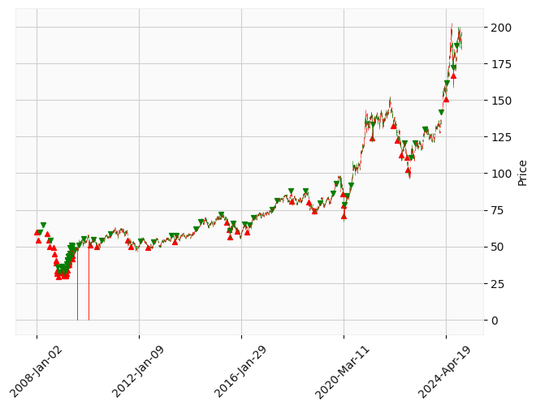
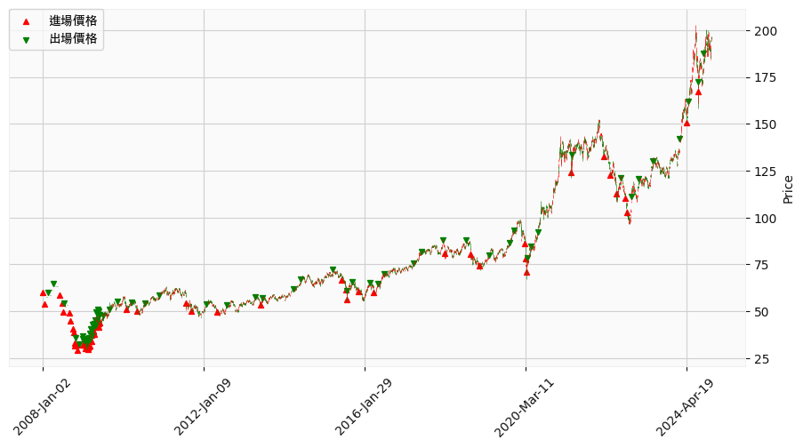
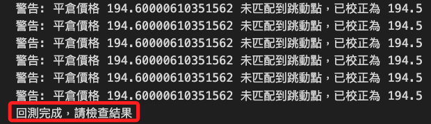

# 網格交易

<br>

## 繪圖

_使用前面步驟所得的 `position_table` 進行繪圖_

<br>

1. 報酬率曲線圖及各時間點資金使用比例；圖形略有瑕疵，圖例與線圖發生重疊。

    ```python
    import matplotlib
    import matplotlib.pyplot as plt
    from matplotlib.ticker import PercentFormatter

    # 使用系統預設字體名稱
    matplotlib.rc('font', family='Heiti TC')
    # 確保負號顯示正常
    matplotlib.rc('axes', unicode_minus=False)

    # 建立圖表
    fig, ax1 = plt.subplots(figsize=(12, 6))

    # 繪製報酬率累進圖
    line1, = ax1.plot(
        position_table.set_index('進場時間')['單筆報酬率'].cumsum(),
        label='報酬率累進圖',
        color='blue',
        linewidth=2
    )
    ax1.set_ylabel(
        "累進報酬率 (%)", 
        fontsize=12
    )
    # 設置為百分比格式
    ax1.yaxis.set_major_formatter(PercentFormatter(1))
    ax1.set_xlabel(
        "進場時間", 
        fontsize=12
    )

    # 繪製資金使用率（副軸）
    ax2 = ax1.twinx()
    line2, = ax2.plot(
        position_table.set_index('進場時間')['買進後持有'],
        label='資金使用率',
        color='orange',
        linewidth=2
    )
    ax2.set_ylabel(
        "資金使用率 (%)", 
        fontsize=12
    )

    # 合併圖例
    lines = [line1, line2]
    labels = [line.get_label() for line in lines]
    ax1.legend(
        lines, 
        labels, 
        loc='upper left', 
        fontsize=12
    )

    # 添加標題
    plt.title(
        "報酬率與資金使用率", 
        fontsize=14
    )

    # 添加網格線
    ax1.grid(
        visible=True, 
        linestyle='--', 
        alpha=0.5
    )

    # 確保佈局不重疊
    plt.tight_layout()

    # 顯示圖表
    plt.show()
    ```

    

<br>

2. 將圖例移到線圖之外。

    ```python
    import matplotlib
    import matplotlib.pyplot as plt
    from matplotlib.ticker import PercentFormatter

    # 使用系統預設字體名稱
    matplotlib.rc('font', family='Heiti TC')
    # 確保負號顯示正常
    matplotlib.rc('axes', unicode_minus=False)

    # 建立圖表
    fig, ax1 = plt.subplots(figsize=(12, 6))

    # 繪製報酬率累進圖
    line1, = ax1.plot(
        position_table.set_index('進場時間')['單筆報酬率'].cumsum(),
        label='報酬率累進圖',
        color='blue',
        linewidth=2
    )
    ax1.set_ylabel(
        "累進報酬率 (%)", 
        fontsize=12
    )
    # 設置為百分比格式
    ax1.yaxis.set_major_formatter(PercentFormatter(1))
    ax1.set_xlabel(
        "進場時間", 
        fontsize=12
    )

    # 繪製資金使用率（副軸）
    ax2 = ax1.twinx()
    line2, = ax2.plot(
        position_table.set_index('進場時間')['買進後持有'],
        label='資金使用率',
        color='orange',
        linewidth=2
    )
    ax2.set_ylabel(
        "資金使用率 (%)", 
        fontsize=12
    )

    # 合併圖例
    lines = [line1, line2]
    labels = [line.get_label() for line in lines]
    ax1.legend(
        lines, 
        labels, 
        loc='upper left', 
        fontsize=12,
        # 將圖例移至圖形外側
        bbox_to_anchor=(1.05, 1),
        borderaxespad=0.
    )

    # 添加標題
    plt.title(
        "報酬率與資金使用率", 
        fontsize=14
    )

    # 添加網格線
    ax1.grid(
        visible=True, 
        linestyle='--', 
        alpha=0.5
    )

    # 確保佈局不重疊
    plt.tight_layout()

    # 顯示圖表
    plt.show()
    ```

    

<br>

## 繪製 `K 線圖`

1. 處理數據，使用 `pd.to_datetime` 確保所有時間類型的索引一致，避免 `pd.concat` 操作時出現索引類型不匹配的情況，並應用 `.infer_objects()` 或顯式地轉換數據類型來確保兼容性。

    ```python
    # 確保索引類型一致
    position_table["進場時間"] = pd.to_datetime(position_table["進場時間"])
    position_table["出場時間"] = pd.to_datetime(position_table["出場時間"])
    data.index = pd.to_datetime(data.index)

    # 合併數據
    data1 = pd.concat(
        [
            data, 
            position_table.groupby("進場時間")["進場價格"].first()
        ], 
        axis=1
    )

    # 第二次合併，處理出場價格
    data1 = pd.concat(
        [
            data1,
            position_table.set_index("出場時間")["出場價格"].groupby("出場時間").first(),
        ],
        axis=1,
    )
    ```

<br>

2. 在繪圖前，檢查 `進場價格` 和 `出場價格` 是否包含極端值。

    ```python
    print(data1["進場價格"].describe())
    print(data1["出場價格"].describe())
    ```

    

<br>

3. 繪圖。

    ```python
    # 添加繪圖參數
    addp = []
    addp.append(
        mpf.make_addplot(
            data1["進場價格"], 
            scatter=True, 
            marker="^", 
            color="r"
        )
    )
    addp.append(
        mpf.make_addplot(
            data1["出場價格"], 
            scatter=True, 
            marker="v", 
            color="g"
        )
    )

    # 設置樣式
    mcolor = mpf.make_marketcolors(
        up="red", 
        down="green", 
        inherit=True
    )
    mstyle = mpf.make_mpf_style(
        base_mpf_style="yahoo", 
        marketcolors=mcolor
    )

    # 繪製蠟燭圖
    mpf.plot(
        data, 
        type="candle", 
        addplot=addp, 
        style=mstyle, 
        warn_too_much_data=999999
    )
    ```

    

<br>

4. 分別給 `進場` 與 `出場` 加入 `label`，然後透過代碼加入圖例。

    ```python
    # 確保索引類型一致
    position_table["進場時間"] = pd.to_datetime(position_table["進場時間"])
    position_table["出場時間"] = pd.to_datetime(position_table["出場時間"])
    data.index = pd.to_datetime(data.index)

    # 合併數據
    data1 = pd.concat(
        [
            data, 
            position_table.groupby("進場時間")["進場價格"].first()
        ], 
        axis=1
    )

    # 第二次合併，處理出場價格
    data1 = pd.concat(
        [
            data1,
            position_table.set_index("出場時間")["出場價格"].groupby("出場時間").first(),
        ],
        axis=1,
    )

    # 添加繪圖參數
    addp = []
    addp.append(
        mpf.make_addplot(
            data1["進場價格"], 
            scatter=True, 
            marker="^", 
            color="r",
            # 加入標註名稱
            label="進場價格"
        )
    )
    addp.append(
        mpf.make_addplot(
            data1["出場價格"], 
            scatter=True, 
            marker="v", 
            color="g",
            # 加入標註名稱
            label="出場價格"
        )
    )

    # 設置樣式
    mcolor = mpf.make_marketcolors(
        up="red", 
        down="green", 
        inherit=True
    )
    mstyle = mpf.make_mpf_style(
        base_mpf_style="yahoo", 
        marketcolors=mcolor
    )

    # 繪製蠟燭圖
    # 返回對象，所以要添加變數承接
    fig, axlist = mpf.plot(
        data, 
        type="candle", 
        addplot=addp, 
        style=mstyle, 
        warn_too_much_data=999999,
        # 返回圖形對象以進行進一步操作
        returnfig=True,
        figratio=(12, 6)
    )
    # 添加圖例
    handles, labels = axlist[0].get_legend_handles_labels()
    axlist[0].legend(
        handles, 
        labels, 
        loc="upper left", 
        fontsize=10, 
        # 這裡不需要調整圖例位置，將空間留給線圖
        # bbox_to_anchor=(1.05, 1),
        borderaxespad=0,
        prop={'family': 'Heiti TC'} 
    )
    ```

    

<br>

5. 補充説明，在線圖左側兩條垂直紅線，這就是前面步驟曾提及的 `open` 有遺漏值的資訊，繪圖時因遺漏值而會出現紅線。

    

<br>

## 進階處理

1. 取得標的的除權息數據，並將其處理為適當的 DataFrame。

    ```python
    import requests

    # 取得除權息資料
    dividend_url = f"https://www.twse.com.tw/rwd/zh/exRight/TWT49U?startDate=20080101&endDate=20241231&response=json"
    dividend_data = requests.get(dividend_url).json()

    # 檢查 API 回應狀態
    if dividend_data.get('stat') != 'OK':
        raise ValueError(
            "除權息數據取得失敗，請檢查 API URL 或網路連線。"
        )

    # 將數據轉換為 DataFrame
    dividend_table = pd.DataFrame(
        dividend_data["data"], 
        columns=dividend_data["fields"]
    )

    # 轉換民國年為西元年
    def convert_to_gregorian(date_str):
        parts = date_str.split('年')
        # 民國年轉換為西元年
        year = int(parts[0]) + 1911
        rest = parts[1]  # 包含月日部分
        return f"{year}年{rest}"

    # 轉換日期格式
    dividend_table["資料日期"] = dividend_table["資料日期"].apply(
        convert_to_gregorian
    )
    dividend_table["資料日期"] = pd.to_datetime(
        dividend_table["資料日期"], 
        format="%Y年%m月%d日"
    )

    # 取得所有除權息日期
    dividend_dates = dividend_table["資料日期"].tolist()

    # 驗證結果
    print(dividend_table.head())
    print(f"總計取得除權息日期: {len(dividend_dates)}")
    ```

    

<br>

2. 處理開牌價出現遺漏值的問題，確保是否為除權息日，若不是則以前一日收盤價作為開盤價，若確實為除權息日，則計算當日開盤價。

    ```python
    # 檢查並清洗異常數據
    for index, row in data.iterrows():
        # 當 open 為 0 或 NaN
        if row["open"] == 0 or pd.isna(row["open"]):
            # 如果是除權息日
            if index in dividend_dates:
                # 查找當日的除權息金額
                dividend_info = dividend_table.loc[
                    dividend_table["資料日期"] == index
                ]
                if not dividend_info.empty:
                    # 提取權值+息值
                    dividend_amount = float(
                        dividend_info["權值+息值"].values[0]
                    )
                    # 查找前一日有效的收盤價
                    previous_index = index - pd.Timedelta(days=1)
                    while previous_index not in data.index or pd.isna(
                        data.loc[previous_index, "close"]
                    ):
                        # 繼續往前找
                        previous_index -= pd.Timedelta(days=1)

                    previous_close = data.loc[previous_index, "close"]
                    if previous_close == 0 or pd.isna(previous_close):
                        print(
                            f"異常：日期 {previous_index} 的收盤價也無效，跳過處理。"
                        )
                        continue

                    # 計算開盤價（前一日收盤價 - 除權息金額）
                    calculated_open = round(
                        previous_close - dividend_amount,
                        2
                    )
                    data.at[index, "open"] = calculated_open
                    print(
                        f"處理除權息日: 日期 {index}，"
                        f"開盤價計算為 {calculated_open}"
                        f"（前一日收盤價 {previous_close} "
                        f"減去除權息金額 {dividend_amount}）"
                    )
                else:
                    print(
                        f"異常：日期 {index} 的除權息金額缺失，無法處理。"
                    )
            else:
                # 如果不是除權息日
                # 尋找前一日有效的數據
                previous_index = index - pd.Timedelta(days=1)
                while previous_index not in data.index or pd.isna(
                    data.loc[previous_index, "close"]
                ):
                    # 繼續往前找
                    previous_index -= pd.Timedelta(days=1)

                # 確保找到的收盤價不為 0 或 NaN
                previous_close = data.loc[previous_index, "close"]
                if previous_close == 0 or pd.isna(previous_close):
                    print(
                        f"異常：日期 {previous_index} 的收盤價也無效，跳過處理。"
                    )
                    continue

                # 填補開盤價並格式化浮點數
                data.at[index, "open"] = round(previous_close, 2)
                print(
                    f"補充異常值: 日期 {index}，"
                    f"使用前一日有效日期 {previous_index} 的"
                    f"收盤價 {round(previous_close, 2)} 作為開盤價"
                )
    ```

    

<br>

3. 檢查是否仍有異常數據。

    ```python
    remaining_anomalies = data[(data["open"] == 0) | (data["open"].isna())]
    print(f"剩餘異常數據: {remaining_anomalies}")
    ```

    

<br>

4. 再次繪圖就不會看到垂直紅線了；另外，這裡僅僅是驗證產生紅線的原因，之後再補充處理遺漏值之後重新進行回測。

    

<br>

___

_END_