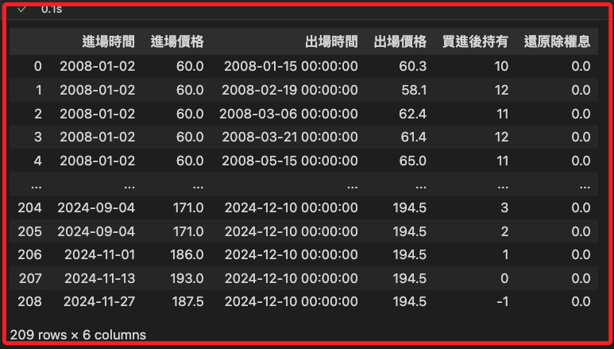
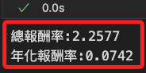
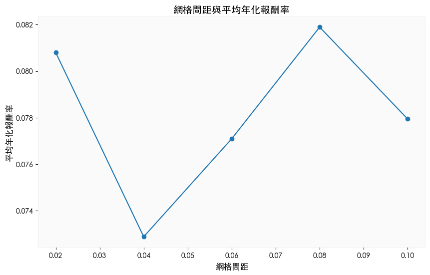
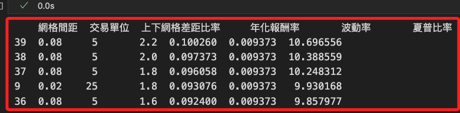
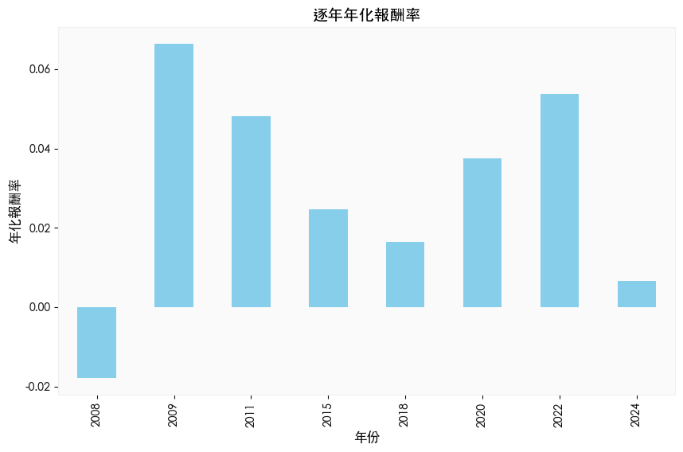

# 調整回測參數

<br>

## 腳本

_開啟新的筆記本_

<br>

1. 載入庫及字型。

    ```python
    import mplfinance as mpf
    import matplotlib.pyplot as plt
    import pandas as pd
    import yfinance as yf
    from grid_backtest import Trade

    # 設定全局字體以支援中文
    plt.rcParams['font.sans-serif'] = ['Heiti TC']
    # 確保負號顯示正常
    plt.rcParams['axes.unicode_minus'] = False
    ```

<br>

2. 網格交易參數設定。

    ```python
    # 金融商品設定
    symbol = '0050'
    # 設定初始部位 50%
    init_ratio = 50
    # 設定網格間距
    grid_gap = round(0.025, 2)
    # 設定交易單位 5%
    grid_unit = 5

    # 初始部位是幾個交易單位
    if init_ratio % grid_unit != 0:
        raise ValueError(
            "*出現錯誤，初始部位要可以被交易單位整除*"
        )
    init_unit = int(init_ratio / grid_unit)
    # 上漲跟下跌網格差距比率
    up_down_grid_gap_diff = 2
    ```

<br>

3. 網格交易策略演算法。

    ```python
    # 取得要回測的歷史資料
    data = yf.download(f'{symbol}.TW')

    # 確認並處理 MultiIndex 或欄位後綴
    if isinstance(data.columns, pd.MultiIndex):
        # 將 MultiIndex 轉換為單層索引，並移除後綴
        data.columns = ['_'.join(col).lower() for col in data.columns]
    else:
        data.columns = [col.split('_')[0].lower() for col in data.columns]

    # 簡化欄位名稱，移除後綴 '_0050.tw'
    data.columns = [col.split('_')[0] for col in data.columns]

    # 輸出轉換後的欄位名稱
    print("轉換後的資料欄位名稱:", data.columns)

    # 處理缺失值，填充數據
    data = data.replace(0, None).infer_objects(copy=False).ffill()

    # 確保所需欄位存在
    required_columns = ['open', 'high', 'low', 'close', 'volume']
    missing_columns = [col for col in required_columns if col not in data.columns]

    if missing_columns:
        raise ValueError(f"缺少必要欄位：{missing_columns}")

    # 期初買入張數
    init_time = data.index[0]
    init_price = data.loc[init_time, 'open']
    trade_position = Trade(init_time, init_price, init_unit)

    # 依照迴圈來跑網格
    for index, row in data.iterrows():
        # 優先處理賣出的情況
        while row['open'] >= init_price * (1 + grid_gap * up_down_grid_gap_diff):
            init_price *= (1 + grid_gap * up_down_grid_gap_diff)
            trade_position.cover(index, row['open'])
        while row['high'] >= init_price * (1 + grid_gap * up_down_grid_gap_diff):
            init_price *= (1 + grid_gap * up_down_grid_gap_diff)
            trade_position.cover(index, init_price)
        # 處理買進的情況
        while row['open'] <= init_price * (1 - grid_gap):
            init_price *= (1 - grid_gap)
            if trade_position.position() < 100 / grid_unit:
                trade_position.order(index, row['open'])
        while row['low'] <= init_price * (1 - grid_gap):
            init_price *= (1 - grid_gap)
            if trade_position.position() < 100 / grid_unit:
                trade_position.order(index, init_price)

    # 最後一天的資料，把所有部位出場
    while trade_position.position() > 0:
        trade_position.cover(index, row['close'])

    # 結果處理完成
    print("回測完成，請檢查結果")
    ```

    

<br>

4. 反應除權與除息。

    ```python
    # 還原除權息
    trade_position.restoreReturn(symbol)
    # 檢查進出紀錄
    trade_position.position_table
    ```

    

<br>

5. 報酬率計算。

    ```python
    position_table = trade_position.position_table
    position_table["單筆報酬"] = (
        position_table["出場價格"]
        - position_table["進場價格"]
        + position_table["還原除權息"]
    )
    position_table["單筆報酬率"] = (
        position_table["單筆報酬"] / \
        position_table["進場價格"] * (grid_unit / 100)
    )
    # 總報酬率
    total_return = (position_table["單筆報酬率"]).sum() + 1
    print(
        f"總報酬率:{round(total_return-1, 4)}"
    )
    # 年化報酬率
    yearly_return = total_return ** (1 / (data.shape[0] / 252)) - 1
    print(
        f"年化報酬率:{round(yearly_return, 4)}"
    )
    ```

    

<br>

## 繪圖

1. 觀察報酬略累進以及資金使用率線圖。

    ```python
    # 繪製報酬率累進圖和資金使用率圖
    fig, ax1 = plt.subplots(figsize=(12, 6))

    # 繪製累進報酬率
    line1, = ax1.plot(
        position_table.set_index('進場時間')['單筆報酬率'].cumsum(),
        label='報酬率累進圖',
        color='blue',
        linewidth=2
    )
    ax1.set_ylabel("累進報酬率 (%)", fontsize=12)
    ax1.set_xlabel("進場時間", fontsize=12)
    ax1.grid(visible=True, linestyle="--", alpha=0.5)

    # 設置第二個軸，繪製資金使用率
    ax2 = ax1.twinx()
    line2, = ax2.plot(
        position_table.set_index('進場時間')['買進後持有'],
        label='資金使用率',
        color='orange',
        linewidth=2
    )
    ax2.set_ylabel("資金使用率 (%)", fontsize=12)

    # 合併圖例，並將其放置於圖形右側
    lines = [line1, line2]
    labels = [line.get_label() for line in lines]
    ax1.legend(
        lines, 
        labels, 
        loc="upper left", 
        fontsize=10, 
        # 調整到圖形外部
        bbox_to_anchor=(1.05, 1),
        borderaxespad=0
    )

    # 增加右側空間
    plt.subplots_adjust(right=0.8)

    # 設置標題
    plt.title("報酬率與資金使用率", fontsize=14)

    # 顯示圖表
    plt.tight_layout()
    plt.show()
    ```

    

<br>

2. 繪製 `K線圖` 與下單點位。

    ```python
    # 確保索引類型一致
    position_table["進場時間"] = pd.to_datetime(position_table["進場時間"])
    position_table["出場時間"] = pd.to_datetime(position_table["出場時間"])
    data.index = pd.to_datetime(data.index)

    # 第一次合併數據，處理進場價格
    entry_prices = position_table.groupby("進場時間")["進場價格"].first()
    data1 = pd.concat([data, entry_prices], axis=1)

    # 第二次合併數據，處理出場價格
    exit_prices = position_table.set_index("出場時間")["出場價格"].groupby("出場時間").first()
    data1 = pd.concat([data1, exit_prices], axis=1)

    # 確保進場價格和出場價格為數值型，避免數據類型不一致問題
    data1["進場價格"] = pd.to_numeric(data1["進場價格"], errors="coerce")
    data1["出場價格"] = pd.to_numeric(data1["出場價格"], errors="coerce")

    # 添加繪圖參數
    addp = []
    addp.append(
        mpf.make_addplot(
            data1["進場價格"], 
            scatter=True, 
            marker="^", 
            color="r"
        )
    )
    addp.append(
        mpf.make_addplot(
            data1["出場價格"], 
            scatter=True, 
            marker="v", 
            color="g"
        )
    )

    # 設置顏色和樣式
    mcolor = mpf.make_marketcolors(
        up="red", 
        down="green", 
        inherit=True
    )
    mstyle = mpf.make_mpf_style(
        base_mpf_style="yahoo", 
        marketcolors=mcolor
    )

    # 繪製蠟燭圖
    mpf.plot(
        data, 
        type="candle", 
        addplot=addp, 
        style=mstyle, 
        warn_too_much_data=999999
    )
    ```

    

<br>

## 參數最佳化

_最高平均年化報酬率_

<br>

1. 設定標的代碼，特別注意，這裡不再判斷尾綴，請自行輸入。

    ```python
    # 標的
    symbol = "0050"
    ```

<br>

2. 取得要回測的歷史資料。

    ```python
    # 下載
    data = yf.download(f"{symbol}.TW")
    # 處理多層索引 (MultiIndex)
    if isinstance(data.columns, pd.MultiIndex):
        # 如果是多層索引，轉換為單層索引，並移除後綴
        data.columns = ["_".join(col).lower() for col in data.columns]
    else:
        # 如果是單層索引，直接處理後綴並轉小寫
        data.columns = [col.split("_")[0].lower() for col in data.columns]

    # 輸出轉換後的欄位名稱以檢查
    print("轉換後的欄位名稱:", data.columns)

    # 更改數值中的 0 為 None，並進行前向填充
    data = data.replace(0, None).ffill()

    # 確認數據處理完成
    print(data.head())
    ```

    

<br>

3. 進行最佳化網格交易，測試多種參數組合下的交易策略，並計算其 `年化報酬率`，進而找到最優化的交易參數。

    ```python
    # 確保 data 的欄位名稱處理正確
    data.columns = [
        col.split("_")[0].lower() for col in data.columns
    ]

    # 紀錄最佳化績效
    trade_performance = []
    for i, j, k in [
        [i / 100, j, k]
        for i in range(2, 11, 2)
        # for j in [5, 20, 25]
        # 避免錯誤改為 10
        for j in [5, 10, 25]
        for k in [1.6, 1.8, 2, 2.2]
    ]:
        # 設定初始部位(%數)
        init_ratio = 50
        # 設定網格間距
        grid_gap = round(i, 2)
        # 設定交易單位(%數)
        grid_unit = j
        # 初始部位是幾個交易單位
        if init_ratio % grid_unit != 0:
            print("錯誤！初始部位要可以被交易單位整除")
        init_unit = int(init_ratio / grid_unit)
        # 上漲跟下跌網格差距比率
        up_down_grid_gap_diff = k

        # 期初買入張數
        init_time = data.index[0]
        # 確保欄位名稱與處理後的欄位一致
        init_price = data.loc[init_time, "open"]
        trade_position = Trade(init_time, init_price, init_unit)
        # 依照迴圈來跑網格
        for index, row in data.iterrows():
            # 優先執行比較差的狀況(賣出) 至少不會回測過度優化導致結果失真
            while row["open"] >= init_price * (1 + grid_gap * up_down_grid_gap_diff):
                init_price *= 1 + grid_gap * up_down_grid_gap_diff
                trade_position.cover(index, row["open"])
            while row["high"] >= init_price * (1 + grid_gap * up_down_grid_gap_diff):
                init_price *= 1 + grid_gap * up_down_grid_gap_diff
                trade_position.cover(index, init_price)
            # 再考慮(買進)的情況
            while row["open"] <= init_price * (1 - grid_gap):
                init_price *= 1 - grid_gap
                if trade_position.position() < 100 / grid_unit:
                    trade_position.order(index, row["open"])
            while row["low"] <= init_price * (1 - grid_gap):
                init_price *= 1 - grid_gap
                if trade_position.position() < 100 / grid_unit:
                    trade_position.order(index, init_price)

        # 最後一天的資料 要把所有部位先出場 檢查總績效
        while trade_position.position() > 0:
            trade_position.cover(index, row["close"])
        # 報酬率計算
        trade_position.restoreReturn(symbol)
        position_table = trade_position.position_table
        position_table["單筆報酬"] = (
            position_table["出場價格"]
            - position_table["進場價格"]
            + position_table["還原除權息"]
        )
        position_table["單筆報酬率"] = (
            position_table["單筆報酬"] / \
            position_table["進場價格"] * \
            (grid_unit / 100)
        )
        total_return = (position_table["單筆報酬率"]).sum() + 1
        yearly_return = total_return ** (1 / (data.shape[0] / 252)) - 1
        # 紀錄最佳化參數與績效
        trade_performance.append([i, j, k, yearly_return])

        print(
            f"網格間距：{i}，"
            f"交易單位：{j}，"
            f"上下差距比：{k}；"
            f"年化報酬率：{yearly_return}"
        )

    # 最佳化績效檢視
    pdf = pd.DataFrame(
        trade_performance, 
        columns=["網格間距", "交易單位", "上下網格差距比", "年化報酬率"]
    )
    # 列出五個
    pdf.head()
    ```

    

<br>

4. 輸出前五筆不同參數組合的測試結果。

    

<br>

5. 依據 `年化報酬率` 將所有結果由大到小進行排序。

    ```python
    pdf.columns = ['網格間距', '交易單位', '上下網格差距比率', '年化報酬率']
    pdf.sort_values(
        by='年化報酬率', 
        # 不升序，也就是由大到小
        ascending=False, 
        # 對原 DataFrame 進行修改，不返回新的 DataFrame
        inplace=True
    )
    pdf
    ```

    

<br>

## 規劃最佳組合

1. 安裝套件。

    ```bash
    pip install seaborn
    ```

<br>

2. 年化報酬率隨網格間距變化關係圖；網格策略的核心參數主要有網格間距、網格單位、上下網格差距比；網格間距越大，交易頻率越低，單筆利潤可能越高，但可能錯過細小波動的收益；網格單位越大，資金占用越高，但對單次波動的收益更敏感；上下網格差距比的目的是讓網格交易更加靈活地應對市場的非對稱波動，上漲網格是當價格上漲並達到設定的 `網格間距` 時觸發 `賣出` 操作，下跌網格是當價格下跌並達到設定的 `網格間距` 時觸發 `買入` 操作，上下網格差距比是指上漲網格間距與下跌網格間距的比例，用於設定不對稱的交易區間，能夠在不同市場條件下提高網格策略的適用性與收益穩定性。

    ```python
    import matplotlib.pyplot as plt
    import seaborn as sns
    from matplotlib import rcParams

    # 設定支持中文顯示的字體
    rcParams['font.family'] = 'Heiti TC'
    # 確保負號正常顯示
    rcParams['axes.unicode_minus'] = False

    # 繪製網格間距與平均年化報酬率圖
    # 將數據分組並計算平均
    grouped = pdf.groupby('網格間距')['年化報酬率'].mean()

    # 繪製圖表
    plt.figure(figsize=(10, 6))
    plt.plot(grouped.index, grouped.values, marker='o')
    plt.xlabel("網格間距", fontsize=12)
    plt.ylabel("平均年化報酬率", fontsize=12)
    plt.title("網格間距與平均年化報酬率", fontsize=14)
    plt.grid()
    plt.show()
    ```

    

<br>

3. 透過箱型圖觀察不同交易單位的年化報酬率分布；以此圖分析，交易單位較小的中位數較高，且數據分布集中，表明這個策略在大多數情況下能產生較高且穩定的收益；而交易單位較大時可能因市場波動不充分而導致更大的收益波動，可能適合偏好捕捉高風險高收益的投資者。

    ```python
    plt.figure(figsize=(10, 6))
    sns.boxplot(data=pdf, x='交易單位', y='年化報酬率')
    plt.title("不同交易單位的年化報酬率分布", fontsize=14)
    plt.xlabel("交易單位", fontsize=12)
    plt.ylabel("年化報酬率", fontsize=12)
    plt.grid()
    plt.show()
    ```

    

<br>

## 進階操作

1. 計算 `Sharpe Ratio（夏普比率）` 作為風險調整後的績效評估指標。

    ```python
    # 計算標準差作為波動率
    pdf['波動率'] = pdf['年化報酬率'].std()
    # 計算 Sharpe Ratio（夏普比率）
    pdf['夏普比率'] = pdf['年化報酬率'] / pdf['波動率']

    # 按夏普比率排序，找到最佳策略組合
    pdf.sort_values(by='夏普比率', ascending=False, inplace=True)

    # 查看排名前 5 的策略
    print(pdf.head())
    ```

    

<br>

2. 計算回測過程中的 `最大回撤（Maximum Drawdown, MDD）` 衡量策略的資金回撤風險；以結果分析，表示在回測期間內投資組合的資金曲線相對於最高點曾經下降過 `20.16`。

    ```python
    # 計算累進資金曲線
    # 累進資金是隨著每筆交易累積的資金曲線，計算方式為累積所有的 單筆報酬
    position_table['累進資金'] = position_table['單筆報酬'].cumsum()

    # 計算最大回撤
    cumulative_return = position_table['累進資金']
    # 計算累進資金曲線到每個時點為止的 `歷史最高值`
    # 這代表投資人面臨的 `資金損失幅度`
    drawdown = cumulative_return - cumulative_return.cummax()
    # 取回撤中的最小值，也就是 `最負值`
    # 即累進資金曲線距離其歷史最高點的最大損失幅度
    max_drawdown = drawdown.min()

    print(f"最大回撤 (MDD): {max_drawdown}")
    ```

    

<br>

3. 使用 `熱力圖（Heatmap）` 可視化性能；其中X軸是 `上下網格差距比率`、Y軸是 `網格間距`，而顏色梯度是 `年化報酬率`。

    ```python
    import seaborn as sns

    # Pivot table 格式化數據
    heatmap_data = pdf.pivot_table(
        values='年化報酬率', 
        index='網格間距', 
        columns='上下網格差距比率'
    )

    # 繪製熱力圖
    plt.figure(figsize=(10, 8))
    sns.heatmap(
        heatmap_data, 
        annot=True, 
        fmt=".2f", 
        cmap="YlGnBu"
    )
    plt.title("網格間距與上下網格差距比對年化報酬率的影響", fontsize=14)
    plt.xlabel("上下網格差距比率", fontsize=12)
    plt.ylabel("網格間距", fontsize=12)
    plt.show()
    ```

    

<br>

4. 將市場數據劃分為 `多頭`、`空頭` 和 `震盪市`，並分別測試策略性能；根據價格的長期變化來判斷市場情境，並對網格間距進行調整。這樣可以有效應對不同的市場波動特徵，提升網格策略的適用性和回報穩定性。

    ```python
    # 定義市場情境
    def market_condition(data):
        if data['close'].iloc[-1] > data['close'].iloc[0] * 1.2:
            return "多頭"
        elif data['close'].iloc[-1] < data['close'].iloc[0] * 0.8:
            return "空頭"
        else:
            return "震盪市"

    # 根據市場情境劃分數據
    condition = market_condition(data)
    print(f"市場情境: {condition}")

    # 在不同市場情境下測試策略
    if condition == "多頭":
        # 窄間距
        grid_gap = 0.02
    elif condition == "空頭":
        # 寬間距
        grid_gap = 0.05
    else:
        # 平衡間距
        grid_gap = 0.03
    ```

<br>

5. 按年份分組計算每年的年化報酬率，分析策略在不同年份的穩定性。

    ```python
    # 添加年份列
    position_table['年份'] = position_table['進場時間'].dt.year

    # 計算每年的年化報酬率
    yearly_performance = (
        position_table.groupby('年份')['單筆報酬率']
        .sum() + 1
    )  (1 / len(position_table['年份'].unique())) - 1

    print("逐年年化報酬率:")
    print(yearly_performance)

    # 繪製逐年年化報酬率柱狀圖
    yearly_performance.plot(kind='bar', figsize=(10, 6), color='skyblue')
    plt.title("逐年年化報酬率", fontsize=14)
    plt.xlabel("年份", fontsize=12)
    plt.ylabel("年化報酬率", fontsize=12)
    plt.grid()
    plt.show()
    ```

    

<br>

## 進階觀察

1. 根據參數的不同，分析 `高風險` 和 `低風險` 策略的回報與穩定性；從風險與收益的角度來看，兩者的年化報酬率幾乎一致，那選擇低風險策略是更明智的決定。

    ```python
    # 高風險策略：網格間距大，交易單位大
    high_risk = pdf[(pdf['網格間距'] >= 0.08) & (pdf['交易單位'] >= 10)]

    # 低風險策略：網格間距小，交易單位小
    low_risk = pdf[(pdf['網格間距'] <= 0.04) & (pdf['交易單位'] <= 5)]

    # 比較年化報酬率
    plt.figure(figsize=(10, 6))
    plt.bar(['高風險策略', '低風險策略'], [high_risk['年化報酬率'].mean(), low_risk['年化報酬率'].mean()], color=['red', 'green'])
    plt.title("高風險與低風險策略的年化報酬率比較", fontsize=14)
    plt.ylabel("平均年化報酬率", fontsize=12)
    plt.grid()
    plt.show()
    ```

    

<br>

2. 繪製策略整個回測過程中的累計盈虧變化。

    ```python
    # 計算累計盈虧
    position_table['累計盈虧'] = position_table['單筆報酬'].cumsum()

    # 繪製累計盈虧曲線
    plt.figure(figsize=(12, 6))
    plt.plot(
        position_table['進場時間'], 
        position_table['累計盈虧'], 
        label='累計盈虧', 
        color='blue'
    )
    plt.title("累計盈虧曲線", fontsize=14)
    plt.xlabel("進場時間", fontsize=12)
    plt.ylabel("累計盈虧", fontsize=12)
    plt.grid()
    plt.legend()
    plt.show()
    ```

    

<br>

___

_END_